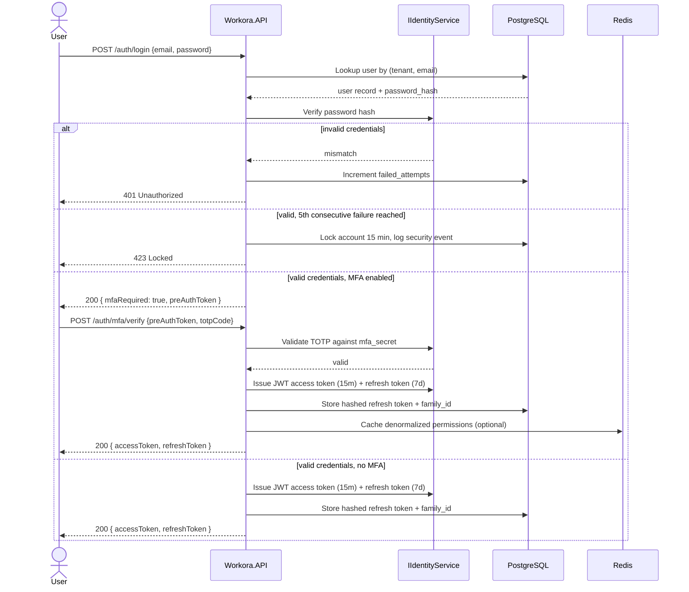
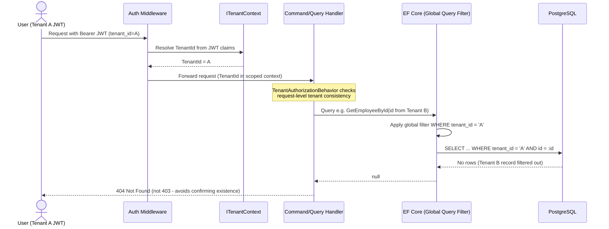
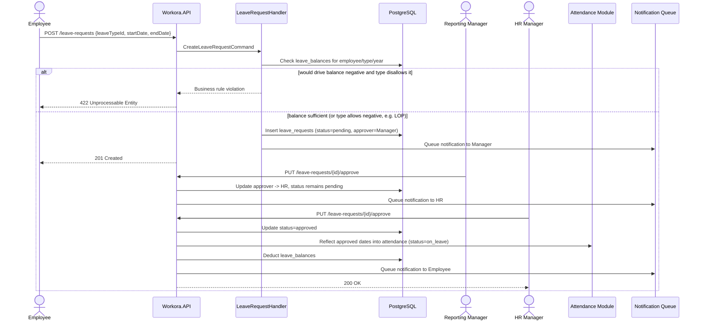
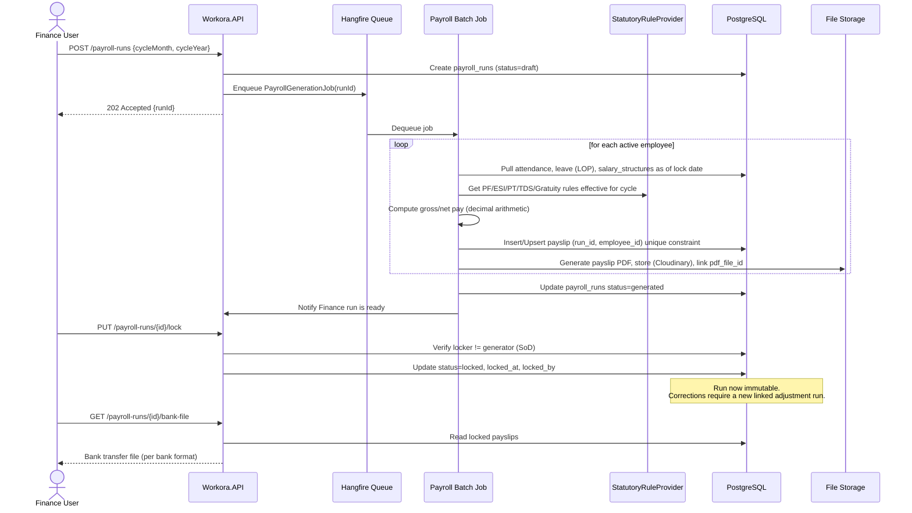

# Sequence Diagrams

This document illustrates the execution flow of the most critical processes in the Workora platform.

## 1. Login with MFA & Token Issuance

## 2. Tenant Isolation Enforcement (Defense-in-Depth)

## 3. Leave Request Approval Workflow

## 4. Payroll Run Generation & Locking

