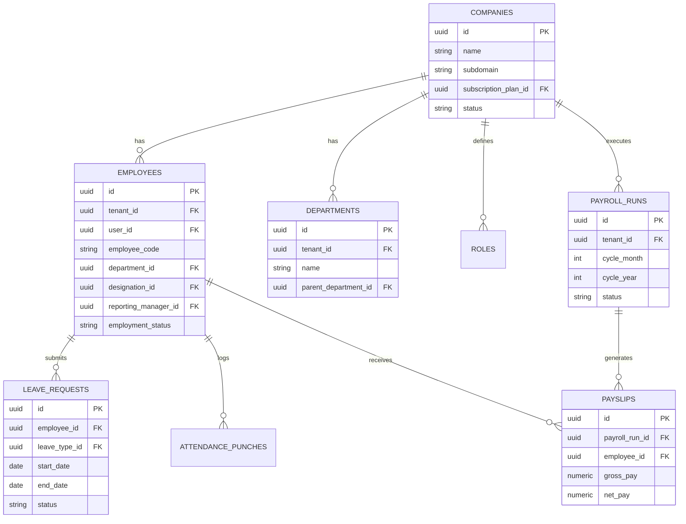

# Entity-Relationship (ER) Diagram

This diagram visualizes the core relationships between the primary aggregates in the Workora database schema. 
*(Note: Audit columns and some lookup tables are omitted for clarity)*

