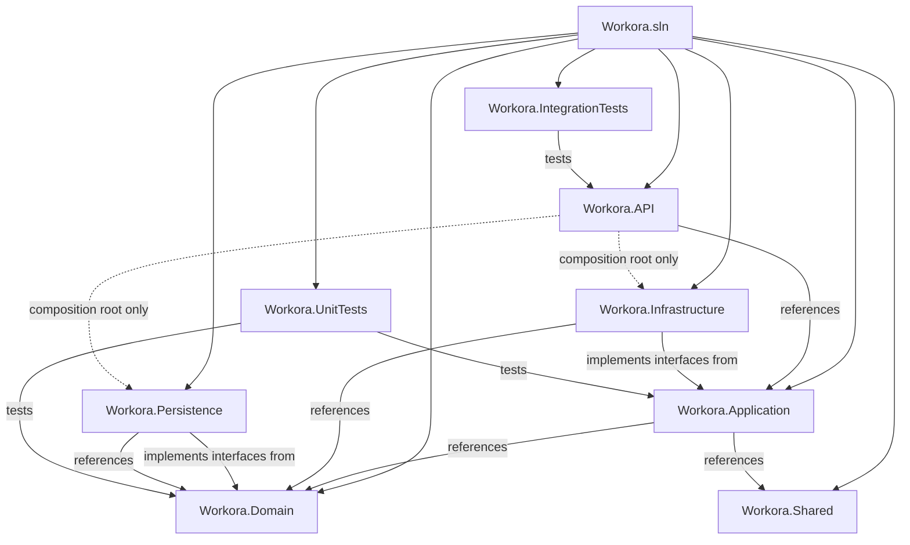
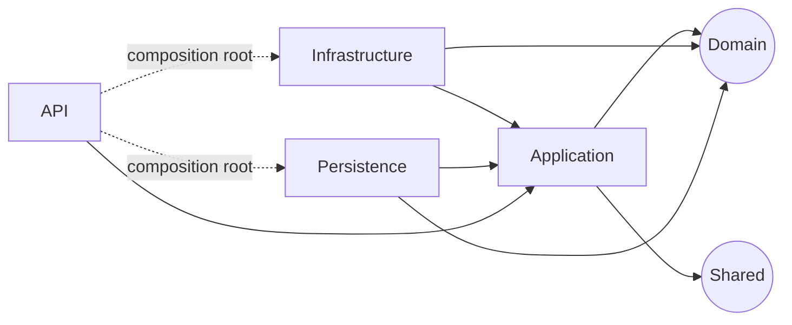
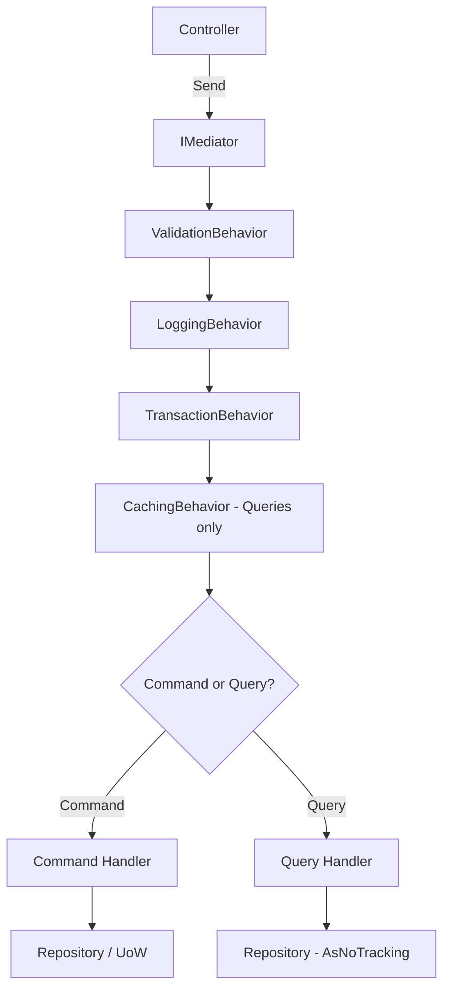
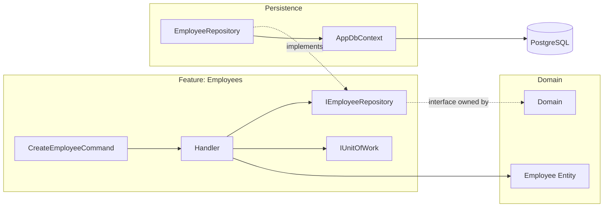
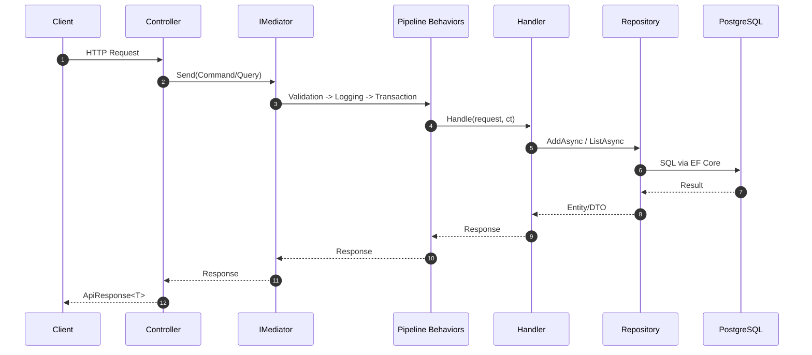

# Workora
## Backend Code Structure Documentation
### Version 1.1

---

## Cover Page

| Field | Value |
|---|---|
| **Project Name** | Workora |
| **Document Title** | Backend Code Structure Documentation |
| **Version** | 1.1 |
| **Author** | Principal .NET Architecture Team |
| **Created Date** | July 2, 2026 |
| **Audience** | Backend Developers, New Team Members, Code Reviewers |

### Revision History

| Version | Date | Description |
|---|---|---|
| 1.0 | 2026-07-02 | Baseline release, companion to Technical Documentation v1.0 |
| 1.1 | 2026-07-15 | Synced with Technical Documentation v1.1 — Sections 22–23 (worked module + all-modules command/query map) updated to reflect the ~202-endpoint API surface (up from ~120) after the full per-module API audit |

---

## 1. Introduction

This document is the **developer-facing companion** to the *Workora Backend Technical Documentation*. Where the Technical Documentation explains **what** the system does and **why** it is architected the way it is, this document explains **how the code is organized**, down to individual files, classes, and naming conventions — with the explicit goal that a new developer can clone the repository, read this document, and start contributing without needing to ask a teammate "where does X go?"

It covers the complete Clean Architecture solution structure, every project and folder's responsibility, DDD entity design, the CQRS/MediatR implementation, repository and Unit of Work patterns, validation and mapping pipelines, naming and coding standards, production-ready code templates, and the Git/CI developer workflow.

---

## 2. Solution Structure



```
Workora/
├── Workora.sln
├── Directory.Build.props
├── Directory.Packages.props
├── .editorconfig
├── src/
│   ├── Workora.API/
│   ├── Workora.Application/
│   ├── Workora.Domain/
│   ├── Workora.Infrastructure/
│   ├── Workora.Persistence/
│   └── Workora.Shared/
├── tests/
│   ├── Workora.UnitTests/
│   └── Workora.IntegrationTests/
└── docs/
    ├── Workora_Technical_Documentation.md
    └── Workora_Code_Structure_Documentation.md
```

> **Note:** `Directory.Packages.props` enables Central Package Management so every project references the same package version, preventing version drift between `Application` and `Infrastructure`.

---

## 3. Projects

| Project | Type | Depends On | Responsibility |
|---|---|---|---|
| `Workora.Domain` | Class Library | *(none)* | Entities, Value Objects, Enums, Domain Events, Domain Exceptions, Repository interfaces, Specifications |
| `Workora.Application` | Class Library | `Domain`, `Shared` | Commands, Queries, Handlers, DTOs, Validators, Pipeline Behaviors, AutoMapper Profiles, external-service interfaces |
| `Workora.Infrastructure` | Class Library | `Application`, `Domain` | Email, File Storage, PDF, Token Service, Background Jobs — implementations of Application interfaces |
| `Workora.Persistence` | Class Library | `Domain`, `Application` | `AppDbContext`, EF Core Entity Configurations, Migrations, Repository implementations, Seeders |
| `Workora.Shared` | Class Library | *(none)* | `ApiResponse<T>`, `PagedResponse<T>`, Guard clauses, common constants/extensions used by any layer |
| `Workora.API` | ASP.NET Core Web API | `Application` (+ `Infrastructure`/`Persistence` at composition root only) | Controllers, Middleware, `Program.cs`, Swagger, appsettings |
| `Workora.UnitTests` | xUnit Test Project | `Application`, `Domain` | Handler, validator, and domain-entity unit tests with mocked dependencies |
| `Workora.IntegrationTests` | xUnit Test Project | `API` | Full HTTP-pipeline tests against a Testcontainers PostgreSQL instance |

> ⚠️ **Warning:** `Application` must **never** take a project reference to `Infrastructure` or `Persistence`. If a handler needs to send email, it depends on `Application.Common.Interfaces.IEmailService` — an interface defined in `Application` and implemented in `Infrastructure` — never the concrete `Infrastructure.Email.SmtpEmailService` type.

---

## 4. Folder Structure (Detailed, by Project)

### 4.1 `Workora.Domain`

```
Domain/
├── Common/
│   ├── BaseEntity.cs
│   ├── AuditableEntity.cs
│   ├── ISoftDeletable.cs
│   └── DomainEvent.cs
├── Entities/
│   ├── Employee.cs
│   ├── Department.cs
│   ├── LeaveRequest.cs
│   ├── PayrollRun.cs
│   └── ... (one file per aggregate/entity)
├── ValueObjects/
│   ├── Money.cs
│   ├── EmailAddress.cs
│   └── DateRange.cs
├── Enums/
│   ├── EmploymentStatus.cs
│   ├── LeaveRequestStatus.cs
│   └── PayrollRunStatus.cs
├── Events/
│   ├── EmployeeOnboardedEvent.cs
│   ├── LeaveApprovedEvent.cs
│   └── CandidateHiredEvent.cs
├── Exceptions/
│   ├── DomainException.cs
│   ├── InvalidDateRangeException.cs
│   └── InsufficientLeaveBalanceException.cs
├── Interfaces/
│   ├── IRepository.cs
│   ├── IEmployeeRepository.cs
│   ├── ILeaveRequestRepository.cs
│   └── ... (one per aggregate repository)
└── Specifications/
    ├── Specification.cs
    ├── EmployeeByDepartmentSpec.cs
    └── ActiveEmployeesSpec.cs
```

| Folder | Explanation |
|---|---|
| `Common/` | Base classes shared by all entities: identity, audit columns, soft-delete marker, domain-event dispatch machinery |
| `Entities/` | Aggregate roots and entities — persistence-ignorant, contain behavior/invariants, not just properties |
| `ValueObjects/` | Immutable, equality-by-value types (e.g., `Money` prevents mixing currencies accidentally) |
| `Enums/` | Domain-meaningful enumerations, referenced by both Domain and Application |
| `Events/` | Domain Events raised by entities/handlers, consumed by MediatR `INotificationHandler<T>` in Application/Infrastructure |
| `Exceptions/` | Domain-specific exceptions caught and translated by the Global Exception Middleware |
| `Interfaces/` | Repository contracts — Domain **owns** these interfaces; Persistence implements them (Dependency Inversion) |
| `Specifications/` | Reusable, composable query specifications (Specification pattern) used by generic repository methods |

### 4.2 `Workora.Application`

```
Application/
├── Common/
│   ├── Behaviors/
│   │   ├── ValidationBehavior.cs
│   │   ├── LoggingBehavior.cs
│   │   ├── TransactionBehavior.cs
│   │   └── CachingBehavior.cs
│   ├── Interfaces/
│   │   ├── ICurrentUserService.cs
│   │   ├── IEmailService.cs
│   │   ├── IFileStorageService.cs
│   │   ├── IPdfGenerationService.cs
│   │   ├── ICacheService.cs
│   │   └── IDateTimeProvider.cs
│   ├── Mappings/
│   │   └── MappingProfile.cs (or per-module profiles)
│   ├── Models/
│   │   ├── ApiResponse.cs (re-exported from Shared)
│   │   └── PagedResult.cs
│   └── Exceptions/
│       ├── ValidationException.cs
│       ├── NotFoundException.cs
│       └── ForbiddenException.cs
├── DependencyInjection.cs
└── Features/
    ├── Employees/
    │   ├── Commands/
    │   │   ├── CreateEmployee/
    │   │   │   ├── CreateEmployeeCommand.cs
    │   │   │   ├── CreateEmployeeCommandHandler.cs
    │   │   │   └── CreateEmployeeCommandValidator.cs
    │   │   ├── UpdateEmployee/
    │   │   ├── UpdateMyEmployeeProfile/
    │   │   ├── TransferEmployee/
    │   │   ├── TerminateEmployee/
    │   │   ├── ReactivateEmployee/
    │   │   ├── UpsertEmergencyContact/
    │   │   └── UpsertBankDetails/
    │   ├── Queries/
    │   │   ├── GetEmployeeById/
    │   │   ├── GetEmployeesList/
    │   │   ├── GetMyEmployeeProfile/
    │   │   ├── GetEmployeeOrgChart/
    │   │   ├── GetEmployeeEmploymentHistory/
    │   │   ├── GetEmployeeDirectReports/
    │   │   └── ExportEmployees/
    │   └── DTOs/
    │       └── EmployeeDto.cs
    ├── Leave/
    ├── Payroll/
    └── ... (one folder per module, mirroring Section 9 of the Technical Documentation — every API endpoint added in Technical Documentation v1.1 has a corresponding Command/Query vertical slice under its module folder, following this same naming pattern: verb-first for Commands, `Get{Noun}`/`Export{Noun}` for Queries)
```

| Folder | Explanation |
|---|---|
| `Common/Behaviors/` | Cross-cutting MediatR `IPipelineBehavior<TRequest,TResponse>` implementations, registered once, applied to every request |
| `Common/Interfaces/` | Interfaces for services implemented in Infrastructure/Persistence, consumed by handlers via DI |
| `Common/Mappings/` | AutoMapper `Profile` classes |
| `Common/Exceptions/` | Application-level exceptions (distinct from Domain exceptions) caught by the Global Exception Middleware |
| `Features/{Module}/Commands/{Action}/` | **Vertical slice** per write operation: Command + Handler + Validator co-located in one folder |
| `Features/{Module}/Queries/{Action}/` | Vertical slice per read operation |
| `Features/{Module}/DTOs/` | Shapes returned by queries / accepted partially by commands |

> **Best Practice:** Workora uses the **vertical slice** folder convention (one folder per use case, containing its Command, Handler, and Validator together) rather than horizontal folders (`Commands/`, `Handlers/`, `Validators/` at the top level) — this keeps everything needed to understand or modify one use case in a single place.

### 4.3 `Workora.Infrastructure`

```
Infrastructure/
├── Email/
│   ├── SmtpEmailService.cs
│   └── EmailTemplates/
├── FileStorage/
│   └── LocalFileStorageService.cs
├── Pdf/
│   ├── QuestPdfPayslipGenerator.cs
│   └── QuestPdfOfferLetterGenerator.cs
├── Authentication/
│   ├── TokenService.cs
│   └── CurrentUserService.cs
├── BackgroundJobs/
│   ├── LeaveBalanceAccrualJob.cs
│   ├── DocumentExpiryNotifierJob.cs
│   └── OfferLetterExpiryJob.cs
├── Caching/
│   └── MemoryCacheService.cs
└── DependencyInjection.cs
```

### 4.4 `Workora.Persistence`

```
Persistence/
├── AppDbContext.cs
├── Configurations/
│   ├── EmployeeConfiguration.cs
│   ├── DepartmentConfiguration.cs
│   └── ... (one per entity, IEntityTypeConfiguration<T>)
├── Repositories/
│   ├── GenericRepository.cs
│   ├── EmployeeRepository.cs
│   └── ... (one per aggregate)
├── Interceptors/
│   ├── AuditSaveChangesInterceptor.cs
│   └── SoftDeleteInterceptor.cs
├── Migrations/
│   └── (EF Core generated migration files)
├── Seeders/
│   ├── PermissionSeeder.cs
│   ├── RoleSeeder.cs
│   └── DevelopmentDataSeeder.cs
└── DependencyInjection.cs
```

### 4.5 `Workora.Shared`

```
Shared/
├── Responses/
│   ├── ApiResponse.cs
│   ├── PagedResponse.cs
│   └── ErrorResponse.cs
├── Constants/
│   ├── PermissionConstants.cs
│   └── RoleConstants.cs
├── Extensions/
│   ├── StringExtensions.cs
│   └── QueryableExtensions.cs
└── Guards/
    └── Guard.cs
```

### 4.6 `Workora.API`

```
API/
├── Program.cs
├── appsettings.json
├── appsettings.Development.json
├── Controllers/
│   ├── v1/
│   │   ├── AuthController.cs
│   │   ├── EmployeesController.cs
│   │   ├── PayrollController.cs
│   │   └── ... (one per module)
├── Middleware/
│   ├── GlobalExceptionMiddleware.cs
│   ├── RequestLoggingMiddleware.cs
│   └── CorrelationIdMiddleware.cs
├── Filters/
│   └── ApiExceptionFilter.cs (supplementary, MVC-level)
├── Extensions/
│   ├── SwaggerServiceExtensions.cs
│   └── AuthenticationServiceExtensions.cs
└── Policies/
    └── PermissionPolicyProvider.cs
```

---

## 5. Dependency Flow



The only "outward-pointing" references in the entire solution are the **composition-root-only** references from `API` to `Infrastructure` and `Persistence`, used exclusively inside `Program.cs` for `AddInfrastructure()` / `AddPersistence()` DI registration calls — no Controller ever references an Infrastructure/Persistence type directly.

---

## 6. Dependency Injection

Each project exposes a single `DependencyInjection.cs` static class with an `IServiceCollection` extension method, keeping `Program.cs` a short, readable composition root:

```csharp
// Program.cs
var builder = WebApplication.CreateBuilder(args);

builder.Services
    .AddApplication()          // Application/DependencyInjection.cs — MediatR, AutoMapper, FluentValidation
    .AddInfrastructure(builder.Configuration)  // Infrastructure/DependencyInjection.cs
    .AddPersistence(builder.Configuration)     // Persistence/DependencyInjection.cs
    .AddApiServices(builder.Configuration);    // API/Extensions — Swagger, Auth, Versioning, CORS

var app = builder.Build();
app.UseWorkoraPipeline(); // extension wrapping middleware registration order
app.Run();
```

```csharp
// Application/DependencyInjection.cs
public static class DependencyInjection
{
    public static IServiceCollection AddApplication(this IServiceCollection services)
    {
        services.AddMediatR(cfg => cfg.RegisterServicesFromAssembly(typeof(DependencyInjection).Assembly));
        services.AddValidatorsFromAssembly(typeof(DependencyInjection).Assembly);
        services.AddAutoMapper(typeof(DependencyInjection).Assembly);

        services.AddTransient(typeof(IPipelineBehavior<,>), typeof(ValidationBehavior<,>));
        services.AddTransient(typeof(IPipelineBehavior<,>), typeof(LoggingBehavior<,>));
        services.AddTransient(typeof(IPipelineBehavior<,>), typeof(TransactionBehavior<,>));

        return services;
    }
}
```

**Service Lifetimes:**

| Service Type | Lifetime | Rationale |
|---|---|---|
| `AppDbContext` | Scoped | One instance per HTTP request; matches EF Core's unit-of-work model |
| Repositories | Scoped | Share the `DbContext` within the request |
| `IEmailService`, `IFileStorageService`, `IPdfGenerationService` | Scoped or Singleton (stateless clients can be Singleton) | Depends on whether the implementation holds per-request state |
| `ICurrentUserService` | Scoped | Reads `HttpContext` per request |
| `ITokenService` | Singleton (stateless) | Pure functions over configuration + input |
| MediatR Handlers | Transient (registered automatically by `AddMediatR`) | New instance per request dispatch |

---

## 7. Entity Design

```csharp
// Domain/Common/BaseEntity.cs
public abstract class BaseEntity
{
    public int Id { get; set; }
    public string Uuid { get; set; }
    public DateTime CreatedAt { get; set; }
    public DateTime UpdatedAt { get; set; }
    public string? CreatedBy { get; set; }
    public string? UpdatedBy { get; set; }
    public bool IsActive { get; set; }
    public bool IsDeleted { get; set; }
}
```

```csharp
// Domain/Common/AuditableEntity.cs
public abstract class AuditableEntity : BaseEntity, ISoftDeletable
{
    public DateTimeOffset CreatedAt { get; set; }
    public Guid? CreatedBy { get; set; }
    public DateTimeOffset? UpdatedAt { get; set; }
    public Guid? UpdatedBy { get; set; }

    public bool IsDeleted { get; set; }
    public DateTimeOffset? DeletedAt { get; set; }
    public Guid? DeletedBy { get; set; }
}
```

| Class | Explanation |
|---|---|
| `BaseEntity` | Root of the entity hierarchy: identity (`Id`) and domain-event capture. Every entity that can raise events derives from this. |
| `AuditableEntity` | Adds the standard audit + soft-delete columns (Section 8.6/8.7 of the Technical Documentation). Nearly all aggregate roots derive from this rather than `BaseEntity` directly. |
| `ISoftDeletable` | A marker interface used by the EF Core global query filter configuration (`modelBuilder.Entity<T>().HasQueryFilter(...)`) applied reflectively to every entity implementing it, so a new entity gets soft-delete filtering "for free" just by implementing the interface. |

---

## 8. Repository Pattern

```csharp
// Domain/Interfaces/IRepository.cs
public interface IRepository<T> where T : BaseEntity
{
    Task<T?> GetByIdAsync(Guid id, CancellationToken ct = default);
    Task<IReadOnlyList<T>> ListAsync(ISpecification<T> spec, CancellationToken ct = default);
    Task<T> AddAsync(T entity, CancellationToken ct = default);
    void Update(T entity);
    void Remove(T entity);
}
```

```csharp
// Domain/Interfaces/IEmployeeRepository.cs
public interface IEmployeeRepository : IRepository<Employee>
{
    Task<bool> IsNationalIdUniqueAsync(string nationalId, CancellationToken ct = default);
    Task<Employee?> GetWithDetailsAsync(Guid id, CancellationToken ct = default);
}
```

- **Generic Repository** (`GenericRepository<T>` in `Persistence/Repositories/`) implements `IRepository<T>` once, covering CRUD + specification-based listing for every entity — eliminating boilerplate for simple aggregates.
- **Specific Repository** (e.g., `EmployeeRepository : GenericRepository<Employee>, IEmployeeRepository`) adds only the queries that are genuinely aggregate-specific (uniqueness checks, eager-loaded detail views) — it does not re-implement what the generic base already provides.

> **Best Practice:** Repository interfaces live in `Domain`, never in `Persistence`. This is what allows `Application` handlers to depend on `IEmployeeRepository` without ever referencing EF Core or PostgreSQL — satisfying the Dependency Inversion Principle and keeping `Application`/`Domain` fully unit-testable with in-memory fakes or Moq.

---

## 9. Unit Of Work

```csharp
// Domain/Interfaces/IUnitOfWork.cs
public interface IUnitOfWork
{
    Task<int> SaveChangesAsync(CancellationToken ct = default);
}
```

`AppDbContext` implements `IUnitOfWork` directly (EF Core's `DbContext` already tracks all changes across repositories that share it within a request, so `SaveChangesAsync` on the context **is** the Unit of Work commit point). Handlers call repository methods to stage changes, then either rely on the `TransactionBehavior` pipeline behavior to call `SaveChangesAsync` once at the end of the request, or call it explicitly for handlers that need multiple round-trips within one logical operation (e.g., Payroll batch processing).

```mermaid
sequenceDiagram
    participant H as Handler
    participant R1 as EmployeeRepository
    participant R2 as SalaryStructureRepository
    participant UoW as AppDbContext (IUnitOfWork)
    participant DB as PostgreSQL

    H->>R1: AddAsync(employee)
    H->>R2: AddAsync(salaryStructure)
    H->>UoW: SaveChangesAsync()
    UoW->>DB: BEGIN TRANSACTION; INSERT ...; COMMIT
    DB-->>UoW: OK
    UoW-->>H: rows affected
```

---

## 10. CQRS (Commands, Queries, Handlers, Mediator, Pipeline)



- **Commands** mutate state and typically return either `void`/`Unit`, the new entity's `Id`, or a minimal confirmation DTO. They never return large read models — that's a Query's job.
- **Queries** are read-only, use `AsNoTracking()` projections, and may be served from cache via `CachingBehavior`.
- **Handlers** implement `IRequestHandler<TCommand, TResponse>` or `IRequestHandler<TQuery, TResponse>` and contain the actual orchestration logic — the only place business orchestration happens.
- **MediatR** decouples the Controller from the Handler entirely; the Controller has no compile-time reference to the Handler class, only to the Command/Query type.

```csharp
// Application/Features/Employees/Commands/CreateEmployee/CreateEmployeeCommand.cs
public record CreateEmployeeCommand(
    string FirstName,
    string LastName,
    string Email,
    DateOnly DateOfBirth,
    Guid DepartmentId,
    Guid DesignationId,
    Guid BranchId,
    Guid? ManagerId
) : IRequest<Guid>;
```

```csharp
// Application/Features/Employees/Commands/CreateEmployee/CreateEmployeeCommandHandler.cs
public class CreateEmployeeCommandHandler : IRequestHandler<CreateEmployeeCommand, Guid>
{
    private readonly IEmployeeRepository _employeeRepository;
    private readonly IUnitOfWork _unitOfWork;
    private readonly IEmployeeCodeGenerator _codeGenerator;

    public CreateEmployeeCommandHandler(
        IEmployeeRepository employeeRepository,
        IUnitOfWork unitOfWork,
        IEmployeeCodeGenerator codeGenerator)
    {
        _employeeRepository = employeeRepository;
        _unitOfWork = unitOfWork;
        _codeGenerator = codeGenerator;
    }

    public async Task<Guid> Handle(CreateEmployeeCommand request, CancellationToken ct)
    {
        var employeeCode = await _codeGenerator.GenerateAsync(ct);

        var employee = Employee.Create(
            employeeCode, request.FirstName, request.LastName, request.Email,
            request.DateOfBirth, request.DepartmentId, request.DesignationId,
            request.BranchId, request.ManagerId);

        await _employeeRepository.AddAsync(employee, ct);
        await _unitOfWork.SaveChangesAsync(ct);

        return employee.Id;
    }
}
```

---

## 11. Validation (FluentValidation + Pipeline Behavior)

```csharp
// Application/Features/Employees/Commands/CreateEmployee/CreateEmployeeCommandValidator.cs
public class CreateEmployeeCommandValidator : AbstractValidator<CreateEmployeeCommand>
{
    public CreateEmployeeCommandValidator()
    {
        RuleFor(x => x.FirstName).NotEmpty().MaximumLength(100);
        RuleFor(x => x.Email).NotEmpty().EmailAddress();
        RuleFor(x => x.DateOfBirth)
            .Must(dob => dob <= DateOnly.FromDateTime(DateTime.UtcNow.AddYears(-18)))
            .WithMessage("Employee must be at least 18 years old.");
        RuleFor(x => x.DepartmentId).NotEmpty();
        RuleFor(x => x.DesignationId).NotEmpty();
    }
}
```

```csharp
// Application/Common/Behaviors/ValidationBehavior.cs
public class ValidationBehavior<TRequest, TResponse> : IPipelineBehavior<TRequest, TResponse>
    where TRequest : IRequest<TResponse>
{
    private readonly IEnumerable<IValidator<TRequest>> _validators;

    public ValidationBehavior(IEnumerable<IValidator<TRequest>> validators) => _validators = validators;

    public async Task<TResponse> Handle(TRequest request, RequestHandlerDelegate<TResponse> next, CancellationToken ct)
    {
        if (!_validators.Any()) return await next();

        var failures = (await Task.WhenAll(_validators.Select(v => v.ValidateAsync(request, ct))))
            .SelectMany(r => r.Errors)
            .Where(f => f != null)
            .ToList();

        if (failures.Any())
            throw new Application.Common.Exceptions.ValidationException(failures);

        return await next();
    }
}
```

Every validator is auto-discovered via `AddValidatorsFromAssembly` and auto-invoked by `ValidationBehavior` for every Command/Query — a handler never calls a validator manually.

---

## 12. AutoMapper

```csharp
// Application/Common/Mappings/EmployeeMappingProfile.cs
public class EmployeeMappingProfile : Profile
{
    public EmployeeMappingProfile()
    {
        CreateMap<Employee, EmployeeDto>()
            .ForMember(d => d.FullName, opt => opt.MapFrom(s => $"{s.FirstName} {s.LastName}"))
            .ForMember(d => d.DepartmentName, opt => opt.MapFrom(s => s.Department.Name));
    }
}
```

One `Profile` class per module, auto-registered via `AddAutoMapper(typeof(DependencyInjection).Assembly)`. Query handlers use `IMapper.Map<T>` or, for large lists, `ProjectTo<TDto>()` directly against `IQueryable` so the SQL projection happens at the database level (only needed columns are selected) rather than materializing full entities first.

---

## 13. Authentication (Code-Level)

```csharp
// Infrastructure/Authentication/TokenService.cs
public class TokenService : ITokenService
{
    public string GenerateAccessToken(User user, IEnumerable<string> roles, IEnumerable<string> permissions)
    {
        var claims = new List<Claim>
        {
            new(JwtRegisteredClaimNames.Sub, user.Id.ToString()),
            new(JwtRegisteredClaimNames.Email, user.Email),
            new(JwtRegisteredClaimNames.Jti, Guid.NewGuid().ToString())
        };
        claims.AddRange(roles.Select(r => new Claim(ClaimTypes.Role, r)));
        claims.AddRange(permissions.Select(p => new Claim("permission", p)));

        var creds = new SigningCredentials(_signingKey, SecurityAlgorithms.HmacSha256);
        var token = new JwtSecurityToken(_issuer, _audience, claims,
            expires: DateTime.UtcNow.AddMinutes(_accessTokenMinutes), signingCredentials: creds);

        return new JwtSecurityTokenHandler().WriteToken(token);
    }
}
```

`ITokenService` is defined in `Application/Common/Interfaces`; `TokenService` lives in `Infrastructure/Authentication` and is registered as a Singleton in `Infrastructure/DependencyInjection.cs`. `ICurrentUserService` (also Infrastructure-implemented) reads the current `ClaimsPrincipal` from `IHttpContextAccessor` and exposes strongly typed `UserId`, `TenantId`, `Roles`, `Permissions` to any Application handler without that handler ever touching `HttpContext` directly.

---

## 14. Authorization (Code-Level)

```csharp
// API/Policies/PermissionPolicyProvider.cs
public class PermissionPolicyProvider : IAuthorizationPolicyProvider
{
    public Task<AuthorizationPolicy?> GetPolicyAsync(string policyName)
    {
        var policy = new AuthorizationPolicyBuilder()
            .AddRequirements(new PermissionRequirement(policyName))
            .Build();
        return Task.FromResult<AuthorizationPolicy?>(policy);
    }
}
```

```csharp
public class PermissionAuthorizationHandler : AuthorizationHandler<PermissionRequirement>
{
    protected override Task HandleRequirementAsync(
        AuthorizationHandlerContext context, PermissionRequirement requirement)
    {
        if (context.User.HasClaim("permission", requirement.Permission))
            context.Succeed(requirement);
        return Task.CompletedTask;
    }
}
```

This dynamic policy provider means `[Authorize(Policy = "employees.create")]` works for **any** permission string without registering hundreds of policies by hand in `Program.cs` — the policy name *is* the permission being checked.

---

## 15. Middleware

| Middleware | Order | Responsibility |
|---|---|---|
| `GlobalExceptionMiddleware` | 1 (outermost) | Catches all exceptions, maps to `ErrorResponse` |
| `CorrelationIdMiddleware` | 2 | Assigns/propagates `X-Correlation-Id` |
| `RequestLoggingMiddleware` | 3 | Serilog structured request/response logging |
| `UseHttpsRedirection` | 4 | Built-in HTTPS enforcement |
| `UseAuthentication` | 5 | JWT validation, populates `HttpContext.User` |
| `UseAuthorization` | 6 | Policy evaluation |
| `UseRateLimiter` | 7 | Per-endpoint rate limiting |
| MVC Routing / Controllers | 8 (innermost) | Action dispatch |

```csharp
// API/Extensions/ApplicationBuilderExtensions.cs
public static IApplicationBuilder UseWorkoraPipeline(this WebApplication app)
{
    app.UseMiddleware<GlobalExceptionMiddleware>();
    app.UseMiddleware<CorrelationIdMiddleware>();
    app.UseMiddleware<RequestLoggingMiddleware>();
    app.UseHttpsRedirection();
    app.UseAuthentication();
    app.UseAuthorization();
    app.UseRateLimiter();
    app.MapControllers();
    return app;
}
```

> ⚠️ **Warning:** Middleware order is not arbitrary. `GlobalExceptionMiddleware` must be registered first so it can catch exceptions thrown by every subsequent middleware, including authentication/authorization failures that throw rather than short-circuit.

---

## 16. Response Model

```csharp
// Shared/Responses/ApiResponse.cs
public class ApiResponse<T>
{
    public bool Success { get; init; }
    public T? Data { get; init; }
    public string? Message { get; init; }
    public List<FieldError>? Errors { get; init; }
    public string? CorrelationId { get; init; }

    public static ApiResponse<T> Success(T data) => new() { Success = true, Data = data };
    public static ApiResponse<T> Fail(string message, List<FieldError>? errors = null) =>
        new() { Success = false, Message = message, Errors = errors };
}
```

```csharp
// Shared/Responses/PagedResponse.cs
public class PagedResponse<T>
{
    public IReadOnlyList<T> Items { get; init; } = [];
    public int PageNumber { get; init; }
    public int PageSize { get; init; }
    public int TotalCount { get; init; }
    public int TotalPages => (int)Math.Ceiling(TotalCount / (double)PageSize);
}
```

```csharp
// Shared/Responses/ErrorResponse.cs
public record FieldError(string Field, string Message);
```

---

## 17. Error Handling

```csharp
// API/Middleware/GlobalExceptionMiddleware.cs
public class GlobalExceptionMiddleware : IMiddleware
{
    public async Task InvokeAsync(HttpContext context, RequestDelegate next)
    {
        try
        {
            await next(context);
        }
        catch (Application.Common.Exceptions.ValidationException ex)
        {
            await WriteResponse(context, 400, ApiResponse<object>.Fail("Validation failed", ex.Errors));
        }
        catch (NotFoundException ex)
        {
            await WriteResponse(context, 404, ApiResponse<object>.Fail(ex.Message));
        }
        catch (ForbiddenException ex)
        {
            await WriteResponse(context, 403, ApiResponse<object>.Fail(ex.Message));
        }
        catch (DbUpdateConcurrencyException)
        {
            await WriteResponse(context, 409, ApiResponse<object>.Fail("The record was modified by another user."));
        }
        catch (Exception ex)
        {
            _logger.LogError(ex, "Unhandled exception");
            await WriteResponse(context, 500, ApiResponse<object>.Fail("An unexpected error occurred."));
        }
    }
}
```

---

## 18. Database

- **`AppDbContext`** exposes a `DbSet<T>` per aggregate root and applies all `IEntityTypeConfiguration<T>` classes via `modelBuilder.ApplyConfigurationsFromAssembly(...)`.
- **Entity Configurations** (one file per entity in `Persistence/Configurations/`) define table names, keys, indexes, relationships, and value converters — keeping the `OnModelCreating` method itself tiny.
- **Migrations** are stored under `Persistence/Migrations/` and generated via `dotnet ef migrations add {Name} --project src/Workora.Persistence --startup-project src/Workora.API`.
- **Seeders** populate reference data (`Permission`, default `Role`s) on startup in Development/Staging and via a controlled one-time script in Production.

```csharp
// Persistence/Configurations/EmployeeConfiguration.cs
public class EmployeeConfiguration : IEntityTypeConfiguration<Employee>
{
    public void Configure(EntityTypeBuilder<Employee> builder)
    {
        builder.ToTable("employees");
        builder.HasKey(e => e.Id);
        builder.Property(e => e.EmployeeCode).HasMaxLength(20).IsRequired();
        builder.HasIndex(e => e.EmployeeCode).IsUnique();
        builder.HasOne(e => e.Department).WithMany().HasForeignKey(e => e.DepartmentId).OnDelete(DeleteBehavior.Restrict);
        builder.HasQueryFilter(e => !e.IsDeleted);
    }
}
```

---

## 19. Naming Standards

| Item | Convention | Example |
|---|---|---|
| Files | Match class name exactly | `CreateEmployeeCommand.cs` |
| Classes | PascalCase, noun phrases | `Employee`, `PayrollRun` |
| Interfaces | `I` + PascalCase | `IEmployeeRepository` |
| DTOs | Suffix `Dto` | `EmployeeDto`, `PayrollRunSummaryDto` |
| Commands | Verb + Noun + `Command` | `CreateEmployeeCommand`, `TerminateEmployeeCommand` |
| Queries | Get/List + Noun + `Query` | `GetEmployeeByIdQuery`, `ListEmployeesQuery` |
| Handlers | `{Request}Handler` | `CreateEmployeeCommandHandler` |
| Validators | `{Request}Validator` | `CreateEmployeeCommandValidator` |
| Repositories | `I{Aggregate}Repository` / `{Aggregate}Repository` | `IEmployeeRepository` / `EmployeeRepository` |
| Controllers | `{Module}Controller` (plural) | `EmployeesController` |
| Enums | Singular, PascalCase members | `EmploymentStatus.Active` |
| Extensions | `{Type}Extensions` | `QueryableExtensions` |

---

## 20. Code Standards

- **SOLID:** Single Responsibility per class (a Handler orchestrates, an Entity enforces invariants, a Repository persists); Open/Closed via Specification pattern and Pipeline Behaviors rather than editing existing classes for new cross-cutting concerns; Liskov substitution respected by `GenericRepository<T>`; Interface Segregation — small, focused interfaces (`IEmailService` doesn't also do file storage); Dependency Inversion throughout (Application depends on abstractions it owns).
- **DRY:** Shared validation/mapping logic factored into base validators/profiles; generic repository eliminates CRUD duplication.
- **KISS:** Prefer straightforward LINQ/EF Core over cleverness; avoid premature abstraction for a single-use case.
- **YAGNI:** Extensibility points (e.g., pluggable file storage provider) are introduced only where a near-term need (Section 26 Future Enhancements of the Technical Documentation) is already identified — not speculative.
- **Clean Code:** methods under ~30 lines, descriptive names over comments explaining *what*, guard clauses over nested conditionals.

---

## 21. Commenting Standards
- **Mandatory Comments**: Every class, method, property, and significant section of code MUST include descriptive comments (e.g., XML documentation comments in C#) explaining its purpose and behavior.

```csharp
/// <summary>
/// Terminates an employee's employment, setting their status to Terminated
/// and recording the termination date. Does not delete the employee record.
/// </summary>
/// <remarks>
/// Triggers <see cref="EmployeeTerminatedEvent"/>, which revokes system access
/// and notifies Payroll to prorate the final pay run.
/// </remarks>
/// <param name="terminationDate">The effective last working day.</param>
/// <returns>The updated employee's Id.</returns>
/// <exception cref="NotFoundException">Thrown when the employee does not exist.</exception>
public async Task<Guid> Handle(TerminateEmployeeCommand request, CancellationToken ct) { ... }
```

XML doc comments are required on: all public Handler `Handle` methods, all public Domain entity methods that enforce a business rule, and all public interfaces in `Common/Interfaces`. Simple DTO property getters/setters do not require comments unless the meaning is non-obvious.

---

## 22. API Folder Structure — Complete Worked Module (Employee)

The Employee module illustrates the full vertical-slice pattern applied consistently across every module in the system.

```
Application/Features/Employees/
├── Commands/
│   ├── CreateEmployee/
│   │   ├── CreateEmployeeCommand.cs
│   │   ├── CreateEmployeeCommandHandler.cs
│   │   └── CreateEmployeeCommandValidator.cs
│   ├── UpdateEmployee/
│   │   ├── UpdateEmployeeCommand.cs
│   │   ├── UpdateEmployeeCommandHandler.cs
│   │   └── UpdateEmployeeCommandValidator.cs
│   ├── UpdateMyEmployeeProfile/
│   ├── TransferEmployee/
│   ├── TerminateEmployee/
│   ├── ReactivateEmployee/
│   ├── UpsertEmergencyContact/
│   └── UpsertBankDetails/
├── Queries/
│   ├── GetEmployeeById/
│   │   ├── GetEmployeeByIdQuery.cs
│   │   └── GetEmployeeByIdQueryHandler.cs
│   ├── ListEmployees/
│   │   ├── ListEmployeesQuery.cs
│   │   └── ListEmployeesQueryHandler.cs
│   ├── GetMyEmployeeProfile/
│   ├── GetOrgChart/
│   ├── GetEmploymentHistory/
│   ├── GetDirectReports/
│   └── ExportEmployees/
└── DTOs/
    ├── EmployeeDto.cs
    ├── EmployeeListItemDto.cs
    ├── OrgChartNodeDto.cs
    ├── EmploymentHistoryDto.cs
    └── EmergencyContactDto.cs

Domain/Entities/Employee.cs
Domain/Interfaces/IEmployeeRepository.cs
Domain/Events/EmployeeOnboardedEvent.cs
Domain/Events/EmployeeTerminatedEvent.cs
Domain/Events/EmployeeReactivatedEvent.cs

Persistence/Configurations/EmployeeConfiguration.cs
Persistence/Repositories/EmployeeRepository.cs

API/Controllers/v1/EmployeesController.cs
```

| File | Responsibility |
|---|---|
| `CreateEmployeeCommand.cs` | Immutable record carrying the request shape; implements `IRequest<Guid>` |
| `CreateEmployeeCommandHandler.cs` | Orchestrates entity creation, persistence, and event dispatch |
| `CreateEmployeeCommandValidator.cs` | FluentValidation rules, auto-invoked by `ValidationBehavior` |
| `UpdateMyEmployeeProfile*` | Self-service variant of `UpdateEmployee`; the handler ignores any incoming `EmployeeId` and instead resolves the target record from `ICurrentUserService`, then restricts the mapped fields to a whitelist (phone, address, emergency contact) so a non-privileged caller cannot elevate other fields |
| `ReactivateEmployee*` | Rehire flow: validates the employee is currently `Terminated`, clears `termination_date`, raises `EmployeeReactivatedEvent` |
| `UpsertEmergencyContact*` / `UpsertBankDetails*` | Insert-or-update commands scoped to the `employee_emergency_contacts` / `employee_bank_details` child tables; bank details are encrypted before persistence via a `IFieldEncryptionService` |
| `EmployeeDto.cs` | Read shape returned by queries; mapped via AutoMapper |
| `ExportEmployees*` | Query returning a stream (`FileResult`) built via `IExcelExportService`, sharing the same filter parameters as `ListEmployeesQuery` |
| `Employee.cs` (Domain) | Aggregate root; exposes `Employee.Create(...)` factory and behavior methods like `Terminate(DateOnly date)` and `Reactivate()` |
| `IEmployeeRepository.cs` | Contract owned by Domain, implemented by Persistence |
| `EmployeeOnboardedEvent.cs` | Raised inside `Employee.Create(...)`, handled by Notification/Asset/User-provisioning listeners |
| `EmployeeConfiguration.cs` | EF Core mapping: table, keys, indexes, relationships |
| `EmployeeRepository.cs` | Concrete data access, extends `GenericRepository<Employee>` |
| `EmployeesController.cs` | Thin HTTP entry point; one action per Command/Query, `[Authorize(Policy="...")]` per action (self-service actions use `[Authorize]` only, with scope enforced inside the handler, not the controller) |

---

## 23. Complete Module Structure (All Modules)

Every module below follows the identical `Commands/ Queries/ DTOs/` vertical-slice shape shown in Section 22. Only the aggregate-specific pieces are listed here to avoid repetition. Following the Technical Documentation v1.1 API audit, every newly added endpoint in Section 9 of that document has a corresponding Command or Query listed here — the columns below are illustrative of the *pattern* (not the full ~202-endpoint enumeration); apply the same `Verb+Noun+Command` / `Get/List/Export+Noun+Query` naming convention for any endpoint not explicitly named.

| Module | Key Commands | Key Queries | Domain Entity/Aggregate | Controller |
|---|---|---|---|---|
| Authentication | `LoginCommand`, `RefreshTokenCommand`, `LogoutCommand`, `LogoutAllCommand`, `ResetPasswordCommand` | `GetMyProfileQuery`, `ListMySessionsQuery` | *(uses User aggregate)* | `AuthController` |
| Users | `CreateUserCommand`, `UpdateUserCommand`, `DeactivateUserCommand`, `ActivateUserCommand`, `DeleteUserCommand`, `AssignRolesCommand`, `AdminResetPasswordCommand` | `GetUserByIdQuery`, `ListUsersQuery`, `GetMyUserQuery` | `User` | `UsersController` |
| Roles | `CreateRoleCommand`, `UpdateRoleCommand`, `DeleteRoleCommand`, `SetRolePermissionsCommand`, `CloneRoleCommand` | `ListRolesQuery`, `GetRoleByIdQuery` | `Role` | `RolesController` |
| Permissions | — | `ListPermissionsQuery` | `Permission` | `PermissionsController` |
| Departments | `CreateDepartmentCommand`, `UpdateDepartmentCommand`, `DeleteDepartmentCommand`, `AssignDepartmentHeadCommand` | `ListDepartmentsQuery`, `GetDepartmentByIdQuery` | `Department` | `DepartmentsController` |
| Designations | `CreateDesignationCommand`, `UpdateDesignationCommand`, `DeleteDesignationCommand` | `ListDesignationsQuery`, `GetDesignationByIdQuery` | `Designation` | `DesignationsController` |
| Employees | `CreateEmployeeCommand`, `UpdateEmployeeCommand`, `UpdateMyEmployeeProfileCommand`, `TransferEmployeeCommand`, `TerminateEmployeeCommand`, `ReactivateEmployeeCommand`, `UpsertEmergencyContactCommand`, `UpsertBankDetailsCommand` | `GetEmployeeByIdQuery`, `ListEmployeesQuery`, `GetMyEmployeeProfileQuery`, `GetOrgChartQuery`, `GetEmploymentHistoryQuery`, `GetDirectReportsQuery`, `ExportEmployeesQuery` | `Employee` | `EmployeesController` |
| Attendance | `CheckInCommand`, `CheckOutCommand`, `RequestCorrectionCommand`, `ApproveCorrectionCommand`, `RejectCorrectionCommand`, `BulkImportAttendanceCommand` | `GetAttendanceHistoryQuery`, `GetAttendanceSummaryQuery`, `GetMyTodayAttendanceQuery`, `ListCorrectionsQuery` | `AttendanceRecord` | `AttendanceController` |
| Leave | `SubmitLeaveRequestCommand`, `ApproveLeaveCommand`, `RejectLeaveCommand`, `CancelLeaveCommand`, `CreateLeaveTypeCommand`, `UpdateLeaveTypeCommand` | `ListLeaveRequestsQuery`, `GetLeaveBalancesQuery`, `ListLeaveTypesQuery`, `GetLeaveCalendarQuery` | `LeaveRequest` | `LeaveController` |
| Payroll | `CreatePayrollRunCommand`, `ProcessPayrollRunCommand`, `ApprovePayrollRunCommand`, `DeletePayrollRunCommand`, `CreateAdjustmentRunCommand` | `ListPayrollRunsQuery`, `GetPayrollRunByIdQuery`, `GetPayslipQuery`, `ListPayslipsQuery` | `PayrollRun` | `PayrollController` |
| Salary Structure | `CreateSalaryStructureCommand`, `DeleteSalaryStructureCommand`, `CreateSalaryComponentCommand`, `UpdateSalaryComponentCommand` | `GetSalaryStructuresQuery`, `ListSalaryComponentsQuery` | `SalaryStructure` | `SalaryStructuresController` |
| Recruitment | `SetPipelineStagesCommand` | `GetPipelineQuery`, `GetHiringAnalyticsQuery` | — | `RecruitmentController` |
| Job Posting | `CreateJobPostingCommand`, `UpdateJobPostingCommand`, `DeleteJobPostingCommand`, `PublishJobPostingCommand`, `CloseJobPostingCommand` | `ListJobPostingsQuery`, `GetJobPostingByIdQuery` | `JobPosting` | `JobPostingsController` |
| Candidates | `RegisterCandidateCommand`, `UpdateCandidateCommand`, `MoveCandidateStageCommand`, `RejectCandidateCommand`, `UploadCandidateDocumentCommand`, `AddCandidateNoteCommand` | `ListCandidatesQuery`, `GetCandidateByIdQuery` | `Candidate` | `CandidatesController` |
| Interview | `ScheduleInterviewCommand`, `RescheduleInterviewCommand`, `CancelInterviewCommand`, `SubmitInterviewFeedbackCommand` | `ListInterviewsQuery`, `GetInterviewByIdQuery` | `Interview` | `InterviewsController` |
| Offer Letter | `GenerateOfferCommand`, `AcceptOfferCommand`, `DeclineOfferCommand`, `ResendOfferCommand` | `ListOfferLettersQuery`, `GetOfferLetterByIdQuery`, `GetOfferLetterPdfQuery` | `OfferLetter` | `OfferLettersController` |
| Training | `CreateTrainingProgramCommand`, `UpdateTrainingProgramCommand`, `DeleteTrainingProgramCommand`, `EnrollEmployeeCommand`, `MarkCompletedCommand`, `CancelEnrollmentCommand` | `ListTrainingProgramsQuery`, `GetTrainingProgramByIdQuery`, `ListEnrollmentsQuery` | `TrainingProgram` | `TrainingController` |
| Performance | `CreateReviewCycleCommand`, `SetGoalsCommand`, `DeleteGoalCommand`, `SubmitSelfAssessmentCommand`, `SubmitManagerAssessmentCommand`, `FinalizeReviewCommand` | `ListReviewCyclesQuery`, `ListReviewsQuery`, `GetReviewQuery` | `PerformanceReview` | `PerformanceController` |
| Assets | `RegisterAssetCommand`, `UpdateAssetCommand`, `DeleteAssetCommand`, `AssignAssetCommand`, `ReturnAssetCommand`, `LogAssetMaintenanceCommand` | `ListAssetsQuery`, `GetAssetByIdQuery`, `ListAssetMaintenanceLogQuery` | `Asset` | `AssetsController` |
| Documents | `UploadDocumentCommand`, `UpdateDocumentCommand`, `DeleteDocumentCommand` | `ListDocumentsQuery`, `DownloadDocumentQuery`, `ListExpiringDocumentsQuery` | `Document` | `DocumentsController` |
| Notifications | `MarkNotificationReadCommand`, `MarkAllNotificationsReadCommand`, `DeleteNotificationCommand`, `UpdateNotificationPreferencesCommand` | `ListMyNotificationsQuery`, `GetUnreadCountQuery` | `Notification` | `NotificationsController` |
| Reports | — | `HeadcountReportQuery`, `AttritionReportQuery`, `PayrollCostReportQuery`, `LeaveUtilizationReportQuery`, `EmployeeTurnoverReportQuery`, `ExportReportQuery` | — | `ReportsController` |
| Dashboard | — | `GetDashboardSummaryQuery`, `GetDashboardWidgetQuery` | — | `DashboardController` |
| Settings | `UpdateSettingsCommand`, `UpdateFeatureFlagsCommand` | `GetSettingsQuery`, `ListFeatureFlagsQuery` | `CompanySettings` | `SettingsController` |
| Audit Logs | — | `SearchAuditLogsQuery`, `GetEntityHistoryQuery`, `ExportAuditLogsQuery` | `AuditLog` | `AuditLogsController` |
| Company | `UpdateCompanyCommand`, `UploadCompanyLogoCommand` | `GetCompanyQuery`, `ListCompaniesQuery` | `Company` | `CompanyController` |
| Branches | `CreateBranchCommand`, `UpdateBranchCommand`, `DeleteBranchCommand` | `ListBranchesQuery`, `GetBranchByIdQuery` | `Branch` | `BranchesController` |
| Holiday | `CreateHolidayCommand`, `UpdateHolidayCommand`, `DeleteHolidayCommand` | `ListHolidaysQuery`, `GetHolidayByIdQuery` | `Holiday` | `HolidaysController` |
| Shift | `CreateShiftCommand`, `UpdateShiftCommand`, `DeleteShiftCommand`, `AssignShiftCommand`, `UnassignShiftCommand` | `ListShiftsQuery`, `GetShiftByIdQuery` | `Shift` | `ShiftsController` |
| Policy | `CreatePolicyCommand`, `DeletePolicyCommand`, `PublishPolicyVersionCommand`, `AcknowledgePolicyCommand` | `ListPoliciesQuery`, `GetPolicyByIdQuery`, `GetPolicyComplianceQuery` | `Policy` | `PoliciesController` |

---

## 24. Dependency Graph



---

## 25. Sequence Diagram — API Request (Generic)



---

## 26. Code Templates (Production-Ready)

### 26.1 Controller Template
```csharp
[ApiController]
[Route("api/v1/[controller]")]
public class {Module}Controller : ControllerBase
{
    private readonly IMediator _mediator;
    public {Module}Controller(IMediator mediator) => _mediator = mediator;

    [HttpGet("{id:guid}")]
    [Authorize(Policy = "{module}.view")]
    public async Task<ApiResponse<{Entity}Dto>> GetById(Guid id)
        => await _mediator.Send(new Get{Entity}ByIdQuery(id));

    [HttpPost]
    [Authorize(Policy = "{module}.create")]
    public async Task<ApiResponse<Guid>> Create(Create{Entity}Command command)
        => await _mediator.Send(command);
}
```

### 26.2 Command Template
```csharp
public record Create{Entity}Command(/* fields */) : IRequest<Guid>;
```

### 26.3 Query Template
```csharp
public record Get{Entity}ByIdQuery(Guid Id) : IRequest<{Entity}Dto>;
```

### 26.4 Handler Template
```csharp
public class Create{Entity}CommandHandler : IRequestHandler<Create{Entity}Command, Guid>
{
    private readonly I{Entity}Repository _repository;
    private readonly IUnitOfWork _unitOfWork;

    public Create{Entity}CommandHandler(I{Entity}Repository repository, IUnitOfWork unitOfWork)
    {
        _repository = repository;
        _unitOfWork = unitOfWork;
    }

    public async Task<Guid> Handle(Create{Entity}Command request, CancellationToken ct)
    {
        var entity = {Entity}.Create(/* map fields */);
        await _repository.AddAsync(entity, ct);
        await _unitOfWork.SaveChangesAsync(ct);
        return entity.Id;
    }
}
```

### 26.5 Validator Template
```csharp
public class Create{Entity}CommandValidator : AbstractValidator<Create{Entity}Command>
{
    public Create{Entity}CommandValidator()
    {
        RuleFor(x => x.Name).NotEmpty().MaximumLength(200);
    }
}
```

### 26.6 Repository Template
```csharp
public class {Entity}Repository : GenericRepository<{Entity}>, I{Entity}Repository
{
    public {Entity}Repository(AppDbContext context) : base(context) { }

    public async Task<bool> IsCodeUniqueAsync(string code, CancellationToken ct) =>
        !await _context.Set<{Entity}>().AnyAsync(e => e.Code == code, ct);
}
```

### 26.7 Interface Template
```csharp
public interface I{Entity}Repository : IRepository<{Entity}>
{
    Task<bool> IsCodeUniqueAsync(string code, CancellationToken ct = default);
}
```

### 26.8 DTO Template
```csharp
public record {Entity}Dto(Guid Id, string Name, DateTimeOffset CreatedAt);
```

### 26.9 Entity Template
```csharp
public class {Entity} : AuditableEntity
{
    public string Name { get; private set; } = default!;

    private {Entity}() { } // EF Core

    public static {Entity} Create(string name)
    {
        Guard.Against.NullOrEmpty(name);
        var entity = new {Entity} { Name = name };
        entity.AddDomainEvent(new {Entity}CreatedEvent(entity.Id));
        return entity;
    }
}
```

### 26.10 Mapping Profile Template
```csharp
public class {Entity}MappingProfile : Profile
{
    public {Entity}MappingProfile() => CreateMap<{Entity}, {Entity}Dto>();
}
```

### 26.11 EF Core Configuration Template
```csharp
public class {Entity}Configuration : IEntityTypeConfiguration<{Entity}>
{
    public void Configure(EntityTypeBuilder<{Entity}> builder)
    {
        builder.ToTable("{table_name}");
        builder.HasKey(e => e.Id);
        builder.Property(e => e.Name).HasMaxLength(200).IsRequired();
        builder.HasQueryFilter(e => !e.IsDeleted);
    }
}
```

### 26.12 Middleware Template
```csharp
public class {Name}Middleware : IMiddleware
{
    public async Task InvokeAsync(HttpContext context, RequestDelegate next)
    {
        // pre-processing
        await next(context);
        // post-processing
    }
}
```

### 26.13 Extension Method Template
```csharp
public static class {Name}Extensions
{
    public static IServiceCollection Add{Name}(this IServiceCollection services, IConfiguration config)
    {
        // registrations
        return services;
    }
}
```

---

## 27. NuGet Packages (Developer Reference)

| Package | Purpose | Configuration Notes | Typical Usage |
|---|---|---|---|
| `MediatR` | CQRS dispatch | Registered once via `AddMediatR` scanning the Application assembly | `_mediator.Send(command)` in controllers |
| `FluentValidation.AspNetCore` | Validation | Validators auto-discovered; invoked by `ValidationBehavior`, not manually | Inherit `AbstractValidator<T>` |
| `AutoMapper` | Mapping | Profiles auto-discovered | `_mapper.Map<Dto>(entity)` or `ProjectTo<Dto>()` |
| `Npgsql.EntityFrameworkCore.PostgreSQL` | EF Core provider | `UseNpgsql(connectionString)` in `Persistence/DependencyInjection.cs` | All `DbContext` operations |
| `EFCore.NamingConventions` | snake_case mapping | `.UseSnakeCaseNamingConvention()` chained onto `UseNpgsql` | Automatic; no per-entity code needed |
| `Serilog.AspNetCore` | Logging | Configured via `UseSerilog()` in `Program.cs`, reading `Serilog` config section | `ILogger<T>` injected anywhere |
| `QuestPDF` | PDF generation | License type set once at startup (`QuestPDF.Settings.License = LicenseType.Community`) | `IDocument` implementations for payslips/offers |
| `MailKit` | SMTP | Configured via `Smtp` appsettings section | `SmtpEmailService` in Infrastructure |
| `Testcontainers.PostgreSql` | Integration tests | Spins up a real PostgreSQL container per test run | `IntegrationTests` project fixtures |

---

## 28. appsettings.json (Key-by-Key Explanation)

| Key | Explanation |
|---|---|
| `ConnectionStrings:DefaultConnection` | Npgsql connection string; password sourced from environment in non-Development environments |
| `Jwt:Issuer` / `Jwt:Audience` | Must match between token generation (`TokenService`) and validation (`AddJwtBearer` options) |
| `Jwt:AccessTokenExpiryMinutes` | Short-lived; balances security against refresh frequency |
| `Jwt:SigningKey` | HMAC-SHA256 symmetric key; minimum 256 bits; environment-supplied only |
| `Smtp:*` | MailKit client configuration for `SmtpEmailService` |
| `Serilog:MinimumLevel` | Global floor; can be overridden per-namespace via `Serilog:MinimumLevel:Override` |
| `Serilog:WriteTo` | Ordered list of active sinks |
| `FileStorage:Provider` | `Local` today; designed as a string switch so `S3`/`Azure` providers can be added without interface changes |
| `RateLimiting:LoginPolicy` | Fixed-window limiter parameters applied specifically to `/auth/login` |

---

## 29. Developer Workflow

```mermaid
flowchart LR
    A[Pick up ticket] --> B[Create feature branch from develop]
    B --> C[Implement vertical slice:\nCommand/Query + Handler + Validator]
    C --> D[Write unit tests]
    D --> E[Run dotnet format + build locally]
    E --> F[Open Pull Request]
    F --> G[CI: Build, Unit Tests, Integration Tests]
    G --> H[Code Review]
    H --> I{Approved?}
    I -->|Changes requested| C
    I -->|Yes| J[Merge to develop]
    J --> K[Auto-deploy to Staging]
    K --> L[QA Verification]
    L --> M[Release PR: develop -> main]
    M --> N[Manual approval + Deploy to Production]
```



### Bug Fix Workflow
Same as above but branches from `main` (hotfix) or `develop` (regular bug), with a mandatory regression test added alongside the fix before merge.

---

## 30. Git Strategy

| Branch | Purpose |
|---|---|
| `main` | Production-deployed, always releasable |
| `develop` | Integration branch, deployed to Staging automatically |
| `feature/{ticket}-{short-desc}` | One branch per feature, branched from `develop` |
| `release/{version}` | Cut from `develop` for release stabilization/regression testing |
| `hotfix/{ticket}-{short-desc}` | Branched from `main` for urgent production fixes, merged back into both `main` and `develop` |

Commit messages follow Conventional Commits (`feat:`, `fix:`, `refactor:`, `test:`, `docs:`, `chore:`) to drive automated changelog generation.

---

## 31. Testing Structure

```
tests/
├── Workora.UnitTests/
│   ├── Features/
│   │   └── Employees/
│   │       ├── CreateEmployeeCommandHandlerTests.cs
│   │       └── CreateEmployeeCommandValidatorTests.cs
│   └── Domain/
│       └── EmployeeTests.cs
└── Workora.IntegrationTests/
    ├── Controllers/
    │   └── EmployeesControllerTests.cs
    └── Fixtures/
        └── WorkoraApiFactory.cs (WebApplicationFactory + Testcontainers)
```

- **Unit Tests** mock `I{Entity}Repository`/`IUnitOfWork` via Moq and assert handler behavior in isolation; Domain entity tests instantiate entities directly with no mocking, asserting invariant enforcement (e.g., `Employee.Create` throws on underage DOB).
- **Integration Tests** boot the full API in-memory via `WebApplicationFactory<Program>` against a real, ephemeral PostgreSQL container (Testcontainers), exercising the entire pipeline including middleware, authentication, and real SQL.
- **Mocking:** only interfaces crossing the Application boundary are mocked (repositories, external services) — never the Mediator itself or the entity being tested.

---

## 32. Logging Standards

- Inject `ILogger<T>` (never `ILogger` untyped) so log source is always attributable.
- Log at the **Handler** boundary (start/success/failure of business operations), not inside every repository call — avoid log noise.
- Never log full entity objects containing PII; log identifiers (`employee.Id`) and non-sensitive summary fields only.
- Use message templates, not string interpolation, for structured logging: `_logger.LogInformation("Employee {EmployeeId} onboarded", employee.Id)`.

---

## 33. Security Standards

- Never trust client-supplied IDs for authorization scope — always re-derive tenant/ownership from `ICurrentUserService` server-side.
- All secrets accessed via `IConfiguration`, never hardcoded, never logged.
- All new endpoints must specify an explicit `[Authorize(Policy = "...")]` — there is no "default open" endpoint aside from `/auth/login`, `/auth/refresh-token`, and `/health/*`.
- Any new external HTTP/SMTP call must set an explicit timeout and be wrapped for the Global Exception Middleware to translate failures gracefully rather than surfacing raw exceptions.

---

## 34. Performance Standards

- Every list/query handler must use `AsNoTracking()` and paginate; unpaginated `ListAsync` methods are rejected in code review.
- New indexes are proposed in the same PR as the query that needs them, with the migration included.
- Handlers must not perform blocking synchronous I/O; `.Result`/`.Wait()` on a `Task` is a build-breaking lint rule.

---

## 35. Coding Checklist

- [ ] Class/file follows naming standards (Section 19)
- [ ] Handler has a corresponding Validator (if it accepts input)
- [ ] Repository interface lives in `Domain`, implementation in `Persistence`
- [ ] No direct `DbContext`/Infrastructure reference from `API` or `Application`
- [ ] Unit tests added for handler and any new domain invariant
- [ ] XML doc comments on public Handler/Interface members
- [ ] No secrets or PII in log statements
- [ ] `dotnet format` run, no analyzer warnings

## 36. Pull Request Checklist

- [ ] PR description links the ticket and summarizes the change
- [ ] All CI checks green (build, unit tests, integration tests)
- [ ] Migration included if schema changed, with `Down()` implemented
- [ ] Swagger/OpenAPI reviewed for the new/changed endpoint
- [ ] At least one reviewer approval from a different feature area

## 37. Deployment Checklist

- [ ] Migration job dry-run verified against a Staging snapshot
- [ ] Feature flag (if applicable) defaults to off in Production
- [ ] Health check endpoints verified post-deploy
- [ ] Rollback plan documented (previous image tag identified)
- [ ] Monitoring dashboards checked for error-rate spike in the 30 minutes post-deploy

---

## 38. Appendix

### References
- Martin, R. C., *Clean Architecture*.
- Evans, E., *Domain-Driven Design*.
- MediatR — https://github.com/jbogard/MediatR
- FluentValidation — https://docs.fluentvalidation.net

### Glossary
See the companion *Workora Backend Technical Documentation*, Section 1.4–1.5.

---

*End of Workora — Backend Code Structure Documentation v1.1*