# Workora
## Backend Technical Documentation
### Version 1.1

---

## Cover Page

| Field | Value |
|---|---|
| **Project Name** | Workora (Human Resource Management System) |
| **Document Title** | Backend Technical Documentation |
| **Version** | 1.1 |
| **Author** | Principal Solution Architecture Team |
| **Created Date** | July 2, 2026 |
| **Classification** | Internal / Engineering |
| **Status** | Approved for Development |

### Revision History

| Version | Date | Author | Description |
|---|---|---|---|
| 0.1 | 2026-05-10 | Solution Architecture Team | Initial draft — architecture skeleton |
| 0.5 | 2026-05-28 | Solution Architecture Team | Added module architecture and DB design |
| 0.9 | 2026-06-18 | Solution Architecture Team | Added security, deployment, CI/CD |
| 1.0 | 2026-07-02 | Solution Architecture Team | Baseline release for development kickoff |
| 1.1 | 2026-07-15 | Solution Architecture Team | Full API audit across all 30 modules — added missing CRUD, self-service (`/me`), lifecycle (cancel/reject/reactivate), and history/log endpoints; endpoint index expanded from ~120 to ~202 |

---

## 1. Document Purpose

### 1.1 Objectives
This document defines the complete backend technical architecture for **Workora**, an enterprise Human Resource Management and Payroll platform built on **ASP.NET Core 9** using **Clean Architecture**, **Domain-Driven Design (DDD)**, and **CQRS**. It serves as the authoritative technical reference for architects, backend engineers, QA engineers, DevOps engineers, and technical stakeholders throughout the system's lifecycle.

The objectives of this document are to:

- Define the layered architecture and the rules that govern dependencies between layers.
- Describe the technology stack and justify each technology choice.
- Specify the database architecture, entity relationships, and data governance rules.
- Document every functional module: its purpose, data model, business rules, and API surface.
- Establish API design standards, security controls, and operational practices (logging, caching, monitoring).
- Define the deployment topology and CI/CD pipeline.
- Provide a single source of truth so that engineering decisions are consistent and traceable.

### 1.2 Scope
This document covers the **backend system only** — the ASP.NET Core Web API, the domain and application layers, the persistence layer (PostgreSQL via EF Core), background services, and backend-adjacent infrastructure (caching, logging, file storage, email, PDF generation). It does **not** cover:

- Frontend/UI implementation (SPA, mobile apps) — covered by a separate Frontend Technical Documentation.
- Detailed infrastructure-as-code scripts (Terraform/Bicep) — covered by a separate DevOps Runbook.
- Third-party payroll compliance/tax tables for specific jurisdictions — covered by a Payroll Compliance Addendum.

### 1.3 Audience
| Audience | Use of this Document |
|---|---|
| Solution Architects | Validate architectural decisions and enforce the dependency rule |
| Backend Developers | Implement modules according to defined structure, standards, and contracts |
| QA / Test Engineers | Derive test plans from business rules, validation rules, and API contracts |
| DevOps Engineers | Implement deployment topology, CI/CD, monitoring, and health checks |
| Technical Leads / Project Managers | Track scope, estimate effort, and review module boundaries |
| Security Auditors | Validate authentication, authorization, and OWASP-aligned controls |

### 1.4 Definitions
| Term | Definition |
|---|---|
| **Aggregate Root** | A DDD entity that acts as the entry point for a cluster of related domain objects, enforcing invariants |
| **Bounded Context** | A logical boundary within which a domain model is defined and consistent |
| **CQRS** | Command Query Responsibility Segregation — separates write (Command) and read (Query) operations |
| **DTO** | Data Transfer Object — a shape used to move data across layer boundaries |
| **Idempotency** | A property of an operation such that performing it multiple times has the same effect as performing it once |
| **Soft Delete** | Marking a record as deleted (via a flag/timestamp) rather than physically removing it |
| **Tenant** | A logically isolated customer/company instance within a multi-company deployment |

### 1.5 Abbreviations
| Abbreviation | Meaning |
|---|---|
| API | Application Programming Interface |
| DDD | Domain-Driven Design |
| DI | Dependency Injection |
| DTO | Data Transfer Object |
| EF Core | Entity Framework Core |
| JWT | JSON Web Token |
| ORM | Object-Relational Mapper |
| RBAC | Role-Based Access Control |
| PBAC | Permission-Based Access Control |
| SLA | Service Level Agreement |
| UoW | Unit of Work |

---

## 2. Technology Stack

| Layer / Concern | Technology | Version | Purpose |
|---|---|---|---|
| Runtime | .NET | 9.0 (LTS-track) | Backend execution runtime |
| Web Framework | ASP.NET Core Web API | 9.0 | REST API host |
| Architecture Style | Clean Architecture + DDD | — | Separation of concerns, testability, domain isolation |
| CQRS Mediator | MediatR | 12.x | Decouples controllers from handlers; pipeline behaviors |
| Database | PostgreSQL | 16.x | Primary relational data store |
| ORM | Entity Framework Core (Npgsql provider) | 9.0 | Data access, migrations, LINQ querying |
| Authentication | JWT Bearer (Microsoft.AspNetCore.Authentication.JwtBearer) | 9.0 | Stateless token-based authentication |
| Authorization | ASP.NET Core Policy-Based Authorization | 9.0 | Role + permission enforcement |
| Validation | FluentValidation | 11.x | Declarative request validation |
| Object Mapping | AutoMapper | 13.x | Entity ⇄ DTO projection |
| Logging | Serilog (+ Sinks: Console, File, Seq) | 4.x | Structured logging |
| Caching | IMemoryCache (built-in) | 9.0 | In-process caching of hot, read-heavy data |
| Background Jobs | IHostedService / BackgroundService | 9.0 | Scheduled and queued background processing |
| File Storage | Local Filesystem Provider (abstracted via `IFileStorageService`) | — | Document/asset storage |
| PDF Generation | QuestPDF | 2024.x | Payslips, offer letters, reports |
| Email | SMTP (MailKit) | 4.x | Transactional email delivery |
| Dependency Injection | Built-in .NET DI Container | 9.0 | Service lifetime management |
| API Documentation | Swashbuckle (Swagger/OpenAPI) | 6.x | Interactive API docs, contract generation |
| Unit Testing | xUnit + FluentAssertions + Moq | latest stable | Unit and integration testing |
| Containerization | Docker | latest stable | Reproducible build/deploy artifacts |
| Reverse Proxy | Nginx | latest stable | TLS termination, load balancing |
| Distributed Cache (future) | Redis | latest stable | Cross-instance caching, distributed locks |

> **Note:** Version numbers are pinned at the *minor* level intentionally; exact patch versions are resolved via the `Directory.Packages.props` central package management file and reviewed quarterly for security patching.

---

## 3. System Architecture

### 3.1 Architectural Style
Workora follows **Clean Architecture** (Robert C. Martin) combined with **Domain-Driven Design** tactical patterns and **CQRS** for the application layer. The guiding principle is the **Dependency Rule**: source code dependencies must only point **inward**. Nothing in an inner circle can know anything about an outer circle.

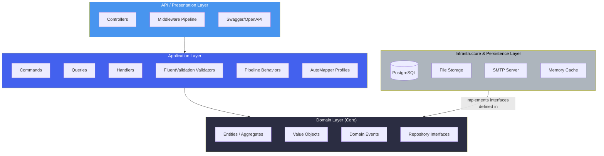

### 3.2 The Dependency Rule in Practice
- **Domain layer** has **zero** dependencies on any other project. It contains Entities, Value Objects, Domain Events, Domain Exceptions, and repository **interfaces** (not implementations).
- **Application layer** depends only on **Domain**. It contains Commands, Queries, Handlers, DTOs, Validators, and orchestration logic. It defines interfaces for anything infrastructural it needs (e.g., `IEmailService`, `IFileStorageService`).
- **Infrastructure/Persistence layer** depends on **Application** and **Domain** (to implement their interfaces) but nothing depends on Infrastructure directly except the composition root (API startup).
- **API layer** depends on **Application** (to dispatch MediatR requests) and on **Infrastructure** only at startup/composition-root time (`Program.cs`) for DI registration — controllers themselves never reference Infrastructure types directly.

> ⚠️ **Warning:** A controller that directly injects `AppDbContext` or any Infrastructure-layer class is a Clean Architecture violation and must be flagged in code review. Controllers must depend only on `IMediator`.

### 3.3 High-Level Component Flow

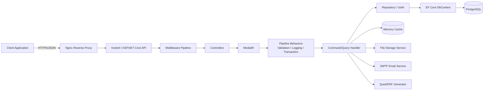

### 3.4 Best Practices
- Keep the **Domain layer** persistence-ignorant: no EF Core attributes, no `DbContext` references, no infrastructure `using` statements.
- Favor **rich domain models** (behavior-carrying entities) over anemic models for aggregates with real business invariants (e.g., `LeaveRequest`, `PayrollRun`).
- Use **Domain Events** to decouple side effects (e.g., `EmployeeOnboardedEvent` triggers welcome email + asset allocation task) instead of chaining logic in a single handler.
- Every cross-cutting concern (validation, logging, transactions, caching) should be implemented as a **MediatR Pipeline Behavior**, not duplicated in each handler.

---

## 4. Project Folder Structure

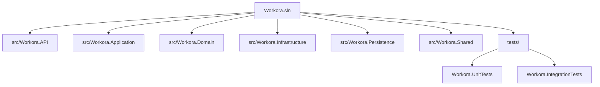

| Folder / Project | Responsibility |
|---|---|
| `Workora.API` | ASP.NET Core Web API host: Controllers, Middleware, Swagger config, `Program.cs` composition root, appsettings |
| `Workora.Application` | CQRS Commands/Queries/Handlers, DTOs, Validators, MediatR Pipeline Behaviors, AutoMapper Profiles, service interfaces |
| `Workora.Domain` | Entities, Value Objects, Enums, Domain Events, Domain Exceptions, Repository interfaces, Specifications |
| `Workora.Infrastructure` | Implementations of Application-defined interfaces: Email (SMTP), File Storage, PDF (QuestPDF), Token Service, Background Jobs |
| `Workora.Persistence` | EF Core `DbContext`, Entity Configurations, Migrations, Repository implementations, Seeders |
| `Workora.Shared` | Cross-cutting constants, common response wrappers (`ApiResponse<T>`), extension methods, guard clauses |
| `tests/Workora.UnitTests` | xUnit unit tests for handlers, validators, domain logic (mocked dependencies) |
| `tests/Workora.IntegrationTests` | End-to-end API tests against a Testcontainers-provisioned PostgreSQL instance |

> **Note:** `Persistence` is deliberately separated from `Infrastructure` so that database concerns (migrations, EF configurations) can evolve independently from external-service integrations (SMTP, file storage). Both implement interfaces owned by `Domain`/`Application`.

---

## 5. Request Lifecycle

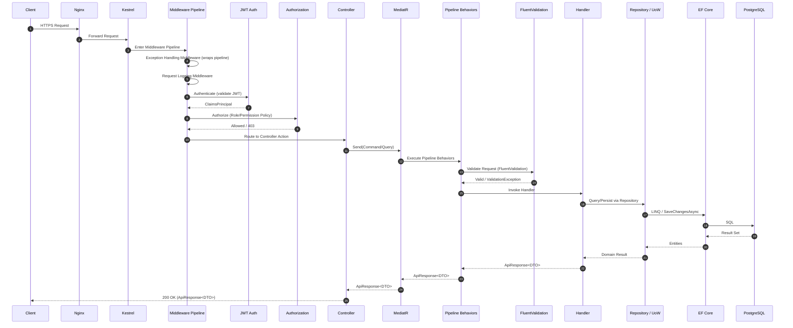

### 5.1 Pipeline Stages Explained
1. **Exception Handling Middleware** — outermost; catches unhandled exceptions and converts them into a standardized `ErrorResponse`.
2. **Request Logging Middleware** — logs method, path, status code, and duration via Serilog with a correlation ID.
3. **Authentication Middleware** — validates the JWT signature, expiry, and issuer/audience; populates `HttpContext.User`.
4. **Authorization Middleware** — evaluates policy requirements (role and/or permission claims) against the route's `[Authorize]` metadata.
5. **Controller Action** — a thin layer that maps the HTTP request to a MediatR `IRequest` and directly returns the resulting `ApiResponse<T>`.
6. **MediatR Pipeline Behaviors** — execute in registered order: `ValidationBehavior` → `LoggingBehavior` → `TransactionBehavior` → `CachingBehavior` (for queries) → Handler.
7. **Handler** — orchestrates domain logic, repository calls, and side effects (email, PDF, events).

---

## 6. Authentication

### 6.1 JWT Authentication Flow

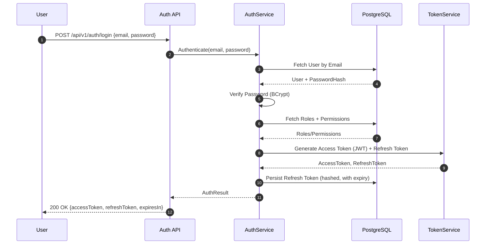

### 6.2 Token Claims Structure
| Claim | Description |
|---|---|
| `sub` | User ID (GUID) |
| `email` | User email address |
| `name` | Full display name |
| `role` | One or more role names (e.g., `Admin`, `HRManager`, `Employee`) |
| `permission` | One claim per granted permission (e.g., `employees.create`, `payroll.approve`) |
| `tenant_id` | Company/tenant identifier (multi-company support) |
| `jti` | Unique token identifier (used for revocation tracking) |
| `exp` | Expiration timestamp (default: 15 minutes for access tokens) |

### 6.3 Refresh Token Strategy
- Refresh tokens are opaque, cryptographically random strings (256-bit), **hashed** (SHA-256) before storage — never stored in plaintext.
- Refresh tokens are long-lived (default: 7 days) and stored per-device, enabling multi-device session management and per-device revocation.
- Refresh token rotation is enforced: each use invalidates the prior token and issues a new one, mitigating replay attacks.
- On logout, the associated refresh token is revoked server-side immediately.

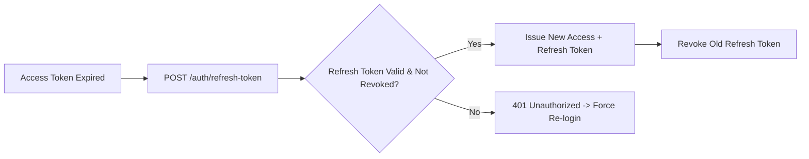

> **Best Practice:** Access tokens are never persisted client-side in `localStorage` on web clients; use `httpOnly` secure cookies or in-memory storage to reduce XSS token-theft exposure.

---

## 7. Authorization

Workora combines three complementary authorization models:

### 7.1 Role-Based Access Control (RBAC)
Coarse-grained access based on named roles (`SuperAdmin`, `HRManager`, `PayrollOfficer`, `Employee`, `Manager`). Roles group permissions for ease of assignment.

### 7.2 Permission-Based Access Control (PBAC)
Fine-grained access based on discrete permission strings following the `{module}.{action}` convention, e.g., `employees.create`, `employees.delete`, `payroll.process`, `leave.approve`. Permissions are assigned to roles, and roles are assigned to users — but permission checks at the API layer are always against the **permission claim**, never the role name directly, so that role composition can change without touching controller code.

### 7.3 Policy-Based Authorization
ASP.NET Core policies compose role/permission checks into named policies evaluated by custom `IAuthorizationHandler` implementations.

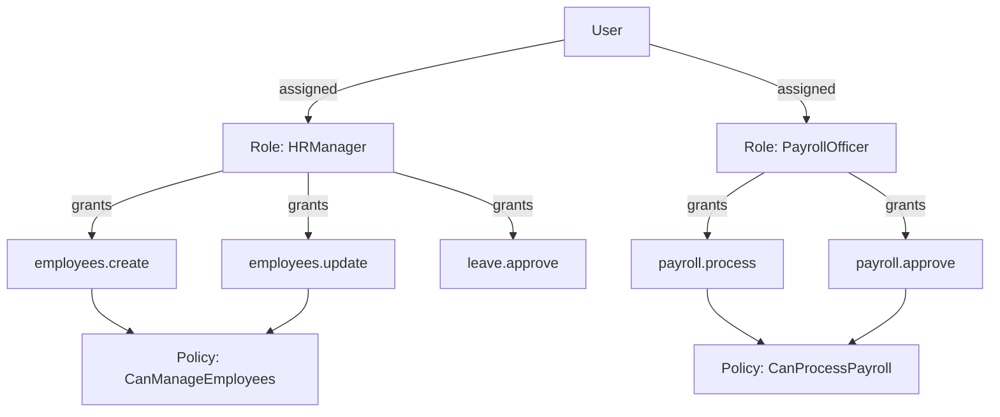

```csharp
// Example controller usage
[Authorize(Policy = "employees.create")]
[HttpPost]
public async Task<ApiResponse<Guid>> CreateEmployee(CreateEmployeeCommand command)
    => await _mediator.Send(command);
```

> ⚠️ **Warning:** Never rely solely on UI-level hiding of buttons/menus for authorization. Every state-changing endpoint must independently enforce a permission policy server-side.

---

## 8. Database Architecture

### 8.1 Entity Relationship Overview (Core Domain)

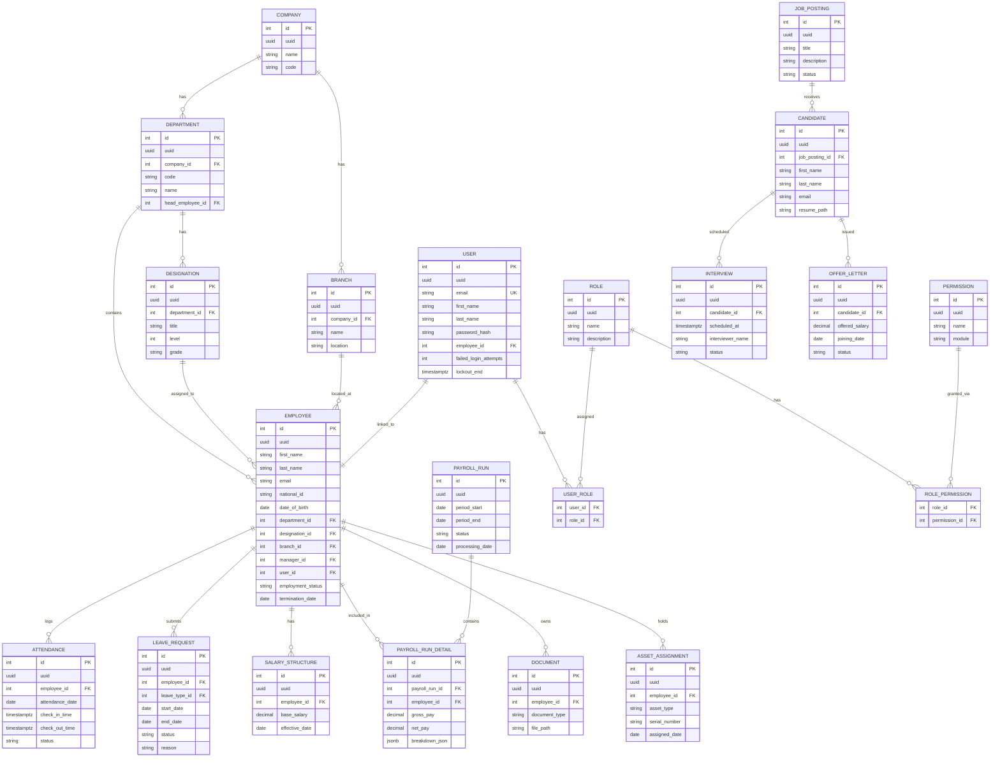

### 8.2 Naming Conventions
| Object | Convention | Example |
|---|---|---|
| Table | `snake_case`, plural | `employees`, `leave_requests` |
| Column | `snake_case` | `first_name`, `created_at` |
| Primary Key | `id` (UUID) | `id` |
| Foreign Key | `{singular_table}_id` | `department_id` |
| Index | `ix_{table}_{column(s)}` | `ix_employees_department_id` |
| Unique Constraint | `uq_{table}_{column(s)}` | `uq_users_email` |
| Check Constraint | `ck_{table}_{rule}` | `ck_leave_requests_dates` |

> **Note:** EF Core's `UseSnakeCaseNamingConvention` (EFCore.NamingConventions package) is used so that C# entities remain `PascalCase` while PostgreSQL objects remain idiomatic `snake_case`.

### 8.3 Migration Strategy
- Migrations are generated via `dotnet ef migrations add {Name}` per feature branch and reviewed in pull requests as first-class code artifacts.
- **No destructive migrations** (column drops, type narrowing) are applied directly in production; a two-phase **expand/contract** pattern is used: (1) expand — add new column/table, dual-write; (2) contract — remove old column in a subsequent release after backfill verification.
- Migrations run automatically on deployment via a dedicated `migrate` job in the CI/CD pipeline (`dotnet ef database update`), never from developer machines against production.
- Each migration is idempotent and reversible (`Down()` methods are implemented, not left empty).

### 8.4 Indexes
- Every foreign key column has a supporting non-clustered index.
- Composite indexes are added for common filter/sort combinations (e.g., `(employee_id, attendance_date)` on `attendance`).
- Partial indexes are used for soft-delete filtering: `CREATE INDEX ix_employees_active ON employees (id) WHERE is_deleted = false;`
- `GIN` indexes are used on JSONB columns (e.g., `payroll_run_detail.breakdown_json`) where ad-hoc querying is required.

### 8.5 Constraints
- `NOT NULL` is the default for all business-required columns; nullability is an explicit domain decision, not an oversight.
- Foreign keys use `ON DELETE RESTRICT` by default; cascading deletes are used only for true ownership relationships (e.g., `PayrollRun` → `PayrollRunDetail`).
- `CHECK` constraints enforce domain invariants at the database level as a defense-in-depth measure (e.g., `end_date >= start_date`).

### 8.6 Soft Delete
All aggregate roots inherit from `AuditableEntity`, which includes:

| Column | Type | Purpose |
|---|---|---|
| `is_deleted` | boolean | Soft-delete flag |
| `deleted_at` | timestamptz, nullable | Deletion timestamp |
| `deleted_by` | uuid, nullable | User who performed the deletion |

A global EF Core query filter (`HasQueryFilter(e => !e.IsDeleted)`) is applied per entity so soft-deleted rows are excluded from all default queries automatically.

### 8.7 Audit Columns
| Column | Type | Purpose |
|---|---|---|
| `created_at` | timestamptz | Set automatically via `SaveChangesAsync` interceptor |
| `created_by` | uuid | Populated from the current `ICurrentUserService` |
| `updated_at` | timestamptz, nullable | Updated automatically on modification |
| `updated_by` | uuid, nullable | Populated automatically |

### 8.8 Concurrency Control
- Optimistic concurrency is implemented via a `xmin` PostgreSQL system column mapped as a concurrency token (`IsRowVersion()`), avoiding a dedicated version column.
- Concurrency conflicts raise `DbUpdateConcurrencyException`, translated by the Global Exception Middleware into a `409 Conflict` response with a machine-readable `ConcurrencyConflict` error code.

> **Best Practice:** Long-running payroll processing runs use a **pessimistic** application-level lock (a `processing` status flag with a unique partial index) in addition to optimistic concurrency, since payroll runs must not be processed concurrently by two operators.

### 8.9 Detailed Entity Schema (All Columns)

**Note**: Most entities (all aggregate roots) derive from `AuditableEntity` (which inherits `BaseEntity`). Therefore, they implicitly contain the following standard audit columns:
- `id` (int, Primary Key)
- `uuid` (uuid, Unique)
- `is_active` (boolean)
- `created_at` (timestamptz)
- `created_by` (uuid)
- `updated_at` (timestamptz, nullable)
- `updated_by` (uuid, nullable)
- `is_deleted` (boolean, for soft-delete)
- `deleted_at` (timestamptz, nullable)
- `deleted_by` (uuid, nullable)

The below schemas focus on the domain-specific columns.

#### 1. users
- `email` (varchar, unique)
- `first_name` (varchar)
- `last_name` (varchar)
- `password_hash` (varchar)
- `employee_id` (int, nullable FK to employees)
- `failed_login_attempts` (int)
- `lockout_end` (timestamptz, nullable)

#### 2. login_audit_logs (Inherits BaseEntity only)
- `email` (varchar)
- `is_success` (boolean)
- `ip_address` (varchar)
- `user_agent` (varchar)
- `details` (varchar, nullable)

#### 3. password_reset_tokens
- `user_id` (int, FK to users)
- `token_hash` (varchar)
- `expires_at` (timestamptz)
- `is_used` (boolean)

#### 4. refresh_tokens
- `token_hash` (varchar)
- `user_id` (int, FK to users)
- `expires_at` (timestamptz)
- `created_by_ip` (varchar)
- `created_by_user_agent` (varchar)
- `is_revoked` (boolean)
- `revoked_at` (timestamptz, nullable)

#### 5. employees
- `first_name` (varchar)
- `last_name` (varchar)
- `email` (varchar)
- `national_id` (varchar, unique)
- `date_of_birth` (date)
- `department_id` (int, FK to departments)
- `designation_id` (int, FK to designations)
- `branch_id` (int, FK to branches)
- `manager_id` (int, nullable FK to employees - self)
- `user_id` (int, nullable FK to users)
- `employment_status` (varchar / enum)
- `termination_date` (date, nullable)

#### 6. departments
- `company_id` (int, FK to companies)
- `code` (varchar, unique)
- `name` (varchar)
- `head_employee_id` (int, nullable FK to employees)

#### 7. designations
- `department_id` (int, FK to departments)
- `title` (varchar)
- `level` (int)
- `grade` (varchar)

#### 8. branches
- `company_id` (int, FK to companies)
- `name` (varchar)
- `location` (varchar)

#### 9. companies
- `name` (varchar)
- `code` (varchar)

#### 10. roles
- `name` (varchar)
- `description` (varchar)

#### 11. permissions
- `name` (varchar)
- `module` (varchar)

#### 12. user_roles (Junction Table)
- `user_id` (int, FK to users)
- `role_id` (int, FK to roles)

#### 13. role_permissions (Junction Table)
- `role_id` (int, FK to roles)
- `permission_id` (int, FK to permissions)

#### 14. attendance_records
- `employee_id` (int, FK to employees)
- `attendance_date` (date)
- `check_in_time` (timestamptz, nullable)
- `check_out_time` (timestamptz, nullable)
- `status` (varchar)

#### 15. leave_requests
- `employee_id` (int, FK to employees)
- `leave_type_id` (int, FK to leave_types)
- `start_date` (date)
- `end_date` (date)
- `status` (varchar)
- `reason` (varchar)

#### 16. salary_structures
- `employee_id` (int, FK to employees)
- `base_salary` (decimal)
- `effective_date` (date)

#### 17. payroll_runs
- `period_start` (date)
- `period_end` (date)
- `status` (varchar)
- `processing_date` (date)

#### 18. payroll_run_details
- `payroll_run_id` (int, FK to payroll_runs)
- `employee_id` (int, FK to employees)
- `gross_pay` (decimal)
- `net_pay` (decimal)
- `breakdown_json` (jsonb)

---

## 9. Module Architecture

This section documents every functional module of Workora. Each module follows the same architectural template: **Purpose**, **Features**, **Database Tables**, **Relationships**, **Business Rules**, **API Endpoints**, **Flow Diagram**, **Validation**, **Permissions**, **Repository**, and **Services**.

---

### 9.1 Authentication Module

**Purpose:** Handles user login, logout, token issuance/refresh, and password recovery.

**Features:** Login, Logout, Refresh Token, Forgot Password, Reset Password, Change Password, Session/Device tracking.

**Database Tables:** `users` (shared with Users module), `refresh_tokens`, `password_reset_tokens`, `login_audit_logs`.

**Relationships:** `refresh_tokens.user_id → users.id`; `password_reset_tokens.user_id → users.id`.

**Business Rules:**
- Accounts lock for 15 minutes after 5 consecutive failed login attempts.
- Password reset tokens are single-use and expire after 30 minutes.
- Refresh tokens rotate on every use (see Section 6.3).

**API Endpoints:**

| Method | URL | Description | Auth |
|---|---|---|---|
| POST | `/api/v1/auth/login` | Authenticate and issue tokens | Anonymous |
| POST | `/api/v1/auth/refresh-token` | Exchange refresh token for new pair | Anonymous (token in body) |
| POST | `/api/v1/auth/logout` | Revoke current refresh token | Authenticated |
| POST | `/api/v1/auth/forgot-password` | Request password reset email | Anonymous |
| POST | `/api/v1/auth/reset-password` | Reset password with token | Anonymous |
| POST | `/api/v1/auth/change-password` | Change password (logged in) | Authenticated |
| GET | `/api/v1/auth/me` | Get current authenticated user profile + roles/permissions | Authenticated |
| GET | `/api/v1/auth/sessions` | List active sessions/devices (by refresh token) | Authenticated |
| POST | `/api/v1/auth/logout-all` | Revoke all refresh tokens/sessions for the current user | Authenticated |

**Flow Diagram:** See Section 6.1 (JWT Authentication Flow).

**Validation:** Email format, password complexity (min 8 chars, upper/lower/digit/symbol), token presence.

**Permissions:** None required (public/self-service endpoints); `change-password`, `me`, `sessions`, and `logout-all` require an authenticated identity only.

**Repository:** `IUserRepository`, `IRefreshTokenRepository`.

**Services:** `IAuthService`, `ITokenService`, `IPasswordHasher`, `IEmailService` (reset link delivery).

---

### 9.2 Users Module

**Purpose:** Manages system user accounts (distinct from Employee HR records, though typically 1:1 linked).

**Features:** Create/Update/Deactivate user, assign roles, view user list, link user to employee record.

**Database Tables:** `users`, `user_roles`.

**Relationships:** `users.employee_id → employees.id` (nullable, 1:1); `user_roles.user_id → users.id`; `user_roles.role_id → roles.id`.

**Business Rules:**
- A user's email must be unique across the tenant.
- Deactivating a user immediately revokes all active refresh tokens.
- A user cannot be deleted if they are the sole `SuperAdmin`.

**API Endpoints:**

| Method | URL | Description | Auth | Permission |
|---|---|---|---|---|
| GET | `/api/v1/users` | List users (paged/filtered) | Yes | `users.view` |
| GET | `/api/v1/users/{id}` | Get user detail | Yes | `users.view` |
| POST | `/api/v1/users` | Create user | Yes | `users.create` |
| PUT | `/api/v1/users/{id}` | Update user | Yes | `users.update` |
| PATCH | `/api/v1/users/{id}/deactivate` | Deactivate user | Yes | `users.deactivate` |
| PATCH | `/api/v1/users/{id}/activate` | Reactivate a previously deactivated user | Yes | `users.deactivate` |
| POST | `/api/v1/users/{id}/roles` | Assign roles | Yes | `users.assign-roles` |
| DELETE | `/api/v1/users/{id}` | Hard-delete a user (only if never linked to audit-relevant activity) | Yes | `users.delete` |
| POST | `/api/v1/users/{id}/reset-password` | Admin-triggered password reset (issues reset email) | Yes | `users.manage` |
| GET | `/api/v1/users/me` | Get current user's own account record | Yes | Authenticated |

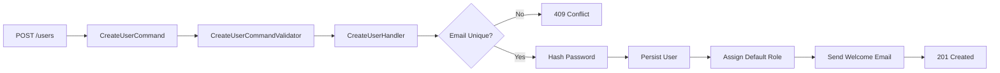

**Validation:** Unique email, valid role IDs, required first/last name.

**Permissions:** `users.view`, `users.create`, `users.update`, `users.deactivate`, `users.assign-roles`, `users.delete`, `users.manage`.

**Repository:** `IUserRepository`.

**Services:** `IUserService`, `IPasswordHasher`, `IEmailService`.

---

### 9.3 Roles Module

**Purpose:** Defines named roles that group permissions for assignment to users.

**Features:** CRUD roles, view role's permissions, clone role.

**Database Tables:** `roles`, `role_permissions`.

**Relationships:** `role_permissions.role_id → roles.id`; `role_permissions.permission_id → permissions.id`.

**Business Rules:**
- System-seeded roles (`SuperAdmin`, `Employee`) cannot be deleted, only extended.
- A role in use by at least one user cannot be deleted (must be reassigned first).

**API Endpoints:**

| Method | URL | Description | Permission |
|---|---|---|---|
| GET | `/api/v1/roles` | List roles | `roles.view` |
| GET | `/api/v1/roles/{id}` | Get role detail (with assigned permissions) | `roles.view` |
| POST | `/api/v1/roles` | Create role | `roles.create` |
| PUT | `/api/v1/roles/{id}` | Update role | `roles.update` |
| DELETE | `/api/v1/roles/{id}` | Delete role | `roles.delete` |
| PUT | `/api/v1/roles/{id}/permissions` | Set role permissions | `roles.manage-permissions` |
| POST | `/api/v1/roles/{id}/clone` | Clone an existing role (with its permission set) as a new role | `roles.create` |

**Validation:** Unique role name per tenant; permission IDs must exist.

**Permissions:** `roles.view`, `roles.create`, `roles.update`, `roles.delete`, `roles.manage-permissions`.

**Repository:** `IRoleRepository`.

**Services:** `IRoleService`.

---

### 9.4 Permissions Module

**Purpose:** Catalog of discrete, seedable permission strings that map to protected operations.

**Features:** List available permissions grouped by module (read-only reference data — permissions are seeded from code via `PermissionCatalog`, not created ad hoc by users).

**Database Tables:** `permissions`.

**Relationships:** `role_permissions.permission_id → permissions.id`.

**Business Rules:** Permissions are compile-time constants mirrored into the database by a startup seeder; the API does not expose create/update/delete for permissions themselves — only viewing.

**API Endpoints:**

| Method | URL | Description | Permission |
|---|---|---|---|
| GET | `/api/v1/permissions` | List all permissions grouped by module | `permissions.view` |

**Validation:** N/A (read-only).

**Permissions:** `permissions.view`.

**Repository:** `IPermissionRepository`.

**Services:** `IPermissionService`.

---

### 9.5 Departments Module

**Purpose:** Organizational departments within a company/branch.

**Features:** CRUD department, assign department head, view department employee count.

**Database Tables:** `departments`.

**Relationships:** `departments.company_id → companies.id`; `departments.head_employee_id → employees.id` (nullable); `employees.department_id → departments.id`.

**Business Rules:**
- A department cannot be deleted while it has active employees or designations.
- Department code must be unique per company.

**API Endpoints:**

| Method | URL | Description | Permission |
|---|---|---|---|
| GET | `/api/v1/departments` | List departments | `departments.view` |
| GET | `/api/v1/departments/{id}` | Get department detail | `departments.view` |
| POST | `/api/v1/departments` | Create department | `departments.create` |
| PUT | `/api/v1/departments/{id}` | Update department | `departments.update` |
| DELETE | `/api/v1/departments/{id}` | Delete department | `departments.delete` |
| PATCH | `/api/v1/departments/{id}/assign-head` | Assign/change department head | `departments.update` |

**Validation:** Unique code per company, required name, valid head employee ID.

**Permissions:** `departments.view`, `departments.create`, `departments.update`, `departments.delete`.

**Repository:** `IDepartmentRepository`.

**Services:** `IDepartmentService`.

---

### 9.6 Designations Module

**Purpose:** Job titles/grades within a department (e.g., "Software Engineer II").

**Features:** CRUD designation, link to department, define grade/level for salary banding.

**Database Tables:** `designations`.

**Relationships:** `designations.department_id → departments.id`; `employees.designation_id → designations.id`.

**Business Rules:** Designation cannot be deleted while referenced by active employees.

**API Endpoints:**

| Method | URL | Description | Permission |
|---|---|---|---|
| GET | `/api/v1/designations` | List designations | `designations.view` |
| GET | `/api/v1/designations/{id}` | Get designation detail | `designations.view` |
| POST | `/api/v1/designations` | Create designation | `designations.create` |
| PUT | `/api/v1/designations/{id}` | Update designation | `designations.update` |
| DELETE | `/api/v1/designations/{id}` | Delete designation | `designations.delete` |

**Validation:** Required title, valid department ID, unique title per department.

**Permissions:** `designations.view`, `designations.create`, `designations.update`, `designations.delete`.

**Repository:** `IDesignationRepository`. **Services:** `IDesignationService`.

---

### 9.7 Employees Module

**Purpose:** Core HR record for every employee — the central aggregate most other modules reference.

**Features:** Onboarding, profile management, employment history, department/designation assignment, termination/offboarding, employee document management, org chart.

**Database Tables:** `employees`, `employee_employment_history`, `employee_emergency_contacts`, `employee_bank_details`.

**Relationships:** `employees.department_id → departments.id`; `employees.designation_id → designations.id`; `employees.branch_id → branches.id`; `employees.manager_id → employees.id` (self-referencing); `employees.user_id → users.id` (nullable 1:1).

**Business Rules:**
- Employee code is auto-generated (`EMP-{YYYY}-{sequence}`) and immutable.
- An employee cannot be their own manager (validated against the self-reference chain to also prevent cycles).
- Termination sets `employment_status = Terminated` and `termination_date`; it does not hard-delete the record (retained for payroll/legal history).
- Bank details are encrypted at rest (see Section 12.6).

**API Endpoints:**

| Method | URL | Description | Permission |
|---|---|---|---|
| GET | `/api/v1/employees` | List employees (paged/filtered) | `employees.view` |
| GET | `/api/v1/employees/{id}` | Get employee detail | `employees.view` |
| POST | `/api/v1/employees` | Onboard new employee | `employees.create` |
| PUT | `/api/v1/employees/{id}` | Update employee profile | `employees.update` |
| PATCH | `/api/v1/employees/{id}/transfer` | Transfer department/branch | `employees.transfer` |
| PATCH | `/api/v1/employees/{id}/terminate` | Terminate employment | `employees.terminate` |
| GET | `/api/v1/employees/{id}/org-chart` | Get reporting chain | `employees.view` |
| GET | `/api/v1/employees/me` | Get the caller's own employee profile | Authenticated |
| PUT | `/api/v1/employees/me` | Self-update limited profile fields (phone, address, emergency contact) | Authenticated |
| GET | `/api/v1/employees/{id}/employment-history` | Get employment history (transfers, promotions, designation changes) | `employees.view` |
| POST | `/api/v1/employees/{id}/emergency-contacts` | Add/update emergency contact | `employees.update` |
| PUT | `/api/v1/employees/{id}/bank-details` | Create/update bank details (encrypted at rest) | `employees.update` |
| PATCH | `/api/v1/employees/{id}/reactivate` | Reactivate a previously terminated employee (rehire) | `employees.update` |
| GET | `/api/v1/employees/{id}/direct-reports` | List employees reporting directly to this employee | `employees.view` |
| GET | `/api/v1/employees/export` | Export filtered employee list (CSV/Excel) | `employees.view` |

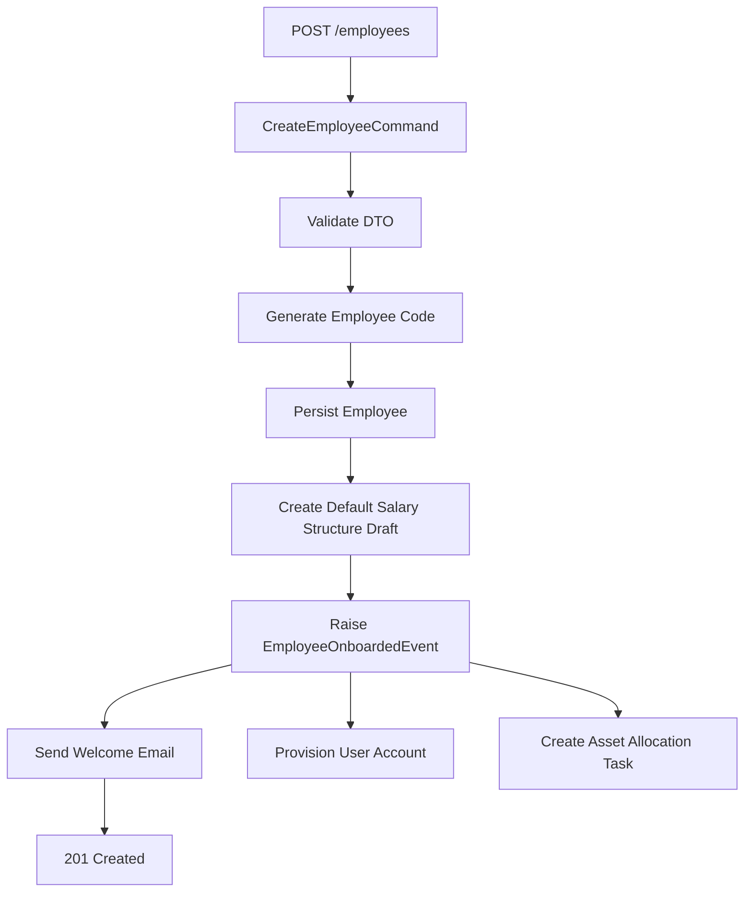

**Validation:** Required legal name, valid date of birth (18+ years), unique national ID, valid department/designation/branch references.

**Permissions:** `employees.view`, `employees.create`, `employees.update`, `employees.transfer`, `employees.terminate`.

**Repository:** `IEmployeeRepository` (includes `Specification`-based filtering for search/pagination).

**Services:** `IEmployeeService`, `IEmployeeCodeGenerator`, domain event handlers for onboarding side-effects.

---

### 9.8 Attendance Module

**Purpose:** Daily clock-in/clock-out tracking and attendance status computation.

**Features:** Check-in/check-out, manual attendance correction (with approval), daily/monthly attendance summary, late/early-leave flags, integration with Shift module for expected hours.

**Database Tables:** `attendance_records`, `attendance_corrections`.

**Relationships:** `attendance_records.employee_id → employees.id`; `attendance_corrections.attendance_record_id → attendance_records.id`; joins `shifts` for expected time windows.

**Business Rules:**
- Only one attendance record per employee per calendar day.
- Check-out time must be after check-in time.
- A correction request requires manager approval before the attendance record is amended; the original values are retained in `attendance_corrections` for audit.
- Attendance status (`Present`, `Late`, `HalfDay`, `Absent`) is computed server-side from shift timing rules, never client-submitted.

**API Endpoints:**

| Method | URL | Description | Permission |
|---|---|---|---|
| POST | `/api/v1/attendance/check-in` | Record check-in | `attendance.self` |
| POST | `/api/v1/attendance/check-out` | Record check-out | `attendance.self` |
| GET | `/api/v1/attendance/{employeeId}` | Get attendance history | `attendance.view` |
| POST | `/api/v1/attendance/{id}/correction` | Request correction | `attendance.self` |
| PATCH | `/api/v1/attendance/corrections/{id}/approve` | Approve correction | `attendance.approve` |
| PATCH | `/api/v1/attendance/corrections/{id}/reject` | Reject correction | `attendance.approve` |
| GET | `/api/v1/attendance/summary` | Monthly summary report | `attendance.view` |
| GET | `/api/v1/attendance/today` | Get the caller's own check-in/check-out status for today | `attendance.self` |
| GET | `/api/v1/attendance/corrections` | List pending/processed correction requests | `attendance.view` |
| POST | `/api/v1/attendance/bulk-import` | Bulk-import attendance records (e.g., from biometric device export) | `attendance.manage` |

**Validation:** Cannot check in twice without checking out; correction reason required (min 10 chars).

**Permissions:** `attendance.self`, `attendance.view`, `attendance.approve`, `attendance.manage`.

**Repository:** `IAttendanceRepository`.

**Services:** `IAttendanceService`, `IShiftResolverService` (computes expected window per employee/day).

---

### 9.9 Leave Module

**Purpose:** Leave request submission, approval workflow, and balance tracking.

**Features:** Apply for leave, multi-level approval, leave balance accrual, leave calendar, cancel/withdraw request.

**Database Tables:** `leave_types`, `leave_requests`, `leave_balances`, `leave_approvals`.

**Relationships:** `leave_requests.employee_id → employees.id`; `leave_requests.leave_type_id → leave_types.id`; `leave_approvals.leave_request_id → leave_requests.id`; `leave_balances.employee_id → employees.id`.

**Business Rules:**
- A leave request cannot exceed the employee's available balance for that leave type unless the leave type allows negative balance (e.g., unpaid leave).
- Overlapping approved leave requests for the same employee are rejected.
- Multi-level approval: direct manager, then HR, configurable per leave type via `requires_hr_approval`.
- Balance is decremented only on final approval, not on submission (reserved/pending is tracked separately to prevent double-booking).
- Cancellation is only allowed before the leave start date, or by HR override after.

**API Endpoints:**

| Method | URL | Description | Permission |
|---|---|---|---|
| POST | `/api/v1/leave/requests` | Submit leave request | `leave.apply` |
| GET | `/api/v1/leave/requests` | List leave requests (self/team) | `leave.view` |
| PATCH | `/api/v1/leave/requests/{id}/approve` | Approve leave | `leave.approve` |
| PATCH | `/api/v1/leave/requests/{id}/reject` | Reject leave | `leave.approve` |
| PATCH | `/api/v1/leave/requests/{id}/cancel` | Cancel leave | `leave.apply` |
| GET | `/api/v1/leave/balances/{employeeId}` | Get leave balances | `leave.view` |
| GET | `/api/v1/leave/types` | List configured leave types | `leave.view` |
| POST | `/api/v1/leave/types` | Create leave type | `leave.manage` |
| PUT | `/api/v1/leave/types/{id}` | Update leave type (accrual rate, negative-balance policy, HR-approval flag) | `leave.manage` |
| GET | `/api/v1/leave/calendar` | Team/company leave calendar for a date range | `leave.view` |

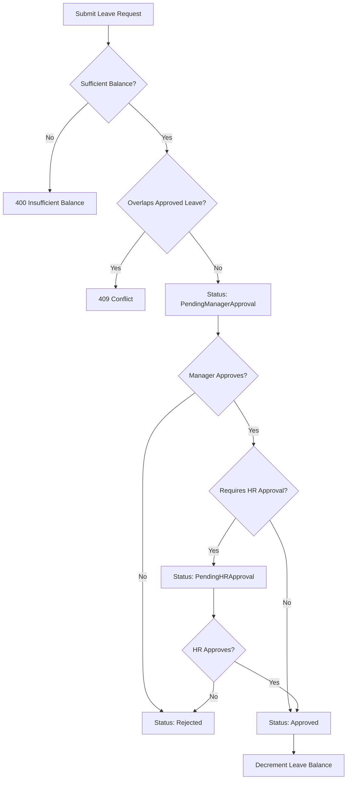

**Validation:** Start date ≤ end date, leave type active, reason required for certain leave types.

**Permissions:** `leave.apply`, `leave.view`, `leave.approve`, `leave.manage`.

**Repository:** `ILeaveRequestRepository`, `ILeaveBalanceRepository`.

**Services:** `ILeaveService`, `ILeaveBalanceAccrualService` (scheduled background job).

---

### 9.10 Payroll Module

**Purpose:** Orchestrates the monthly payroll run: computing gross/net pay, deductions, and generating payslips.

**Features:** Create payroll run, compute earnings/deductions per employee, approve/lock payroll run, generate payslips (PDF), disbursement export.

**Database Tables:** `payroll_runs`, `payroll_run_details`, `payroll_deductions`, `payroll_earnings`.

**Relationships:** `payroll_runs.company_id → companies.id`; `payroll_run_details.payroll_run_id → payroll_runs.id`; `payroll_run_details.employee_id → employees.id`; joins `salary_structures` for computation inputs.

**Business Rules:**
- A payroll run is scoped to a single calendar month and company; only one run per month/company (`uq_payroll_runs_company_month`).
- Once a payroll run is **Locked/Approved**, its detail rows become immutable; corrections require a new **adjustment run**, never editing history.
- Net pay = Gross Earnings − Statutory Deductions − Other Deductions; computation is fully server-side and auditable via `payroll_earnings`/`payroll_deductions` line items.
- Payroll processing uses an application-level lock (Section 8.8) to prevent concurrent processing of the same run.
- Terminated employees are pro-rated automatically based on `termination_date`.

**API Endpoints:**

| Method | URL | Description | Permission |
|---|---|---|---|
| GET | `/api/v1/payroll/runs` | List payroll runs (by company/date range/status) | `payroll.view` |
| POST | `/api/v1/payroll/runs` | Create payroll run for a month | `payroll.create` |
| POST | `/api/v1/payroll/runs/{id}/process` | Compute earnings/deductions | `payroll.process` |
| GET | `/api/v1/payroll/runs/{id}` | View payroll run detail | `payroll.view` |
| PATCH | `/api/v1/payroll/runs/{id}/approve` | Approve/lock run | `payroll.approve` |
| DELETE | `/api/v1/payroll/runs/{id}` | Cancel/delete a run still in `Draft` status | `payroll.create` |
| POST | `/api/v1/payroll/runs/{id}/adjustment` | Create an adjustment run against a locked run | `payroll.process` |
| GET | `/api/v1/payroll/runs/{id}/payslips/{employeeId}` | Download payslip PDF | `payroll.view` |
| GET | `/api/v1/payroll/runs/{id}/payslips` | List/download all payslips for a run (bulk ZIP) | `payroll.view` |
| GET | `/api/v1/payroll/runs/{id}/export` | Bank disbursement export | `payroll.export` |

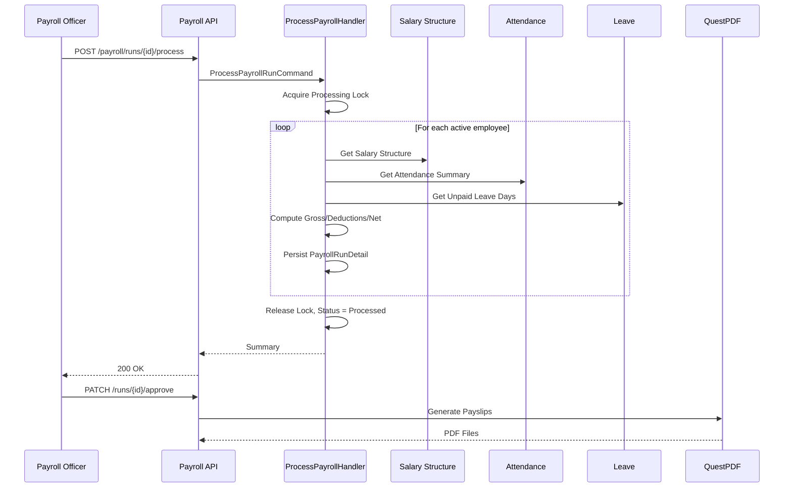

**Validation:** Run must not already exist for company/month; run must be in `Draft` status to process; must be `Processed` to approve.

**Permissions:** `payroll.create`, `payroll.process`, `payroll.approve`, `payroll.view`, `payroll.export`.

**Repository:** `IPayrollRunRepository`.

**Services:** `IPayrollCalculationService`, `IPayslipPdfGenerator`, `IPayrollExportService`.

---

### 9.11 Salary Structure Module

**Purpose:** Defines the compensation composition (basic, allowances, deductions) for each employee, used as the input to Payroll.

**Features:** Define salary components, assign structure to employee, effective-dated revisions (raises/promotions).

**Database Tables:** `salary_structures`, `salary_components`, `salary_structure_components`.

**Relationships:** `salary_structures.employee_id → employees.id`; `salary_structure_components.salary_structure_id → salary_structures.id`; `salary_structure_components.salary_component_id → salary_components.id`.

**Business Rules:**
- Salary structures are **effective-dated**: a new structure row is created on revision, with `effective_from`, never overwriting history (payroll for prior months must use the structure active at that time).
- Sum of percentage-based components must resolve to a valid gross; validated at save time.
- Only one structure may be `Active` per employee at any given date (enforced via exclusion constraint on date range).

**API Endpoints:**

| Method | URL | Description | Permission |
|---|---|---|---|
| GET | `/api/v1/salary-structures/{employeeId}` | Get current/historical structures | `salary.view` |
| POST | `/api/v1/salary-structures` | Create/revise structure | `salary.manage` |
| DELETE | `/api/v1/salary-structures/{id}` | Retract a draft (not-yet-effective) structure revision | `salary.manage` |
| GET | `/api/v1/salary-components` | List available components | `salary.view` |
| POST | `/api/v1/salary-components` | Create a new salary component (allowance/deduction type) | `salary.manage` |
| PUT | `/api/v1/salary-components/{id}` | Update a salary component definition | `salary.manage` |

**Validation:** `effective_from` ≥ employee hire date; component amounts non-negative.

**Permissions:** `salary.view`, `salary.manage`.

**Repository:** `ISalaryStructureRepository`. **Services:** `ISalaryStructureService`.

---

### 9.12 Recruitment Module

**Purpose:** Umbrella module coordinating the hiring pipeline (Job Postings → Candidates → Interviews → Offer Letters).

**Features:** Pipeline dashboard, stage transitions, hiring analytics.

**Database Tables:** Aggregates data from `job_postings`, `candidates`, `interviews`, `offer_letters` (no dedicated table of its own beyond `recruitment_pipelines` for stage configuration).

**Relationships:** See sub-modules below.

**Business Rules:** Pipeline stage order is configurable per company (`recruitment_pipeline_stages`), but default flow is `Applied → Screening → Interview → Offer → Hired/Rejected`.

**API Endpoints:**

| Method | URL | Description | Permission |
|---|---|---|---|
| GET | `/api/v1/recruitment/pipeline` | Pipeline board view | `recruitment.view` |
| GET | `/api/v1/recruitment/analytics` | Hiring funnel metrics | `recruitment.view` |
| PUT | `/api/v1/recruitment/pipeline-stages` | Configure the company's pipeline stage order | `recruitment.manage` |

**Permissions:** `recruitment.view`, `recruitment.manage`. **Repository:** composed from sub-module repositories. **Services:** `IRecruitmentPipelineService`.

---

### 9.13 Job Posting Module

**Purpose:** Manages open positions published internally/externally.

**Features:** Create/publish/close job posting, define requirements, link to department/designation.

**Database Tables:** `job_postings`.

**Relationships:** `job_postings.department_id → departments.id`; `job_postings.designation_id → designations.id`; `candidates.job_posting_id → job_postings.id`.

**Business Rules:** A closed job posting can no longer accept new candidates; `openings_count` decrements as candidates are marked `Hired` and auto-closes at zero.

**API Endpoints:**

| Method | URL | Description | Permission |
|---|---|---|---|
| GET | `/api/v1/job-postings` | List postings | `recruitment.view` |
| GET | `/api/v1/job-postings/{id}` | Get posting detail | `recruitment.view` |
| POST | `/api/v1/job-postings` | Create posting | `recruitment.manage` |
| PUT | `/api/v1/job-postings/{id}` | Update posting | `recruitment.manage` |
| DELETE | `/api/v1/job-postings/{id}` | Delete a posting with no candidates yet | `recruitment.manage` |
| PATCH | `/api/v1/job-postings/{id}/publish` | Publish posting | `recruitment.manage` |
| PATCH | `/api/v1/job-postings/{id}/close` | Close posting | `recruitment.manage` |

**Validation:** Openings count > 0, valid department/designation.

**Permissions:** `recruitment.view`, `recruitment.manage`.

**Repository:** `IJobPostingRepository`. **Services:** `IJobPostingService`.

---

### 9.14 Candidates Module

**Purpose:** Tracks applicants against job postings through the hiring pipeline.

**Features:** Register candidate, upload resume, update pipeline stage, add evaluation notes.

**Database Tables:** `candidates`, `candidate_documents`, `candidate_notes`.

**Relationships:** `candidates.job_posting_id → job_postings.id`; `candidate_documents.candidate_id → candidates.id`; `interviews.candidate_id → candidates.id`; `offer_letters.candidate_id → candidates.id`.

**Business Rules:**
- Candidate email is unique per job posting (a candidate may apply to multiple postings).
- Stage transitions are validated against the configured pipeline order — a candidate cannot skip from `Applied` directly to `Offer` without passing through required stages, unless the actor holds `recruitment.override-stage`.

**API Endpoints:**

| Method | URL | Description | Permission |
|---|---|---|---|
| GET | `/api/v1/candidates` | List/search candidates | `recruitment.view` |
| GET | `/api/v1/candidates/{id}` | Get candidate detail | `recruitment.view` |
| POST | `/api/v1/candidates` | Register candidate | `recruitment.manage` |
| PUT | `/api/v1/candidates/{id}` | Update candidate profile | `recruitment.manage` |
| PATCH | `/api/v1/candidates/{id}/stage` | Move pipeline stage | `recruitment.manage` |
| PATCH | `/api/v1/candidates/{id}/reject` | Reject candidate (with reason) | `recruitment.manage` |
| POST | `/api/v1/candidates/{id}/documents` | Upload resume/documents | `recruitment.manage` |
| POST | `/api/v1/candidates/{id}/notes` | Add an evaluation note | `recruitment.manage` |

**Validation:** Resume file type restricted to PDF/DOCX, max 5MB.

**Permissions:** `recruitment.view`, `recruitment.manage`, `recruitment.override-stage`.

**Repository:** `ICandidateRepository`. **Services:** `ICandidateService`, `IFileStorageService`.

---

### 9.15 Interview Module

**Purpose:** Schedules and records interview rounds for candidates.

**Features:** Schedule interview, assign panel members, record feedback/scorecards, reschedule/cancel.

**Database Tables:** `interviews`, `interview_panelists`, `interview_feedback`.

**Relationships:** `interviews.candidate_id → candidates.id`; `interview_panelists.interview_id → interviews.id`; `interview_panelists.employee_id → employees.id`; `interview_feedback.interview_id → interviews.id`.

**Business Rules:**
- An interview cannot be scheduled in the past.
- All assigned panelists must submit feedback before the candidate can be moved past the `Interview` stage (unless overridden by HR).
- Panelist double-booking (same employee, overlapping time) triggers a warning but is not hard-blocked.

**API Endpoints:**

| Method | URL | Description | Permission |
|---|---|---|---|
| GET | `/api/v1/interviews` | List interviews (by candidate/date/panelist) | `recruitment.view` |
| POST | `/api/v1/interviews` | Schedule interview | `recruitment.manage` |
| PATCH | `/api/v1/interviews/{id}/reschedule` | Reschedule | `recruitment.manage` |
| PATCH | `/api/v1/interviews/{id}/cancel` | Cancel interview | `recruitment.manage` |
| POST | `/api/v1/interviews/{id}/feedback` | Submit feedback | `recruitment.interview` |
| GET | `/api/v1/interviews/{id}` | Interview detail | `recruitment.view` |

**Validation:** Scheduled time in the future, at least one panelist assigned, feedback score within defined scale (1–5).

**Permissions:** `recruitment.view`, `recruitment.manage`, `recruitment.interview`.

**Repository:** `IInterviewRepository`. **Services:** `IInterviewService`, `INotificationService` (panelist invites).

---

### 9.16 Offer Letter Module

**Purpose:** Generates and tracks formal offer letters for successful candidates.

**Features:** Generate offer (PDF via QuestPDF), send for e-acceptance, track accept/decline/expire, convert accepted offer into an Employee record.

**Database Tables:** `offer_letters`.

**Relationships:** `offer_letters.candidate_id → candidates.id`; `offer_letters.job_posting_id → job_postings.id`.

**Business Rules:**
- Offer letters expire automatically after a configurable window (default 7 days) via a background job; expired offers cannot be accepted.
- Accepting an offer triggers `CandidateHiredEvent`, which pre-populates a draft Employee record for HR to finalize onboarding.
- Only one active (non-expired, non-declined) offer per candidate per job posting.

**API Endpoints:**

| Method | URL | Description | Permission |
|---|---|---|---|
| GET | `/api/v1/offer-letters` | List offer letters (by candidate/status) | `recruitment.view` |
| GET | `/api/v1/offer-letters/{id}` | Get offer letter detail | `recruitment.view` |
| POST | `/api/v1/offer-letters` | Generate offer | `recruitment.offer` |
| GET | `/api/v1/offer-letters/{id}/pdf` | Download offer PDF | `recruitment.view` |
| PATCH | `/api/v1/offer-letters/{id}/accept` | Mark accepted | `recruitment.offer` |
| PATCH | `/api/v1/offer-letters/{id}/decline` | Mark declined | `recruitment.offer` |
| POST | `/api/v1/offer-letters/{id}/resend` | Resend the offer letter email/e-acceptance link | `recruitment.offer` |

**Validation:** Offered salary within approved band, candidate not already hired.

**Permissions:** `recruitment.offer`, `recruitment.view`.

**Repository:** `IOfferLetterRepository`. **Services:** `IOfferLetterService`, `IPdfGenerationService`, `IEmailService`.

---

### 9.17 Performance Module

**Purpose:** Manages performance review cycles, goal setting, and evaluations.

**Features:** Define review cycle, set employee goals (OKRs/KPIs), self-assessment, manager assessment, final rating, 360-degree feedback (optional).

**Database Tables:** `performance_cycles`, `performance_goals`, `performance_reviews`, `performance_review_feedback`.

**Relationships:** `performance_reviews.employee_id → employees.id`; `performance_reviews.cycle_id → performance_cycles.id`; `performance_goals.employee_id → employees.id`.

**Business Rules:**
- A review cannot be finalized until both self-assessment and manager-assessment sections are submitted.
- Goal weightages within a cycle must sum to 100%.
- Historical reviews are immutable once `Finalized`.

**API Endpoints:**

| Method | URL | Description | Permission |
|---|---|---|---|
| GET | `/api/v1/performance/cycles` | List review cycles | `performance.manage` |
| POST | `/api/v1/performance/cycles` | Create review cycle | `performance.manage` |
| POST | `/api/v1/performance/goals` | Set employee goals | `performance.self` |
| DELETE | `/api/v1/performance/goals/{id}` | Remove a goal (before cycle finalization) | `performance.self` |
| GET | `/api/v1/performance/reviews` | List reviews (self/team/cycle) | `performance.review` |
| GET | `/api/v1/performance/reviews/{id}` | Get review detail | `performance.self` |
| POST | `/api/v1/performance/reviews/{id}/self-assessment` | Submit self-review | `performance.self` |
| POST | `/api/v1/performance/reviews/{id}/manager-assessment` | Submit manager review | `performance.review` |
| PATCH | `/api/v1/performance/reviews/{id}/finalize` | Finalize review | `performance.finalize` |

**Validation:** Goal weightage sum = 100%, rating within defined scale.

**Permissions:** `performance.self`, `performance.review`, `performance.finalize`, `performance.manage`.

**Repository:** `IPerformanceReviewRepository`. **Services:** `IPerformanceService`.

---

### 9.18 Training Module

**Purpose:** Tracks training programs and employee enrollment/completion.

**Features:** Create training program, enroll employees, track completion/certification, feedback survey.

**Database Tables:** `training_programs`, `training_enrollments`.

**Relationships:** `training_enrollments.employee_id → employees.id`; `training_enrollments.training_program_id → training_programs.id`.

**Business Rules:** Enrollment capacity is enforced (`max_participants`); completion requires `attendance_percentage ≥ program.min_attendance_required`.

**API Endpoints:**

| Method | URL | Description | Permission |
|---|---|---|---|
| GET | `/api/v1/training/programs` | List programs | `training.view` |
| GET | `/api/v1/training/programs/{id}` | Get program detail | `training.view` |
| POST | `/api/v1/training/programs` | Create program | `training.manage` |
| PUT | `/api/v1/training/programs/{id}` | Update program | `training.manage` |
| DELETE | `/api/v1/training/programs/{id}` | Delete/cancel a program with no active enrollments | `training.manage` |
| GET | `/api/v1/training/enrollments` | List enrollments (by employee/program) | `training.view` |
| POST | `/api/v1/training/enrollments` | Enroll employee | `training.enroll` |
| PATCH | `/api/v1/training/enrollments/{id}/complete` | Mark completed | `training.manage` |
| PATCH | `/api/v1/training/enrollments/{id}/cancel` | Cancel enrollment | `training.manage` |

**Validation:** Enrollment capacity not exceeded, program not expired.

**Permissions:** `training.view`, `training.manage`, `training.enroll`.

**Repository:** `ITrainingRepository`. **Services:** `ITrainingService`.

---

### 9.19 Assets Module

**Purpose:** Tracks company assets (laptops, equipment) issued to employees.

**Features:** Register asset, assign/return asset, condition tracking, maintenance log.

**Database Tables:** `assets`, `asset_assignments`.

**Relationships:** `asset_assignments.asset_id → assets.id`; `asset_assignments.employee_id → employees.id`.

**Business Rules:** An asset can only be `Assigned` to one employee at a time; returning an asset closes the assignment (`returned_at` set) and reverts asset status to `Available`.

**API Endpoints:**

| Method | URL | Description | Permission |
|---|---|---|---|
| GET | `/api/v1/assets` | List assets | `assets.view` |
| GET | `/api/v1/assets/{id}` | Get asset detail (with assignment history) | `assets.view` |
| POST | `/api/v1/assets` | Register asset | `assets.manage` |
| PUT | `/api/v1/assets/{id}` | Update asset details | `assets.manage` |
| DELETE | `/api/v1/assets/{id}` | Retire/delete an asset (must be `Available`) | `assets.manage` |
| POST | `/api/v1/assets/{id}/assign` | Assign to employee | `assets.manage` |
| PATCH | `/api/v1/assets/assignments/{id}/return` | Process return | `assets.manage` |
| GET | `/api/v1/assets/{id}/maintenance-log` | List maintenance/service entries | `assets.view` |
| POST | `/api/v1/assets/{id}/maintenance-log` | Log a maintenance/service event | `assets.manage` |

**Validation:** Asset must be `Available` to assign.

**Permissions:** `assets.view`, `assets.manage`.

**Repository:** `IAssetRepository`. **Services:** `IAssetService`.

---

### 9.20 Documents Module

**Purpose:** Central repository for employee and company documents (contracts, IDs, certificates).

**Features:** Upload/download document, categorize by type, expiry tracking (e.g., visa, license), access control.

**Database Tables:** `documents`.

**Relationships:** `documents.employee_id → employees.id` (nullable, for company-level docs); `documents.uploaded_by → users.id`.

**Business Rules:** Files are stored via `IFileStorageService` with only a reference path persisted in the database; sensitive document categories (e.g., `NationalID`) are restricted to `documents.view-sensitive` permission holders. Documents nearing `expiry_date` trigger a notification 30 days in advance via a background job.

**API Endpoints:**

| Method | URL | Description | Permission |
|---|---|---|---|
| POST | `/api/v1/documents` | Upload document | `documents.upload` |
| GET | `/api/v1/documents/{employeeId}` | List employee documents | `documents.view` |
| GET | `/api/v1/documents/{id}/download` | Download file | `documents.view` |
| PUT | `/api/v1/documents/{id}` | Update document metadata (category, expiry date) | `documents.upload` |
| DELETE | `/api/v1/documents/{id}` | Delete document | `documents.delete` |
| GET | `/api/v1/documents/expiring` | List documents nearing expiry (within N days) | `documents.view` |

**Validation:** File type whitelist (PDF, JPG, PNG, DOCX), max size 10MB, virus scan hook (extensibility point).

**Permissions:** `documents.upload`, `documents.view`, `documents.view-sensitive`, `documents.delete`.

**Repository:** `IDocumentRepository`. **Services:** `IFileStorageService`, `IDocumentExpiryNotifierJob`.

---

### 9.21 Notifications Module

**Purpose:** In-app and email notification delivery for system events across all modules.

**Features:** In-app notification feed, mark read/unread, email digest preferences, event-driven triggers (leave approval, offer expiry, document expiry, payroll processed).

**Database Tables:** `notifications`, `notification_preferences`.

**Relationships:** `notifications.user_id → users.id`.

**Business Rules:** Notifications are produced by Domain Event handlers (e.g., `LeaveApprovedEvent → NotificationHandler`), decoupling the triggering module from delivery. Users can opt out of email channel per notification category via `notification_preferences` but cannot disable critical/security notifications (e.g., password change).

**API Endpoints:**

| Method | URL | Description | Permission |
|---|---|---|---|
| GET | `/api/v1/notifications` | Get user's notifications | Authenticated |
| GET | `/api/v1/notifications/unread-count` | Get count of unread notifications | Authenticated |
| PATCH | `/api/v1/notifications/{id}/read` | Mark as read | Authenticated |
| PATCH | `/api/v1/notifications/read-all` | Mark all notifications as read | Authenticated |
| DELETE | `/api/v1/notifications/{id}` | Delete/dismiss a notification | Authenticated |
| PUT | `/api/v1/notifications/preferences` | Update preferences | Authenticated |

**Validation:** N/A beyond ownership check (users may only read/modify their own notifications).

**Permissions:** Self-scoped; no elevated permission required.

**Repository:** `INotificationRepository`. **Services:** `INotificationService`, `IEmailService`.

---

### 9.22 Reports Module

**Purpose:** Generates operational and compliance reports across HR data.

**Features:** Headcount report, attrition report, payroll cost report, leave utilization report, custom date-range filters, export to PDF/Excel.

**Database Tables:** No dedicated tables — reads via optimized read-model queries (CQRS Queries) against existing module tables, often through database views for performance.

**Relationships:** N/A (cross-cutting read layer).

**Business Rules:** Reports respect the requesting user's data scope (e.g., a department manager only sees their department's data) enforced via row-level filtering in the query handler, not just UI filtering.

**API Endpoints:**

| Method | URL | Description | Permission |
|---|---|---|---|
| GET | `/api/v1/reports/headcount` | Headcount by department/branch | `reports.view` |
| GET | `/api/v1/reports/attrition` | Attrition rate over period | `reports.view` |
| GET | `/api/v1/reports/payroll-cost` | Payroll cost trend | `reports.view-financial` |
| GET | `/api/v1/reports/leave-utilization` | Leave usage summary | `reports.view` |
| GET | `/api/v1/reports/employee-turnover` | Turnover/retention analysis over period | `reports.view` |
| GET | `/api/v1/reports/export/{reportType}` | Export a given report to PDF/Excel | `reports.view` |

**Validation:** Date range required and bounded (max 24 months) to protect query performance.

**Permissions:** `reports.view`, `reports.view-financial`.

**Repository:** Dedicated read-only query classes (Dapper or EF Core `AsNoTracking` projections). **Services:** `IReportService`, `IExcelExportService`.

---

### 9.23 Dashboard Module

**Purpose:** Aggregated at-a-glance metrics for the landing screen, role-aware (Admin vs Manager vs Employee views).

**Features:** Headcount widget, pending approvals widget (leave/attendance corrections), upcoming holidays, birthday/anniversary widget, payroll status widget.

**Database Tables:** No dedicated tables — composite read model aggregating from multiple modules, cached (Section 13) due to its read-heavy, low-volatility nature.

**API Endpoints:**

| Method | URL | Description | Permission |
|---|---|---|---|
| GET | `/api/v1/dashboard/summary` | Role-aware dashboard payload | Authenticated |
| GET | `/api/v1/dashboard/widgets/{widgetKey}` | Refresh a single widget's data (e.g., for polling/lazy-load) | Authenticated |

**Business Rules:** The response shape adapts based on the caller's role/permissions (e.g., `payroll.view` gates the payroll-status widget); this is a single endpoint with server-side composition rather than N client-side calls, to minimize round trips.

**Permissions:** Authenticated; individual widgets gated by their source module's permission.

**Repository:** Composed from multiple module repositories. **Services:** `IDashboardAggregationService` (with `IMemoryCache`).

---

### 9.24 Settings Module

**Purpose:** Tenant/company-level configuration (working days, currency, leave policy defaults, notification toggles).

**Features:** View/update system settings, feature flags, localization defaults.

**Database Tables:** `company_settings` (key-value with typed columns for common settings; JSONB `extra_settings` for extensibility).

**Relationships:** `company_settings.company_id → companies.id`.

**Business Rules:** Only `SuperAdmin`/`HRManager` roles may modify settings; changes are audit-logged (Section 9.25) given their system-wide blast radius.

**API Endpoints:**

| Method | URL | Description | Permission |
|---|---|---|---|
| GET | `/api/v1/settings` | Get company settings | `settings.view` |
| PUT | `/api/v1/settings` | Update settings | `settings.manage` |
| GET | `/api/v1/settings/feature-flags` | List feature flags and their current state | `settings.view` |
| PUT | `/api/v1/settings/feature-flags` | Toggle feature flags | `settings.manage` |

**Validation:** Setting-specific (e.g., currency must be a valid ISO 4217 code).

**Permissions:** `settings.view`, `settings.manage`.

**Repository:** `ICompanySettingsRepository`. **Services:** `ISettingsService` (cached).

---

### 9.25 Audit Logs Module

**Purpose:** Immutable trail of sensitive actions across the system for compliance and forensic review.

**Features:** Automatic capture of create/update/delete on designated entities, settings changes, permission changes, login events; searchable audit viewer.

**Database Tables:** `audit_logs` (append-only; no update/delete API exists for this table).

**Relationships:** `audit_logs.user_id → users.id` (actor); polymorphic `entity_type` + `entity_id` reference to the affected record.

**Business Rules:** Audit entries are written via a `SaveChangesAsync` interceptor that diffs tracked entity changes — application code never writes audit rows manually, preventing accidental omission. Audit logs are retained for a minimum of 7 years per typical HR compliance requirements and are excluded from any hard-delete operation.

**API Endpoints:**

| Method | URL | Description | Permission |
|---|---|---|---|
| GET | `/api/v1/audit-logs` | Search audit trail | `audit.view` |
| GET | `/api/v1/audit-logs/{entityType}/{entityId}` | Entity-specific history | `audit.view` |
| GET | `/api/v1/audit-logs/export` | Export filtered audit trail (CSV) for compliance review | `audit.view` |

**Validation:** N/A (read-only, system-generated).

**Permissions:** `audit.view` (typically restricted to `SuperAdmin`/Compliance role).

**Repository:** `IAuditLogRepository`. **Services:** `IAuditInterceptor` (EF Core `SaveChangesInterceptor`).

---

### 9.26 Company Module

**Purpose:** Top-level tenant entity representing the organization using Workora (supports multi-company deployments under one instance).

**Features:** Company profile, logo, legal/registration details, fiscal year configuration.

**Database Tables:** `companies`.

**Relationships:** Root of the tenancy hierarchy: `branches.company_id`, `departments.company_id`, `payroll_runs.company_id`, `company_settings.company_id`, etc. all reference `companies.id`.

**Business Rules:** A user's `tenant_id` JWT claim scopes every query transparently via a global EF Core query filter on `company_id`, preventing cross-tenant data leakage even if application code omits an explicit filter.

**API Endpoints:**

| Method | URL | Description | Permission |
|---|---|---|---|
| GET | `/api/v1/company` | Get company profile | `company.view` |
| PUT | `/api/v1/company` | Update company profile | `company.manage` |
| POST | `/api/v1/company/logo` | Upload/replace company logo | `company.manage` |
| GET | `/api/v1/companies` | List companies visible to the caller (multi-company `SuperAdmin` accounts only) | `company.view` |

**Validation:** Required legal name, valid registration number format.

**Permissions:** `company.view`, `company.manage`.

**Repository:** `ICompanyRepository`. **Services:** `ICompanyService`.

---

### 9.27 Branches Module

**Purpose:** Physical/regional offices under a company.

**Features:** CRUD branch, assign address/timezone, link employees.

**Database Tables:** `branches`.

**Relationships:** `branches.company_id → companies.id`; `employees.branch_id → branches.id`; `shifts.branch_id → branches.id` (optional branch-specific shift).

**Business Rules:** A branch's timezone affects attendance/shift computation for employees assigned to it; cannot delete a branch with active employees.

**API Endpoints:**

| Method | URL | Description | Permission |
|---|---|---|---|
| GET | `/api/v1/branches` | List branches | `branches.view` |
| GET | `/api/v1/branches/{id}` | Get branch detail | `branches.view` |
| POST | `/api/v1/branches` | Create branch | `branches.manage` |
| PUT | `/api/v1/branches/{id}` | Update branch | `branches.manage` |
| DELETE | `/api/v1/branches/{id}` | Delete branch | `branches.manage` |

**Validation:** Valid IANA timezone string, required address.

**Permissions:** `branches.view`, `branches.manage`.

**Repository:** `IBranchRepository`. **Services:** `IBranchService`.

---

### 9.28 Holiday Module

**Purpose:** Defines the annual holiday calendar used by Attendance and Leave computations.

**Features:** CRUD holidays, optional/floating holidays, branch/region-specific calendars.

**Database Tables:** `holidays`.

**Relationships:** `holidays.branch_id → branches.id` (nullable — null means company-wide).

**Business Rules:** Holidays are excluded automatically from leave day-count calculations and attendance expected-working-day calculations; duplicate dates per branch are rejected.

**API Endpoints:**

| Method | URL | Description | Permission |
|---|---|---|---|
| GET | `/api/v1/holidays` | List holidays (by year) | `holidays.view` |
| GET | `/api/v1/holidays/{id}` | Get holiday detail | `holidays.view` |
| POST | `/api/v1/holidays` | Create holiday | `holidays.manage` |
| PUT | `/api/v1/holidays/{id}` | Update holiday | `holidays.manage` |
| DELETE | `/api/v1/holidays/{id}` | Remove holiday | `holidays.manage` |

**Validation:** Date not already defined for the same scope.

**Permissions:** `holidays.view`, `holidays.manage`.

**Repository:** `IHolidayRepository`. **Services:** `IHolidayService`.

---

### 9.29 Shift Module

**Purpose:** Defines work-time windows used to compute expected attendance and overtime.

**Features:** CRUD shift definitions, assign shift to employee/department, rotating shift schedules (extensibility point).

**Database Tables:** `shifts`, `employee_shift_assignments`.

**Relationships:** `employee_shift_assignments.employee_id → employees.id`; `employee_shift_assignments.shift_id → shifts.id`.

**Business Rules:** An employee has exactly one **active** shift assignment at any given date (effective-dated, similar pattern to Salary Structure); shift start/end times respect the branch timezone.

**API Endpoints:**

| Method | URL | Description | Permission |
|---|---|---|---|
| GET | `/api/v1/shifts` | List shift definitions | `shifts.view` |
| GET | `/api/v1/shifts/{id}` | Get shift detail | `shifts.view` |
| POST | `/api/v1/shifts` | Create shift | `shifts.manage` |
| PUT | `/api/v1/shifts/{id}` | Update shift | `shifts.manage` |
| DELETE | `/api/v1/shifts/{id}` | Delete an unused shift definition | `shifts.manage` |
| POST | `/api/v1/shifts/assign` | Assign shift to employee | `shifts.manage` |
| POST | `/api/v1/shifts/unassign` | Remove an employee's active shift assignment | `shifts.manage` |

**Validation:** End time after start time (accounting for overnight shifts via a `spans_midnight` flag).

**Permissions:** `shifts.view`, `shifts.manage`.

**Repository:** `IShiftRepository`. **Services:** `IShiftService`, `IShiftResolverService` (shared with Attendance).

---

### 9.30 Policy Module

**Purpose:** Publishes company HR policies (leave policy, code of conduct, IT policy) with version tracking and acknowledgment.

**Features:** CRUD policy document, publish new version, require employee acknowledgment, acknowledgment compliance report.

**Database Tables:** `policies`, `policy_versions`, `policy_acknowledgments`.

**Relationships:** `policy_versions.policy_id → policies.id`; `policy_acknowledgments.policy_version_id → policy_versions.id`; `policy_acknowledgments.employee_id → employees.id`.

**Business Rules:** Publishing a new policy version does not retroactively alter prior acknowledgments (each acknowledgment is tied to a specific version); policies flagged `acknowledgment_required` surface as a blocking task on the employee dashboard until acknowledged.

**API Endpoints:**

| Method | URL | Description | Permission |
|---|---|---|---|
| GET | `/api/v1/policies` | List published policies | `policies.view` |
| GET | `/api/v1/policies/{id}` | Get policy detail (with version history) | `policies.view` |
| POST | `/api/v1/policies` | Create policy | `policies.manage` |
| DELETE | `/api/v1/policies/{id}` | Archive/delete a policy with no acknowledgment history | `policies.manage` |
| POST | `/api/v1/policies/{id}/versions` | Publish new version | `policies.manage` |
| POST | `/api/v1/policies/versions/{id}/acknowledge` | Acknowledge policy | Authenticated |
| GET | `/api/v1/policies/{id}/compliance` | Acknowledgment compliance report | `policies.manage` |

**Validation:** Version content required; acknowledgment is idempotent (re-acknowledging is a no-op, not an error).

**Permissions:** `policies.view`, `policies.manage`.

**Repository:** `IPolicyRepository`. **Services:** `IPolicyService`.

---

## 10. API Standards

### 10.1 Naming Conventions
- Routes use **kebab-case**, plural nouns: `/api/v1/leave-requests`, `/api/v1/salary-structures`.
- Actions that don't map to a pure REST verb use a sub-resource/verb suffix: `PATCH /employees/{id}/terminate`.
- Query parameters use `camelCase`: `?pageNumber=1&pageSize=25&sortBy=createdAt`.

### 10.2 HTTP Status Codes

| Code | Meaning | Usage |
|---|---|---|
| 200 OK | Success | Successful GET/PUT/PATCH |
| 201 Created | Resource created | Successful POST creating a resource (includes `Location` header) |
| 204 No Content | Success, no body | Successful DELETE |
| 400 Bad Request | Validation failure | FluentValidation failures, malformed input |
| 401 Unauthorized | Missing/invalid token | Authentication failure |
| 403 Forbidden | Insufficient permission | Authorization failure |
| 404 Not Found | Resource doesn't exist | Invalid ID lookups |
| 409 Conflict | Business rule / concurrency conflict | Duplicate email, concurrency token mismatch |
| 422 Unprocessable Entity | Semantically invalid request | Business-rule violations distinct from field validation |
| 429 Too Many Requests | Rate limit exceeded | Rate-limiting middleware |
| 500 Internal Server Error | Unhandled exception | Caught by global exception middleware |

### 10.3 Standard Response Envelope

```json
{
  "success": true,
  "data": { "...": "..." },
  "message": null,
  "errors": null,
  "correlationId": "b3f1c2a4-..."
}
```

```json
{
  "success": false,
  "data": null,
  "message": "Validation failed",
  "errors": [
    { "field": "email", "message": "Email is required" }
  ],
  "correlationId": "b3f1c2a4-..."
}
```

### 10.4 Pagination
All list endpoints accept `pageNumber` (default 1) and `pageSize` (default 25, max 100), and return:

```json
{
  "items": [ "..." ],
  "pageNumber": 1,
  "pageSize": 25,
  "totalCount": 342,
  "totalPages": 14
}
```

### 10.5 Sorting & Filtering
- Sorting: `?sortBy=lastName&sortDirection=asc`
- Filtering: dedicated query parameters per endpoint (e.g., `?departmentId=...&status=Active`), not a generic OData-style filter string, to keep query handlers explicit and indexable.

### 10.6 Errors & Validation
- All validation errors are aggregated (not fail-fast) and returned together so clients can display all field errors at once.
- Business-rule errors (e.g., "cannot delete department with active employees") use `422` with a machine-readable `errorCode` in addition to the human message, so clients can localize/branch on it.

---

## 11. Security

| Control | Implementation |
|---|---|
| Transport Security | HTTPS enforced end-to-end; HSTS enabled; TLS termination at Nginx |
| Authentication | JWT Bearer, short-lived access tokens, rotated refresh tokens |
| SQL Injection | Mitigated structurally via EF Core parameterized queries; raw SQL (if any) uses parameters exclusively, never string concatenation |
| XSS | API returns JSON only (no HTML rendering); output encoding is the frontend's responsibility, but the API rejects/strips script-like payloads in free-text fields as defense-in-depth |
| CSRF | Not applicable to token-based (non-cookie) API auth; if cookie-based auth is added for a web client, anti-forgery tokens will be required |
| Password Hashing | BCrypt (work factor 12), never MD5/SHA1/plain |
| Data Encryption | Sensitive columns (bank account numbers, national IDs) encrypted at rest via `AesGcm`-based value converters in EF Core |
| Secrets Management | No secrets in `appsettings.json`; sourced from environment variables / a secrets manager (Azure Key Vault or equivalent) at runtime |
| Rate Limiting | ASP.NET Core built-in Rate Limiting middleware, per-IP and per-user policies, stricter limits on `/auth/login` |
| OWASP Alignment | Controls mapped against OWASP API Security Top 10 (see table below) |

### 11.1 OWASP API Security Top 10 Mapping

| Risk | Mitigation |
|---|---|
| Broken Object Level Authorization | Every query handler filters by tenant + ownership/scope, not just by ID |
| Broken Authentication | JWT + refresh rotation + account lockout |
| Broken Object Property Level Authorization | DTOs are explicit allow-lists (AutoMapper profiles), never `SELECT *`-style entity exposure |
| Unrestricted Resource Consumption | Pagination caps, rate limiting, request size limits |
| Broken Function Level Authorization | Policy-based authorization on every mutating endpoint |
| Unrestricted Access to Sensitive Business Flows | Payroll processing lock, offer-letter expiry, stage-transition validation |
| Server-Side Request Forgery | No user-supplied URLs are fetched server-side |
| Security Misconfiguration | Swagger disabled in Production; verbose errors disabled outside Development |
| Improper Inventory Management | API versioning (Section 20) and deprecation policy |
| Unsafe Consumption of APIs | Outbound SMTP/webhook calls use timeouts and circuit breakers |

> ⚠️ **Warning:** Swagger UI must be disabled (or protected behind authentication) in Production environments to avoid exposing the full API surface to unauthenticated actors.

---

## 12. Caching Strategy

- **`IMemoryCache`** is used for read-heavy, low-volatility data: permission catalogs, company settings, holiday calendars, dashboard aggregates.
- Cache keys are namespaced per tenant: `settings:{companyId}`, `dashboard:{userId}:{date}`.
- Cache invalidation is explicit: mutation handlers for cached entities call `IMemoryCache.Remove(key)` on write (write-through invalidation), rather than relying purely on TTL expiry.
- Default TTL is 5–15 minutes for aggregate/report-style data; reference data (permissions, holidays) uses longer TTLs (1 hour) with explicit invalidation on change.
- `IMemoryCache` is process-local; the architecture isolates cache access behind an `ICacheService` abstraction so a future move to a distributed cache (Redis) requires no handler-level changes — see Section 17 (Deployment) for the Redis-ready topology.

> **Best Practice:** Never cache data scoped to a specific user's authorization state (e.g., "can this user see payroll") without including the user/role in the cache key — a shared cache entry across users with different permissions is a data-leak risk.

---

## 13. Logging

### 13.1 Serilog Configuration
Sinks: Console (structured JSON in Production, human-readable in Development), rolling File sink, and Seq (centralized log aggregation) in staging/production.

### 13.2 Log Levels

| Level | Usage |
|---|---|
| Verbose/Debug | Detailed diagnostic info (Development only) |
| Information | Request start/end, business milestones (e.g., "Payroll run processed") |
| Warning | Recoverable anomalies (e.g., retry attempted, correction pending approval backlog) |
| Error | Handled exceptions, failed external calls (SMTP, file storage) |
| Fatal | Unrecoverable startup failures |

### 13.3 Structured Logging & Correlation
Every request is enriched with a `CorrelationId` (from `X-Correlation-Id` header or generated), `UserId`, and `TenantId`, propagated through Serilog's `LogContext` so all log lines for a single request can be correlated in Seq.

### 13.4 Exception Logging
All exceptions caught by the Global Exception Middleware are logged with full stack trace at `Error` level (or `Warning` for expected domain exceptions like `ValidationException`/`NotFoundException`, to avoid alert fatigue on expected 4xx conditions).

> **Note:** PII (national IDs, bank details, passwords) is never written to logs. A Serilog destructuring policy explicitly masks these properties even if a developer accidentally logs a full entity object.

---

## 14. Exception Handling

### 14.1 Global Exception Middleware
A single middleware, registered first in the pipeline, catches all unhandled exceptions and maps them to the standard error envelope (Section 10.3).

| Exception Type | HTTP Status | Notes |
|---|---|---|
| `ValidationException` (FluentValidation) | 400 | Field-level errors array populated |
| `NotFoundException` | 404 | Thrown by handlers when an entity lookup fails |
| `ForbiddenException` | 403 | Business-level authorization failure beyond policy checks |
| `BusinessRuleException` | 422 | Includes `errorCode` for client branching |
| `DbUpdateConcurrencyException` | 409 | Translated to `ConcurrencyConflict` |
| `Exception` (unhandled) | 500 | Generic message returned to client; full detail logged server-side only |

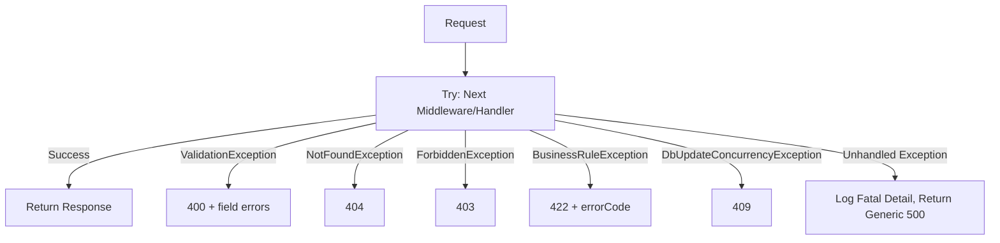

> ⚠️ **Warning:** The 500 response body must never include stack traces or internal exception messages in Production — only a generic message and `correlationId` for support lookup.

---

## 15. Performance Optimization

- **Database:** connection pooling via Npgsql; `AsNoTracking()` on all read-only queries; covering indexes for hot query paths (Section 8.4).
- **EF Core:** avoid N+1 via `.Include()`/projection to DTOs directly in the query (`Select` before materialization) rather than loading full entity graphs.
- **Caching:** Section 12 — reduces repeated DB round-trips for reference/aggregate data.
- **Pagination:** enforced server-side maximum page size (100) to prevent unbounded result sets.
- **Async:** all I/O (DB, SMTP, file, HTTP) is `async`/`await` end-to-end; no blocking `.Result`/`.Wait()` calls, which would starve the thread pool under load.
- **Response Compression:** Gzip/Brotli response compression enabled at the Kestrel/Nginx layer.
- **Bulk Operations:** payroll processing uses batched `SaveChangesAsync` (e.g., per 100 employees) rather than one round-trip per employee, balancing memory and transaction size.

---

## 16. Deployment Architecture

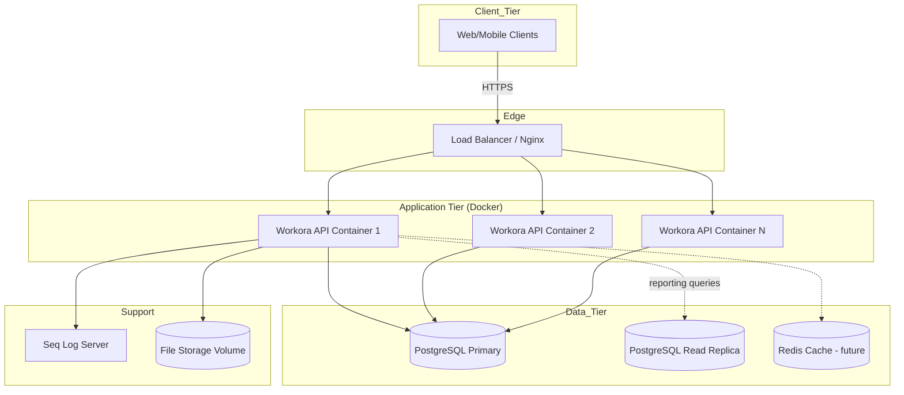

### 16.1 Notes
- Each API container is stateless; horizontal scaling is achieved by adding container replicas behind the load balancer.
- `IMemoryCache` being process-local means cache is **not** shared across replicas today — acceptable given short TTLs, but the `ICacheService` abstraction (Section 12) allows swapping to Redis without handler changes as replica count grows.
- File storage currently uses a shared volume/local disk mounted to all containers; migrating to object storage (S3-compatible) is a documented future enhancement (Section 26).

---

## 17. CI/CD

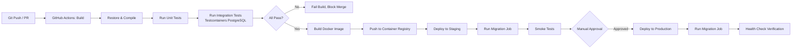

- Build, test, and publish stages run on every pull request; deployment stages run on merge to `develop` (Staging) and `main` (Production, gated by manual approval).
- Database migrations run as a distinct pipeline job before the new application version receives traffic, ensuring schema/code compatibility.

---

## 18. Monitoring

- **Health Checks:** `/health/live` (process liveness) and `/health/ready` (readiness, verifies DB connectivity) via `Microsoft.Extensions.Diagnostics.HealthChecks`, polled by the load balancer and container orchestrator.
- **Logging:** centralized in Seq (Section 13), with saved queries/alerts for `Error`/`Fatal` spikes.
- **Metrics:** request rate, latency percentiles (p50/p95/p99), and error rate exposed via `/metrics` (Prometheus-compatible) for scraping by the monitoring stack; payroll-run duration and background-job success/failure counts are tracked as custom business metrics.

---

## 19. API Documentation

- **Swagger/OpenAPI** (Swashbuckle) generates the interactive API explorer at `/swagger` in Development/Staging (disabled or auth-protected in Production per Section 11).
- **Versioning:** URL-segment versioning (`/api/v1/...`); a new major version is introduced only for breaking changes, with the prior version supported for a minimum deprecation window of 6 months and a `Deprecation`/`Sunset` HTTP header on legacy responses.

---

## 20. Complete API Documentation

Per-module endpoint tables are provided in Section 9 (Module Architecture). This section consolidates the full endpoint index and provides worked request/response examples for representative endpoints from each functional area. The canonical, always-current contract (full JSON Schemas for every request/response) is generated automatically from code via Swashbuckle and published at `/swagger/v1/swagger.json`; this document intentionally shows representative depth rather than duplicating the generated OpenAPI spec, which would immediately drift from the generated source of truth.

### 20.1 Consolidated Endpoint Index

> **Update note (v1.1):** This index and every per-module table in Section 9 were audited against standard HRMS functional coverage and expanded with the missing CRUD, self-service, and lifecycle endpoints each module needed (e.g., `GET/{id}` and `PUT` on modules that only had list/create, self-service `/me` endpoints, bulk import/export, cancel/reject counterparts to approve, and history/log sub-resources). New endpoints are marked inline in Section 9; the counts below reflect the expanded surface.

| Module | Endpoint Count | Base Route |
|---|---|---|
| Authentication | 9 | `/api/v1/auth` |
| Users | 10 | `/api/v1/users` |
| Roles | 7 | `/api/v1/roles` |
| Permissions | 1 | `/api/v1/permissions` |
| Departments | 6 | `/api/v1/departments` |
| Designations | 5 | `/api/v1/designations` |
| Employees | 15 | `/api/v1/employees` |
| Attendance | 10 | `/api/v1/attendance` |
| Leave | 10 | `/api/v1/leave` |
| Payroll | 10 | `/api/v1/payroll` |
| Salary Structure | 6 | `/api/v1/salary-structures` |
| Recruitment | 3 | `/api/v1/recruitment` |
| Job Posting | 7 | `/api/v1/job-postings` |
| Candidates | 8 | `/api/v1/candidates` |
| Interview | 6 | `/api/v1/interviews` |
| Offer Letter | 7 | `/api/v1/offer-letters` |
| Performance | 9 | `/api/v1/performance` |
| Training | 9 | `/api/v1/training` |
| Assets | 9 | `/api/v1/assets` |
| Documents | 6 | `/api/v1/documents` |
| Notifications | 6 | `/api/v1/notifications` |
| Reports | 6 | `/api/v1/reports` |
| Dashboard | 2 | `/api/v1/dashboard` |
| Settings | 4 | `/api/v1/settings` |
| Audit Logs | 3 | `/api/v1/audit-logs` |
| Company | 4 | `/api/v1/company` |
| Branches | 5 | `/api/v1/branches` |
| Holiday | 5 | `/api/v1/holidays` |
| Shift | 7 | `/api/v1/shifts` |
| Policy | 7 | `/api/v1/policies` |
| **Total** | **~202** | |

### 20.2 Worked Example — Authentication: Login

**`POST /api/v1/auth/login`**

Request:
```json
{
  "email": "priya.sharma@workora.com",
  "password": "Str0ngP@ssw0rd!"
}
```

Response `200 OK`:
```json
{
  "success": true,
  "data": {
    "accessToken": "eyJhbGciOiJIUzI1NiIs...",
    "refreshToken": "8f14e45fceea167a5a36...",
    "expiresIn": 900,
    "user": { "id": "3a1e...", "email": "priya.sharma@workora.com", "roles": ["HRManager"] }
  },
  "message": null,
  "errors": null
}
```

| Status | Condition |
|---|---|
| 200 | Valid credentials |
| 400 | Missing email/password |
| 401 | Invalid credentials |
| 423 | Account locked (too many failed attempts) |

**Validation Rules:** `email` required, valid format; `password` required, min length 8.

### 20.3 Worked Example — Employees: Onboard

**`POST /api/v1/employees`** — Permission: `employees.create`

Request:
```json
{
  "firstName": "Arjun",
  "lastName": "Mehta",
  "email": "arjun.mehta@workora.com",
  "dateOfBirth": "1998-04-12",
  "dateOfJoining": "2026-07-15",
  "departmentId": "d3f1...",
  "designationId": "de21...",
  "branchId": "b901...",
  "managerId": "e551..."
}
```

Response `201 Created`:
```json
{
  "success": true,
  "data": {
    "id": "e900...",
    "employeeCode": "EMP-2026-00142",
    "fullName": "Arjun Mehta",
    "status": "Active"
  },
  "message": null,
  "errors": null
}
```

| Status | Condition |
|---|---|
| 201 | Employee created |
| 400 | Validation failure (missing/invalid fields) |
| 409 | National ID or email already exists |
| 403 | Caller lacks `employees.create` |

**Validation Rules:** Age ≥ 18 at `dateOfJoining`; `departmentId`, `designationId`, `branchId` must reference existing active records; `managerId` optional, must not create a cycle.

### 20.4 Worked Example — Leave: Submit Request

**`POST /api/v1/leave/requests`** — Permission: `leave.apply`

Request:
```json
{
  "leaveTypeId": "lt01...",
  "startDate": "2026-08-10",
  "endDate": "2026-08-12",
  "reason": "Family function"
}
```

Response `201 Created`:
```json
{
  "success": true,
  "data": { "id": "lr77...", "status": "PendingManagerApproval", "daysRequested": 3 },
  "message": null,
  "errors": null
}
```

| Status | Condition |
|---|---|
| 201 | Request submitted |
| 400 | `endDate` before `startDate` |
| 422 | Insufficient balance (`errorCode: INSUFFICIENT_LEAVE_BALANCE`) |
| 409 | Overlaps an already-approved leave request |

### 20.5 Worked Example — Payroll: Process Run

**`POST /api/v1/payroll/runs/{id}/process`** — Permission: `payroll.process`

Response `200 OK`:
```json
{
  "success": true,
  "data": {
    "payrollRunId": "pr55...",
    "employeesProcessed": 248,
    "totalGross": 18542000.00,
    "totalDeductions": 3120450.00,
    "totalNet": 15421550.00,
    "status": "Processed"
  },
  "message": null,
  "errors": null
}
```

| Status | Condition |
|---|---|
| 200 | Processing completed |
| 409 | Run already processing/locked (concurrent processing attempt) |
| 422 | Run not in `Draft` status |

> For the complete, field-by-field request/response JSON Schema of every one of the ~120 endpoints listed in Section 20.1, refer to the live Swagger document at `/swagger/v1/swagger.json` in any deployed environment — it is generated directly from the Command/Query/DTO types and is therefore guaranteed to match the running code, unlike a hand-maintained static copy.

---

## 21. NuGet Packages

| Package | Purpose | Recommended Version |
|---|---|---|
| `Microsoft.AspNetCore.Authentication.JwtBearer` | JWT authentication middleware | 9.0.x |
| `Microsoft.EntityFrameworkCore` | ORM core | 9.0.x |
| `Npgsql.EntityFrameworkCore.PostgreSQL` | PostgreSQL EF Core provider | 9.0.x |
| `EFCore.NamingConventions` | snake_case DB naming | 9.0.x |
| `MediatR` | CQRS mediator | 12.x |
| `FluentValidation.AspNetCore` | Request validation | 11.x |
| `AutoMapper` | Object-object mapping | 13.x |
| `Serilog.AspNetCore` | Structured logging host integration | 8.x |
| `Serilog.Sinks.Seq` | Centralized log sink | 8.x |
| `Serilog.Sinks.File` | Rolling file sink | 6.x |
| `Swashbuckle.AspNetCore` | Swagger/OpenAPI generation | 6.x |
| `QuestPDF` | PDF generation (payslips, offers) | 2024.x |
| `MailKit` | SMTP email delivery | 4.x |
| `BCrypt.Net-Next` | Password hashing | 4.x |
| `xunit` | Unit testing framework | 2.x |
| `FluentAssertions` | Test assertions | 6.x |
| `Moq` | Mocking framework | 4.x |
| `Testcontainers.PostgreSql` | Integration test DB provisioning | 3.x |
| `Microsoft.AspNetCore.RateLimiting` (built-in) | API rate limiting | 9.0.x |
| `AspNetCore.HealthChecks.NpgSql` | DB readiness health check | 8.x |

---

## 22. Configuration

### 22.1 `appsettings.json` Structure (Illustrative)

```json
{
  "ConnectionStrings": {
    "DefaultConnection": "Host=localhost;Database=workora;Username=app;Password=__set_via_env__"
  },
  "Jwt": {
    "Issuer": "Workora",
    "Audience": "Workora.Clients",
    "AccessTokenExpiryMinutes": 15,
    "RefreshTokenExpiryDays": 7,
    "SigningKey": "__set_via_env__"
  },
  "Smtp": {
    "Host": "smtp.workora.com",
    "Port": 587,
    "UseSsl": true,
    "Username": "__set_via_env__",
    "Password": "__set_via_env__",
    "FromAddress": "no-reply@workora.com"
  },
  "Serilog": {
    "MinimumLevel": "Information",
    "WriteTo": [ "Console", "File", "Seq" ],
    "SeqServerUrl": "http://seq:5341"
  },
  "FileStorage": {
    "Provider": "Local",
    "RootPath": "/data/workora-files"
  },
  "RateLimiting": {
    "LoginPolicy": { "PermitLimit": 5, "WindowSeconds": 60 }
  }
}
```

### 22.2 Environment Variable Overrides
All secret-bearing values (`ConnectionStrings__DefaultConnection`, `Jwt__SigningKey`, `Smtp__Password`) are supplied exclusively via environment variables / the secrets manager at deploy time, following the standard ASP.NET Core configuration precedence (env vars override `appsettings.{Environment}.json`, which overrides `appsettings.json`).

> ⚠️ **Warning:** `appsettings.json` committed to source control must never contain real secrets — only placeholder/empty values, enforced via a pre-commit secret-scanning hook.

---

## 23. Best Practices

- Keep controllers thin: one `_mediator.Send()` call per action, no business logic in the API layer.
- Never expose Domain entities directly from an API response — always map to DTOs via AutoMapper profiles.
- Prefer explicit, small DTOs per Command/Query over one shared "God DTO" reused across create/update/read.
- Every mutating Command handler runs inside a single database transaction, committed only after all side-effect writes succeed (via `TransactionBehavior` pipeline behavior).
- Domain invariants belong in the Domain layer (entity methods), not scattered across handlers — a handler orchestrates, an entity enforces its own rules.
- Write integration tests against real (Testcontainers) PostgreSQL for anything involving raw SQL, concurrency tokens, or query filters — mocked repositories hide real database behavior differences.
- Treat migrations as immutable once merged to `main`; fix forward with a new migration, never edit a shipped one.

---

## 24. Coding Standards

- Follow Microsoft's C# coding conventions; enforce via `.editorconfig` and `dotnet format` in CI.
- One class per file; file name matches class name.
- Async methods are suffixed `Async` and awaited all the way up the call stack — no `async void` except top-level event handlers.
- Guard clauses at the top of methods (`Guard.Against.Null(...)`) rather than deeply nested `if` blocks.
- Nullable reference types are enabled project-wide (`<Nullable>enable</Nullable>`); nullability annotations are treated as compiler warnings-as-errors in CI.

---

## 25. Future Enhancements

- Migrate `IMemoryCache` to Redis for multi-instance cache coherence as horizontal scale increases.
- Migrate local file storage to S3-compatible object storage with pre-signed URL downloads.
- Introduce multi-factor authentication (TOTP) for privileged roles.
- GraphQL read gateway for complex reporting/dashboard queries alongside the existing REST surface.
- Event-driven integration (message broker) for payroll-to-finance system synchronization.
- Localization/multi-currency support for global multi-company tenants.

---

## 27. Multi-Tenant SaaS Implementation

For a multi-tenant system, tenant isolation is critical. Workora uses **Row-Level Security (RLS)** via a shared database, shared schema approach.

- **Tenant Identification:** The `TenantId` is resolved from the JWT claim (`tenant_id`) or a custom header (`X-Tenant-Id`) by a `TenantResolverMiddleware`.
- **Tenant Context:** `ICurrentTenantService` provides the scoped `TenantId` across the application.
- **Data Isolation:** All aggregate roots implement `IMustHaveTenant`. The `AppDbContext` automatically applies a global query filter: `modelBuilder.Entity<IMustHaveTenant>().HasQueryFilter(e => e.TenantId == _currentTenantService.TenantId)`.
- **Enforcement:** `AuditSaveChangesInterceptor` ensures every inserted record automatically receives the correct `TenantId`.

---

## 28. Event-Driven Architecture (Azure Service Bus)

To decouple bounded contexts (e.g., HR and Payroll) and handle asynchronous background processing reliably, Workora employs an Event-Driven Architecture.

- **Integration Events:** Unlike Domain Events (which are handled in-process via MediatR), Integration Events (e.g., `EmployeeTerminatedIntegrationEvent`) are published to **Azure Service Bus**.
- **Publishing:** `IEventBus` (implemented in Infrastructure) publishes messages to a Service Bus Topic.
- **Subscribing:** Azure Functions or Background Services (e.g., AKS Worker Service) subscribe to specific Subscriptions on the Topic to process events like Payroll proration, Email Notifications, and external integrations independently.
- **Outbox Pattern:** To ensure atomic consistency between database commits and event publishing, Domain Events are saved to an `OutboxMessages` table in the same transaction as the business entity. A background worker polls this table and publishes to Azure Service Bus.

---

## 29. Azure Cloud Infrastructure Deployment Architecture

Workora is deployed on a production-grade, highly available Azure ecosystem.

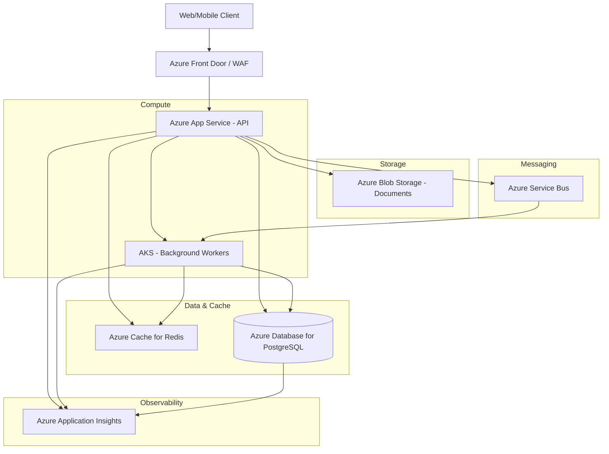

- **Azure App Service (Web App for Containers):** Hosts the `Workora.API`. It autoscales based on CPU/Memory usage.
- **Azure Kubernetes Service (AKS):** Hosts decoupled background workers (Outbox processors, Report generators, Payroll batch processors) subscribing to Service Bus.
- **Azure Database for PostgreSQL (Flexible Server):** The primary relational datastore. Provides High Availability (HA) across availability zones and automated backups.
- **Azure Cache for Redis:** Caches read-heavy queries (e.g., Organization Hierarchy, Dropdown lists, User Permissions) and manages distributed locking.
- **Azure Service Bus:** The enterprise message broker facilitating pub/sub communication for integration events.
- **Azure Blob Storage:** Secure, scalable storage for employee documents, payslips, and compliance files, accessed via SAS tokens.
- **Azure Application Insights (Log Analytics):** Centralized distributed tracing, metrics, exception tracking, and structured logging.

---

## 30. Appendix

### 26.1 Useful Links
- ASP.NET Core Documentation — https://learn.microsoft.com/aspnet/core
- EF Core Documentation — https://learn.microsoft.com/ef/core
- MediatR — https://github.com/jbogard/MediatR
- FluentValidation — https://docs.fluentvalidation.net
- QuestPDF — https://www.questpdf.com
- OWASP API Security Top 10 — https://owasp.org/API-Security

### 26.2 References
- Martin, R. C., *Clean Architecture: A Craftsman's Guide to Software Structure and Design*.
- Evans, E., *Domain-Driven Design: Tackling Complexity in the Heart of Software*.
- Microsoft Docs — ASP.NET Core Architecture Guidance.

### 26.3 Glossary
See Section 1.4 (Definitions) and Section 1.5 (Abbreviations).

---

*End of Workora — Backend Technical Documentation v1.1*