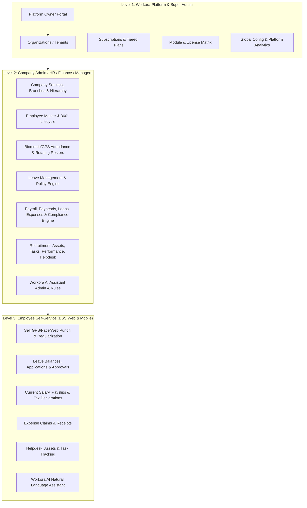
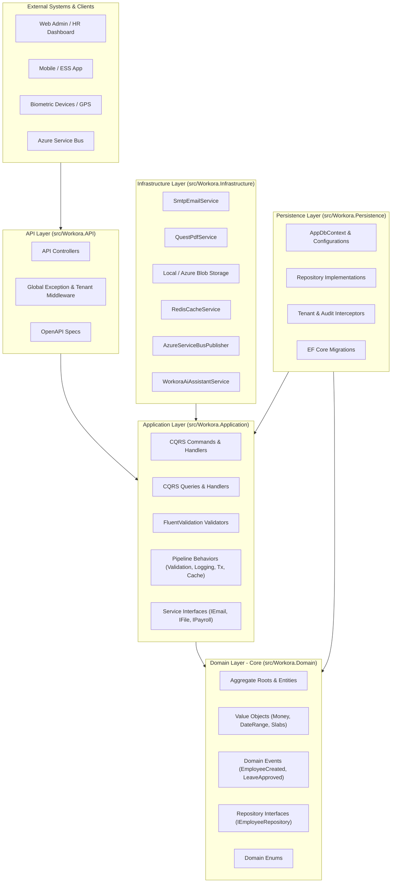
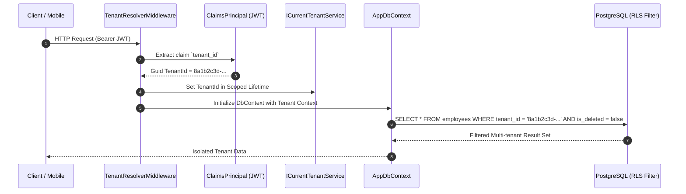
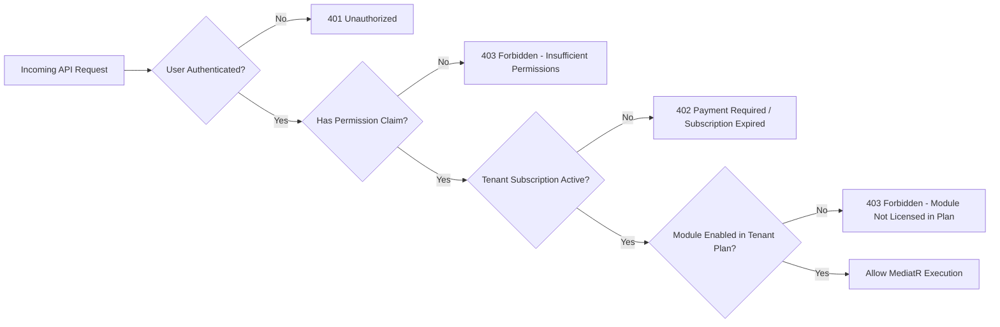
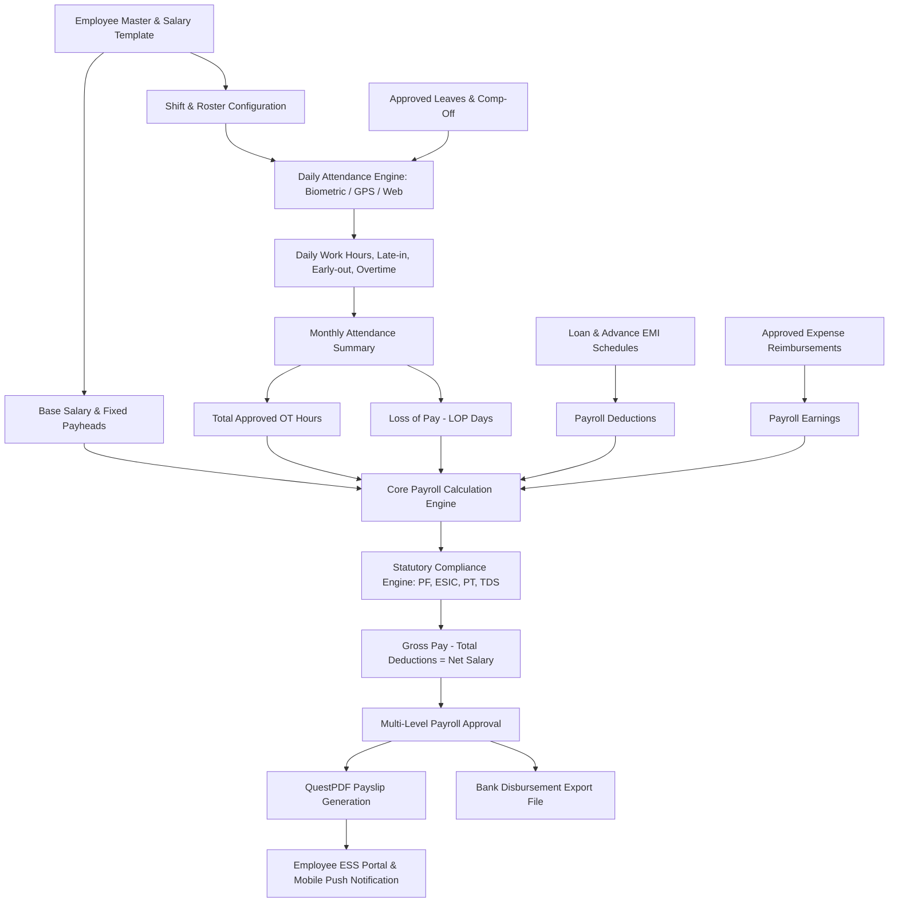
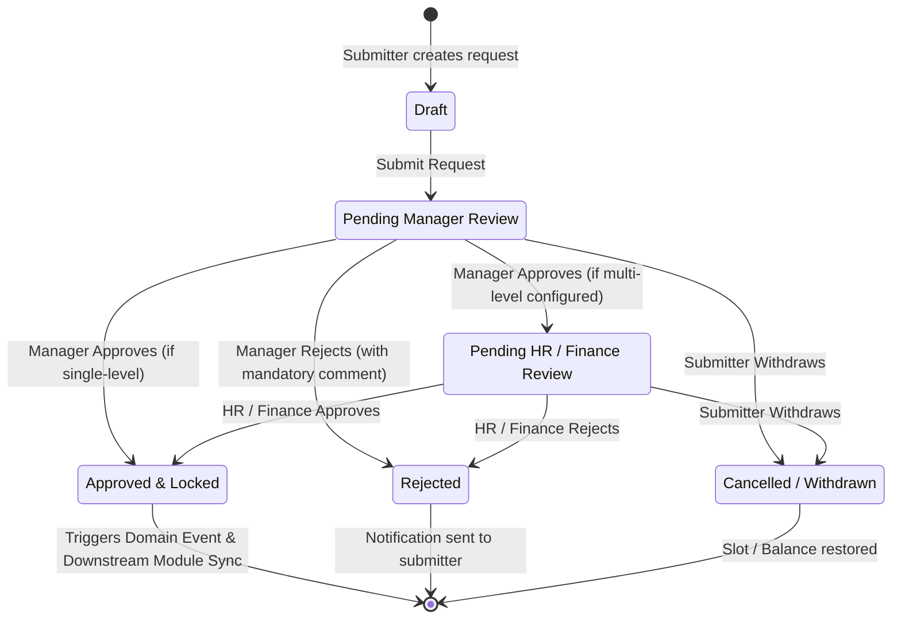
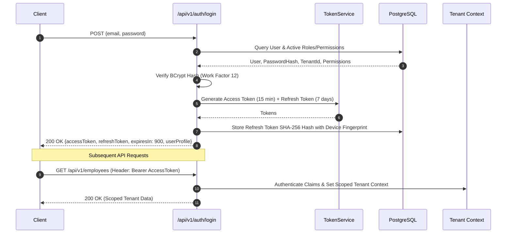
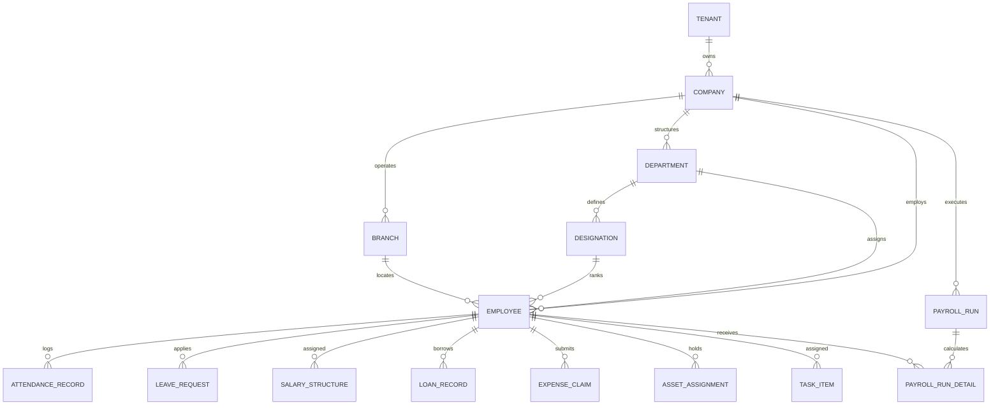
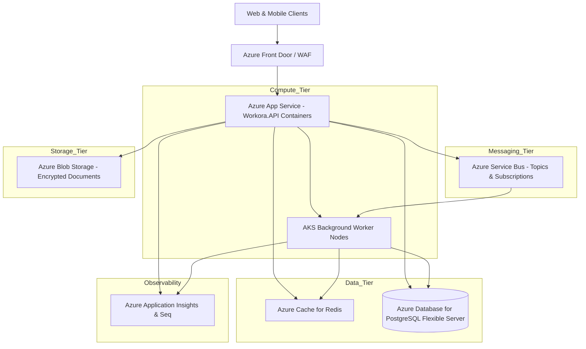
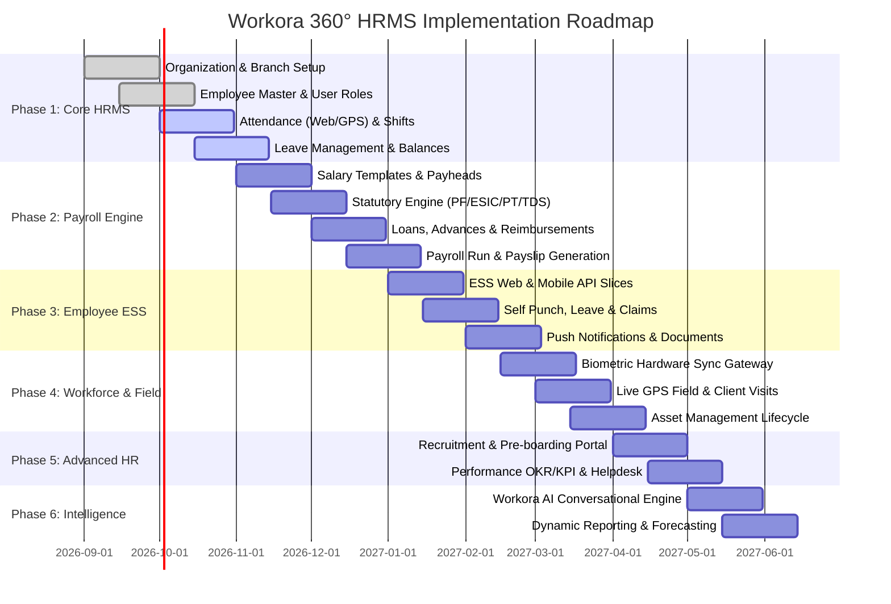

# Workora
## 360° Human Resource Management & Payroll Platform
### Backend Technical Architecture & System Documentation — Version 2.0

---

## Cover Page

| Field | Value |
|---|---|
| **Project Name** | Workora (Enterprise 360° HRMS & Payroll SaaS) |
| **Document Title** | Backend Technical Architecture & System Specification |
| **Version** | 2.0 (Full 360° HRMS & Multi-Tenant SaaS Architecture) |
| **Author** | Principal Solution Architecture Team |
| **Created Date** | July 2, 2026 |
| **Last Updated** | August 25, 2026 |
| **Classification** | Enterprise / Engineering Specification |
| **Status** | Approved for Implementation |

### Revision History

| Version | Date | Author | Description |
|---|---|---|---|
| 0.1 | 2026-05-10 | Solution Architecture Team | Initial draft — Clean Architecture skeleton |
| 0.5 | 2026-05-28 | Solution Architecture Team | Added module architecture and DB design |
| 0.9 | 2026-06-18 | Solution Architecture Team | Added security, deployment, CI/CD |
| 1.0 | 2026-07-02 | Solution Architecture Team | Baseline release for development kickoff |
| 1.1 | 2026-07-15 | Solution Architecture Team | Full API audit across 30 modules — CRUD, `/me`, and lifecycle endpoints |
| 2.0 | 2026-08-25 | Solution Architecture Team | Major release: Complete 360° HRMS transformation modeled after modern enterprise HR operating systems (Tankhwa Patra paradigm). Added 3-Tier Multi-Tenant SaaS Architecture (Super Admin, Company Admin/HR, Employee ESS), Dynamic Plan & Module Licensing, Core Interconnected HR Data Engine, India Statutory Compliance Engine (PF, ESIC, PT, TDS, Gratuity, Bonus), Multi-Device Biometric/GPS Attendance Engine, Rotating Rosters, Loans & Advances with EMI Recovery, Expense Reimbursements, Field GPS & Visit Tracking, Assets Lifecycle, Task Management, Helpdesk, Workora AI Conversational Assistant, and ~280+ fully mapped CQRS API endpoints. |

---

## Table of Contents

1. [Document Purpose & System Vision](#1-document-purpose--system-vision)
2. [Technology Stack](#2-technology-stack)
3. [System Architecture & Clean Architecture Principles](#3-system-architecture--clean-architecture-principles)
4. [Solution & Project Folder Structure](#4-solution--project-folder-structure)
5. [The Three-Tier Operational Model](#5-the-three-tier-operational-model)
    - 5.1 [Level 1 — Super Admin (Platform Owner)](#51-level-1--super-admin-platform-owner)
    - 5.2 [Level 2 — Company Admin / HR / Finance / Managers](#52-level-2--company-admin--hr--finance--managers)
    - 5.3 [Level 3 — Employee Self-Service (ESS)](#53-level-3--employee-self-service-ess)
    - 5.4 [Complete Admin Navigation & Sidebar Blueprint](#54-complete-admin-navigation--sidebar-information-architecture)
6. [Multi-Tenant SaaS Architecture & Plan Licensing](#6-multi-tenant-saas-architecture--plan-licensing)
7. [The Interconnected Core HRMS Data Flow](#7-the-interconnected-core-hrms-data-flow)
8. [Multi-Level Approval State Machine](#8-multi-level-approval-state-machine)
9. [Identity, Authentication & Authorization (PBAC)](#9-identity-authentication--authorization-pbac)
10. [Database Architecture & Data Governance](#10-database-architecture--data-governance)
11. [Detailed Entity Relational Schemas (All Tables & Columns)](#11-detailed-entity-relational-schemas-all-tables--columns)
12. [Comprehensive Module Architecture (36 Modules)](#12-comprehensive-module-architecture-36-modules)
    - 12.1 Platform Subscriptions & Tiered Plans
    - 12.2 Organizations & Multi-Tenant Management
    - 12.3 Authentication & Session Management
    - 12.4 Users & Identity
    - 12.5 Roles & Permissions Catalog
    - 12.6 Company Profile & Legal Entities
    - 12.7 Branches & Regional Locations
    - 12.8 Departments & Organizational Hierarchy
    - 12.9 Designations, Grades & Job Levels
    - 12.10 Financial Years & Fiscal Settings
    - 12.11 Holiday Calendars (Company & Branch-wise)
    - 12.12 Weekly-Off Configurations
    - 12.13 Employee Master & 360° Profile
    - 12.14 Pre-Boarding, Offer Management & E-Sign
    - 12.15 Onboarding Checklists & Document Verification
    - 12.16 Employee Lifecycle (Transfers, Promotions, Exit & Offboarding)
    - 12.17 Attendance Core & Multi-Device Synchronization
    - 12.18 Attendance Policies & Overtime Engine
    - 12.19 Attendance Regularization & Corrections
    - 12.20 Shifts & Rotating Rosters (Factory & Office)
    - 12.21 Leave Types & Accrual Policy Engine
    - 12.22 Leave Requests & Balance Management
    - 12.23 Salary Structures, Payheads & Templates
    - 12.24 Salary Revisions & Increment History
    - 12.25 Loans, Advances & EMI Recovery Engine
    - 12.26 Expense Claims & Reimbursements
    - 12.27 Field Employee Live GPS Tracking & Visit Logs
    - 12.28 Payroll Calculation Core & Disbursement
    - 12.29 Statutory & Compliance Engine (PF, ESIC, PT, TDS, Gratuity, Bonus)
    - 12.30 Asset Management & Allocation Lifecycle
    - 12.31 Task Management & Operational SLAs
    - 12.32 Performance Management (OKRs, KPIs & 360° Reviews)
    - 12.33 Helpdesk & Employee Ticketing
    - 12.34 Documents & Compliance Expiry Engine
    - 12.35 Policies & Versioned Digital Acknowledgments
    - 12.36 Workora AI Assistant & Dynamic Reports Engine
13. [API Standards & Response Contracts](#13-api-standards--response-contracts)
14. [Consolidated API Endpoint Catalog (~280+ Endpoints)](#14-consolidated-api-endpoint-catalog-280-endpoints)
15. [Security Architecture & OWASP Top 10 Mitigation](#15-security-architecture--owasp-top-10-mitigation)
16. [Caching, Logging, Exception Handling & Observability](#16-caching-logging-exception-handling--observability)
17. [Cloud Infrastructure, Azure Deployment & Event Bus](#17-cloud-infrastructure-azure-deployment--event-bus)
18. [Phased Implementation Roadmap](#18-phased-implementation-roadmap)
19. [Appendix & Standards Compliance](#19-appendix--standards-compliance)

---

## 1. Document Purpose & System Vision

### 1.1 Executive Summary
**Workora** is an enterprise-grade, cloud-native 360° Human Resource Management System (HRMS) and Payroll automation platform. Engineered on **.NET 9**, **Clean Architecture**, **Domain-Driven Design (DDD)**, and **CQRS (MediatR)**, Workora delivers an interconnected operational ecosystem where workforce management, time & attendance, leave accruals, statutory compliance, loan recovery, expense claims, and payroll computation operate as a synchronized engine.

Workora is structured around a three-tier operational hierarchy:
1. **Platform / Super Admin**: Manages multi-tenant onboarding, subscriptions, tiered feature flags, module licenses, and global platform observability.
2. **Company Admin / HR / Finance / Manager Dashboard**: Provides company setup, branch-level operations, employee master management, biometric/GPS attendance calculation, multi-shift rotating rosters, leave approvals, salary structure templates, loan/advance EMI scheduling, expense claim approvals, statutory compliance, and payroll finalization.
3. **Employee Self-Service (ESS)**: A mobile-first and responsive web portal enabling employees to mark geo-fenced/selfie attendance, request regularizations, apply for leaves, access monthly payslips, submit reimbursement claims, request salary advances, track assigned assets, manage tasks, and interact with **Workora AI** (an intelligent conversational HR assistant).


```mermaid
flowchart TB
    subgraph SaaS_Platform["Level 1: Workora Platform & Super Admin"]
        Platform[Platform Owner Portal]
        Tenants[Organizations / Tenants]
        Subs[Subscriptions & Tiered Plans]
        ModLic[Module & License Matrix]
        PlatformConfig[Global Config & Platform Analytics]
    end

    subgraph Tenant_Company["Level 2: Company Admin / HR / Finance / Managers"]
        CompanySetup[Company Settings, Branches & Hierarchy]
        EmpLifecycle[Employee Master & 360° Lifecycle]
        AttShift[Biometric/GPS Attendance & Rotating Rosters]
        LeaveMgmt[Leave Management & Policy Engine]
        PayrollComp[Payroll, Payheads, Loans, Expenses & Compliance Engine]
        AdvHR[Recruitment, Assets, Tasks, Performance, Helpdesk]
        WorkoraAIAdmin[Workora AI Assistant Admin & Rules]
    end

    subgraph ESS_Layer["Level 3: Employee Self-Service (ESS Web & Mobile)"]
        ESSPunch[Self GPS/Face/Web Punch & Regularization]
        ESSLeave[Leave Balances, Applications & Approvals]
        ESSSalary[Current Salary, Payslips & Tax Declarations]
        ESSReimburse[Expense Claims & Receipts]
        ESSDesk[Helpdesk, Assets & Task Tracking]
        WorkoraAIESS[Workora AI Natural Language Assistant]
    end

    Platform --> Tenants
    Tenants --> Tenant_Company
    Tenant_Company --> ESS_Layer
```

### 1.2 Core Objectives
- **Zero-Friction Tenancy**: Multi-tenant isolation using Row-Level Security (RLS) via EF Core Global Query Filters with zero cross-tenant data leakage.
- **Deep Interconnectivity**: Immediate propagation of employee status changes, approved leaves, overtime hours, unpaid absences (LOP), loans, and expense claims into the payroll calculation pipeline.
- **Statutory Rigor**: Full compliance with Indian statutory payroll mandates (EPF, ESIC, PT across state slabs, TDS with New/Old tax regimes, Gratuity, and Statutory Bonus).
- **Clean Architecture & CQRS Integrity**: Strict separation between Domain, Application, Infrastructure, Persistence, and API layers with MediatR vertical slices.
- **Enterprise Extensibility**: Event-driven architecture with Outbox pattern, distributed caching (Redis), Azure Service Bus pub/sub, and modular subscription licensing.

---

## 2. Technology Stack

| Layer / Concern | Technology | Version | Purpose |
|---|---|---|---|
| **Runtime** | .NET | 9.0 (LTS-track) | High-performance backend execution framework |
| **Web API** | ASP.NET Core Web API | 9.0 | RESTful API host with routing and DI |
| **Architecture Style** | Clean Architecture + DDD + CQRS | — | Domain isolation, maintainability, and testability |
| **CQRS Mediator** | MediatR | 12.x | Decouples HTTP controllers from domain handlers; executes pipeline behaviors |
| **Database** | PostgreSQL | 16.x | Primary relational store supporting ACID transactions, JSONB, and RLS |
| **ORM** | Entity Framework Core (Npgsql provider) | 9.0 | Data modeling, migrations, LINQ projections, and interceptors |
| **Naming Conventions** | EFCore.NamingConventions | 9.0 | Enforces idiomatic PostgreSQL `snake_case` naming from C# `PascalCase` |
| **Authentication** | JWT Bearer (`Microsoft.AspNetCore.Authentication.JwtBearer`) | 9.0 | Stateless cryptographically signed token auth with claims |
| **Authorization** | ASP.NET Core Policy-Based Authorization | 9.0 | Fine-grained Permission-Based Access Control (PBAC) |
| **Validation** | FluentValidation.AspNetCore | 11.x | Strongly typed request validation integrated into MediatR pipeline |
| **Object Mapping** | AutoMapper | 13.x | Entity-to-DTO projection and shape mapping |
| **Logging** | Serilog (+ Sinks: Console, File, Seq) | 8.x / 4.x | Structured JSON logging with Correlation ID and Tenant ID enrichment |
| **In-Memory Cache** | `IMemoryCache` (built-in) | 9.0 | In-process caching for hot reference data (permissions, settings, holidays) |
| **Distributed Cache** | Azure Cache for Redis | 7.x | Cross-instance caching, session state, and distributed locking |
| **Message Broker** | Azure Service Bus / Outbox Pattern | 7.x | Reliable asynchronous event pub/sub across bounded contexts |
| **Background Processing** | `BackgroundService` / Quartz.NET | 9.0 / 3.x | Cron-based jobs (leave accruals, biometric sync, document expiry, payroll batch) |
| **PDF Generation** | QuestPDF | 2024.x | Pixel-perfect programmatic generation of payslips, offer letters, and compliance reports |
| **Excel / CSV Engine** | ClosedXML / CsvHelper | 0.104.x / 33.x | High-throughput bulk import/export processing |
| **Email Service** | MailKit / MimeKit | 4.x | Transactional email delivery with HTML templates |
| **Cryptographic Security** | BCrypt.Net-Next / `System.Security.Cryptography` (AES-GCM) | 4.x | Password hashing (work factor 12) and encrypted columns (bank accounts, PAN, Aadhaar) |
| **AI / NLP Engine** | Azure OpenAI / Semantic Kernel / Custom Intent Router | 1.x | Natural language HR assistant (*Workora AI*) for Q&A and automated actions |
| **API Documentation** | Swashbuckle (Swagger/OpenAPI) | 6.x | Interactive API schema documentation and OpenAPI v3 contracts |
| **Containerization** | Docker + Linux Alpine base | Latest | Container runtime for Azure App Service & AKS |

---

## 3. System Architecture & Clean Architecture Principles

Workora strictly enforces **Clean Architecture** (Robert C. Martin) and **Domain-Driven Design (DDD)** tactical patterns.


```mermaid
flowchart TB
    subgraph External["External Systems & Clients"]
        WebAdmin["Web Admin / HR Dashboard"]
        MobileApp["Mobile / ESS App"]
        Biometric["Biometric Devices / GPS"]
        AzureSB["Azure Service Bus"]
    end

    subgraph Presentation["API Layer (src/Workora.API)"]
        Controllers["API Controllers"]
        Middleware["Global Exception & Tenant Middleware"]
        Swagger["OpenAPI Specs"]
    end

    subgraph ApplicationLayer["Application Layer (src/Workora.Application)"]
        Commands["CQRS Commands & Handlers"]
        Queries["CQRS Queries & Handlers"]
        Validators["FluentValidation Validators"]
        Behaviors["Pipeline Behaviors (Validation, Logging, Tx, Cache)"]
        Interfaces["Service Interfaces (IEmail, IFile, IPayroll)"]
    end

    subgraph DomainLayer["Domain Layer - Core (src/Workora.Domain)"]
        Entities["Aggregate Roots & Entities"]
        ValueObjects["Value Objects (Money, DateRange, Slabs)"]
        DomainEvents["Domain Events (EmployeeCreated, LeaveApproved)"]
        RepoInterfaces["Repository Interfaces (IEmployeeRepository)"]
        Enums["Domain Enums"]
    end

    subgraph InfrastructureLayer["Infrastructure Layer (src/Workora.Infrastructure)"]
        EmailSvc["SmtpEmailService"]
        PdfSvc["QuestPdfService"]
        FileStore["Local / Azure Blob Storage"]
        RedisSvc["RedisCacheService"]
        EventBus["AzureServiceBusPublisher"]
        AIService["WorkoraAiAssistantService"]
    end

    subgraph PersistenceLayer["Persistence Layer (src/Workora.Persistence)"]
        AppDb["AppDbContext & Configurations"]
        Repos["Repository Implementations"]
        Interceptors["Tenant & Audit Interceptors"]
        Migrations["EF Core Migrations"]
    end

    External --> Presentation
    Presentation --> ApplicationLayer
    ApplicationLayer --> DomainLayer
    InfrastructureLayer --> ApplicationLayer
    PersistenceLayer --> DomainLayer
    PersistenceLayer --> ApplicationLayer
```

### 3.1 The Dependency Rule
- **`Workora.Domain`**: Has **zero** external package or project dependencies. Owns entity models, business invariants, domain events, domain exceptions, enums, value objects, and repository interfaces.
- **`Workora.Application`**: References only `Workora.Domain` and `Workora.Shared`. Contains MediatR Commands/Queries, handlers, validators, DTOs, AutoMapper profiles, and abstractions for external services.
- **`Workora.Persistence`**: References `Workora.Domain` and `Workora.Application`. Implements repository interfaces, manages `AppDbContext`, applies entity type configurations (`IEntityTypeConfiguration<T>`), runs migrations, and configures global query filters.
- **`Workora.Infrastructure`**: References `Workora.Application` and `Workora.Domain`. Implements non-database external services (SMTP email, QuestPDF rendering, Azure Blob storage, Redis caching, Azure Service Bus, AI connectors).
- **`Workora.API`**: The composition root. References `Workora.Application`, `Workora.Infrastructure`, `Workora.Persistence`, and `Workora.Shared`. Controllers only inject `IMediator` and never directly access `DbContext` or repositories.

---

## 4. Solution & Project Folder Structure

```
workora/
├── backend/
│   ├── Workora.sln
│   ├── Directory.Build.props
│   ├── Directory.Packages.props
│   ├── src/
│   │   ├── Workora.Domain/
│   │   │   ├── Common/              (BaseEntity, AuditableEntity, DomainEvent, IMustHaveTenant)
│   │   │   ├── Entities/            (Employee, AttendanceRecord, LeaveRequest, PayrollRun, etc.)
│   │   │   ├── ValueObjects/        (Money, DateRange, Address, Coordinates, TaxSlab)
│   │   │   ├── Enums/               (EmploymentStatus, AttendanceStatus, LeaveStatus, LoanStatus, etc.)
│   │   │   ├── Events/              (EmployeeOnboardedEvent, PayrollApprovedEvent, etc.)
│   │   │   ├── Exceptions/          (DomainException, InvalidStateTransitionException, etc.)
│   │   │   └── Interfaces/          (IEmployeeRepository, IPayrollRunRepository, etc.)
│   │   │
│   │   ├── Workora.Application/
│   │   │   ├── Common/
│   │   │   │   ├── Behaviors/       (ValidationBehavior, LoggingBehavior, TransactionBehavior, CachingBehavior)
│   │   │   │   ├── Interfaces/      (ICurrentTenantService, ICurrentUserService, IEmailService, IPdfGenerator)
│   │   │   │   ├── Mappings/        (MappingProfile, Module-specific AutoMapper Profiles)
│   │   │   │   └── Models/          (ApiResponse, PagedResponse, ErrorResponse)
│   │   │   └── Features/            (Vertical Slices by Module)
│   │   │       ├── Employees/
│   │   │       │   ├── Commands/    (CreateEmployee/, UpdateEmployee/, TerminateEmployee/)
│   │   │       │   ├── Queries/     (GetEmployeeById/, ListEmployees/, GetMyProfile/)
│   │   │       │   └── DTOs/        (EmployeeDto, EmployeeListDto)
│   │   │       ├── Attendance/
│   │   │       ├── Leave/
│   │   │       ├── Payroll/
│   │   │       ├── Compliance/
│   │   │       ├── Loans/
│   │   │       ├── Expenses/
│   │   │       ├── Shifts/
│   │   │       ├── Assets/
│   │   │       ├── Tasks/
│   │   │       ├── Performance/
│   │   │       ├── Helpdesk/
│   │   │       ├── WorkoraAI/
│   │   │       └── ... (all functional modules)
│   │   │
│   │   ├── Workora.Infrastructure/
│   │   │   ├── Email/               (SmtpEmailService, EmailTemplates/)
│   │   │   ├── FileStorage/         (LocalFileStorageService, AzureBlobStorageService)
│   │   │   ├── Pdf/                 (QuestPdfPayslipGenerator, QuestPdfOfferGenerator)
│   │   │   ├── Caching/             (MemoryCacheService, RedisCacheService)
│   │   │   ├── Messaging/           (AzureServiceBusPublisher, OutboxProcessorJob)
│   │   │   ├── AI/                  (WorkoraAiEngine, IntentClassifier, ContextRetriever)
│   │   │   └── BackgroundJobs/      (BiometricSyncJob, LeaveAccrualJob, PayrollBatchJob)
│   │   │
│   │   ├── Workora.Persistence/
│   │   │   ├── AppDbContext.cs
│   │   │   ├── Configurations/      (EmployeeConfiguration, AttendanceConfiguration, etc.)
│   │   │   ├── Repositories/        (GenericRepository, EmployeeRepository, PayrollRepository)
│   │   │   ├── Interceptors/        (TenantSaveChangesInterceptor, AuditSaveChangesInterceptor)
│   │   │   ├── Migrations/          (EF Core PostgreSQL migration snapshots)
│   │   │   └── Seeders/             (PermissionSeeder, RoleSeeder, StatutorySlabSeeder)
│   │   │
│   │   ├── Workora.Shared/
│   │   │   ├── Responses/           (ApiResponse<T>, PagedResponse<T>, ErrorResponse)
│   │   │   ├── Constants/           (PermissionConstants, RoleConstants, CacheKeys)
│   │   │   ├── Guards/              (Guard.AgainstNull, Guard.AgainstNegative)
│   │   │   └── Extensions/          (DateTimeExtensions, QueryableExtensions)
│   │   │
│   │   └── Workora.API/
│   │       ├── Controllers/v1/      (AuthController, EmployeesController, PayrollController, etc.)
│   │       ├── Middleware/          (GlobalExceptionMiddleware, TenantResolverMiddleware, CorrelationIdMiddleware)
│   │       ├── Program.cs           (Composition Root, DI Registrations, Pipeline Setup)
│   │       └── appsettings.json
│   │
│   └── tests/
│       ├── Workora.UnitTests/       (Handler, Validator, and Domain Logic Tests)
│       └── Workora.IntegrationTests/(End-to-end API tests with Testcontainers PostgreSQL)
```

---

## 5. The Three-Tier Operational Model

Workora decouples administrative authority, company operations, and workforce self-service into three clearly isolated tiers:


```mermaid
graph LR
    subgraph Level1["Level 1: Platform / Super Admin"]
        L1_1[Organization Onboarding]
        L1_2[Subscription & Plans]
        L1_3[Module Licensing]
        L1_4[Platform Analytics]
        L1_5[System Configuration]
    end

    subgraph Level2["Level 2: Company Admin / HR / Finance"]
        L2_1[Company & Branch Setup]
        L2_2[Employee Master & 360° Lifecycle]
        L2_3[Shift & Biometric Attendance]
        L2_4[Leave Policies & Approvals]
        L2_5[Payroll, Loans, Expenses & Compliance]
        L2_6[Assets, Tasks, Performance, Helpdesk]
    end

    subgraph Level3["Level 3: Employee Self-Service (ESS)"]
        L3_1[GPS / Face Self-Attendance]
        L3_2[Apply Leaves & Regularization]
        L3_3[View / Download Payslips]
        L3_4[Expense Claims & Receipts]
        L3_5[Loan / Advance Requests]
        L3_6[Workora AI Assistant]
    end

    Level1 --> Level2
    Level2 --> Level3
```

### 5.1 Level 1 — Super Admin (Platform Owner)
The Super Admin is the SaaS owner controlling the platform ecosystem:
- **Tenant Management**: Registers organizations, issues company codes, provisions default databases/tenants.
- **Subscription Engine**: Manages subscription tiers (`Starter`, `Professional`, `Enterprise`, `Custom`), billing cycles, seat limits (max allowed employees), and renewal statuses.
- **Module Feature Flags**: Controls which modules are licensed per organization (e.g., Company A licenses Payroll + Attendance; Company B licenses full Suite + AI + Field Tracking).
- **Global Metrics**: Platform-wide telemetry (active tenants, total seats under management, API throughput, background queue latencies).

### 5.2 Level 2 — Company Admin / HR / Finance / Managers
The tenant customer administrators who configure and run daily business operations:
- **HR Administrators**: Master configuration (branches, departments, designations, shifts, attendance rules, holiday calendars, leave policies), candidate pre-boarding, onboarding checklist enforcement, employee profile management, policy publishing, asset assignment, and performance review cycles.
- **Reporting Managers**: Review direct reports' attendance punches, approve/reject leave requests, approve attendance regularizations, review submitted expense claims, conduct quarterly OKR/KPI performance reviews, and assign team tasks.
- **Finance & Payroll Officers**: Configure salary templates, manage salary revisions, approve loan/advance applications, review approved expenses for reimbursement, execute monthly payroll batch runs, verify statutory deductions (PF/ESIC/PT/TDS), approve disbursement files, and publish digital payslips.

### 5.3 Level 3 — Employee Self-Service (ESS)
The mobile and web portal used by the workforce:
- **Time Tracking**: Mobile GPS-geofenced clock-in/clock-out, selfie punch verification, monthly punch logs, shift schedules, and regularization request filing.
- **Leave & Absence**: Real-time balance ledger (CL, PL, SL, Comp-Off), leave applications with doctor certificate attachments, holiday calendar view, and approval status tracking.
- **Financial Services**: Access to current compensation structure, one-click PDF payslip downloads, annual Form 16/tax computation statements, salary advance requests with auto-calculated EMI repayment schedules, and expense claims with instant bill/receipt camera uploads.
- **Workplace Engagement**: Assigned company asset tracking, assigned operational tasks, goal setting and self-review submissions, HR helpdesk ticket raising, company policy acknowledgments, and conversational interaction with **Workora AI**.

### 5.4 Complete Admin Navigation & Sidebar Information Architecture

To deliver an enterprise-grade administration console matching modern HR operating systems (Tankhwa Patra paradigm), the Workora Web Dashboard is structured across the following functional hierarchy:

```
WORKORA ENTERPRISE ADMIN NAVIGATION
│
├── 📊 1. Dashboard
│   ├── Real-time Workforce Presence (Present, Absent, On Leave, Late)
│   ├── Monthly Payroll Cost & Disbursal Metrics
│   ├── Actionable Pending Approvals (Leaves, Regularizations, Expenses, Loans)
│   └── Visual Attendance Trends & Shift Coverage
│
├── 🏢 2. Organization Master
│   ├── Company Profile & Statutory Identifiers (CIN, GSTIN, PAN, TAN)
│   ├── Branches & Regional Work Locations
│   ├── Departments & Sub-Departments
│   ├── Designations, Job Bands & Salary Grades
│   └── Organization Settings & Fiscal Year
│
├── 👥 3. Employee Directory
│   ├── All Employees (Advanced Search, Filters, Org Chart)
│   ├── Add Employee (Single & Bulk Excel/CSV Import)
│   ├── Employee 360° Profile & Digital Files
│   ├── Employment History, Promotions & Transfers
│   └── Lifecycle Management (Probation, Confirmation, Notice, Exit)
│
├── 🎯 4. Recruitment & Pre-Boarding
│   ├── Job Postings & Open Requisitions
│   ├── Candidate Pipeline & Interview Schedules
│   ├── Digital Offer Letters (QuestPDF Generation + Link Delivery)
│   ├── Pre-boarding Portal (Document Upload: Aadhaar, PAN, Education)
│   └── Joining Checklists & Automated Workflows
│
├── 🚀 5. Onboarding
│   ├── Pending Verification (HR Document Review)
│   ├── In-Progress Asset/Account Allocation (IT, Email, ID Card)
│   └── Completed Joinings & Auto-Master Sync
│
├── ⏱️ 6. Attendance & Time Tracking
│   ├── Real-time Live Attendance Dashboard
│   ├── Daily Attendance Grid & Biometric Multi-Punch Logs
│   ├── Monthly Muster Roll & Attendance Registers
│   ├── Late Coming & Early Going Analytics
│   ├── Absence & Loss of Pay (LOP) Tracking
│   ├── Attendance Regularization Requests & Approvals
│   ├── Geo-Tracking & Geofenced Punch Radius
│   └── Biometric Hardware Devices & Integration Gateway
│
├── 🔄 7. Shifts & Rotating Rosters
│   ├── Shift Masters (Shift A, Shift B, Night Shift C, Flexible)
│   ├── Rotating Monthly Roster Planning (Factory & Office)
│   ├── Weekly Off Rules & Rotational Offs
│   └── Holiday Calendars (Company-wide & Branch-specific)
│
├── 🌴 8. Leave Management
│   ├── Leave Types Master (CL, PL, SL, Comp-Off, Maternity, LWP)
│   ├── Leave Accrual & Carryover Policy Engine
│   ├── Employee Leave Balances & Annual Ledgers
│   ├── Leave Applications & Multi-Tier Approvals
│   └── Team Leave Calendar & Availability Matrix
│
├── 💰 9. Payroll Core & Compensation
│   ├── Salary Structures & Customizable Payheads (Earnings & Deductions)
│   ├── CTC Calculator & Compensation Templates
│   ├── Salary Revisions, Increment History & Effective Dates
│   ├── Monthly Payroll Run Processing (Select Branch / Employees)
│   ├── Multi-Tier Payroll Approvals (HR -> Finance -> Leadership)
│   ├── Itemized Payslips (QuestPDF Generation & Batch ZIP Export)
│   ├── Bank Disbursement Files (NEFT / RTGS Formats)
│   └── Payroll Audit Registers & Historical Runs
│
├── 💳 10. Loans & Salary Advances
│   ├── Advance / Loan Applications
│   ├── HR & Finance Approval Chain
│   ├── Amortization Schedule & Monthly EMI Calculator
│   └── Automatic Monthly Payroll Recovery Ledger
│
├── ⌛ 11. Overtime (OT) Engine
│   ├── Overtime Calculation Rules (Single / Double Slabs)
│   ├── Employee OT Requests & Biometric Trigger Logs
│   ├── Manager OT Approval Chain
│   └── Monthly OT Pay Registers
│
├── 🧾 12. Expenses & Reimbursements
│   ├── Expense Categories (Travel, Lodging, Meals, Fuel, Stationery)
│   ├── Claim Submissions with Bill & Invoice Uploads
│   ├── Multi-Tier Approval (Manager -> Finance)
│   ├── Automated Payroll Reimbursement Settlement
│   └── Expense Utilization & Audit Reports
│
├── ⚖️ 13. Statutory Compliance (India Regulations)
│   ├── Employee Provident Fund (EPF / EPS / EDLI ECR `.txt` Export)
│   ├── Employee State Insurance (ESIC Monthly Return `.csv` Export)
│   ├── Professional Tax (PT Slabs & State-wise Statements)
│   ├── Income Tax TDS (Old vs New Regime u/s 115BAC)
│   ├── Tax Declaration Proofs & HRA Verification
│   ├── Gratuity Slabs & Provisions
│   └── Statutory Bonus Calculations (8.33% to 20%)
│
├── 💻 14. Asset Management
│   ├── Asset Master & Category Inventory (Hardware, Software, Vehicles)
│   ├── Employee Asset Allocation & Acknowledgment
│   ├── Return & Inspection during Offboarding
│   └── Maintenance & Depreciation Logs
│
├── 📍 15. Field Tracking & Client Visits
│   ├── Real-time Field Agent Live GPS Map
│   ├── Client Site Visits (Check-In, Geotag, Address)
│   ├── Check-Out with Travel Distance (KM), Notes & Signature
│   └── Travel Allowance & Route Reports
│
├── 📈 16. Performance Management
│   ├── Performance Cycles & Evaluation Periods
│   ├── OKR & KPI Goal Setting
│   ├── Self-Review & Manager Review Forms
│   └── 360° Ratings, Bell Curve Calibration & History
│
├── 📋 17. Task Management
│   ├── Operational Tasks Board (ToDo, InProgress, InReview, Done)
│   ├── My Tasks (Assigned to Authenticated Employee)
│   ├── Team Tasks & Delegated Assignments
│   └── SLA & Deadline Tracking
│
├── 🎫 18. HR & IT Helpdesk
│   ├── Support Ticket Creation (Payroll, Attendance, IT, HR Policy)
│   ├── Support Agent Assignment & Priority Management
│   ├── Discussion Threads & File Attachments
│   └── Resolution Verification & SLA Closure
│
├── 📁 19. Documents Hub
│   ├── Central HR Templates & Policy Documents
│   ├── Digital Letters (Appointment, Confirmation, Relieving)
│   ├── Employee Document Vault (KYC, Education, Experience)
│   └── Expiry Tracking Engine (Visas, Passports, Driving Licenses)
│
├── 📜 20. Policies & Governance
│   ├── Company Handbook & Code of Conduct
│   ├── Versioned Policy Publishing
│   ├── Employee Digital E-Sign Acknowledgments
│   └── Compliance Audit Reports
│
├── 📊 21. Reports & Analytics Engine
│   ├── Headcount, Gender Ratio & Attrition Reports
│   ├── Attendance Muster & Late-coming Reports
│   ├── Payroll Summary & Cost Trend Analysis
│   ├── Leave Utilization & Balance Reports
│   ├── Statutory Filing Reports
│   └── Dynamic Custom Report Builder & Excel Export
│
├── 🔔 22. Notifications Hub
│   ├── In-App Notification Center
│   ├── Push Notifications (Mobile ESS)
│   └── Email & SMS Notification Templates
│
├── 🤖 23. Workora AI Assistant
│   ├── Conversational Natural Language Assistant
│   ├── Attendance & Leave Balance Q&A
│   ├── Policy Inquiries & Payslip Retrieval
│   └── Intent-Based HR Action Triggering
│
└── ⚙️ 24. System Administration & Settings
    ├── User Accounts & Multi-Tenant Access
    ├── Roles & Permission Matrix (PBAC)
    ├── Multi-Level Approval Workflow Configurations
    ├── Third-Party Hardware & API Integrations
    ├── Immutable System Audit Logs (Who, What, When, IP)
    └── Global System Preferences
```

---

## 6. Multi-Tenant SaaS Architecture & Plan Licensing

### 6.1 Multi-Tenant Data Isolation Strategy
Workora utilizes a **Shared Database, Shared Schema** multi-tenant model enforced through PostgreSQL **Row-Level Security (RLS)** and Entity Framework Core **Global Query Filters**.


```mermaid
sequenceDiagram
    autonumber
    participant C as Client / Mobile
    participant MW as TenantResolverMiddleware
    participant Claims as ClaimsPrincipal (JWT)
    participant Svc as ICurrentTenantService
    participant EF as AppDbContext
    participant PG as PostgreSQL (RLS Filter)

    C->>MW: HTTP Request (Bearer JWT)
    MW->>Claims: Extract claim `tenant_id`
    Claims-->>MW: Guid TenantId = 8a1b2c3d-...
    MW->>Svc: Set TenantId in Scoped Lifetime
    MW->>EF: Initialize DbContext with Tenant Context
    EF->>PG: SELECT * FROM employees WHERE tenant_id = '8a1b2c3d-...' AND is_deleted = false
    PG-->>EF: Filtered Multi-tenant Result Set
    EF-->>C: Isolated Tenant Data
```

1. Every tenant-owned aggregate root implements `IMustHaveTenant`, which enforces a required `Guid TenantId` column.
2. In `AppDbContext.OnModelCreating`, a universal expression is applied:
   ```csharp
   modelBuilder.Entity<TEntity>().HasQueryFilter(e => e.TenantId == _currentTenantService.TenantId && !e.IsDeleted);
   ```
3. An EF Core `SaveChangesInterceptor` automatically stamps the resolved `TenantId` on every newly added entity, preventing developer omission.

### 6.2 Dynamic Tiered Plans & Module License Matrix
Module visibility and API execution are gated by a 5-tier evaluation chain:

$$\text{User} \longrightarrow \text{Role} \longrightarrow \text{Permission} \longrightarrow \text{Tenant Subscription Plan} \longrightarrow \text{Licensed Module Enabled}$$


```mermaid
flowchart LR
    A[Incoming API Request] --> B{User Authenticated?}
    B -->|No| C[401 Unauthorized]
    B -->|Yes| D{Has Permission Claim?}
    D -->|No| E[403 Forbidden - Insufficient Permissions]
    D -->|Yes| F{Tenant Subscription Active?}
    F -->|No| G[402 Payment Required / Subscription Expired]
    F -->|Yes| H{Module Enabled in Tenant Plan?}
    H -->|No| I[403 Forbidden - Module Not Licensed in Plan]
    H -->|Yes| J[Allow MediatR Execution]
```

#### Plan Tiers & Module Availability Matrix

| Module / Capability | Starter Plan | Professional Plan | Enterprise Plan | Custom / Factory Plan |
|---|:---:|:---:|:---:|:---:|
| **Core HR & Employee Master** | Yes | Yes | Yes | Yes |
| **Basic Web Attendance** | Yes | Yes | Yes | Yes |
| **Leave Management (CL/SL/PL)** | Yes | Yes | Yes | Yes |
| **Standard Payroll & Payslips** | Yes | Yes | Yes | Yes |
| **Employee Self-Service (Web)** | Yes | Yes | Yes | Yes |
| **Employee ESS Mobile App** | Optional | Yes | Yes | Yes |
| **Biometric Device Integration** | — | Yes | Yes | Yes |
| **GPS Geofenced Punch & Selfie**| — | Yes | Yes | Yes |
| **Rotating Shift & Factory Rosters**| — | — | Yes | Yes |
| **Statutory Compliance (PF/ESIC/PT/TDS)**| Optional | Yes | Yes | Yes |
| **Loans & Salary Advances** | — | Yes | Yes | Yes |
| **Expense Claims & Reimbursement**| — | Yes | Yes | Yes |
| **Field Live GPS Tracking & Visits**| — | — | Yes | Yes |
| **Asset Management Lifecycle** | — | — | Yes | Yes |
| **Task Management & Team SLAs**| — | — | Yes | Yes |
| **Performance Management (OKR/KPI)**| — | — | Yes | Yes |
| **HR Helpdesk & Ticketing** | — | — | Yes | Yes |
| **Workora AI Assistant** | — | Optional | Yes | Yes |
| **Custom Labour Law Registers**| — | — | Yes | Yes |

---

## 7. The Interconnected Core HRMS Data Flow

The central power of Workora lies in the automated data pipeline between modules. No module exists as an isolated silo.


```mermaid
flowchart TD
    EM[Employee Master & Salary Template] --> Shift[Shift & Roster Configuration]
    Shift --> Att[Daily Attendance Engine: Biometric / GPS / Web]
    Leave[Approved Leaves & Comp-Off] --> Att
    
    Att --> Calc[Daily Work Hours, Late-in, Early-out, Overtime]
    Calc --> AttSummary[Monthly Attendance Summary]
    
    AttSummary --> LOP[Loss of Pay - LOP Days]
    AttSummary --> OT[Total Approved OT Hours]
    
    Loans[Loan & Advance EMI Schedules] --> Deductions[Payroll Deductions]
    Expenses[Approved Expense Reimbursements] --> Earnings[Payroll Earnings]
    
    EM --> SalaryGross[Base Salary & Fixed Payheads]
    SalaryGross --> PayrollEngine[Core Payroll Calculation Engine]
    OT --> PayrollEngine
    LOP --> PayrollEngine
    Deductions --> PayrollEngine
    Earnings --> PayrollEngine
    
    PayrollEngine --> Statutory[Statutory Compliance Engine: PF, ESIC, PT, TDS]
    Statutory --> FinalCalc[Gross Pay - Total Deductions = Net Salary]
    
    FinalCalc --> ApprovalChain[Multi-Level Payroll Approval]
    ApprovalChain --> PayslipGen[QuestPDF Payslip Generation]
    ApprovalChain --> BankFile[Bank Disbursement Export File]
    
    PayslipGen --> ESS[Employee ESS Portal & Mobile Push Notification]
```

### 7.1 Cross-Module Synchronization Steps
1. **Attendance $\rightarrow$ LOP & OT**:
   - Each calendar day, if an employee has no punch and no approved leave record, the attendance engine flags the day as `Absent`.
   - At month-end, total unexcused absent days are aggregated into `UnpaidLeaveDays (LOP)`.
   - Overtime minutes accumulated beyond shift schedules (and manager-approved via `OTRequest`) are compiled into `PayableOTHours`.
2. **Salary Advances $\rightarrow$ EMI Recovery**:
   - Active loans in `Approved` status query their amortization schedule for the payroll processing month. The active `MonthlyEMI` is automatically pulled into the deduction line item `LOAN_RECOVERY`.
3. **Expense Claims $\rightarrow$ Non-Taxable Reimbursements**:
   - Expense claims marked `FinanceApproved` in the current billing cycle are aggregated and added as non-taxable earnings line items `EXPENSE_REIMBURSEMENT`.
4. **Statutory Computations**:
   - **EPF**: Computed as $12\%$ of $(\text{Basic} + \text{DA})$ subject to statutory ceiling ($\text{INR } 15,000$ wage limit or actual basic as per company policy). Employer $12\%$ split into EPS ($8.33\%$) and EPF ($3.67\%$) plus EDLI and admin charges.
   - **ESIC**: Computed as $0.75\%$ (Employee) and $3.25\%$ (Employer) of Gross Wages for employees earning $\le \text{INR } 21,000/\text{month}$.
   - **Professional Tax (PT)**: Computed based on state-specific salary slab schedules (e.g., Maharashtra, Karnataka, Gujarat, Tamil Nadu, West Bengal).
   - **TDS**: Calculated monthly based on employee-declared tax regime (Old vs. New Regime u/s 115BAC), Chapter VI-A deductions, HRA exemptions, and annualized tax projections.

---

## 8. Multi-Level Approval State Machine

Workora implements a flexible, configurable workflow approval engine supporting single-level, two-level, and custom hierarchical chains.


```mermaid
stateDiagram-v2
    [*] --> Draft: Submitter creates request
    Draft --> PendingManager: Submit Request
    
    state "Pending Manager Review" as PendingManager
    state "Pending HR / Finance Review" as PendingHRFinance
    state "Approved & Locked" as Approved
    state "Rejected" as Rejected
    state "Cancelled / Withdrawn" as Cancelled

    PendingManager --> PendingHRFinance: Manager Approves (if multi-level configured)
    PendingManager --> Approved: Manager Approves (if single-level)
    PendingManager --> Rejected: Manager Rejects (with mandatory comment)
    PendingManager --> Cancelled: Submitter Withdraws

    PendingHRFinance --> Approved: HR / Finance Approves
    PendingHRFinance --> Rejected: HR / Finance Rejects
    PendingHRFinance --> Cancelled: Submitter Withdraws

    Approved --> [*]: Triggers Domain Event & Downstream Module Sync
    Rejected --> [*]: Notification sent to submitter
    Cancelled --> [*]: Slot / Balance restored
```

#### Approval Matrix Configuration by Workflow Type

| Workflow Type | Submitter | Level 1 Approver | Level 2 Approver | Final State Impact |
|---|---|---|---|---|
| **Leave Application** | Employee | Direct Reporting Manager | HR Manager (Optional if $>3$ days) | Decrements leave balance ledger; updates attendance sheet |
| **Attendance Regularization** | Employee | Reporting Manager | HR Admin | Updates punch records from `Absent`/`Missed` to `Present` |
| **Expense Reimbursement** | Employee | Project/Dept Manager | Finance Approver | Queues claim into next payroll reimbursement batch |
| **Salary Advance / Loan** | Employee | HR Manager | Finance Director | Generates loan account & monthly EMI deduction schedule |
| **Salary Revision / Increment**| Manager / HR | Department Head | Management / Finance | Updates `salary_structures` with `effective_from` date |
| **Monthly Payroll Batch Run** | Payroll Officer | HR Director | Finance VP / CFO | Locks payroll records, generates immutable PDFs, publishes to ESS |

---

## 9. Identity, Authentication & Authorization (PBAC)

### 9.1 JWT & Refresh Token Architecture
Workora implements stateless token authentication with asymmetric cryptographic signing (RSA / HMAC-SHA256) and rolling refresh tokens.


```mermaid
sequenceDiagram
    autonumber
    participant Client
    participant AuthAPI as /api/v1/auth/login
    participant JWT as TokenService
    participant DB as PostgreSQL
    participant RLS as Tenant Context

    Client->>AuthAPI: POST {email, password}
    AuthAPI->>DB: Query User & Active Roles/Permissions
    DB-->>AuthAPI: User, PasswordHash, TenantId, Permissions
    AuthAPI->>AuthAPI: Verify BCrypt Hash (Work Factor 12)
    AuthAPI->>JWT: Generate Access Token (15 min) + Refresh Token (7 days)
    JWT-->>AuthAPI: Tokens
    AuthAPI->>DB: Store Refresh Token SHA-256 Hash with Device Fingerprint
    AuthAPI-->>Client: 200 OK {accessToken, refreshToken, expiresIn: 900, userProfile}
    
    Note over Client,AuthAPI: Subsequent API Requests
    Client->>AuthAPI: GET /api/v1/employees (Header: Bearer AccessToken)
    AuthAPI->>RLS: Authenticate Claims & Set Scoped Tenant Context
    AuthAPI-->>Client: 200 OK (Scoped Tenant Data)
```

### 9.2 Token Claims Payload Schema
```json
{
  "sub": "3fa85f64-5717-4562-b3fc-2c963f66afa6",
  "email": "priya.sharma@jadequest.com",
  "name": "Priya Sharma",
  "tenant_id": "8a1b2c3d-4e5f-6a7b-8c9d-0e1f2a3b4c5d",
  "company_id": "1",
  "employee_id": "142",
  "roles": ["HRManager"],
  "permissions": [
    "employees.view",
    "employees.create",
    "employees.update",
    "attendance.view",
    "attendance.approve",
    "leave.approve",
    "payroll.process",
    "payroll.approve"
  ],
  "jti": "d7b4c3a2-1e0f-4b8a-9c7d-6e5f4a3b2c1d",
  "iat": 1787654400,
  "exp": 1787655300,
  "iss": "Workora.IdentityServer",
  "aud": "Workora.ClientApps"
}
```

### 9.3 Permission-Based Access Control (PBAC) Policy System
Rather than checking coarse roles in code, Workora checks discrete permissions formatted as `{module}.{action}`:
```csharp
[Authorize(Policy = "payroll.process")]
[HttpPost("{id:int}/process")]
public async Task<ApiResponse<PayrollRunSummaryDto>> ProcessPayroll(int id)
    => await _mediator.Send(new ProcessPayrollRunCommand(id));
```

---

## 10. Database Architecture & Data Governance

### 10.1 Schema Principles & Governance
- **Primary Keys**: Auto-incrementing 64-bit integers (`int` / `bigint`) for performant clustered index lookups + secondary immutable `UUID` (`uuid`) exposed externally across REST endpoints to prevent enumeration attacks.
- **Tenant Scoping**: All tenant-owned tables contain `tenant_id uuid NOT NULL`.
- **Soft Deletion**: All operational records inherit from `AuditableEntity`, including `is_deleted boolean DEFAULT false`, `deleted_at timestamptz`, and `deleted_by uuid`.
- **Audit Interception**: `created_at`, `created_by`, `updated_at`, and `updated_by` are populated automatically by EF Core `SaveChangesInterceptor`.
- **Concurrency Token**: PostgreSQL `xmin` system column mapped as row version for optimistic concurrency detection (`409 Conflict`).
- **Data Protection**: PII and sensitive financial data (Bank Account Numbers, IFSC, Aadhaar Numbers, PAN) are encrypted at rest using `AesGcm` value converters before persistence.


```mermaid
erDiagram
    TENANT ||--o{ COMPANY : owns
    COMPANY ||--o{ BRANCH : operates
    COMPANY ||--o{ DEPARTMENT : structures
    DEPARTMENT ||--o{ DESIGNATION : defines
    COMPANY ||--o{ EMPLOYEE : employs
    BRANCH ||--o{ EMPLOYEE : locates
    DEPARTMENT ||--o{ EMPLOYEE : assigns
    DESIGNATION ||--o{ EMPLOYEE : ranks

    EMPLOYEE ||--o{ ATTENDANCE_RECORD : logs
    EMPLOYEE ||--o{ LEAVE_REQUEST : applies
    EMPLOYEE ||--o{ SALARY_STRUCTURE : assigned
    EMPLOYEE ||--o{ LOAN_RECORD : borrows
    EMPLOYEE ||--o{ EXPENSE_CLAIM : submits
    EMPLOYEE ||--o{ ASSET_ASSIGNMENT : holds
    EMPLOYEE ||--o{ TASK_ITEM : assigned

    COMPANY ||--o{ PAYROLL_RUN : executes
    PAYROLL_RUN ||--o{ PAYROLL_RUN_DETAIL : calculates
    EMPLOYEE ||--o{ PAYROLL_RUN_DETAIL : receives
```

---

## 11. Detailed Entity Relational Schemas (All Tables & Columns)

The following tables define the PostgreSQL relational schema. Every table inherits standard identity and audit columns (`id` int PK, `uuid` uuid UNIQUE, `tenant_id` uuid, `is_active` bool, `created_at` timestamptz, `created_by` uuid, `updated_at` timestamptz, `updated_by` uuid, `is_deleted` bool, `deleted_at` timestamptz, `deleted_by` uuid). The domain-specific columns are detailed below:

### 11.1 Platform & Tenancy Tables
#### `tenants`
- `name` (varchar(200), NOT NULL)
- `code` (varchar(50), UNIQUE, NOT NULL)
- `domain` (varchar(100), UNIQUE, NULL)
- `subscription_plan_id` (int, FK to `subscription_plans`, NOT NULL)
- `max_employees` (int, NOT NULL DEFAULT 50)
- `status` (varchar(30), NOT NULL DEFAULT 'Active')  -- Active, Suspended, Expired
- `subscription_start_date` (date, NOT NULL)
- `subscription_expiry_date` (date, NOT NULL)

#### `subscription_plans`
- `name` (varchar(100), NOT NULL)
- `code` (varchar(50), UNIQUE, NOT NULL) -- STARTER, PRO, ENTERPRISE, FACTORY
- `description` (varchar(500), NULL)
- `base_price_monthly` (numeric(12,2), NOT NULL)
- `price_per_employee_monthly` (numeric(12,2), NOT NULL)
- `modules_json` (jsonb, NOT NULL) -- Array of enabled module string codes
- `max_seats` (int, NOT NULL)

### 11.2 Core Organization Hierarchy
#### `companies`
- `name` (varchar(250), NOT NULL)
- `legal_name` (varchar(250), NOT NULL)
- `cin_number` (varchar(50), NULL)
- `pan_number` (varchar(20), NULL)
- `tan_number` (varchar(20), NULL)
- `gstin` (varchar(20), NULL)
- `logo_url` (varchar(500), NULL)
- `website` (varchar(200), NULL)
- `financial_year_start_month` (int, NOT NULL DEFAULT 4) -- 4 for April

#### `branches`
- `company_id` (int, FK to `companies`, NOT NULL)
- `code` (varchar(50), NOT NULL)
- `name` (varchar(150), NOT NULL)
- `address_line1` (varchar(250), NOT NULL)
- `address_line2` (varchar(250), NULL)
- `city` (varchar(100), NOT NULL)
- `state` (varchar(100), NOT NULL)
- `country` (varchar(100), NOT NULL DEFAULT 'India')
- `pincode` (varchar(20), NOT NULL)
- `latitude` (numeric(10,8), NULL)
- `longitude` (numeric(11,8), NULL)
- `geofence_radius_meters` (int, NOT NULL DEFAULT 100)
- `timezone` (varchar(50), NOT NULL DEFAULT 'Asia/Kolkata')
- `is_head_office` (bool, NOT NULL DEFAULT false)

#### `departments`
- `company_id` (int, FK to `companies`, NOT NULL)
- `parent_department_id` (int, FK to `departments`, NULL)
- `code` (varchar(50), NOT NULL)
- `name` (varchar(150), NOT NULL)
- `head_employee_id` (int, FK to `employees`, NULL)

#### `designations`
- `department_id` (int, FK to `departments`, NOT NULL)
- `code` (varchar(50), NOT NULL)
- `title` (varchar(150), NOT NULL)
- `level` (int, NOT NULL DEFAULT 1)
- `grade` (varchar(20), NOT NULL DEFAULT 'L1')
- `min_salary` (numeric(12,2), NULL)
- `max_salary` (numeric(12,2), NULL)

### 11.3 Employee Master & Lifecycle
#### `employees`
- `company_id` (int, FK to `companies`, NOT NULL)
- `branch_id` (int, FK to `branches`, NOT NULL)
- `department_id` (int, FK to `departments`, NOT NULL)
- `designation_id` (int, FK to `designations`, NOT NULL)
- `manager_id` (int, FK to `employees`, NULL)
- `user_id` (int, FK to `users`, NULL)
- `employee_code` (varchar(50), UNIQUE, NOT NULL)
- `first_name` (varchar(100), NOT NULL)
- `middle_name` (varchar(100), NULL)
- `last_name` (varchar(100), NOT NULL)
- `gender` (varchar(20), NOT NULL)
- `date_of_birth` (date, NOT NULL)
- `date_of_joining` (date, NOT NULL)
- `confirmation_date` (date, NULL)
- `employment_type` (varchar(30), NOT NULL DEFAULT 'FullTime') -- FullTime, PartTime, Contractor, Intern, Trainee
- `employment_status` (varchar(30), NOT NULL DEFAULT 'Active') -- Active, Probation, NoticePeriod, Terminated, Resigned
- `official_email` (varchar(150), UNIQUE, NOT NULL)
- `personal_email` (varchar(150), NULL)
- `phone_number` (varchar(20), NOT NULL)
- `emergency_contact_name` (varchar(150), NULL)
- `emergency_contact_phone` (varchar(20), NULL)
- `emergency_contact_relation` (varchar(50), NULL)
- `pan_encrypted` (varchar(255), NULL)
- `aadhaar_encrypted` (varchar(255), NULL)
- `uan_number` (varchar(50), NULL)
- `esic_number` (varchar(50), NULL)
- `bank_name` (varchar(150), NULL)
- `bank_account_encrypted` (varchar(255), NULL)
- `bank_ifsc_code` (varchar(20), NULL)
- `avatar_url` (varchar(500), NULL)
- `probation_period_months` (int, NOT NULL DEFAULT 6)
- `notice_period_days` (int, NOT NULL DEFAULT 30)
- `termination_date` (date, NULL)
- `termination_reason` (varchar(500), NULL)

### 11.4 Attendance & Shifts
#### `shifts`
- `company_id` (int, FK to `companies`, NOT NULL)
- `branch_id` (int, FK to `branches`, NULL)
- `code` (varchar(50), NOT NULL)
- `name` (varchar(100), NOT NULL)
- `start_time` (time, NOT NULL)
- `end_time` (time, NOT NULL)
- `grace_period_minutes` (int, NOT NULL DEFAULT 15)
- `half_day_hours` (numeric(4,2), NOT NULL DEFAULT 4.5)
- `full_day_hours` (numeric(4,2), NOT NULL DEFAULT 8.0)
- `spans_midnight` (bool, NOT NULL DEFAULT false)
- `is_rotational` (bool, NOT NULL DEFAULT false)

#### `attendance_records`
- `employee_id` (int, FK to `employees`, NOT NULL)
- `shift_id` (int, FK to `shifts`, NOT NULL)
- `attendance_date` (date, NOT NULL)
- `first_punch_in` (timestamptz, NULL)
- `last_punch_out` (timestamptz, NULL)
- `punch_source` (varchar(30), NOT NULL DEFAULT 'Web') -- Web, MobileGPS, FaceDevice, BiometricFinger, QR
- `punch_in_latitude` (numeric(10,8), NULL)
- `punch_in_longitude` (numeric(11,8), NULL)
- `punch_in_address` (varchar(300), NULL)
- `punch_in_selfie_url` (varchar(500), NULL)
- `total_working_hours` (numeric(5,2), NOT NULL DEFAULT 0.0)
- `late_minutes` (int, NOT NULL DEFAULT 0)
- `early_exit_minutes` (int, NOT NULL DEFAULT 0)
- `overtime_minutes` (int, NOT NULL DEFAULT 0)
- `status` (varchar(30), NOT NULL) -- Present, Absent, HalfDay, Late, OnLeave, Holiday, WeeklyOff
- `is_regularized` (bool, NOT NULL DEFAULT false)

#### `attendance_punches` (Raw Multi-punch Logs)
- `attendance_record_id` (int, FK to `attendance_records`, NOT NULL)
- `employee_id` (int, FK to `employees`, NOT NULL)
- `punch_time` (timestamptz, NOT NULL)
- `punch_type` (varchar(10), NOT NULL) -- IN, OUT
- `device_id` (varchar(100), NULL)
- `latitude` (numeric(10,8), NULL)
- `longitude` (numeric(11,8), NULL)

#### `attendance_regularizations`
- `attendance_record_id` (int, FK to `attendance_records`, NOT NULL)
- `employee_id` (int, FK to `employees`, NOT NULL)
- `requested_punch_in` (timestamptz, NOT NULL)
- `requested_punch_out` (timestamptz, NOT NULL)
- `reason` (varchar(500), NOT NULL)
- `status` (varchar(30), NOT NULL DEFAULT 'Pending') -- Pending, Approved, Rejected
- `reviewed_by_employee_id` (int, FK to `employees`, NULL)
- `reviewed_at` (timestamptz, NULL)
- `review_comments` (varchar(500), NULL)

### 11.5 Leave Management
#### `leave_types`
- `company_id` (int, FK to `companies`, NOT NULL)
- `name` (varchar(100), NOT NULL)
- `code` (varchar(20), NOT NULL) -- CL, PL, SL, COMP_OFF, LWP, MATERNITY, PATERNITY
- `annual_quota` (numeric(5,2), NOT NULL)
- `is_carry_forward_allowed` (bool, NOT NULL DEFAULT false)
- `max_carry_forward_days` (numeric(5,2), NOT NULL DEFAULT 0.0)
- `is_encashable` (bool, NOT NULL DEFAULT false)
- `requires_document_proof` (bool, NOT NULL DEFAULT false)
- `proof_required_after_days` (int, NOT NULL DEFAULT 2)
- `is_paid` (bool, NOT NULL DEFAULT true)

#### `leave_balances`
- `employee_id` (int, FK to `employees`, NOT NULL)
- `leave_type_id` (int, FK to `leave_types`, NOT NULL)
- `year` (int, NOT NULL)
- `opening_balance` (numeric(5,2), NOT NULL DEFAULT 0.0)
- `accrued` (numeric(5,2), NOT NULL DEFAULT 0.0)
- `taken` (numeric(5,2), NOT NULL DEFAULT 0.0)
- `pending_approval` (numeric(5,2), NOT NULL DEFAULT 0.0)
- `closing_balance` (numeric(5,2), NOT NULL DEFAULT 0.0)

#### `leave_requests`
- `employee_id` (int, FK to `employees`, NOT NULL)
- `leave_type_id` (int, FK to `leave_types`, NOT NULL)
- `start_date` (date, NOT NULL)
- `end_date` (date, NOT NULL)
- `is_half_day` (bool, NOT NULL DEFAULT false)
- `half_day_session` (varchar(20), NULL) -- FirstHalf, SecondHalf
- `total_days` (numeric(4,2), NOT NULL)
- `reason` (varchar(500), NOT NULL)
- `attachment_url` (varchar(500), NULL)
- `status` (varchar(30), NOT NULL DEFAULT 'PendingManager') -- PendingManager, PendingHR, Approved, Rejected, Cancelled
- `manager_id` (int, FK to `employees`, NULL)
- `manager_action_at` (timestamptz, NULL)
- `manager_comments` (varchar(500), NULL)

### 11.6 Payroll & Compensation
#### `payheads` (Salary Components)
- `company_id` (int, FK to `companies`, NOT NULL)
- `code` (varchar(50), NOT NULL) -- BASIC, HRA, DA, SPECIAL_ALLOW, CONVEYANCE, MEDICAL, BONUS, PF_EMPLOYEE, ESIC_EMPLOYEE, PT, TDS
- `name` (varchar(100), NOT NULL)
- `type` (varchar(20), NOT NULL) -- Earning, Deduction
- `category` (varchar(30), NOT NULL) -- Fixed, Variable, Statutory, Reimbursement
- `calculation_type` (varchar(30), NOT NULL) -- FlatAmount, PercentageOfBasic, PercentageOfGross, Formula
- `calculation_formula` (varchar(200), NULL)
- `is_taxable` (bool, NOT NULL DEFAULT true)
- `is_part_of_epf` (bool, NOT NULL DEFAULT true)
- `is_part_of_esic` (bool, NOT NULL DEFAULT true)

#### `salary_structures`
- `employee_id` (int, FK to `employees`, NOT NULL)
- `effective_from` (date, NOT NULL)
- `annual_ctc` (numeric(14,2), NOT NULL)
- `monthly_gross` (numeric(14,2), NOT NULL)
- `status` (varchar(20), NOT NULL DEFAULT 'Active') -- Draft, Active, Superseded

#### `salary_structure_items`
- `salary_structure_id` (int, FK to `salary_structures`, NOT NULL)
- `payhead_id` (int, FK to `payheads`, NOT NULL)
- `monthly_amount` (numeric(12,2), NOT NULL)
- `annual_amount` (numeric(14,2), NOT NULL)

#### `payroll_runs`
- `company_id` (int, FK to `companies`, NOT NULL)
- `month` (int, NOT NULL) -- 1 to 12
- `year` (int, NOT NULL)
- `processing_date` (date, NOT NULL)
- `total_employees_count` (int, NOT NULL DEFAULT 0)
- `total_gross_wages` (numeric(16,2), NOT NULL DEFAULT 0.0)
- `total_deductions` (numeric(16,2), NOT NULL DEFAULT 0.0)
- `total_net_payable` (numeric(16,2), NOT NULL DEFAULT 0.0)
- `status` (varchar(30), NOT NULL DEFAULT 'Draft') -- Draft, Processing, Processed, Approved, Locked, Paid
- `approved_by_user_id` (int, FK to `users`, NULL)
- `approved_at` (timestamptz, NULL)

#### `payroll_run_details` (Employee Payslip Line)
- `payroll_run_id` (int, FK to `payroll_runs`, NOT NULL)
- `employee_id` (int, FK to `employees`, NOT NULL)
- `total_calendar_days` (int, NOT NULL)
- `payable_days` (numeric(4,2), NOT NULL)
- `lop_days` (numeric(4,2), NOT NULL DEFAULT 0.0)
- `ot_hours` (numeric(5,2), NOT NULL DEFAULT 0.0)
- `basic_pay` (numeric(12,2), NOT NULL)
- `gross_earnings` (numeric(12,2), NOT NULL)
- `epf_employee` (numeric(10,2), NOT NULL DEFAULT 0.0)
- `epf_employer` (numeric(10,2), NOT NULL DEFAULT 0.0)
- `esic_employee` (numeric(10,2), NOT NULL DEFAULT 0.0)
- `esic_employer` (numeric(10,2), NOT NULL DEFAULT 0.0)
- `professional_tax` (numeric(10,2), NOT NULL DEFAULT 0.0)
- `tds_amount` (numeric(10,2), NOT NULL DEFAULT 0.0)
- `loan_recovery` (numeric(10,2), NOT NULL DEFAULT 0.0)
- `other_deductions` (numeric(10,2), NOT NULL DEFAULT 0.0)
- `total_deductions` (numeric(12,2), NOT NULL)
- `net_salary` (numeric(12,2), NOT NULL)
- `earnings_json` (jsonb, NOT NULL) -- Breakdown of every earning payhead
- `deductions_json` (jsonb, NOT NULL) -- Breakdown of every deduction payhead
- `payslip_pdf_url` (varchar(500), NULL)
- `disbursement_status` (varchar(30), NOT NULL DEFAULT 'Pending') -- Pending, Transferred, Failed

### 11.7 Loans, Advances & Expenses
#### `loan_records`
- `employee_id` (int, FK to `employees`, NOT NULL)
- `loan_type` (varchar(50), NOT NULL) -- SalaryAdvance, PersonalLoan, EmergencyLoan
- `principal_amount` (numeric(12,2), NOT NULL)
- `tenure_months` (int, NOT NULL)
- `monthly_emi` (numeric(10,2), NOT NULL)
- `total_repaid` (numeric(12,2), NOT NULL DEFAULT 0.0)
- `remaining_balance` (numeric(12,2), NOT NULL)
- `disbursement_date` (date, NOT NULL)
- `status` (varchar(30), NOT NULL DEFAULT 'PendingApproval') -- PendingApproval, Active, Closed, Rejected

#### `expense_claims`
- `employee_id` (int, FK to `employees`, NOT NULL)
- `category` (varchar(50), NOT NULL) -- Travel, Lodging, Meals, ClientMeeting, Fuel, Stationery
- `expense_date` (date, NOT NULL)
- `amount` (numeric(10,2), NOT NULL)
- `merchant_name` (varchar(150), NULL)
- `description` (varchar(500), NOT NULL)
- `receipt_url` (varchar(500), NOT NULL)
- `status` (varchar(30), NOT NULL DEFAULT 'Submitted') -- Submitted, ManagerApproved, FinanceApproved, Reimbursed, Rejected
- `payroll_run_detail_id` (int, FK to `payroll_run_details`, NULL)

### 11.8 Field GPS & Visit Tracking
#### `field_visits`
- `employee_id` (int, FK to `employees`, NOT NULL)
- `client_name` (varchar(150), NOT NULL)
- `visit_purpose` (varchar(250), NOT NULL)
- `check_in_time` (timestamptz, NOT NULL)
- `check_in_latitude` (numeric(10,8), NOT NULL)
- `check_in_longitude` (numeric(11,8), NOT NULL)
- `check_in_address` (varchar(300), NOT NULL)
- `check_out_time` (timestamptz, NULL)
- `check_out_latitude` (numeric(10,8), NULL)
- `check_out_longitude` (numeric(11,8), NULL)
- `distance_traveled_km` (numeric(6,2), NOT NULL DEFAULT 0.0)
- `meeting_notes` (varchar(1000), NULL)
- `signature_url` (varchar(500), NULL)

### 11.9 Assets, Tasks, Performance & Helpdesk
#### `assets`
- `company_id` (int, FK to `companies`, NOT NULL)
- `asset_code` (varchar(50), UNIQUE, NOT NULL)
- `category` (varchar(50), NOT NULL) -- Laptop, Monitor, MobilePhone, Vehicle, IDCard
- `name` (varchar(150), NOT NULL)
- `serial_number` (varchar(100), UNIQUE, NOT NULL)
- `purchase_date` (date, NOT NULL)
- `purchase_cost` (numeric(12,2), NOT NULL)
- `current_employee_id` (int, FK to `employees`, NULL)
- `status` (varchar(30), NOT NULL DEFAULT 'Available') -- Available, Assigned, Maintenance, Retired

#### `task_items`
- `company_id` (int, FK to `companies`, NOT NULL)
- `title` (varchar(200), NOT NULL)
- `description` (varchar(1000), NULL)
- `assigned_to_employee_id` (int, FK to `employees`, NOT NULL)
- `created_by_employee_id` (int, FK to `employees`, NOT NULL)
- `priority` (varchar(20), NOT NULL DEFAULT 'Medium') -- Low, Medium, High, Urgent
- `due_date` (date, NOT NULL)
- `status` (varchar(30), NOT NULL DEFAULT 'ToDo') -- ToDo, InProgress, InReview, Completed, Cancelled

#### `helpdesk_tickets`
- `company_id` (int, FK to `companies`, NOT NULL)
- `ticket_number` (varchar(50), UNIQUE, NOT NULL) -- TKT-2026-0001
- `raised_by_employee_id` (int, FK to `employees`, NOT NULL)
- `assigned_to_employee_id` (int, FK to `employees`, NULL)
- `category` (varchar(50), NOT NULL) -- Payroll, Attendance, ITSupport, Admin, HRPolicy
- `subject` (varchar(200), NOT NULL)
- `description` (varchar(2000), NOT NULL)
- `priority` (varchar(20), NOT NULL DEFAULT 'Medium')
- `status` (varchar(30), NOT NULL DEFAULT 'Open') -- Open, Assigned, InProgress, Resolved, Closed
- `resolution_notes` (varchar(2000), NULL)

#### `audit_logs`
- `user_id` (int, FK to `users`, NOT NULL)
- `user_email` (varchar(150), NOT NULL)
- `entity_name` (varchar(100), NOT NULL)
- `entity_id` (varchar(100), NOT NULL)
- `action` (varchar(50), NOT NULL) -- Create, Update, Delete, Approve, Finalize, Login
- `old_values_json` (jsonb, NULL)
- `new_values_json` (jsonb, NULL)
- `ip_address` (varchar(50), NOT NULL)
- `user_agent` (varchar(300), NOT NULL)
- `reason` (varchar(500), NULL)

---

## 12. Comprehensive Module Architecture (36 Modules)

Every module follows the vertical-slice CQRS architecture: Commands, Queries, Handlers, Validators, DTOs, Repository interfaces, and Controllers.

```
Workora.Application/Features/{Module}/
├── Commands/{Action}/
│   ├── {Action}Command.cs
│   ├── {Action}CommandHandler.cs
│   └── {Action}CommandValidator.cs
├── Queries/{Action}/
│   ├── {Action}Query.cs
│   ├── {Action}QueryHandler.cs
│   └── {Action}QueryValidator.cs
└── DTOs/
    └── {Entity}Dto.cs
```

---

### 12.1 Platform Subscriptions & Tiered Plans
- **Purpose**: Level 1 Super Admin engine to create SaaS plans, set employee thresholds, price tiers, and enable/disable licensed feature flags.
- **CQRS Slices**:
  - `CreateSubscriptionPlanCommand` / `UpdateSubscriptionPlanCommand` / `DeleteSubscriptionPlanCommand`
  - `GetSubscriptionPlanByIdQuery` / `ListSubscriptionPlansQuery`
- **Key Business Rules**: Plan cannot be deleted if active tenants are currently subscribed.

### 12.2 Organizations & Multi-Tenant Management
- **Purpose**: Super Admin onboarding of customer organizations, provisioning tenant databases, and configuring plan expiration.
- **CQRS Slices**:
  - `RegisterOrganizationCommand` / `UpdateOrganizationCommand` / `SuspendOrganizationCommand` / `ReactivateOrganizationCommand`
  - `GetOrganizationByIdQuery` / `ListOrganizationsQuery` / `GetTenantUsageMetricsQuery`
- **Key Business Rules**: Employee provisioning blocks automatically when active headcount reaches `max_employees` limit of tenant subscription.

### 12.3 Authentication & Session Management
- **Purpose**: Issues JWT access tokens, rotates refresh tokens, validates MFA/Device fingerprints, and tracks active sessions.
- **CQRS Slices**:
  - `LoginCommand` / `RefreshTokenCommand` / `LogoutCommand` / `LogoutAllDevicesCommand` / `ForgotPasswordCommand` / `ResetPasswordCommand` / `ChangePasswordCommand`
  - `GetMyProfileQuery` / `ListMyActiveSessionsQuery`

### 12.4 Users & Identity
- **Purpose**: Manages authenticated logins mapped to employee records.
- **CQRS Slices**:
  - `CreateUserCommand` / `UpdateUserCommand` / `DeactivateUserCommand` / `ActivateUserCommand` / `AssignRolesCommand` / `AdminResetPasswordCommand`
  - `GetUserByIdQuery` / `ListUsersQuery` / `GetMyUserQuery`

### 12.5 Roles & Permissions Catalog
- **Purpose**: Seedable permission strings and role definitions assigned across HR, Finance, Managers, and Employees.
- **CQRS Slices**:
  - `CreateRoleCommand` / `UpdateRoleCommand` / `DeleteRoleCommand` / `SetRolePermissionsCommand` / `CloneRoleCommand`
  - `ListRolesQuery` / `GetRoleByIdQuery` / `ListPermissionsQuery`

### 12.6 Company Profile & Legal Entities
- **Purpose**: Manages company legal details (CIN, PAN, TAN, GSTIN, Logo, Fiscal year start).
- **CQRS Slices**:
  - `UpdateCompanyProfileCommand` / `UploadCompanyLogoCommand`
  - `GetCompanyProfileQuery` / `ListCompaniesQuery`

### 12.7 Branches & Regional Locations
- **Purpose**: Multi-location office management with latitude/longitude geofencing radius and localized timezones.
- **CQRS Slices**:
  - `CreateBranchCommand` / `UpdateBranchCommand` / `DeleteBranchCommand`
  - `GetBranchByIdQuery` / `ListBranchesQuery`

### 12.8 Departments & Organizational Hierarchy
- **Purpose**: Department tree structure with parent-child relationships and assigned department heads.
- **CQRS Slices**:
  - `CreateDepartmentCommand` / `UpdateDepartmentCommand` / `DeleteDepartmentCommand` / `AssignDepartmentHeadCommand`
  - `GetDepartmentByIdQuery` / `ListDepartmentsQuery` / `GetDepartmentOrgTreeQuery`

### 12.9 Designations, Grades & Job Levels
- **Purpose**: Defines job titles, organizational levels (L1–L8), and salary compensation bands.
- **CQRS Slices**:
  - `CreateDesignationCommand` / `UpdateDesignationCommand` / `DeleteDesignationCommand`
  - `GetDesignationByIdQuery` / `ListDesignationsQuery`

### 12.10 Financial Years & Fiscal Settings
- **Purpose**: Defines financial year boundaries (e.g., April 1 to March 31) for tax projections and leave cycles.
- **CQRS Slices**:
  - `ConfigureFinancialYearCommand` / `CloseFinancialYearCommand`
  - `GetCurrentFinancialYearQuery` / `ListFinancialYearsQuery`

### 12.11 Holiday Calendars (Company & Branch-wise)
- **Purpose**: Configures mandatory, floating, and regional branch-specific holiday lists.
- **CQRS Slices**:
  - `CreateHolidayCommand` / `UpdateHolidayCommand` / `DeleteHolidayCommand` / `ImportHolidayCalendarCommand`
  - `GetHolidayByIdQuery` / `ListHolidaysQuery`

### 12.12 Weekly-Off Configurations
- **Purpose**: Defines standard weekly off rules (e.g., 5-day week, 6-day week, alternate 2nd/4th Saturdays).
- **CQRS Slices**:
  - `ConfigureWeeklyOffPolicyCommand` / `AssignWeeklyOffToBranchCommand`
  - `GetWeeklyOffPolicyQuery`

### 12.13 Employee Master & 360° Profile
- **Purpose**: The central HR repository containing personal, employment, statutory (PAN/Aadhaar/UAN/ESIC), encrypted banking, and reporting hierarchy details.
- **CQRS Slices**:
  - `CreateEmployeeCommand` / `UpdateEmployeeCommand` / `UpdateMyProfileCommand` / `UpsertBankDetailsCommand` / `UpsertEmergencyContactsCommand`
  - `GetEmployeeByIdQuery` / `ListEmployeesQuery` / `GetMyEmployeeProfileQuery` / `GetOrgChartQuery` / `GetEmploymentHistoryQuery` / `GetDirectReportsQuery` / `ExportEmployeesQuery`

### 12.14 Pre-Boarding, Offer Management & E-Sign
- **Purpose**: Issue digital offer letters, track acceptance, collect candidate document uploads prior to day-one joining.
- **CQRS Slices**:
  - `GenerateOfferLetterCommand` / `AcceptOfferLetterCommand` / `DeclineOfferLetterCommand` / `ResendOfferLetterCommand`
  - `GetOfferLetterByIdQuery` / `ListOfferLettersQuery` / `DownloadOfferLetterPdfQuery`

### 12.15 Onboarding Checklists & Document Verification
- **Purpose**: Configurable joining checklist (ID card, email account, laptop, bank doc verification, policy signoff).
- **CQRS Slices**:
  - `CreateOnboardingChecklistCommand` / `VerifyOnboardingItemCommand` / `CompleteOnboardingCommand`
  - `GetEmployeeOnboardingStatusQuery` / `ListPendingOnboardingsQuery`

### 12.16 Employee Lifecycle (Transfers, Promotions, Exit & Offboarding)
- **Purpose**: Manages department/branch transfers, promotions, resignation submissions, clearance checklists, and full & final settlement triggers.
- **CQRS Slices**:
  - `TransferEmployeeCommand` / `PromoteEmployeeCommand` / `SubmitResignationCommand` / `ProcessExitClearanceCommand` / `TerminateEmployeeCommand` / `ReactivateEmployeeCommand`
  - `GetExitClearanceStatusQuery` / `ListResignationsQuery`

### 12.17 Attendance Core & Multi-Device Synchronization
- **Purpose**: Processes attendance punches from Biometric Fingerprint/Face terminals, GPS Geofenced mobile punches, QR codes, and Web portals.
- **CQRS Slices**:
  - `CheckInCommand` / `CheckOutCommand` / `RecordDevicePunchLogCommand` / `BulkImportAttendanceCommand`
  - `GetAttendanceHistoryQuery` / `GetTodayMyAttendanceQuery` / `GetAttendanceSummaryQuery` / `GetLiveAttendanceStatusQuery`

### 12.18 Attendance Policies & Overtime Engine
- **Purpose**: Computes late-coming minutes, early departures, half-day eligibility, and overtime accruals based on shift grace periods.
- **CQRS Slices**:
  - `ConfigureAttendancePolicyCommand` / `SubmitOTRequestCommand` / `ApproveOTRequestCommand`
  - `GetAttendancePolicyQuery` / `ListOTRequestsQuery` / `GetOTReportQuery`

### 12.19 Attendance Regularization & Corrections
- **Purpose**: Workflow for employees to regularize missed punches with manager approval chains.
- **CQRS Slices**:
  - `RequestAttendanceCorrectionCommand` / `ApproveAttendanceCorrectionCommand` / `RejectAttendanceCorrectionCommand`
  - `ListPendingRegularizationsQuery` / `GetRegularizationByIdQuery`

### 12.20 Shifts & Rotating Rosters (Factory & Office)
- **Purpose**: Defines standard (09:00–18:00), afternoon (14:00–23:00), night (23:00–08:00) shifts, and rotational monthly roster schedules for shift-based factories.
- **CQRS Slices**:
  - `CreateShiftCommand` / `UpdateShiftCommand` / `DeleteShiftCommand` / `AssignShiftRosterCommand` / `SwapEmployeeShiftCommand`
  - `ListShiftsQuery` / `GetShiftByIdQuery` / `GetMonthlyRosterQuery`

### 12.21 Leave Types & Accrual Policy Engine
- **Purpose**: Configures annual leave allowances (CL, PL, SL, Comp-Off, Maternity), monthly accrual rules, carry-forward caps, and encashment settings.
- **CQRS Slices**:
  - `CreateLeaveTypeCommand` / `UpdateLeaveTypeCommand` / `DeleteLeaveTypeCommand` / `RunMonthlyLeaveAccrualJobCommand`
  - `ListLeaveTypesQuery` / `GetLeaveTypeByIdQuery`

### 12.22 Leave Requests & Balance Management
- **Purpose**: Leave application submission, manager/HR multi-level approvals, team calendar views, and real-time balance ledger updates.
- **CQRS Slices**:
  - `SubmitLeaveRequestCommand` / `ApproveLeaveRequestCommand` / `RejectLeaveRequestCommand` / `CancelLeaveRequestCommand`
  - `GetLeaveBalancesQuery` / `ListLeaveRequestsQuery` / `GetLeaveCalendarQuery`

### 12.23 Salary Structures, Payheads & Templates
- **Purpose**: Master payhead definitions (Earnings, Deductions, Formulas) and assignment of salary structure templates to employees.
- **CQRS Slices**:
  - `CreatePayheadCommand` / `UpdatePayheadCommand` / `CreateSalaryStructureCommand` / `AssignSalaryTemplateCommand`
  - `ListPayheadsQuery` / `GetSalaryStructureByEmployeeQuery`

### 12.24 Salary Revisions & Increment History
- **Purpose**: Manages percentage/flat CTC revisions with future/retrospective `effective_from` dates and full historical salary auditing.
- **CQRS Slices**:
  - `ReviseSalaryCommand` / `ApproveSalaryRevisionCommand`
  - `GetSalaryRevisionHistoryQuery`

### 12.25 Loans, Advances & EMI Recovery Engine
- **Purpose**: Employee salary advance requests, loan sanctioning, amortization schedules, and automated monthly payroll deductions.
- **CQRS Slices**:
  - `ApplyForLoanCommand` / `ApproveLoanCommand` / `DisburseLoanCommand` / `ForecloseLoanCommand`
  - `GetLoanDetailsQuery` / `ListMyLoansQuery` / `ListCompanyLoansQuery`

### 12.26 Expense Claims & Reimbursements
- **Purpose**: Field/travel expense claim filing with camera receipt attachments, multi-tier approval, and payroll reimbursement synchronization.
- **CQRS Slices**:
  - `SubmitExpenseClaimCommand` / `ApproveExpenseClaimCommand` / `RejectExpenseClaimCommand` / `ProcessReimbursementBatchCommand`
  - `ListExpenseClaimsQuery` / `GetExpenseClaimByIdQuery` / `ListMyExpensesQuery`

### 12.27 Field Employee Live GPS Tracking & Visit Logs
- **Purpose**: Real-time GPS location tracking, client visit check-in/check-out, travel distance (km) calculation, and route history for sales/field agents.
- **CQRS Slices**:
  - `RecordLiveGpsLocationCommand` / `CheckInClientVisitCommand` / `CheckOutClientVisitCommand`
  - `GetFieldEmployeeLiveLocationsQuery` / `GetEmployeeVisitHistoryQuery` / `GetTravelDistanceReportQuery`

### 12.28 Payroll Calculation Core & Disbursement
- **Purpose**: Executes monthly batch payroll calculation (Gross, LOP, OT, Loans, Expenses, Net), locks runs, creates bank transfer files, and renders PDF payslips.
- **CQRS Slices**:
  - `CreatePayrollRunCommand` / `ProcessPayrollRunCommand` / `ApprovePayrollRunCommand` / `LockPayrollRunCommand` / `CreateAdjustmentRunCommand`
  - `ListPayrollRunsQuery` / `GetPayrollRunByIdQuery` / `DownloadPayslipPdfQuery` / `DownloadBulkPayslipsZipQuery` / `ExportBankDisbursementFileQuery`

### 12.29 Statutory & Compliance Engine (PF, ESIC, PT, TDS, Gratuity, Bonus)
- **Purpose**: Automated statutory calculation and export of compliance registers (EPF ECR Challan, ESIC Monthly Return, Form 16/24Q TDS summaries, PT Form 5).
- **CQRS Slices**:
  - `ConfigureStatutorySettingsCommand` / `DeclareTaxInvestmentCommand` / `VerifyTaxDeclarationsCommand`
  - `GetStatutorySummaryQuery` / `ExportEpfEcrQuery` / `ExportEsicMonthlyReturnQuery` / `GetTdsComputationSheetQuery`

### 12.30 Asset Management & Allocation Lifecycle
- **Purpose**: Tracks inventory of IT assets (laptops, monitors), serial numbers, employee custody, return checklists during offboarding, and maintenance logs.
- **CQRS Slices**:
  - `RegisterAssetCommand` / `UpdateAssetCommand` / `AssignAssetCommand` / `ReturnAssetCommand` / `LogAssetMaintenanceCommand` / `RetireAssetCommand`
  - `ListAssetsQuery` / `GetAssetByIdQuery` / `GetMyAssignedAssetsQuery`

### 12.31 Task Management & Operational SLAs
- **Purpose**: HR and team task delegation with priorities, due dates, SLA escalations, and status boards.
- **CQRS Slices**:
  - `CreateTaskCommand` / `UpdateTaskStatusCommand` / `AssignTaskCommand` / `DeleteTaskCommand`
  - `ListMyTasksQuery` / `ListTeamTasksQuery` / `GetTaskByIdQuery`

### 12.32 Performance Management (OKRs, KPIs & 360° Reviews)
- **Purpose**: Quarterly/annual review cycles, goal setting (OKRs/KPIs with weightages), self-assessments, manager evaluations, and final appraisal ratings.
- **CQRS Slices**:
  - `CreateReviewCycleCommand` / `SetEmployeeGoalsCommand` / `SubmitSelfReviewCommand` / `SubmitManagerReviewCommand` / `FinalizeAppraisalCommand`
  - `ListReviewCyclesQuery` / `GetMyPerformanceReviewsQuery` / `GetTeamReviewListQuery`

### 12.33 Helpdesk & Employee Ticketing
- **Purpose**: Internal ticketing system for payroll disputes, attendance corrections, IT support, and HR inquiries with SLA tracking.
- **CQRS Slices**:
  - `CreateTicketCommand` / `AssignTicketCommand` / `ResolveTicketCommand` / `CloseTicketCommand` / `AddTicketCommentCommand`
  - `ListMyTicketsQuery` / `ListHelpdeskTicketsQuery` / `GetTicketByIdQuery`

### 12.34 Documents & Compliance Expiry Engine
- **Purpose**: Centralized storage of company and employee documents (Passports, Visas, Driving Licenses) with automated 30-day expiry notifications.
- **CQRS Slices**:
  - `UploadDocumentCommand` / `UpdateDocumentMetadataCommand` / `DeleteDocumentCommand`
  - `ListEmployeeDocumentsQuery` / `DownloadDocumentQuery` / `ListExpiringDocumentsQuery`

### 12.35 Policies & Versioned Digital Acknowledgments
- **Purpose**: Publishing of company HR policies (Code of Conduct, Leave Policy) with version tracking and mandatory employee digital signoff.
- **CQRS Slices**:
  - `CreatePolicyCommand` / `PublishPolicyVersionCommand` / `AcknowledgePolicyCommand`
  - `ListPublishedPoliciesQuery` / `GetPolicyByIdQuery` / `GetPolicyComplianceReportQuery`

### 12.36 Workora AI Assistant & Dynamic Reports Engine
- **Purpose**: Conversational AI HR Assistant (*Workora AI*) for natural language inquiries (leave balance, policy explanations, attendance summaries) + dynamic cross-module SQL reporting engine.
- **CQRS Slices**:
  - `AskWorkoraAiAssistantCommand` / `ExecuteDynamicReportQuery` / `ExportReportToExcelQuery`
  - `GetHeadcountReportQuery` / `GetAttritionReportQuery` / `GetPayrollCostSummaryQuery`

---

## 13. API Standards & Response Contracts

### 13.1 Envelope Standards
All MediatR handlers return data wrapped inside `ApiResponse<T>` or `PagedResponse<T>`.

#### Standard Success Response
```json
{
  "success": true,
  "data": {
    "id": "e900a1b2-...",
    "employeeCode": "EMP-2026-00142",
    "fullName": "Arjun Mehta",
    "status": "Active"
  },
  "message": "Employee record created successfully.",
  "errors": null,
  "correlationId": "b3f1c2a4-7e8d-4f9a-8c1b-2d3e4f5a6b7c"
}
```

#### Standard Paginated Response
```json
{
  "success": true,
  "data": {
    "items": [ /* array of DTOs */ ],
    "pageNumber": 1,
    "pageSize": 25,
    "totalCount": 248,
    "totalPages": 10
  },
  "message": null,
  "errors": null,
  "correlationId": "b3f1c2a4-7e8d-4f9a-8c1b-2d3e4f5a6b7c"
}
```

#### Standard Error Response (Validation / Business Rule)
```json
{
  "success": false,
  "data": null,
  "message": "One or more validation failures occurred.",
  "errors": [
    {
      "field": "dateOfBirth",
      "message": "Employee must be at least 18 years of age."
    },
    {
      "field": "panNumber",
      "message": "Invalid PAN card format. Expected pattern: [A-Z]{5}[0-9]{4}[A-Z]{1}"
    }
  ],
  "correlationId": "b3f1c2a4-7e8d-4f9a-8c1b-2d3e4f5a6b7c"
}
```

---

## 14. Consolidated API Endpoint Catalog (~280+ Endpoints)

| Module | Route | Verb | Policy / Auth | Description |
|---|---|:---:|---|---|
| **Platform / Plans** | `/api/v1/superadmin/plans` | GET | `superadmin.access` | List subscription plans |
| | `/api/v1/superadmin/plans` | POST | `superadmin.access` | Create subscription plan |
| | `/api/v1/superadmin/plans/{id}` | PUT | `superadmin.access` | Update subscription plan |
| | `/api/v1/superadmin/plans/{id}` | DELETE | `superadmin.access` | Delete subscription plan |
| **Organizations** | `/api/v1/superadmin/organizations` | GET | `superadmin.access` | List tenant organizations |
| | `/api/v1/superadmin/organizations` | POST | `superadmin.access` | Register new organization |
| | `/api/v1/superadmin/organizations/{id}` | GET | `superadmin.access` | Get organization details |
| | `/api/v1/superadmin/organizations/{id}` | PUT | `superadmin.access` | Update organization details |
| | `/api/v1/superadmin/organizations/{id}/suspend` | PATCH | `superadmin.access` | Suspend tenant organization |
| | `/api/v1/superadmin/organizations/{id}/reactivate` | PATCH | `superadmin.access` | Reactivate tenant |
| | `/api/v1/superadmin/metrics` | GET | `superadmin.access` | Platform global metrics |
| **Auth** | `/api/v1/auth/login` | POST | Anonymous | Authenticate & issue tokens |
| | `/api/v1/auth/refresh-token` | POST | Anonymous | Rotate refresh token |
| | `/api/v1/auth/logout` | POST | Authenticated | Revoke refresh token |
| | `/api/v1/auth/logout-all` | POST | Authenticated | Revoke all user sessions |
| | `/api/v1/auth/forgot-password` | POST | Anonymous | Issue password reset link |
| | `/api/v1/auth/reset-password` | POST | Anonymous | Reset password with token |
| | `/api/v1/auth/change-password` | POST | Authenticated | Change active password |
| | `/api/v1/auth/me` | GET | Authenticated | Get current user context & claims |
| | `/api/v1/auth/sessions` | GET | Authenticated | List active login devices |
| **Users** | `/api/v1/users` | GET | `users.view` | List tenant users (paged) |
| | `/api/v1/users/{id}` | GET | `users.view` | Get user details |
| | `/api/v1/users` | POST | `users.create` | Provision new user account |
| | `/api/v1/users/{id}` | PUT | `users.update` | Update user profile |
| | `/api/v1/users/{id}/deactivate` | PATCH | `users.deactivate` | Deactivate user account |
| | `/api/v1/users/{id}/activate` | PATCH | `users.deactivate` | Reactivate user account |
| | `/api/v1/users/{id}/roles` | POST | `users.assign-roles` | Assign security roles |
| | `/api/v1/users/{id}/reset-password` | POST | `users.manage` | Admin password reset |
| **Roles & Permissions** | `/api/v1/roles` | GET | `roles.view` | List defined roles |
| | `/api/v1/roles/{id}` | GET | `roles.view` | Get role & permissions |
| | `/api/v1/roles` | POST | `roles.create` | Create custom role |
| | `/api/v1/roles/{id}` | PUT | `roles.update` | Update role metadata |
| | `/api/v1/roles/{id}` | DELETE | `roles.delete` | Delete role |
| | `/api/v1/roles/{id}/permissions` | PUT | `roles.manage-permissions` | Set permission matrix |
| | `/api/v1/roles/{id}/clone` | POST | `roles.create` | Clone existing role |
| | `/api/v1/permissions` | GET | `permissions.view` | List all catalog permissions |
| **Company & Branches** | `/api/v1/company` | GET | `company.view` | Get company profile |
| | `/api/v1/company` | PUT | `company.manage` | Update company profile |
| | `/api/v1/company/logo` | POST | `company.manage` | Upload company logo |
| | `/api/v1/branches` | GET | `branches.view` | List branch offices |
| | `/api/v1/branches/{id}` | GET | `branches.view` | Get branch office detail |
| | `/api/v1/branches` | POST | `branches.manage` | Create branch office |
| | `/api/v1/branches/{id}` | PUT | `branches.manage` | Update branch office |
| | `/api/v1/branches/{id}` | DELETE | `branches.manage` | Delete branch office |
| **Departments & Designations** | `/api/v1/departments` | GET | `departments.view` | List departments |
| | `/api/v1/departments/{id}` | GET | `departments.view` | Get department details |
| | `/api/v1/departments` | POST | `departments.create` | Create department |
| | `/api/v1/departments/{id}` | PUT | `departments.update` | Update department |
| | `/api/v1/departments/{id}` | DELETE | `departments.delete` | Delete department |
| | `/api/v1/departments/{id}/assign-head`| PATCH | `departments.update` | Assign department head |
| | `/api/v1/designations` | GET | `designations.view` | List designations |
| | `/api/v1/designations/{id}` | GET | `designations.view` | Get designation detail |
| | `/api/v1/designations` | POST | `designations.create` | Create designation |
| | `/api/v1/designations/{id}` | PUT | `designations.update` | Update designation |
| | `/api/v1/designations/{id}` | DELETE | `designations.delete` | Delete designation |
| **Holidays & Weekly Offs** | `/api/v1/holidays` | GET | `holidays.view` | List annual holidays |
| | `/api/v1/holidays/{id}` | GET | `holidays.view` | Get holiday details |
| | `/api/v1/holidays` | POST | `holidays.manage` | Create holiday |
| | `/api/v1/holidays/{id}` | PUT | `holidays.manage` | Update holiday |
| | `/api/v1/holidays/{id}` | DELETE | `holidays.manage` | Delete holiday |
| | `/api/v1/holidays/import` | POST | `holidays.manage` | Bulk import holidays |
| | `/api/v1/weekly-offs` | GET | `settings.view` | Get weekly-off policy |
| | `/api/v1/weekly-offs` | PUT | `settings.manage` | Update weekly-off policy |
| **Employees Master** | `/api/v1/employees` | GET | `employees.view` | List employees (paged/filtered) |
| | `/api/v1/employees/{id}` | GET | `employees.view` | Get employee full 360° detail |
| | `/api/v1/employees` | POST | `employees.create` | Onboard new employee |
| | `/api/v1/employees/{id}` | PUT | `employees.update` | Update employee profile |
| | `/api/v1/employees/me` | GET | Authenticated | Get caller's own ESS profile |
| | `/api/v1/employees/me` | PUT | Authenticated | Self-update phone/address |
| | `/api/v1/employees/{id}/transfer` | PATCH | `employees.transfer` | Transfer branch/dept |
| | `/api/v1/employees/{id}/terminate` | PATCH | `employees.terminate` | Terminate employment |
| | `/api/v1/employees/{id}/reactivate` | PATCH | `employees.update` | Rehire terminated employee |
| | `/api/v1/employees/{id}/org-chart` | GET | `employees.view` | Reporting hierarchy tree |
| | `/api/v1/employees/{id}/history` | GET | `employees.view` | Promotion/transfer history |
| | `/api/v1/employees/{id}/direct-reports`| GET | `employees.view` | Direct reporting subordinates |
| | `/api/v1/employees/{id}/bank-details` | PUT | `employees.update` | Update encrypted bank info |
| | `/api/v1/employees/{id}/emergency` | POST | `employees.update` | Upsert emergency contact |
| | `/api/v1/employees/export` | GET | `employees.view` | Export employee master (Excel) |
| | `/api/v1/employees/bulk-import` | POST | `employees.create` | Bulk upload employee records |
| **Pre-Boarding & Offers** | `/api/v1/offer-letters` | GET | `recruitment.view` | List issued offer letters |
| | `/api/v1/offer-letters/{id}` | GET | `recruitment.view` | Get offer letter details |
| | `/api/v1/offer-letters` | POST | `recruitment.offer` | Generate candidate offer |
| | `/api/v1/offer-letters/{id}/pdf` | GET | `recruitment.view` | Download offer PDF |
| | `/api/v1/offer-letters/{id}/accept` | PATCH | Anonymous (Token) | Digital offer acceptance |
| | `/api/v1/offer-letters/{id}/decline` | PATCH | Anonymous (Token) | Candidate declines offer |
| | `/api/v1/offer-letters/{id}/resend` | POST | `recruitment.offer` | Resend offer letter email |
| **Attendance Engine** | `/api/v1/attendance/check-in` | POST | `attendance.self` | Self clock-in (GPS/Selfie/Web)|
| | `/api/v1/attendance/check-out` | POST | `attendance.self` | Self clock-out (GPS/Web) |
| | `/api/v1/attendance/today` | GET | `attendance.self` | Get today's punch status |
| | `/api/v1/attendance/history/{id}` | GET | `attendance.view` | Get employee punch history |
| | `/api/v1/attendance/summary` | GET | `attendance.view` | Monthly attendance report |
| | `/api/v1/attendance/live-status` | GET | `attendance.view` | Real-time presence dashboard |
| | `/api/v1/attendance/device-punches` | POST | `attendance.manage` | Push biometric device logs |
| | `/api/v1/attendance/bulk-import` | POST | `attendance.manage` | Bulk upload punch sheets |
| | `/api/v1/attendance/regularize` | POST | `attendance.self` | Submit regularization |
| | `/api/v1/attendance/regularizations`| GET | `attendance.view` | List pending regularizations |
| | `/api/v1/attendance/regularizations/{id}/approve` | PATCH | `attendance.approve` | Approve regularization |
| | `/api/v1/attendance/regularizations/{id}/reject` | PATCH | `attendance.approve` | Reject regularization |
| **Shifts & Rosters** | `/api/v1/shifts` | GET | `shifts.view` | List shift definitions |
| | `/api/v1/shifts/{id}` | GET | `shifts.view` | Get shift details |
| | `/api/v1/shifts` | POST | `shifts.manage` | Create shift definition |
| | `/api/v1/shifts/{id}` | PUT | `shifts.manage` | Update shift |
| | `/api/v1/shifts/{id}` | DELETE | `shifts.manage` | Delete shift |
| | `/api/v1/shifts/roster` | GET | `shifts.view` | Get monthly shift roster |
| | `/api/v1/shifts/roster/assign` | POST | `shifts.manage` | Assign rotational roster |
| | `/api/v1/shifts/roster/swap` | POST | `shifts.manage` | Swap employee shifts |
| **Leave Management** | `/api/v1/leave/types` | GET | `leave.view` | List configured leave types |
| | `/api/v1/leave/types` | POST | `leave.manage` | Create leave type policy |
| | `/api/v1/leave/types/{id}` | PUT | `leave.manage` | Update leave type policy |
| | `/api/v1/leave/balances/{id}` | GET | `leave.view` | Get employee leave balances |
| | `/api/v1/leave/balances/me` | GET | Authenticated | Get caller's leave balance |
| | `/api/v1/leave/requests` | GET | `leave.view` | List leave applications |
| | `/api/v1/leave/requests` | POST | `leave.apply` | Submit leave application |
| | `/api/v1/leave/requests/{id}/approve`| PATCH | `leave.approve` | Approve leave application |
| | `/api/v1/leave/requests/{id}/reject` | PATCH | `leave.approve` | Reject leave application |
| | `/api/v1/leave/requests/{id}/cancel` | PATCH | `leave.apply` | Cancel leave application |
| | `/api/v1/leave/calendar` | GET | `leave.view` | Team leave calendar |
| **Salary Structure** | `/api/v1/payheads` | GET | `salary.view` | List salary payheads |
| | `/api/v1/payheads` | POST | `salary.manage` | Create salary payhead |
| | `/api/v1/payheads/{id}` | PUT | `salary.manage` | Update salary payhead |
| | `/api/v1/salary-structures/{id}` | GET | `salary.view` | Get employee structure |
| | `/api/v1/salary-structures` | POST | `salary.manage` | Create/revise salary structure|
| | `/api/v1/salary-structures/history/{id}`| GET | `salary.view` | View salary revision history |
| **Loans & Advances** | `/api/v1/loans` | GET | `loans.view` | List employee loan accounts |
| | `/api/v1/loans/me` | GET | Authenticated | List caller's active loans |
| | `/api/v1/loans/apply` | POST | `loans.apply` | Apply for loan / advance |
| | `/api/v1/loans/{id}/approve` | PATCH | `loans.approve` | Approve loan application |
| | `/api/v1/loans/{id}/reject` | PATCH | `loans.approve` | Reject loan application |
| | `/api/v1/loans/{id}/schedule`| GET | `loans.view` | Get EMI repayment schedule |
| **Expenses** | `/api/v1/expenses` | GET | `expenses.view` | List submitted claims |
| | `/api/v1/expenses/me` | GET | Authenticated | List caller's expense claims |
| | `/api/v1/expenses` | POST | `expenses.submit` | Submit expense with receipt |
| | `/api/v1/expenses/{id}/approve-manager`| PATCH | `expenses.approve` | Manager approval |
| | `/api/v1/expenses/{id}/approve-finance`| PATCH | `expenses.finance` | Finance reimbursement approval |
| | `/api/v1/expenses/{id}/reject` | PATCH | `expenses.approve` | Reject claim |
| **Field GPS & Visits** | `/api/v1/field/locations` | GET | `field.view` | Real-time map locations |
| | `/api/v1/field/ping-location` | POST | `field.track` | Send GPS coordinates ping |
| | `/api/v1/field/visits/check-in` | POST | `field.track` | Check-in at client site |
| | `/api/v1/field/visits/check-out`| POST | `field.track` | Check-out at client site |
| | `/api/v1/field/visits/history/{id}`| GET | `field.view` | List employee visit logs |
| | `/api/v1/field/reports/travel-km` | GET | `field.view` | Distance traveled report |
| **Payroll Processing**| `/api/v1/payroll/runs` | GET | `payroll.view` | List monthly payroll runs |
| | `/api/v1/payroll/runs` | POST | `payroll.create` | Initialize draft payroll run |
| | `/api/v1/payroll/runs/{id}/process` | POST | `payroll.process` | Compute earnings/deductions |
| | `/api/v1/payroll/runs/{id}` | GET | `payroll.view` | Get payroll run breakdown |
| | `/api/v1/payroll/runs/{id}/approve` | PATCH | `payroll.approve` | Lock & finalize payroll |
| | `/api/v1/payroll/runs/{id}/payslips/{empId}`| GET | `payroll.view` | Download employee payslip |
| | `/api/v1/payroll/runs/{id}/payslips/bulk`| GET | `payroll.view` | Download all payslips ZIP |
| | `/api/v1/payroll/runs/{id}/disbursement`| GET | `payroll.export` | Export bank payment file |
| | `/api/v1/payroll/payslips/me` | GET | Authenticated | ESS list/download my payslips|
| **Statutory Compliance**| `/api/v1/compliance/summary` | GET | `compliance.view` | Monthly statutory summary |
| | `/api/v1/compliance/epf/ecr` | GET | `compliance.export` | Export EPF ECR text file |
| | `/api/v1/compliance/esic/monthly` | GET | `compliance.export` | Export ESIC monthly return |
| | `/api/v1/compliance/pt/return` | GET | `compliance.export` | Export PT state statement |
| | `/api/v1/compliance/tds/form16/{id}` | GET | `compliance.view` | Generate Form 16 Part A/B |
| | `/api/v1/compliance/tax-declaration` | POST | Authenticated | Submit tax exemption proofs |
| **Assets Management** | `/api/v1/assets` | GET | `assets.view` | List hardware/office assets |
| | `/api/v1/assets/{id}` | GET | `assets.view` | Get asset & assignment log |
| | `/api/v1/assets` | POST | `assets.manage` | Register asset |
| | `/api/v1/assets/{id}` | PUT | `assets.manage` | Update asset metadata |
| | `/api/v1/assets/{id}/assign` | POST | `assets.manage` | Assign asset to employee |
| | `/api/v1/assets/assignments/{id}/return` | PATCH | `assets.manage` | Process asset return |
| | `/api/v1/assets/me` | GET | Authenticated | List caller's assigned assets|
| **Task Management** | `/api/v1/tasks` | GET | `tasks.view` | List team tasks |
| | `/api/v1/tasks/me` | GET | Authenticated | List caller's assigned tasks |
| | `/api/v1/tasks` | POST | `tasks.create` | Create task assignment |
| | `/api/v1/tasks/{id}/status` | PATCH | Authenticated | Update task status |
| | `/api/v1/tasks/{id}` | DELETE | `tasks.create` | Delete task |
| **Performance (OKR/KPI)**| `/api/v1/performance/cycles` | GET | `performance.view` | List review cycles |
| | `/api/v1/performance/cycles` | POST | `performance.manage` | Create appraisal cycle |
| | `/api/v1/performance/goals` | POST | Authenticated | Set OKR/KPI goals |
| | `/api/v1/performance/reviews/self` | POST | Authenticated | Submit self assessment |
| | `/api/v1/performance/reviews/manager`| POST | `performance.review` | Submit manager rating |
| | `/api/v1/performance/reviews/{id}/finalize`| PATCH | `performance.finalize`| Finalize appraisal score |
| **Helpdesk & Tickets** | `/api/v1/helpdesk/tickets` | GET | `helpdesk.view` | List company support tickets |
| | `/api/v1/helpdesk/tickets/me` | GET | Authenticated | List caller's tickets |
| | `/api/v1/helpdesk/tickets` | POST | Authenticated | Raise helpdesk ticket |
| | `/api/v1/helpdesk/tickets/{id}/assign` | PATCH | `helpdesk.manage` | Assign agent to ticket |
| | `/api/v1/helpdesk/tickets/{id}/resolve`| PATCH | `helpdesk.manage` | Mark ticket resolved |
| | `/api/v1/helpdesk/tickets/{id}/comments`| POST | Authenticated | Add comment to ticket |
| **Documents Hub** | `/api/v1/documents` | POST | `documents.upload` | Upload employee/company doc |
| | `/api/v1/documents/{empId}` | GET | `documents.view` | List employee documents |
| | `/api/v1/documents/{id}/download` | GET | `documents.view` | Download secure file |
| | `/api/v1/documents/expiring` | GET | `documents.view` | List docs expiring in 30 days|
| **Policies & Compliance**| `/api/v1/policies` | GET | Authenticated | List published policies |
| | `/api/v1/policies` | POST | `policies.manage` | Create company policy |
| | `/api/v1/policies/{id}/versions` | POST | `policies.manage` | Publish new version |
| | `/api/v1/policies/versions/{id}/acknowledge`| POST | Authenticated | Digital acknowledgment |
| | `/api/v1/policies/{id}/compliance`| GET | `policies.manage` | Acknowledgment audit report |
| **Workora AI & Reports** | `/api/v1/ai/ask` | POST | Authenticated | Natural Language Assistant Q&A |
| | `/api/v1/reports/headcount` | GET | `reports.view` | Headcount breakdown report |
| | `/api/v1/reports/attrition` | GET | `reports.view` | Attrition & turnover metrics |
| | `/api/v1/reports/payroll-cost` | GET | `reports.financial`| Payroll cost trends |
| | `/api/v1/reports/leave-utilization`| GET | `reports.view` | Leave utilization metrics |
| | `/api/v1/reports/custom/export` | POST | `reports.export` | Dynamic SQL/Excel export |
| **Audit Logs** | `/api/v1/audit-logs` | GET | `audit.view` | Search system audit trail |
| | `/api/v1/audit-logs/{entity}/{id}` | GET | `audit.view` | Entity-specific change logs |
| | `/api/v1/audit-logs/export` | GET | `audit.view` | Export audit logs (CSV) |

---

## 15. Security Architecture & OWASP Top 10 Mitigation

| OWASP API Security Risk | Architectural Mitigation Strategy in Workora |
|---|---|
| **API1: Broken Object Level Auth (BOLA)** | EF Core Global Query Filter automatically injects `tenant_id` on every query; handlers independently verify `employee.id == currentUserId` or require elevated manager/HR permissions. |
| **API2: Broken Authentication** | Short-lived JWTs (15 min), cryptographically hashed refresh tokens (SHA-256) rotated on every use, account lockout after 5 consecutive failures, and BCrypt password hashing. |
| **API3: Broken Object Property Level Auth** | Strict DTO projections via AutoMapper; endpoints never expose raw domain entities or accept mass-assignment fields (e.g., `is_admin`, `salary`). |
| **API4: Unrestricted Resource Consumption** | Global ASP.NET Core Rate Limiting per IP/User, mandatory pagination (`pageSize` max capped at 100), and max file upload limits (10MB). |
| **API5: Broken Function Level Auth (BFLA)** | Declarative `[Authorize(Policy = "{module}.{action}")]` on all mutating endpoints; role composition is evaluated server-side. |
| **API6: Unrestricted Access to Sensitive Flows** | Application-level locking on payroll execution (`processing` flag), offer letter 7-day TTL expiry, and OTP/re-auth on bank detail updates. |
| **API7: Server-Side Request Forgery (SSRF)** | API does not fetch external client-supplied URLs; all webhook integrations use strictly whitelisted endpoints. |
| **API8: Security Misconfiguration** | Swagger UI disabled in Production; CORS locked down to configured client origins; security headers (`HSTS`, `X-Content-Type-Options: nosniff`, `X-Frame-Options: DENY`) enforced. |
| **API9: Improper Inventory Management** | Clean URL versioning (`/api/v1/`); legacy APIs deprecated with formal `Sunset` headers. |
| **API10: Unsafe Consumption of APIs** | Outbound SMTP, SMS, and Azure Service Bus calls utilize Polly retry policies with exponential backoff and circuit breakers. |

---

## 16. Caching, Logging, Exception Handling & Observability

### 16.1 Caching Strategy
- **Layer 1 (Process-Local)**: `IMemoryCache` for high-frequency, near-static data (Permission catalogs, System Settings, Holiday calendars) with write-through invalidation.
- **Layer 2 (Distributed)**: Azure Cache for Redis for distributed lock management during monthly payroll calculation and cached organization trees.

### 16.2 Structured Logging & Serilog
Every log entry is enriched with `CorrelationId`, `TenantId`, `UserId`, `ClientIp`, and `MachineName`. PII (passwords, PAN, Aadhaar, bank numbers) is stripped using a Serilog destructuring policy.

### 16.3 Global Exception Middleware Mapping

| Exception Type | HTTP Status | Client Response | Server Action |
|---|:---:|---|---|
| `FluentValidation.ValidationException` | `400 Bad Request` | List of field-level validation errors | Logged at `Debug` level |
| `NotFoundException` | `404 Not Found` | Entity not found message | Logged at `Information` level |
| `ForbiddenException` | `403 Forbidden` | Access denied for requested operation | Logged at `Warning` level |
| `BusinessRuleException` | `422 Unprocessable`| Machine-readable `errorCode` and message | Logged at `Warning` level |
| `DbUpdateConcurrencyException` | `409 Conflict` | Concurrency conflict detected | Logged at `Warning` level |
| `Exception` (Unhandled) | `500 Server Error` | Generic error message + `correlationId` | Full stack trace logged at `Fatal` level |

---

## 17. Cloud Infrastructure, Azure Deployment & Event Bus

Workora is deployed on Microsoft Azure using managed container services, high-availability PostgreSQL, and enterprise messaging.


```mermaid
graph TD
    Client[Web & Mobile Clients] --> AFD[Azure Front Door / WAF]
    AFD --> AppService[Azure App Service - Workora.API Containers]
    
    subgraph Compute_Tier
        AppService --> AKS[AKS Background Worker Nodes]
    end

    subgraph Data_Tier
        AppService --> Redis[Azure Cache for Redis]
        AKS --> Redis
        AppService --> PgDb[(Azure Database for PostgreSQL Flexible Server)]
        AKS --> PgDb
    end

    subgraph Messaging_Tier
        AppService --> ASB[Azure Service Bus - Topics & Subscriptions]
        ASB --> AKS
    end

    subgraph Storage_Tier
        AppService --> Blob[Azure Blob Storage - Encrypted Documents]
    end

    subgraph Observability
        AppService --> AppInsights[Azure Application Insights & Seq]
        AKS --> AppInsights
    end
```

- **Azure App Service (Web App for Containers)**: Hosts stateless `Workora.API` instances with autoscaling.
- **Azure Kubernetes Service (AKS)**: Hosts background workers running the Outbox Processor, Biometric device sync listeners, scheduled leave accruals, and bulk payslip PDF renderers.
- **Azure Database for PostgreSQL (Flexible Server)**: Zone-redundant high availability, automatic point-in-time backups, and SSD storage.
- **Azure Service Bus**: Handles asynchronous Integration Events (e.g., `EmployeeTerminatedIntegrationEvent`, `PayrollApprovedIntegrationEvent`) decoupled via the transactional Outbox pattern.

---

## 18. Phased Implementation Roadmap


```mermaid
gantt
    title Workora 360° HRMS Implementation Roadmap
    dateFormat  YYYY-MM-DD
    section Phase 1: Core HRMS
    Organization & Branch Setup       :done, p1_1, 2026-09-01, 30d
    Employee Master & User Roles      :done, p1_2, 2026-09-15, 30d
    Attendance (Web/GPS) & Shifts     :active, p1_3, 2026-10-01, 30d
    Leave Management & Balances       :active, p1_4, 2026-10-15, 30d
    section Phase 2: Payroll Engine
    Salary Templates & Payheads       :p2_1, 2026-11-01, 30d
    Statutory Engine (PF/ESIC/PT/TDS) :p2_2, 2026-11-15, 30d
    Loans, Advances & Reimbursements  :p2_3, 2026-12-01, 30d
    Payroll Run & Payslip Generation  :p2_4, 2026-12-15, 30d
    section Phase 3: Employee ESS
    ESS Web & Mobile API Slices       :p3_1, 2027-01-01, 30d
    Self Punch, Leave & Claims        :p3_2, 2027-01-15, 30d
    Push Notifications & Documents    :p3_3, 2027-02-01, 30d
    section Phase 4: Workforce & Field
    Biometric Hardware Sync Gateway   :p4_1, 2027-02-15, 30d
    Live GPS Field & Client Visits    :p4_2, 2027-03-01, 30d
    Asset Management Lifecycle        :p4_3, 2027-03-15, 30d
    section Phase 5: Advanced HR
    Recruitment & Pre-boarding Portal :p5_1, 2027-04-01, 30d
    Performance OKR/KPI & Helpdesk    :p5_2, 2027-04-15, 30d
    section Phase 6: Intelligence
    Workora AI Conversational Engine  :p6_1, 2027-05-01, 30d
    Dynamic Reporting & Forecasting   :p6_2, 2027-05-15, 30d
```

---

## 19. Appendix & Standards Compliance

### 19.1 Coding & Architecture Invariants
1. **Controllers**: Must never contain business logic, direct DB access, or repository injections. Must only call `_mediator.Send(command)`.
2. **DTO Isolation**: Entities are never exposed directly to presentation or clients. All mappings must pass through AutoMapper profiles.
3. **Domain Events**: Inter-module side effects (e.g., sending welcome emails, allocating onboarding assets, queuing statutory reports) must be raised via `AddDomainEvent(new Event(...))` and handled asynchronously.
4. **Mandatory Documentation**: All public classes, interfaces, records, methods, and configurations must contain XML doc comments.
5. **Strong Typing with Enums**: All categorical, lifecycle, and status fields must be strongly typed C# enums placed in `Workora.Domain.Enums`.

---

*End of Workora — 360° Human Resource Management & Payroll Platform Technical Architecture Document v2.0*