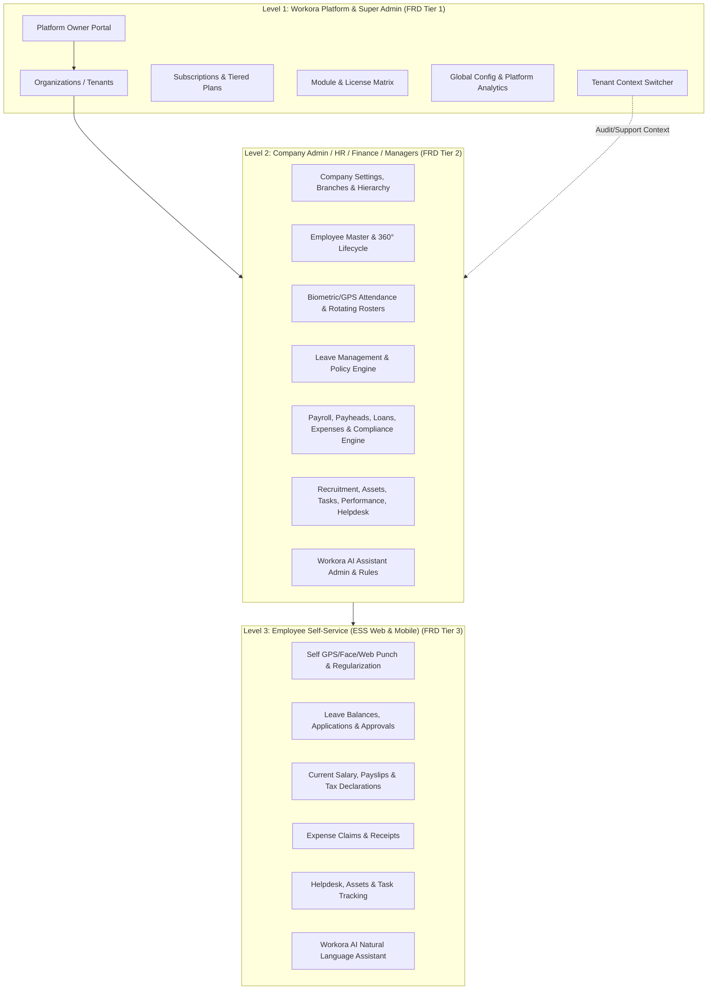
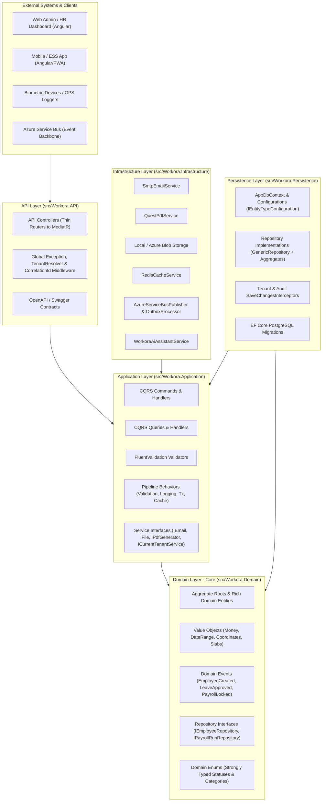
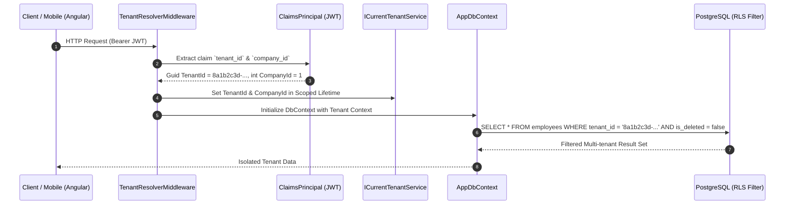
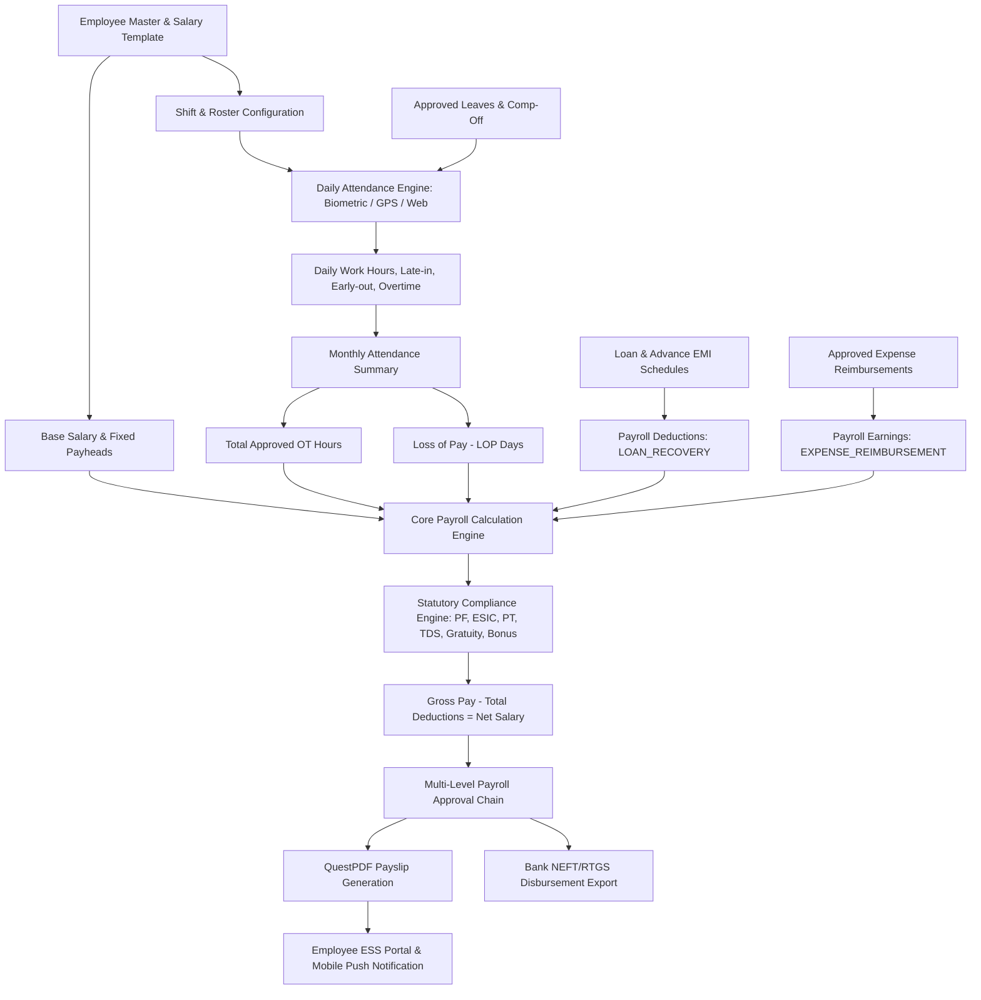
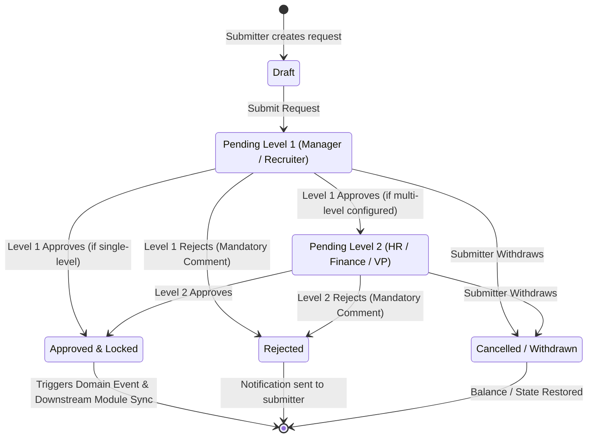
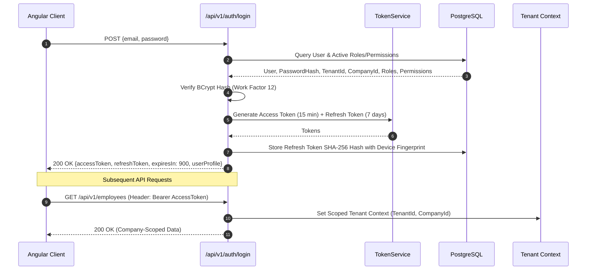
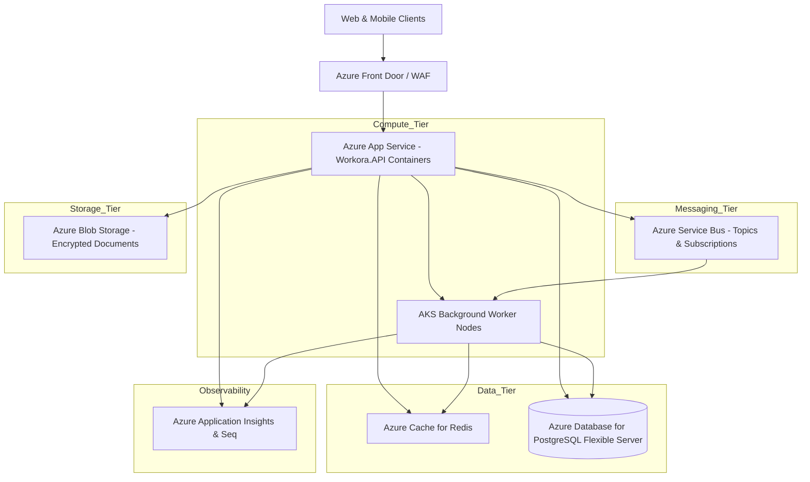
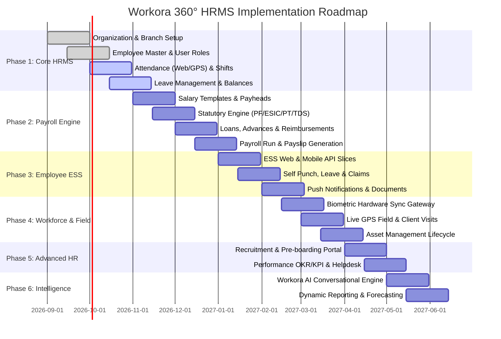

# Workora
## 360° Human Resource Management & Payroll Platform
### Backend Technical Architecture & System Documentation — Version 2.0 (FRD 2.0 Aligned)

---

## Cover Page

| Field | Value |
|---|---|
| **Project Name** | Workora (Enterprise 360° HRMS & Payroll SaaS) |
| **Document Title** | Backend Technical Architecture & System Specification |
| **Version** | 2.0 (FRD 2.0 & PBAC 3-Tier Multi-Tenant Architecture Aligned) |
| **Author** | Principal Solution Architecture Team |
| **Created Date** | July 2, 2026 |
| **Last Updated** | August 26, 2026 |
| **Classification** | Enterprise / Engineering Specification |
| **Status** | Approved for Implementation |
| **Primary Reference** | `Workora_FRD.md` v2.0 (Functional Requirements Document) |

### Revision History

| Version | Date | Author | Description |
|---|---|---|---|
| 0.1 | 2026-05-10 | Solution Architecture Team | Initial draft — Clean Architecture skeleton |
| 0.5 | 2026-05-28 | Solution Architecture Team | Added module architecture and DB design |
| 0.9 | 2026-06-18 | Solution Architecture Team | Added security, deployment, CI/CD |
| 1.0 | 2026-07-02 | Solution Architecture Team | Baseline release for development kickoff |
| 1.1 | 2026-07-15 | Solution Architecture Team | Full API audit across 30 modules — CRUD, `/me`, and lifecycle endpoints |
| 2.0 | 2026-08-25 | Solution Architecture Team | Major release: 360° HRMS transformation (Tankhwa Patra paradigm). Added 3-Tier SaaS Architecture, Dynamic Plan Licensing, India Statutory Compliance, Multi-Device Biometric/GPS Attendance, Rotating Rosters, Loans/Advances EMI Recovery, Expenses, Field GPS, Assets, Tasks, Helpdesk, Workora AI Assistant, and ~280+ CQRS API endpoints. |
| 2.0 (Rev) | 2026-08-26 | Solution Architecture Team | Comprehensive synchronization with `Workora_FRD.md` v2.0: Full traceability for all 37 functional modules (FR-01 to FR-37), Access Control & 3-Tier Navigation (FR-AC.1 to FR-AC.12), `/auth/me` real database context remediation, Server-side forced tenant/company query filters, Tenant Context Switcher, Multi-level Approval State Machine across 7 workflows, Complete PostgreSQL Entity Relational Schemas, Consolidated 280+ API Endpoint Catalog, OWASP Top 10 API Security Mitigations (NFR-SEC), and Verification Acceptance Criteria (AC-1 to AC-8). |

---

## Table of Contents

1. [Document Purpose & System Vision](#1-document-purpose--system-vision)
2. [Technology Stack](#2-technology-stack)
3. [System Architecture & Clean Architecture Principles](#3-system-architecture--clean-architecture-principles)
4. [Solution & Project Folder Structure](#4-solution--project-folder-structure)
5. [The Three-Tier Operational Model & Navigation Architecture](#5-the-three-tier-operational-model--navigation-architecture)
    - 5.1 [Level 1 — Super Admin (Platform Owner)](#51-level-1--super-admin-platform-owner)
    - 5.2 [Level 2 — Company Admin / HR / Finance / Managers](#52-level-2--company-admin--hr--finance--managers)
    - 5.3 [Level 3 — Employee Self-Service (ESS)](#53-level-3--employee-self-service-ess)
    - 5.4 [Complete Admin Navigation & Sidebar Information Architecture](#54-complete-admin-navigation--sidebar-information-architecture)
    - 5.5 [Navigation Map by Tier & Route Protection](#55-navigation-map-by-tier--route-protection)
    - 5.6 [Tenant Context Switcher & Tiered Dashboards](#56-tenant-context-switcher--tiered-dashboards)
6. [Multi-Tenant SaaS Architecture & Plan Licensing](#6-multi-tenant-saas-architecture--plan-licensing)
    - 6.1 [Multi-Tenant Data Isolation Strategy (RLS & EF Core Global Filters)](#61-multi-tenant-data-isolation-strategy)
    - 6.2 [Dynamic Tiered Plans & Module License Matrix](#62-dynamic-tiered-plans--module-license-matrix)
    - 6.3 [Headcount Seat Cap Enforcement](#63-headcount-seat-cap-enforcement)
7. [The Interconnected Core HRMS Data Flow](#7-the-interconnected-core-hrms-data-flow)
    - 7.1 [Cross-Module Synchronization Steps](#71-cross-module-synchronization-steps)
8. [Multi-Level Approval State Machine](#8-multi-level-approval-state-machine)
    - 8.1 [7 Core Workflow State Machines](#81-7-core-workflow-state-machines)
    - 8.2 [Transition Rules, Permissions & Rejection Comments](#82-transition-rules-permissions--rejection-comments)
9. [Identity, Authentication & Authorization (PBAC)](#9-identity-authentication--authorization-pbac)
    - 9.1 [JWT & Rotating Refresh Token Architecture](#91-jwt--rotating-refresh-token-architecture)
    - 9.2 [Token Claims Payload & Fixed `/auth/me` Contract](#92-token-claims-payload--fixed-authme-contract)
    - 9.3 [Permission-Based Access Control (PBAC) Policy System](#93-permission-based-access-control-pbac-policy-system)
    - 9.4 [Frontend Route Guards & Element Directives](#94-frontend-route-guards--element-directives)
    - 9.5 [Account Lockout & Security Policies](#95-account-lockout--security-policies)
10. [Database Architecture & Data Governance](#10-database-architecture--data-governance)
    - 10.1 [Schema Principles & Governance](#101-schema-principles--governance)
    - 10.2 [Entity Relational Diagrams](#102-entity-relational-diagrams)
11. [Detailed Entity Relational Schemas (All Tables & Columns)](#11-detailed-entity-relational-schemas-all-tables--columns)
    - 11.1 [Platform & Tenancy Tables](#111-platform--tenancy-tables)
    - 11.2 [Identity, PBAC & Security Tables](#112-identity-pbac--security-tables)
    - 11.3 [Organization Hierarchy & Master Tables](#113-organization-hierarchy--master-tables)
    - 11.4 [Employee Master & Lifecycle Tables](#114-employee-master--lifecycle-tables)
    - 11.5 [Recruitment, Pre-Boarding & Onboarding Tables](#115-recruitment-pre-boarding--onboarding-tables)
    - 11.6 [Time, Attendance & Roster Tables](#116-time-attendance--roster-tables)
    - 11.7 [Leave Management Tables](#117-leave-management-tables)
    - 11.8 [Payroll, Compensation & Statutory Tables](#118-payroll-compensation--statutory-tables)
    - 11.9 [Loans, Advances & Expense Tables](#119-loans-advances--expense-tables)
    - 11.10 [Field GPS & Live Tracking Tables](#1110-field-gps--live-tracking-tables)
    - 11.11 [Assets, Tasks & Performance Tables](#1111-assets-tasks--performance-tables)
    - 11.12 [Helpdesk, Documents, Policies & Governance Tables](#1112-helpdesk-documents-policies--governance-tables)
    - 11.13 [AI Assistant, Analytics & Communication Tables](#1113-ai-assistant-analytics--communication-tables)
    - 11.14 [Training & Development Tables](#1114-training--development-tables)
12. [Comprehensive Module Architecture (37 Modules)](#12-comprehensive-module-architecture-37-modules)
13. [API Standards & Response Contracts](#13-api-standards--response-contracts)
14. [Consolidated API Endpoint Catalog (~280+ Endpoints)](#14-consolidated-api-endpoint-catalog-280-endpoints)
15. [Security Architecture & OWASP API Top 10 Mitigation](#15-security-architecture--owasp-api-top-10-mitigation)
16. [Caching, Logging, Exception Handling & Observability](#16-caching-logging-exception-handling--observability)
17. [Cloud Infrastructure, Azure Deployment & Event Bus](#17-cloud-infrastructure-azure-deployment--event-bus)
18. [Phased Implementation Roadmap](#18-phased-implementation-roadmap)
19. [Appendix, Verification Acceptance Plan & Standards Compliance](#19-appendix-verification-acceptance-plan--standards-compliance)

---

## 1. Document Purpose & System Vision

### 1.1 Executive Summary
**Workora** is an enterprise-grade, cloud-native 360° Human Resource Management System (HRMS) and Payroll automation platform. Engineered on **.NET 9**, **Clean Architecture**, **Domain-Driven Design (DDD)**, and **CQRS (MediatR)** with a **PostgreSQL 16** relational data store and **Angular** frontend, Workora translates the functional requirements defined in `Workora_FRD.md` (v2.0) into a secure, high-performance, and verifiable technical implementation.

Workora delivers an interconnected operational ecosystem where workforce management, time & attendance, leave accruals, statutory compliance, loan recovery, expense claims, and payroll computation operate as a synchronized engine.


```mermaid
flowchart TB
    subgraph SaaS_Platform["Level 1: Workora Platform & Super Admin (FRD Tier 1)"]
        Platform[Platform Owner Portal]
        Tenants[Organizations / Tenants]
        Subs[Subscriptions & Tiered Plans]
        ModLic[Module & License Matrix]
        PlatformConfig[Global Config & Platform Analytics]
        TenantSwitcher[Tenant Context Switcher]
    end

    subgraph Tenant_Company["Level 2: Company Admin / HR / Finance / Managers (FRD Tier 2)"]
        CompanySetup[Company Settings, Branches & Hierarchy]
        EmpLifecycle[Employee Master & 360° Lifecycle]
        AttShift[Biometric/GPS Attendance & Rotating Rosters]
        LeaveMgmt[Leave Management & Policy Engine]
        PayrollComp[Payroll, Payheads, Loans, Expenses & Compliance Engine]
        AdvHR[Recruitment, Assets, Tasks, Performance, Helpdesk]
        WorkoraAIAdmin[Workora AI Assistant Admin & Rules]
    end

    subgraph ESS_Layer["Level 3: Employee Self-Service (ESS Web & Mobile) (FRD Tier 3)"]
        ESSPunch[Self GPS/Face/Web Punch & Regularization]
        ESSLeave[Leave Balances, Applications & Approvals]
        ESSSalary[Current Salary, Payslips & Tax Declarations]
        ESSReimburse[Expense Claims & Receipts]
        ESSDesk[Helpdesk, Assets & Task Tracking]
        WorkoraAIESS[Workora AI Natural Language Assistant]
    end

    Platform --> Tenants
    Tenants --> Tenant_Company
    Tenant_Company --> ESS_Layer
    TenantSwitcher -.->|Audit/Support Context| Tenant_Company
```

### 1.2 Core Scope & System Invariants (FRD Traceability)
- **Scope (FRD 1.2)**: Multi-tenant SaaS governance (tenant onboarding, subscription/module licensing); tenant-level HR, attendance, leave, payroll, statutory compliance (India), loans, expenses, field tracking, assets, tasks, performance, helpdesk, documents, and policies; employee self-service; PBAC access control and strict multi-tenant data isolation; Workora AI assistant.
- **Out of Scope (FRD 1.2)**: Payment gateway collection for SaaS billing, native mobile app store submissions, non-India statutory payroll rules.
- **Multi-Tenancy Model (FRD 2.4 / NFR-DATA.1)**: Shared database with row-level isolation enforced via PostgreSQL Row-Level Security and mandatory EF Core Global Query Filters (`tenant_id` and `company_id`). Cross-tenant data leakage is a release-blocking defect class.
- **Identity & Authorization Fix (FRD 2.4 / FR-03.7 / FR-AC.1)**: The `/auth/me` endpoint returns actual database-derived roles, permissions, `companyId`, `companyName`, `companyCode`, `departmentName`, `designationTitle`, and `employeeCode` — eliminating any hardcoded SuperAdmin role assignment.

---

## 2. Technology Stack

| Layer / Concern | Technology | Version | Purpose |
|---|---|---|---|
| **Runtime** | .NET | 9.0 (LTS-track) | High-performance backend execution framework |
| **Web API** | ASP.NET Core Web API | 9.0 | RESTful API host with routing, filters, and DI |
| **Architecture Style** | Clean Architecture + DDD + CQRS | — | Domain isolation, maintainability, and testability |
| **CQRS Mediator** | MediatR | 12.x | Decouples HTTP controllers from domain handlers; executes pipeline behaviors |
| **Database** | PostgreSQL | 16.x | Primary relational store supporting ACID transactions, JSONB, and RLS |
| **ORM** | Entity Framework Core (Npgsql provider) | 9.0 | Data modeling, migrations, LINQ projections, and interceptors |
| **Naming Conventions** | EFCore.NamingConventions | 9.0 | Enforces idiomatic PostgreSQL `snake_case` naming from C# `PascalCase` |
| **Authentication** | JWT Bearer (`Microsoft.AspNetCore.Authentication.JwtBearer`) | 9.0 | Stateless cryptographically signed token auth with claims |
| **Authorization** | ASP.NET Core Policy-Based Authorization | 9.0 | Fine-grained Permission-Based Access Control (PBAC) `{module}.{action}` |
| **Validation** | FluentValidation.AspNetCore | 11.x | Strongly typed request validation integrated into MediatR pipeline |
| **Object Mapping** | AutoMapper | 13.x | Entity-to-DTO projection and shape mapping |
| **Logging** | Serilog (+ Sinks: Console, File, Seq) | 8.x / 4.x | Structured JSON logging with Correlation ID, Tenant ID, and User ID enrichment |
| **In-Memory Cache** | `IMemoryCache` (built-in) | 9.0 | In-process caching for hot reference data (permissions, settings, holidays) |
| **Distributed Cache** | Azure Cache for Redis | 7.x | Cross-instance caching, session state, and distributed locking for payroll |
| **Message Broker** | Azure Service Bus / Outbox Pattern | 7.x | Reliable asynchronous event pub/sub across bounded contexts |
| **Background Processing** | `BackgroundService` / Quartz.NET | 9.0 / 3.x | Cron-based jobs (leave accruals, biometric sync, document expiry, payroll batch) |
| **PDF Generation** | QuestPDF | 2024.x | Pixel-perfect programmatic generation of payslips, offer letters, and compliance reports |
| **Excel / CSV Engine** | ClosedXML / CsvHelper | 0.104.x / 33.x | High-throughput bulk import/export processing (Muster roll, ECR, Bank files) |
| **Email Service** | MailKit / MimeKit | 4.x | Transactional email delivery with HTML templates |
| **Cryptographic Security** | BCrypt.Net-Next / `System.Security.Cryptography` (AES-GCM) | 4.x | Password hashing (work factor 12) and encrypted columns (bank accounts, PAN, Aadhaar) |
| **AI / NLP Engine** | Azure OpenAI / Semantic Kernel / Custom Intent Router | 1.x | Natural language HR assistant (*Workora AI*) for Q&A and automated actions |
| **API Documentation** | Swashbuckle (Swagger/OpenAPI) | 6.x | Interactive API schema documentation and OpenAPI v3 contracts |
| **Frontend Framework** | Angular | 19.x | Single Page Application (SPA) for Web Admin and ESS |
| **Containerization** | Docker + Linux Alpine base | Latest | Container runtime for Azure App Service & AKS |

---

## 3. System Architecture & Clean Architecture Principles

Workora strictly enforces **Clean Architecture** (Robert C. Martin) and **Domain-Driven Design (DDD)** tactical patterns.


```mermaid
flowchart TB
    subgraph External["External Systems & Clients"]
        WebAdmin["Web Admin / HR Dashboard (Angular)"]
        MobileApp["Mobile / ESS App (Angular/PWA)"]
        Biometric["Biometric Devices / GPS Loggers"]
        AzureSB["Azure Service Bus (Event Backbone)"]
    end

    subgraph Presentation["API Layer (src/Workora.API)"]
        Controllers["API Controllers (Thin Routers to MediatR)"]
        Middleware["Global Exception, TenantResolver & CorrelationId Middleware"]
        Swagger["OpenAPI / Swagger Contracts"]
    end

    subgraph ApplicationLayer["Application Layer (src/Workora.Application)"]
        Commands["CQRS Commands & Handlers"]
        Queries["CQRS Queries & Handlers"]
        Validators["FluentValidation Validators"]
        Behaviors["Pipeline Behaviors (Validation, Logging, Tx, Cache)"]
        Interfaces["Service Interfaces (IEmail, IFile, IPdfGenerator, ICurrentTenantService)"]
    end

    subgraph DomainLayer["Domain Layer - Core (src/Workora.Domain)"]
        Entities["Aggregate Roots & Rich Domain Entities"]
        ValueObjects["Value Objects (Money, DateRange, Coordinates, Slabs)"]
        DomainEvents["Domain Events (EmployeeCreated, LeaveApproved, PayrollLocked)"]
        RepoInterfaces["Repository Interfaces (IEmployeeRepository, IPayrollRunRepository)"]
        Enums["Domain Enums (Strongly Typed Statuses & Categories)"]
    end

    subgraph InfrastructureLayer["Infrastructure Layer (src/Workora.Infrastructure)"]
        EmailSvc["SmtpEmailService"]
        PdfSvc["QuestPdfService"]
        FileStore["Local / Azure Blob Storage"]
        RedisSvc["RedisCacheService"]
        EventBus["AzureServiceBusPublisher & OutboxProcessor"]
        AIService["WorkoraAiAssistantService"]
    end

    subgraph PersistenceLayer["Persistence Layer (src/Workora.Persistence)"]
        AppDb["AppDbContext & Configurations (IEntityTypeConfiguration)"]
        Repos["Repository Implementations (GenericRepository + Aggregates)"]
        Interceptors["Tenant & Audit SaveChangesInterceptors"]
        Migrations["EF Core PostgreSQL Migrations"]
    end

    External --> Presentation
    Presentation --> ApplicationLayer
    ApplicationLayer --> DomainLayer
    InfrastructureLayer --> ApplicationLayer
    PersistenceLayer --> DomainLayer
    PersistenceLayer --> ApplicationLayer
```

### 3.1 The Dependency Rule & Coding Invariants
- **`Workora.Domain`**: Has **zero** external package or project dependencies. Owns entity models, business invariants, domain events, domain exceptions, enums, value objects, and repository interfaces.
- **`Workora.Application`**: References only `Workora.Domain` and `Workora.Shared`. Contains MediatR Commands/Queries, handlers, validators, DTOs, AutoMapper profiles, and abstractions for external services.
- **`Workora.Persistence`**: References `Workora.Domain` and `Workora.Application`. Implements repository interfaces, manages `AppDbContext`, applies entity type configurations (`IEntityTypeConfiguration<T>`), runs migrations, and configures global query filters.
- **`Workora.Infrastructure`**: References `Workora.Application` and `Workora.Domain`. Implements non-database external services (SMTP email, QuestPDF rendering, Azure Blob storage, Redis caching, Azure Service Bus, AI connectors).
- **`Workora.API`**: The composition root. References `Workora.Application`, `Workora.Infrastructure`, `Workora.Persistence`, and `Workora.Shared`. Controllers only inject `IMediator` and never directly access `DbContext` or repositories.

---

## 4. Solution & Project Folder Structure

```
workora/
├── backend/
│   ├── Workora.sln
│   ├── Directory.Build.props
│   ├── Directory.Packages.props
│   ├── src/
│   │   ├── Workora.Domain/
│   │   │   ├── Common/              (BaseEntity, AuditableEntity, DomainEvent, IMustHaveTenant)
│   │   │   ├── Entities/            (Employee, AttendanceRecord, LeaveRequest, PayrollRun, etc.)
│   │   │   ├── ValueObjects/        (Money, DateRange, Address, Coordinates, TaxSlab)
│   │   │   ├── Enums/               (EmploymentStatus, AttendanceStatus, LeaveStatus, LoanStatus, etc.)
│   │   │   ├── Events/              (EmployeeOnboardedEvent, PayrollApprovedEvent, etc.)
│   │   │   ├── Exceptions/          (DomainException, InvalidStateTransitionException, etc.)
│   │   │   └── Interfaces/          (IEmployeeRepository, IPayrollRunRepository, IGenericRepository)
│   │   │
│   │   ├── Workora.Application/
│   │   │   ├── Common/
│   │   │   │   ├── Behaviors/       (ValidationBehavior, LoggingBehavior, TransactionBehavior, CachingBehavior)
│   │   │   │   ├── Interfaces/      (ICurrentTenantService, ICurrentUserService, IEmailService, IPdfGenerator)
│   │   │   │   ├── Mappings/        (MappingProfile, Module-specific AutoMapper Profiles)
│   │   │   │   └── Models/          (ApiResponse, PagedResponse, ErrorResponse)
│   │   │   └── Features/            (Vertical Slices by 37 Functional Modules)
│   │   │       ├── SuperAdmin/      (Plans, Organizations, Global Telemetry)
│   │   │       ├── Authentication/  (Login, RefreshToken, Password Management, Me)
│   │   │       ├── Users/           (User Provisioning, Roles, Session Management)
│   │   │       ├── Roles/           (Role Management, PBAC Permission Matrix)
│   │   │       ├── Companies/       (Company Profile, Statutory Identifiers, Logo)
│   │   │       ├── Branches/        (Branch Master, Geofencing, Timezones)
│   │   │       ├── Departments/     (Hierarchy Tree, Department Heads)
│   │   │       ├── Designations/    (Grades, Levels, Salary Bands)
│   │   │       ├── FinancialYears/  (Fiscal Setup, Year Closure)
│   │   │       ├── Holidays/        (Company/Branch Holiday Calendars)
│   │   │       ├── WeeklyOffs/      (Weekly-off Rules & Branch Assignments)
│   │   │       ├── Employees/       (360° Profile, Encrypted Bank Details, Org Chart)
│   │   │       ├── Recruitment/     (Job Postings, Candidates, Offer Letters, E-Sign)
│   │   │       ├── Onboarding/      (Checklists, Document Verification)
│   │   │       ├── Attendance/      (Punches, Multi-Device Logs, Regularization, Live Status)
│   │   │       ├── Shifts/          (Shift Master, Rotating Rosters, Swaps)
│   │   │       ├── Leave/           (Types, Balances, Accrual Job, Requests, Calendar)
│   │   │       ├── Payroll/         (Payheads, Salary Structures, Batch Run, Locking, Payslips)
│   │   │       ├── Compliance/      (EPF ECR, ESIC Return, PT Slabs, Form 16, Tax Declarations)
│   │   │       ├── Loans/           (Applications, Amortization Schedule, EMI Payroll Recovery)
│   │   │       ├── Expenses/        (Claims, Multi-level Approval, Payroll Reimbursement)
│   │   │       ├── FieldTracking/   (Live GPS Map, Client Visits, Distance KM Computation)
│   │   │       ├── Assets/          (Master, Allocation, Return on Offboarding, Maintenance)
│   │   │       ├── Tasks/           (Operational Boards, SLA Tracking, My Tasks)
│   │   │       ├── Performance/     (Cycles, OKR/KPI Goals, Self/Manager Reviews, Ratings)
│   │   │       ├── Helpdesk/        (Tickets, Categories, Threaded Comments, SLA Closure)
│   │   │       ├── Documents/       (Secure Upload, Category Tagging, Expiry Alerts)
│   │   │       ├── Policies/        (Versioned Publishing, Mandatory Digital E-Sign)
│   │   │       ├── Notifications/   (In-App, Push, Email, Log Center)
│   │   │       ├── WorkoraAI/       (Natural Language Assistant, Intent Routing, Scoped Retrieval)
│   │   │       ├── Reports/         (Headcount, Attrition, Payroll Cost, Dynamic Excel Export)
│   │   │       ├── AuditLogs/       (Immutable Audit Trail, Entity Change Diffs)
│   │   │       ├── Training/        (Training Programs, Course Enrollments)
│   │   │       └── Dashboard/       (3-Tier KPIs & Analytics)
│   │   │
│   │   ├── Workora.Infrastructure/
│   │   │   ├── Email/               (SmtpEmailService, Razor/Liquid HTML Templates)
│   │   │   ├── FileStorage/         (LocalFileStorageService, AzureBlobStorageService)
│   │   │   ├── Pdf/                 (QuestPdfPayslipGenerator, QuestPdfOfferGenerator)
│   │   │   ├── Caching/             (MemoryCacheService, RedisCacheService)
│   │   │   ├── Messaging/           (AzureServiceBusPublisher, OutboxProcessorJob)
│   │   │   ├── AI/                  (WorkoraAiEngine, IntentClassifier, ContextRetriever)
│   │   │   └── BackgroundJobs/      (BiometricSyncJob, LeaveAccrualJob, PayrollBatchJob, ExpiryAlertJob)
│   │   │
│   │   ├── Workora.Persistence/
│   │   │   ├── AppDbContext.cs
│   │   │   ├── Configurations/      (IEntityTypeConfiguration<T> per entity)
│   │   │   ├── Repositories/        (GenericRepository, EmployeeRepository, PayrollRepository, etc.)
│   │   │   ├── Interceptors/        (TenantSaveChangesInterceptor, AuditSaveChangesInterceptor)
│   │   │   ├── Migrations/          (EF Core PostgreSQL migration snapshots)
│   │   │   └── Seeders/             (PermissionSeeder, RoleSeeder, StatutorySlabSeeder)
│   │   │
│   │   ├── Workora.Shared/
│   │   │   ├── Responses/           (ApiResponse<T>, PagedResponse<T>, ErrorResponse)
│   │   │   ├── Constants/           (PermissionConstants, RoleConstants, CacheKeys)
│   │   │   ├── Guards/              (Guard.AgainstNull, Guard.AgainstNegative)
│   │   │   └── Extensions/          (DateTimeExtensions, QueryableExtensions)
│   │   │
│   │   └── Workora.API/
│   │       ├── Controllers/v1/      (34+ Thin API Controllers)
│   │       ├── Middleware/          (GlobalExceptionMiddleware, TenantResolverMiddleware, CorrelationIdMiddleware)
│   │       ├── Program.cs           (Composition Root, DI Registrations, Pipeline Setup)
│   │       └── appsettings.json
│   │
│   └── tests/
│       ├── Workora.UnitTests/       (Handler, Validator, and Domain Invariant Tests)
│       └── Workora.IntegrationTests/(End-to-end API tests with Testcontainers PostgreSQL)
```

---

## 5. The Three-Tier Operational Model & Navigation Architecture

Workora enforces a strict three-tier operational hierarchy defined in FRD Section 2.2 and Section 4:


```mermaid
graph LR
    subgraph Level1["Level 1: Platform / Super Admin (FRD Tier 1)"]
        L1_1[Organization Onboarding]
        L1_2[Subscription & Plans]
        L1_3[Module Licensing]
        L1_4[Platform Analytics]
        L1_5[Tenant Context Switcher]
    end

    subgraph Level2["Level 2: Company Admin / HR / Finance (FRD Tier 2)"]
        L2_1[Company & Branch Setup]
        L2_2[Employee Master & 360° Lifecycle]
        L2_3[Shift & Biometric Attendance]
        L2_4[Leave Policies & Approvals]
        L2_5[Payroll, Loans, Expenses & Compliance]
        L2_6[Assets, Tasks, Performance, Helpdesk]
    end

    subgraph Level3["Level 3: Employee Self-Service (ESS) (FRD Tier 3)"]
        L3_1[GPS / Face Self-Attendance]
        L3_2[Apply Leaves & Regularization]
        L3_3[View / Download Payslips]
        L3_4[Expense Claims & Receipts]
        L3_5[Loan / Advance Requests]
        L3_6[Workora AI Assistant]
    end

    Level1 --> Level2
    Level2 --> Level3
```

### 5.1 Level 1 — Super Admin (Platform Owner)
- **Actor (FRD 2.2)**: Workora platform owner/operator.
- **Responsibilities**: Onboard, suspend, and reactivate tenant organizations; define subscription plans and module licensing; view platform-wide analytics and audit logs; switch viewing context into any tenant for support purposes via the **Tenant Context Switcher** (`FR-AC.5`).
- **Authorization**: Governed by the `SuperAdmin` role and `superadmin.*` permissions. Only Global Super Admin accounts have platform-wide visibility across all tenant organizations (`FR-AC.4`).

### 5.2 Level 2 — Company Admin / HR / Finance / Managers
- **Actor (FRD 2.2)**: Tenant-side administrators and people managers.
- **Responsibilities**: Configure their own company (branches, departments, shifts, leave policy); manage employees end-to-end; approve leave, regularization, expense, loan, and payroll workflows; run and lock payroll; view statutory compliance reports.
- **Scoping (FR-AC.3 / FR-AC.12)**: Strictly scoped to their own `companyId` / `tenant_id` enforced server-side via EF Core query filters. Non-Super-Admin users cannot view or mutate another tenant's data.

### 5.3 Level 3 — Employee Self-Service (ESS)
- **Actor (FRD 2.2)**: Every onboarded employee.
- **Responsibilities**: Self punch attendance (GPS geofenced / selfie / web); apply for and track leave; view/download payslips; submit expense claims and loan requests; view assigned assets and tasks; acknowledge policies; use the Workora AI assistant.
- **Scoping**: Restricted to `/api/v1/.../me` endpoints and records owned by the authenticated caller.

### 5.4 Complete Admin Navigation & Sidebar Information Architecture

The administration navigation blueprint strictly mirrors FRD Appendix B:

```text
WORKORA ENTERPRISE ADMIN NAVIGATION
│
├── 📊 1. Dashboard
│   ├── Real-time Workforce Presence (Present, Absent, On Leave, Late)
│   ├── Monthly Payroll Cost & Disbursal Metrics
│   ├── Actionable Pending Approvals (Leaves, Regularizations, Expenses, Loans)
│   └── Visual Attendance Trends & Shift Coverage
│
├── 🏢 2. Organization Master
│   ├── Company Profile & Statutory Identifiers (CIN, GSTIN, PAN, TAN)
│   ├── Branches & Regional Work Locations (Geofencing & Timezone)
│   ├── Departments & Sub-Departments (Hierarchy Tree)
│   ├── Designations, Job Bands & Salary Grades
│   └── Organization Settings & Fiscal Year
│
├── 👥 3. Employee Directory
│   ├── All Employees (Advanced Search, Filters, Org Chart)
│   ├── Add Employee (Single & Bulk Excel/CSV Import)
│   ├── Employee 360° Profile & Digital Files
│   ├── Employment History, Promotions & Transfers
│   └── Lifecycle Management (Probation, Confirmation, Notice, Exit)
│
├── 🎯 4. Recruitment & Pre-Boarding
│   ├── Job Postings & Open Requisitions
│   ├── Candidate Pipeline & Interview Schedules
│   ├── Digital Offer Letters (QuestPDF Generation + Link Delivery)
│   ├── Pre-boarding Portal (Document Upload: Aadhaar, PAN, Education)
│   └── Joining Checklists & Automated Workflows
│
├── 🚀 5. Onboarding
│   ├── Pending Verification (HR Document Review)
│   ├── In-Progress Asset/Account Allocation (IT, Email, ID Card)
│   └── Completed Joinings & Auto-Master Sync
│
├── ⏱️ 6. Attendance & Time Tracking
│   ├── Real-time Live Attendance Dashboard
│   ├── Daily Attendance Grid & Biometric Multi-Punch Logs
│   ├── Monthly Muster Roll & Attendance Registers
│   ├── Late Coming & Early Going Analytics
│   ├── Absence & Loss of Pay (LOP) Tracking
│   ├── Attendance Regularization Requests & Approvals
│   ├── Geo-Tracking & Geofenced Punch Radius
│   └── Biometric Hardware Devices & Integration Gateway
│
├── 🔄 7. Shifts & Rotating Rosters
│   ├── Shift Masters (Shift A, Shift B, Night Shift C, Flexible)
│   ├── Rotating Monthly Roster Planning (Factory & Office)
│   ├── Weekly Off Rules & Rotational Offs
│   └── Holiday Calendars (Company-wide & Branch-specific)
│
├── 🌴 8. Leave Management
│   ├── Leave Types Master (CL, PL, SL, Comp-Off, Maternity, LWP)
│   ├── Leave Accrual & Carryover Policy Engine
│   ├── Employee Leave Balances & Annual Ledgers
│   ├── Leave Applications & Multi-Tier Approvals
│   └── Team Leave Calendar & Availability Matrix
│
├── 💰 9. Payroll Core & Compensation
│   ├── Salary Structures & Customizable Payheads (Earnings & Deductions)
│   ├── CTC Calculator & Compensation Templates
│   ├── Salary Revisions, Increment History & Effective Dates
│   ├── Monthly Payroll Run Processing (Select Branch / Employees)
│   ├── Multi-Tier Payroll Approvals (HR -> Finance -> Leadership)
│   ├── Itemized Payslips (QuestPDF Generation & Batch ZIP Export)
│   ├── Bank Disbursement Files (NEFT / RTGS Formats)
│   └── Payroll Audit Registers & Historical Runs
│
├── 💳 10. Loans & Salary Advances
│   ├── Advance / Loan Applications
│   ├── HR & Finance Approval Chain
│   ├── Amortization Schedule & Monthly EMI Calculator
│   └── Automatic Monthly Payroll Recovery Ledger
│
├── ⌛ 11. Overtime (OT) Engine
│   ├── Overtime Calculation Rules (Single / Double Slabs)
│   ├── Employee OT Requests & Biometric Trigger Logs
│   ├── Manager OT Approval Chain
│   └── Monthly OT Pay Registers
│
├── 🧾 12. Expenses & Reimbursements
│   ├── Expense Categories (Travel, Lodging, Meals, Fuel, Stationery)
│   ├── Claim Submissions with Bill & Invoice Uploads
│   ├── Multi-Tier Approval (Manager -> Finance)
│   ├── Automated Payroll Reimbursement Settlement
│   └── Expense Utilization & Audit Reports
│
├── ⚖️ 13. Statutory Compliance (India Regulations)
│   ├── Employee Provident Fund (EPF / EPS / EDLI ECR `.txt` Export)
│   ├── Employee State Insurance (ESIC Monthly Return `.csv` Export)
│   ├── Professional Tax (PT Slabs & State-wise Statements)
│   ├── Income Tax TDS (Old vs New Regime u/s 115BAC)
│   ├── Tax Declaration Proofs & HRA Verification
│   ├── Gratuity Slabs & Provisions
│   └── Statutory Bonus Calculations (8.33% to 20%)
│
├── 💻 14. Asset Management
│   ├── Asset Master & Category Inventory (Hardware, Software, Vehicles)
│   ├── Employee Asset Allocation & Acknowledgment
│   ├── Return & Inspection during Offboarding
│   └── Maintenance & Depreciation Logs
│
├── 📍 15. Field Tracking & Client Visits
│   ├── Real-time Field Agent Live GPS Map
│   ├── Client Site Visits (Check-In, Geotag, Address)
│   ├── Check-Out with Travel Distance (KM), Notes & Signature
│   └── Travel Allowance & Route Reports
│
├── 📈 16. Performance Management
│   ├── Performance Cycles & Evaluation Periods
│   ├── OKR & KPI Goal Setting
│   ├── Self-Review & Manager Review Forms
│   └── 360° Ratings, Bell Curve Calibration & History
│
├── 📋 17. Task Management
│   ├── Operational Tasks Board (ToDo, InProgress, InReview, Done)
│   ├── My Tasks (Assigned to Authenticated Employee)
│   ├── Team Tasks & Delegated Assignments
│   └── SLA & Deadline Tracking
│
├── 🎫 18. HR & IT Helpdesk
│   ├── Support Ticket Creation (Payroll, Attendance, IT, HR Policy)
│   ├── Support Agent Assignment & Priority Management
│   ├── Discussion Threads & File Attachments
│   └── Resolution Verification & SLA Closure
│
├── 📁 19. Documents Hub
│   ├── Central HR Templates & Policy Documents
│   ├── Digital Letters (Appointment, Confirmation, Relieving)
│   ├── Employee Document Vault (KYC, Education, Experience)
│   └── Expiry Tracking Engine (Visas, Passports, Driving Licenses)
│
├── 📜 20. Policies & Governance
│   ├── Company Handbook & Code of Conduct
│   ├── Versioned Policy Publishing
│   ├── Employee Digital E-Sign Acknowledgments
│   └── Compliance Audit Reports
│
├── 📊 21. Reports & Analytics Engine
│   ├── Headcount, Gender Ratio & Attrition Reports
│   ├── Attendance Muster & Late-coming Reports
│   ├── Payroll Summary & Cost Trend Analysis
│   ├── Leave Utilization & Balance Reports
│   ├── Statutory Filing Reports
│   └── Dynamic Custom Report Builder & Excel Export
│
├── 🔔 22. Notifications Hub
│   ├── In-App Notification Center
│   ├── Push Notifications (Mobile ESS)
│   └── Email & SMS Notification Templates
│
├── 🤖 23. Workora AI Assistant
│   ├── Conversational Natural Language Assistant
│   ├── Attendance & Leave Balance Q&A
│   ├── Policy Inquiries & Payslip Retrieval
│   └── Intent-Based HR Action Triggering
│
└── ⚙️ 24. System Settings & Administration
    ├── User Accounts & Multi-Tenant Access
    ├── Roles & Permission Matrix (PBAC)
    ├── Multi-Level Approval Workflow Configurations
    ├── Third-Party Hardware & API Integrations
    ├── Immutable System Audit Logs (Who, What, When, IP)
    └── Global System Preferences
```

### 5.5 Navigation Map by Tier & Route Protection

Per FRD Section 4.1 (`FR-AC.6`, `FR-AC.9`):

| Tier | Sidebar Sections Visible | Route Guard Policy |
|---|---|---|
| **Super Admin** | SuperAdmin Console · Platform Users · Global Audit Trail · System Settings · Roles & Permissions · Tenant Context Switcher | `superadmin.access` |
| **Company Admin / HR / Manager** | Dashboard · Organization · Employee · Recruitment/Pre-Boarding · Onboarding · Attendance · Shift & Roster · Leave · Payroll · Loans & Advances · Overtime · Expense · Compliance · Assets · Visit/Field · Performance · Tasks · Helpdesk · Documents · Reports · Notifications · AI Assistant · Settings | `{module}.{action}` policy checks |
| **Employee (ESS)** | Dashboard (Punch Clock, Leave Balance, Latest Payslip) · My Attendance · My Leaves · My Salary · My Expenses · My Loans · My Documents · My Assets · My Tasks · Helpdesk · Policies · AI Assistant · Account Security | `authenticated` / ESS policy |

- **FR-AC.7 Enforcement**: A user who attempts direct URL navigation to a route they are not authorized for is immediately redirected to their dashboard with a denial notification; no partial data is rendered.
- **FR-AC.8 Element Directives**: Angular structural directives (`*hasPermission="module.action"`, `*hasRole="RoleName"`, `*superAdminOnly`) ensure unauthorized buttons and panels are completely removed from the DOM.

### 5.6 Tenant Context Switcher & Tiered Dashboards

- **Tenant Context Switcher (FR-AC.5)**: Super Admin can switch viewing context between Global (all tenants) and any single tenant via `X-Tenant-Override` header. This allows support inspection without granting write access outside platform governance.
- **Topbar Indicator (FR-AC.10)**: Displays active Tenant Name, Company Short Code, and color-coded Role Badge (`Super Admin`, `HR Admin`, `Finance Manager`, `Manager`, `Employee`).
- **Tiered Dashboard Landing Pages (FR-AC.11)**:
  - **Super Admin**: Platform KPIs (Active Tenants, Global Workforce Count, MRR, Active Subscriptions, System Health, API Latencies).
  - **Company Admin / HR**: Company-scoped KPIs (Headcount, Today's Attendance Rate, Real-time Present/Absent/Late/Leave, Payroll Run Status, Pending Multi-level Approvals, Open Requisitions).
  - **Employee (ESS)**: Personal Punch Card, Real-time Leave Balance Cards, Latest Payslip Download Card, Assigned Tasks, Pending Requests Status.

---

## 6. Multi-Tenant SaaS Architecture & Plan Licensing

### 6.1 Multi-Tenant Data Isolation Strategy
Workora utilizes a **Shared Database, Shared Schema** multi-tenant model enforced through PostgreSQL **Row-Level Security (RLS)** and Entity Framework Core **Global Query Filters** (`FR-02.5`, `FR-AC.3`, `NFR-DATA.1`).


```mermaid
sequenceDiagram
    autonumber
    participant C as Client / Mobile (Angular)
    participant MW as TenantResolverMiddleware
    participant Claims as ClaimsPrincipal (JWT)
    participant Svc as ICurrentTenantService
    participant EF as AppDbContext
    participant PG as PostgreSQL (RLS Filter)

    C->>MW: HTTP Request (Bearer JWT)
    MW->>Claims: Extract claim `tenant_id` & `company_id`
    Claims-->>MW: Guid TenantId = 8a1b2c3d-..., int CompanyId = 1
    MW->>Svc: Set TenantId & CompanyId in Scoped Lifetime
    MW->>EF: Initialize DbContext with Tenant Context
    EF->>PG: SELECT * FROM employees WHERE tenant_id = '8a1b2c3d-...' AND is_deleted = false
    PG-->>EF: Filtered Multi-tenant Result Set
    EF-->>C: Isolated Tenant Data
```

1. **`IMustHaveTenant` Invariant**: Every tenant-owned aggregate root implements `IMustHaveTenant` (`Guid TenantId { get; set; }`).
2. **Global Query Filters**:
   ```csharp
   modelBuilder.Entity<TEntity>().HasQueryFilter(e => 
       e.TenantId == _currentTenantService.TenantId && !e.IsDeleted);
   ```
3. **Automatic Stamping Interceptor**: `TenantSaveChangesInterceptor` automatically stamps `TenantId` on entity insertion.
4. **Forced Server-Side Company Scoping (FR-AC.12 / FR-13.6)**: For all non-Super-Admin callers, queries for employees, branches, departments, and payroll runs are forced server-side to the caller's own `companyId`, ignoring any malicious client query parameter overrides.

### 6.2 Dynamic Tiered Plans & Module License Matrix

Evaluation Chain (`FR-01.1` – `FR-01.4`):
$$\text{User} \longrightarrow \text{Role} \longrightarrow \text{Permission} \longrightarrow \text{Tenant Subscription Plan} \longrightarrow \text{Licensed Module Enabled}$$


```mermaid
flowchart LR
    A[Incoming API Request] --> B{User Authenticated?}
    B -->|No| C[401 Unauthorized]
    B -->|Yes| D{Has Permission Policy?}
    D -->|No| E[403 Forbidden - Insufficient Permissions]
    D -->|Yes| F{Tenant Subscription Active?}
    F -->|No| G[402 Payment Required / Subscription Expired]
    F -->|Yes| H{Module Enabled in Tenant Plan?}
    H -->|No| I[403 Forbidden - Module Not Licensed in Plan]
    H -->|Yes| J[Allow MediatR Execution]
```

#### Plan Tiers & Module Availability Matrix (All 37 Modules)

| Module Code | Module Description | Starter Plan | Professional Plan | Enterprise Plan | Custom / Factory Plan |
|---|---|:---:|:---:|:---:|:---:|
| `TENANTS` | Platform Tenancy Governance | SuperAdmin | SuperAdmin | SuperAdmin | SuperAdmin |
| `PLANS` | Subscription & Plan Config | SuperAdmin | SuperAdmin | SuperAdmin | SuperAdmin |
| `AUTH` | Authentication & Sessions | Yes | Yes | Yes | Yes |
| `USERS` | User Accounts & Security | Yes | Yes | Yes | Yes |
| `ROLES` | Roles & PBAC Permissions | Yes | Yes | Yes | Yes |
| `COMPANY` | Company Profile & Entities | Yes | Yes | Yes | Yes |
| `BRANCHES` | Regional Branches & Geofence | Yes | Yes | Yes | Yes |
| `DEPARTMENTS` | Department Tree Hierarchy | Yes | Yes | Yes | Yes |
| `DESIGNATIONS` | Designations & Salary Bands | Yes | Yes | Yes | Yes |
| `FINANCIAL_YEAR` | Fiscal Year Settings | Yes | Yes | Yes | Yes |
| `HOLIDAYS` | Company/Branch Holiday Lists | Yes | Yes | Yes | Yes |
| `WEEKLY_OFF` | Weekly-Off Policy Config | Yes | Yes | Yes | Yes |
| `EMPLOYEE` | Employee Master & 360° Profile| Yes | Yes | Yes | Yes |
| `RECRUITMENT` | Pre-Boarding & E-Sign Offers | — | Yes | Yes | Yes |
| `ONBOARDING` | Onboarding Checklists | — | Yes | Yes | Yes |
| `LIFECYCLE` | Transfers, Promotions & Exit | Yes | Yes | Yes | Yes |
| `ATTENDANCE` | Biometric/GPS Attendance Core | Web Only | Yes (Mobile/GPS) | Yes (All Devices) | Yes (All Devices) |
| `OVERTIME` | Overtime Policy Engine | — | Yes | Yes | Yes |
| `REGULARIZATION`| Attendance Regularization | Yes | Yes | Yes | Yes |
| `SHIFTS` | Shifts & Rotating Rosters | Standard Only | Standard | Yes (Rosters) | Yes (Factory A/B/C) |
| `LEAVE_TYPES` | Leave Accrual Policy Engine | Standard | Yes | Yes | Yes |
| `LEAVE_MGMT` | Leave Applications & Balances| Yes | Yes | Yes | Yes |
| `SALARY_STRUCT`| Salary Structure & Payheads | Yes | Yes | Yes | Yes |
| `SALARY_REVISE`| Salary Revision History | — | Yes | Yes | Yes |
| `LOANS` | Loans, Advances & EMI Recovery | — | Yes | Yes | Yes |
| `EXPENSES` | Expense Claims & Reimburse | — | Yes | Yes | Yes |
| `FIELD_TRACK` | Live GPS Tracking & Visits | — | — | Yes | Yes |
| `PAYROLL` | Core Payroll Calculation | Yes (Basic) | Yes (Standard) | Yes (Batch) | Yes (Batch/Shift) |
| `COMPLIANCE` | India Statutory (PF/ESIC/PT/TDS)| Optional | Yes | Yes | Yes |
| `ASSETS` | Asset Management Lifecycle | — | — | Yes | Yes |
| `TASKS` | Operational Tasks Board | — | Yes | Yes | Yes |
| `PERFORMANCE` | OKRs, KPIs & 360° Reviews | — | — | Yes | Yes |
| `HELPDESK` | HR & IT Employee Ticketing | — | — | Yes | Yes |
| `DOCUMENTS` | Documents Hub & Expiry Alerts| Basic | Yes | Yes | Yes |
| `POLICIES` | Policy Publishing & E-Sign | Basic | Yes | Yes | Yes |
| `WORKORA_AI` | Workora Conversational AI | — | Optional | Yes | Yes |
| `NOTIFICATIONS`| Notifications Engine | Yes | Yes | Yes | Yes |

### 6.3 Headcount Seat Cap Enforcement
Per `FR-02.3`, upon creating a new employee (`CreateEmployeeCommand`) or activating an existing employee, the domain service queries:
$$\text{ActiveHeadcount} = \text{Count}(\text{employees WHERE tenant\_id} = T \text{ AND is\_active} = \text{true})$$
If $\text{ActiveHeadcount} \ge \text{Plan.MaxEmployees}$, the command fails with `422 Unprocessable` (`PLAN_SEAT_CAP_EXCEEDED`).

---

## 7. The Interconnected Core HRMS Data Flow

Workora eliminates data silos by executing an automated data pipeline across workforce, time, leaves, loans, expenses, compliance, and payroll (`FR-13.7`, `FR-28.7`).


```mermaid
flowchart TD
    EM[Employee Master & Salary Template] --> Shift[Shift & Roster Configuration]
    Shift --> Att[Daily Attendance Engine: Biometric / GPS / Web]
    Leave[Approved Leaves & Comp-Off] --> Att
    
    Att --> Calc[Daily Work Hours, Late-in, Early-out, Overtime]
    Calc --> AttSummary[Monthly Attendance Summary]
    
    AttSummary --> LOP[Loss of Pay - LOP Days]
    AttSummary --> OT[Total Approved OT Hours]
    
    Loans[Loan & Advance EMI Schedules] --> Deductions[Payroll Deductions: LOAN_RECOVERY]
    Expenses[Approved Expense Reimbursements] --> Earnings[Payroll Earnings: EXPENSE_REIMBURSEMENT]
    
    EM --> SalaryGross[Base Salary & Fixed Payheads]
    SalaryGross --> PayrollEngine[Core Payroll Calculation Engine]
    OT --> PayrollEngine
    LOP --> PayrollEngine
    Deductions --> PayrollEngine
    Earnings --> PayrollEngine
    
    PayrollEngine --> Statutory[Statutory Compliance Engine: PF, ESIC, PT, TDS, Gratuity, Bonus]
    Statutory --> FinalCalc[Gross Pay - Total Deductions = Net Salary]
    
    FinalCalc --> ApprovalChain[Multi-Level Payroll Approval Chain]
    ApprovalChain --> PayslipGen[QuestPDF Payslip Generation]
    ApprovalChain --> BankFile[Bank NEFT/RTGS Disbursement Export]
    
    PayslipGen --> ESS[Employee ESS Portal & Mobile Push Notification]
```

### 7.1 Cross-Module Synchronization Steps
1. **Attendance $\rightarrow$ LOP & Overtime (`FR-17`, `FR-18`, `FR-22.5`)**:
   - For each calendar day, absence without an approved leave record is classified as `Absent`.
   - Monthly unexcused absences aggregate into `UnpaidLeaveDays (LOP)` to proportionally deduct earnings.
   - Manager-approved `OTRequest` instances accumulate into `PayableOTHours` for overtime pay calculation.
2. **Salary Advances $\rightarrow$ EMI Recovery (`FR-25.3`)**:
   - Active loans query the `loan_emi_schedules` table for the active month. The monthly EMI amount is injected into the deduction line item `LOAN_RECOVERY`.
3. **Expense Claims $\rightarrow$ Non-Taxable Reimbursements (`FR-26.3`)**:
   - Claims marked `FinanceApproved` in the current cycle aggregate into the non-taxable earnings line `EXPENSE_REIMBURSEMENT`.
4. **Indian Statutory Computations (`FR-29.1` – `FR-29.7`)**:
   - **EPF**: $12\%$ of $(\text{Basic} + \text{DA})$ subject to statutory ceiling ($\text{INR } 15,000$). Employer $12\%$ split into EPS ($8.33\%$) and EPF ($3.67\%$) plus EDLI and admin charges.
   - **ESIC**: $0.75\%$ (Employee) and $3.25\%$ (Employer) of Gross Wages for employees earning $\le \text{INR } 21,000/\text{month}$.
   - **Professional Tax (PT)**: Computed based on state-specific salary slab schedules (Maharashtra, Karnataka, Gujarat, Tamil Nadu, West Bengal).
   - **TDS**: Calculated monthly based on declared tax regime (Old vs. New Regime u/s 115BAC), Chapter VI-A deductions, HRA exemptions, and annualized tax projections.
   - **Gratuity & Statutory Bonus**: Gratuity provisions ($15/26 \times \text{Last Drawn Basic} \times \text{Years}$) and Bonus ($8.33\% \text{ to } 20\%$).

---

## 8. Multi-Level Approval State Machine

Workora implements a unified, configurable state machine supporting single-level and multi-level approval workflows (`FR-APPR.1` – `FR-APPR.3`):


```mermaid
stateDiagram-v2
    [*] --> Draft: Submitter creates request
    Draft --> PendingLevel1: Submit Request
    
    state "Pending Level 1 (Manager / Recruiter)" as PendingLevel1
    state "Pending Level 2 (HR / Finance / VP)" as PendingLevel2
    state "Approved & Locked" as Approved
    state "Rejected" as Rejected
    state "Cancelled / Withdrawn" as Cancelled

    PendingLevel1 --> PendingLevel2: Level 1 Approves (if multi-level configured)
    PendingLevel1 --> Approved: Level 1 Approves (if single-level)
    PendingLevel1 --> Rejected: Level 1 Rejects (Mandatory Comment)
    PendingLevel1 --> Cancelled: Submitter Withdraws

    PendingLevel2 --> Approved: Level 2 Approves
    PendingLevel2 --> Rejected: Level 2 Rejects (Mandatory Comment)
    PendingLevel2 --> Cancelled: Submitter Withdraws

    Approved --> [*]: Triggers Domain Event & Downstream Module Sync
    Rejected --> [*]: Notification sent to submitter
    Cancelled --> [*]: Balance / State Restored
```

### 8.1 7 Core Workflow State Machines

Per FRD Section 5:

| Workflow Type | Submitter | Level 1 Approver | Level 2 Approver | Effect on Approval |
|---|---|---|---|---|
| **1. Leave Application** | Employee | Direct Reporting Manager | HR Manager (if $>3$ days) | Decrements leave balance ledger; updates attendance sheet |
| **2. Attendance Regularization** | Employee | Reporting Manager | HR Admin | Updates punch record from `Absent`/`Missed` to `Present` |
| **3. Expense Reimbursement** | Employee | Project/Dept Manager | Finance Approver | Queues claim into next payroll reimbursement batch |
| **4. Salary Advance / Loan** | Employee | HR Manager | Finance Director | Generates loan account & monthly EMI deduction schedule |
| **5. Salary Revision / Increment**| Manager / HR | Department Head | Management / Finance | Updates salary structure with effective-from date |
| **6. Monthly Payroll Batch Run** | Payroll Officer | HR Director | Finance VP / CFO | Locks payroll records, generates immutable payslips, publishes to ESS |
| **7. Candidate Offer Letter** | Recruiter | HR Manager | — | Generates and sends offer letter; creates employee on acceptance |

### 8.2 Transition Rules, Permissions & Rejection Comments
- **FR-APPR.1**: Any approval action attempted by a user lacking the mapped level permission is rejected (`403 Forbidden`), even if that user is the record submitter.
- **FR-APPR.2**: Rejection at any level mandates a non-empty `comment` field and sends immediate notifications to the submitter.
- **FR-APPR.3**: Submitter can cancel/withdraw their request while in `Pending` state, immediately restoring provisionally reserved quotas (e.g., leave days).

---

## 9. Identity, Authentication & Authorization (PBAC)

### 9.1 JWT & Rotating Refresh Token Architecture
Workora implements stateless token authentication with RSA/HMAC cryptographic signing and rolling refresh tokens (`FR-03.1` – `FR-03.3`, `NFR-SEC.2`):


```mermaid
sequenceDiagram
    autonumber
    participant Client as Angular Client
    participant AuthAPI as /api/v1/auth/login
    participant JWT as TokenService
    participant DB as PostgreSQL
    participant RLS as Tenant Context

    Client->>AuthAPI: POST {email, password}
    AuthAPI->>DB: Query User & Active Roles/Permissions
    DB-->>AuthAPI: User, PasswordHash, TenantId, CompanyId, Roles, Permissions
    AuthAPI->>AuthAPI: Verify BCrypt Hash (Work Factor 12)
    AuthAPI->>JWT: Generate Access Token (15 min) + Refresh Token (7 days)
    JWT-->>AuthAPI: Tokens
    AuthAPI->>DB: Store Refresh Token SHA-256 Hash with Device Fingerprint
    AuthAPI-->>Client: 200 OK {accessToken, refreshToken, expiresIn: 900, userProfile}
    
    Note over Client,AuthAPI: Subsequent API Requests
    Client->>AuthAPI: GET /api/v1/employees (Header: Bearer AccessToken)
    AuthAPI->>RLS: Set Scoped Tenant Context (TenantId, CompanyId)
    AuthAPI-->>Client: 200 OK (Company-Scoped Data)
```

### 9.2 Token Claims Payload & Fixed `/auth/me` Contract

#### JWT Claims Payload
```json
{
  "sub": "3fa85f64-5717-4562-b3fc-2c963f66afa6",
  "email": "priya.sharma@workora.com",
  "name": "Priya Sharma",
  "tenant_id": "8a1b2c3d-4e5f-6a7b-8c9d-0e1f2a3b4c5d",
  "company_id": "1",
  "employee_id": "142",
  "roles": ["HRManager"],
  "permissions": [
    "employees.view",
    "employees.create",
    "employees.update",
    "attendance.view",
    "attendance.approve",
    "leave.approve",
    "payroll.process",
    "payroll.approve"
  ],
  "jti": "d7b4c3a2-1e0f-4b8a-9c7d-6e5f4a3b2c1d",
  "iat": 1787654400,
  "exp": 1787655300,
  "iss": "Workora.IdentityServer",
  "aud": "Workora.ClientApps"
}
```

#### Fixed `/auth/me` Response Contract (`FR-03.7`, `FR-AC.1`)
```json
{
  "success": true,
  "data": {
    "userId": 42,
    "userUuid": "3fa85f64-5717-4562-b3fc-2c963f66afa6",
    "email": "priya.sharma@workora.com",
    "fullName": "Priya Sharma",
    "tenantId": "8a1b2c3d-4e5f-6a7b-8c9d-0e1f2a3b4c5d",
    "companyId": 1,
    "companyName": "Jade Quest Global Pvt Ltd",
    "companyCode": "JQG",
    "employeeId": 142,
    "employeeCode": "EMP-2026-00142",
    "departmentName": "Human Resources",
    "designationTitle": "Senior HR Manager",
    "roles": ["HRManager"],
    "permissions": [
      "employees.view",
      "employees.create",
      "employees.update",
      "attendance.view",
      "attendance.approve",
      "leave.approve",
      "payroll.process",
      "payroll.approve"
    ]
  },
  "message": "User context retrieved successfully.",
  "errors": null,
  "correlationId": "b3f1c2a4-7e8d-4f9a-8c1b-2d3e4f5a6b7c"
}
```

### 9.3 Permission-Based Access Control (PBAC) Policy System
Endpoints are protected by discrete declarative permissions formatted as `{module}.{action}` (`FR-05.4`, `NFR-SEC.5`):
```csharp
[Authorize(Policy = "payroll.process")]
[HttpPost("{id:int}/process")]
public async Task<ApiResponse<PayrollRunSummaryDto>> ProcessPayroll(int id)
    => await _mediator.Send(new ProcessPayrollRunCommand(id));
```

### 9.4 Frontend Route Guards & Element Directives
- `AuthGuard`: Verifies valid JWT token; redirects unauthenticated requests to `/auth/login`.
- `PermissionGuard`: Evaluates `requiredPermission` or `requiredAnyPermission` against `/auth/me` permission catalog.
- `RoleGuard`: Evaluates `requiredRole` or `requiredAnyRole`.
- `SuperAdminGuard`: Restricted to Level 1 Super Admin accounts.
- `*hasPermission` Directive: Conditionally hides action buttons and panels if permission is absent.

### 9.5 Account Lockout & Security Policies
- **Account Lockout (`FR-03.5`)**: Account is automatically locked for 30 minutes after 5 consecutive failed login attempts.
- **Password Policy (`FR-03.2`)**: Minimum 8 characters, at least 1 uppercase, 1 lowercase, 1 digit, 1 special character; hashed via BCrypt (work factor 12).
- **Session Management (`FR-03.3`, `FR-03.6`)**: Active sessions track device name, IP address, and last activity; users can revoke single sessions or execute `LogoutAllDevicesCommand`.

---

## 10. Database Architecture & Data Governance

### 10.1 Schema Principles & Governance
- **Primary Keys**: Auto-incrementing 64-bit integers (`int` / `bigint`) for performant clustered index lookups + secondary immutable `UUID` (`uuid`) exposed externally across REST endpoints to prevent enumeration attacks.
- **Tenant Scoping**: All tenant-owned tables contain `tenant_id uuid NOT NULL`.
- **Soft Deletion**: All operational records inherit from `AuditableEntity`, including `is_deleted boolean DEFAULT false`, `deleted_at timestamptz`, and `deleted_by uuid`.
- **Audit Interception**: `created_at`, `created_by`, `updated_at`, and `updated_by` are populated automatically by EF Core `SaveChangesInterceptor`.
- **Concurrency Token**: PostgreSQL `xmin` system column mapped as row version for optimistic concurrency detection (`409 Conflict`, `NFR-CONC.1`).
- **Data Protection**: PII and sensitive financial data (Bank Account Numbers, IFSC, Aadhaar Numbers, PAN) are encrypted at rest using `AesGcm` value converters before persistence (`FR-13.3`, `NFR-DATA.2`).

### 10.2 Entity Relational Diagrams


```mermaid
erDiagram
    TENANT ||--o{ SUBSCRIPTION_PLAN : subscribes
    TENANT ||--o{ COMPANY : owns
    COMPANY ||--o{ BRANCH : operates
    COMPANY ||--o{ DEPARTMENT : structures
    DEPARTMENT ||--o{ DESIGNATION : defines
    COMPANY ||--o{ FINANCIAL_YEAR : configures
    COMPANY ||--o{ HOLIDAY : schedules
    COMPANY ||--o{ WEEKLY_OFF_POLICY : establishes
    
    COMPANY ||--o{ EMPLOYEE : employs
    BRANCH ||--o{ EMPLOYEE : locates
    DEPARTMENT ||--o{ EMPLOYEE : assigns
    DESIGNATION ||--o{ EMPLOYEE : ranks
    EMPLOYEE ||--o| USER : authenticates
    
    USER ||--o{ USER_ROLE : assigned
    ROLE ||--o{ USER_ROLE : contains
    ROLE ||--o{ ROLE_PERMISSION : grants
    PERMISSION ||--o{ ROLE_PERMISSION : defines
    
    EMPLOYEE ||--o{ ATTENDANCE_RECORD : logs
    ATTENDANCE_RECORD ||--o{ ATTENDANCE_PUNCH : contains
    ATTENDANCE_RECORD ||--o{ ATTENDANCE_REGULARIZATION : requests
    
    EMPLOYEE ||--o{ LEAVE_REQUEST : applies
    LEAVE_TYPE ||--o{ LEAVE_REQUEST : categorizes
    EMPLOYEE ||--o{ LEAVE_BALANCE : tracks
    
    EMPLOYEE ||--o{ SALARY_STRUCTURE : assigned
    SALARY_STRUCTURE ||--o{ SALARY_STRUCTURE_ITEM : items
    PAYHEAD ||--o{ SALARY_STRUCTURE_ITEM : references
    
    COMPANY ||--o{ PAYROLL_RUN : executes
    PAYROLL_RUN ||--o{ PAYROLL_RUN_DETAIL : calculates
    EMPLOYEE ||--o{ PAYROLL_RUN_DETAIL : receives
    
    EMPLOYEE ||--o{ LOAN_RECORD : borrows
    LOAN_RECORD ||--o{ LOAN_EMI_SCHEDULE : amortizes
    
    EMPLOYEE ||--o{ EXPENSE_CLAIM : submits
    EMPLOYEE ||--o{ FIELD_VISIT : performs
    EMPLOYEE ||--o{ ASSET_ALLOCATION : holds
    COMPANY ||--o{ ASSET : owns
    
    EMPLOYEE ||--o{ TASK_ITEM : assigned
    EMPLOYEE ||--o{ HELPDESK_TICKET : raises
    HELPDESK_TICKET ||--o{ HELPDESK_TICKET_COMMENT : discusses
    
    COMPANY ||--o{ POLICY : publishes
    POLICY ||--o{ POLICY_VERSION : versions
    POLICY_VERSION ||--o{ POLICY_ACKNOWLEDGMENT : acknowledged
    
    EMPLOYEE ||--o{ DOCUMENT : stores
    USER ||--o{ NOTIFICATION : receives
    USER ||--o{ AUDIT_LOG : generates
```

---

## 11. Detailed Entity Relational Schemas (All Tables & Columns)

Every table inherits standard identity and audit columns (`id` int PK, `uuid` uuid UNIQUE, `tenant_id` uuid, `is_active` bool, `created_at` timestamptz, `created_by` uuid, `updated_at` timestamptz, `updated_by` uuid, `is_deleted` bool, `deleted_at` timestamptz, `deleted_by` uuid). Domain-specific columns are detailed below:

### 11.1 Platform & Tenancy Tables
#### `tenants`
- `name` (varchar(200), NOT NULL)
- `code` (varchar(50), UNIQUE, NOT NULL)
- `domain` (varchar(100), UNIQUE, NULL)
- `subscription_plan_id` (int, FK to `subscription_plans`, NOT NULL)
- `max_employees` (int, NOT NULL DEFAULT 50)
- `status` (varchar(30), NOT NULL DEFAULT 'Active')  -- Active, Suspended, Expired
- `subscription_start_date` (date, NOT NULL)
- `subscription_expiry_date` (date, NOT NULL)

#### `subscription_plans`
- `name` (varchar(100), NOT NULL)
- `code` (varchar(50), UNIQUE, NOT NULL) -- STARTER, PRO, ENTERPRISE, FACTORY
- `description` (varchar(500), NULL)
- `base_price_monthly` (numeric(12,2), NOT NULL)
- `price_per_employee_monthly` (numeric(12,2), NOT NULL)
- `modules_json` (jsonb, NOT NULL) -- Array of enabled module string codes
- `max_seats` (int, NOT NULL)

#### `system_settings`
- `key` (varchar(100), NOT NULL)
- `value` (varchar(1000), NOT NULL)
- `description` (varchar(500), NULL)
- `is_encrypted` (bool, NOT NULL DEFAULT false)

### 11.2 Identity, PBAC & Security Tables
#### `users`
- `employee_id` (int, FK to `employees`, NULL)
- `email` (varchar(150), UNIQUE, NOT NULL)
- `password_hash` (varchar(255), NOT NULL)
- `failed_login_attempts` (int, NOT NULL DEFAULT 0)
- `lockout_end` (timestamptz, NULL)
- `last_login_at` (timestamptz, NULL)
- `status` (varchar(30), NOT NULL DEFAULT 'Active') -- Active, Inactive, Locked

#### `roles`
- `name` (varchar(100), NOT NULL)
- `code` (varchar(50), NOT NULL)
- `description` (varchar(250), NULL)
- `is_system_role` (bool, NOT NULL DEFAULT false)

#### `permissions`
- `code` (varchar(100), UNIQUE, NOT NULL) -- e.g. 'employees.create', 'payroll.process'
- `module` (varchar(50), NOT NULL)
- `action` (varchar(50), NOT NULL)
- `description` (varchar(250), NOT NULL)

#### `role_permissions`
- `role_id` (int, FK to `roles`, NOT NULL)
- `permission_id` (int, FK to `permissions`, NOT NULL)

#### `user_roles`
- `user_id` (int, FK to `users`, NOT NULL)
- `role_id` (int, FK to `roles`, NOT NULL)

#### `refresh_tokens`
- `user_id` (int, FK to `users`, NOT NULL)
- `token_hash` (varchar(255), NOT NULL)
- `device_fingerprint` (varchar(200), NULL)
- `expiry_date` (timestamptz, NOT NULL)
- `is_revoked` (bool, NOT NULL DEFAULT false)
- `revoked_at` (timestamptz, NULL)

#### `password_reset_tokens`
- `user_id` (int, FK to `users`, NOT NULL)
- `token_hash` (varchar(255), NOT NULL)
- `expiry_date` (timestamptz, NOT NULL)
- `is_used` (bool, NOT NULL DEFAULT false)

#### `login_audit_logs`
- `user_id` (int, FK to `users`, NULL)
- `email` (varchar(150), NOT NULL)
- `login_time` (timestamptz, NOT NULL)
- `ip_address` (varchar(50), NOT NULL)
- `user_agent` (varchar(300), NOT NULL)
- `is_successful` (bool, NOT NULL)
- `failure_reason` (varchar(200), NULL)

### 11.3 Organization Hierarchy & Master Tables
#### `companies`
- `name` (varchar(250), NOT NULL)
- `legal_name` (varchar(250), NOT NULL)
- `code` (varchar(50), NOT NULL)
- `cin_number` (varchar(50), NULL)
- `pan_number` (varchar(20), NULL)
- `tan_number` (varchar(20), NULL)
- `gstin` (varchar(20), NULL)
- `logo_url` (varchar(500), NULL)
- `website` (varchar(200), NULL)
- `financial_year_start_month` (int, NOT NULL DEFAULT 4) -- 4 for April

#### `branches`
- `company_id` (int, FK to `companies`, NOT NULL)
- `code` (varchar(50), NOT NULL)
- `name` (varchar(150), NOT NULL)
- `address_line1` (varchar(250), NOT NULL)
- `address_line2` (varchar(250), NULL)
- `city` (varchar(100), NOT NULL)
- `state` (varchar(100), NOT NULL)
- `country` (varchar(100), NOT NULL DEFAULT 'India')
- `pincode` (varchar(20), NOT NULL)
- `latitude` (numeric(10,8), NULL)
- `longitude` (numeric(11,8), NULL)
- `geofence_radius_meters` (int, NOT NULL DEFAULT 100)
- `timezone` (varchar(50), NOT NULL DEFAULT 'Asia/Kolkata')
- `is_head_office` (bool, NOT NULL DEFAULT false)

#### `departments`
- `company_id` (int, FK to `companies`, NOT NULL)
- `parent_department_id` (int, FK to `departments`, NULL)
- `code` (varchar(50), NOT NULL)
- `name` (varchar(150), NOT NULL)
- `head_employee_id` (int, FK to `employees`, NULL)

#### `designations`
- `department_id` (int, FK to `departments`, NOT NULL)
- `code` (varchar(50), NOT NULL)
- `title` (varchar(150), NOT NULL)
- `level` (int, NOT NULL DEFAULT 1)
- `grade` (varchar(20), NOT NULL DEFAULT 'L1')
- `min_salary` (numeric(12,2), NULL)
- `max_salary` (numeric(12,2), NULL)

#### `financial_years`
- `company_id` (int, FK to `companies`, NOT NULL)
- `name` (varchar(50), NOT NULL) -- 'FY 2026-2027'
- `start_date` (date, NOT NULL)
- `end_date` (date, NOT NULL)
- `is_current` (bool, NOT NULL DEFAULT false)
- `is_closed` (bool, NOT NULL DEFAULT false)

#### `holidays`
- `company_id` (int, FK to `companies`, NOT NULL)
- `branch_id` (int, FK to `branches`, NULL) -- NULL indicates company-wide
- `name` (varchar(150), NOT NULL)
- `holiday_date` (date, NOT NULL)
- `holiday_type` (varchar(30), NOT NULL DEFAULT 'Mandatory') -- Mandatory, Floating, Optional
- `description` (varchar(300), NULL)

#### `weekly_off_policies`
- `company_id` (int, FK to `companies`, NOT NULL)
- `name` (varchar(100), NOT NULL)
- `policy_type` (varchar(50), NOT NULL) -- FiveDayWeek, SixDayWeek, AlternateSaturdays
- `rules_json` (jsonb, NOT NULL) -- Configured day array and Saturday pattern

### 11.4 Employee Master & Lifecycle Tables
#### `employees`
- `company_id` (int, FK to `companies`, NOT NULL)
- `branch_id` (int, FK to `branches`, NOT NULL)
- `department_id` (int, FK to `departments`, NOT NULL)
- `designation_id` (int, FK to `designations`, NOT NULL)
- `manager_id` (int, FK to `employees`, NULL)
- `employee_code` (varchar(50), UNIQUE, NOT NULL)
- `first_name` (varchar(100), NOT NULL)
- `middle_name` (varchar(100), NULL)
- `last_name` (varchar(100), NOT NULL)
- `gender` (varchar(20), NOT NULL)
- `date_of_birth` (date, NOT NULL)
- `date_of_joining` (date, NOT NULL)
- `confirmation_date` (date, NULL)
- `employment_type` (varchar(30), NOT NULL DEFAULT 'FullTime') -- FullTime, PartTime, Contractor, Intern, Trainee
- `employment_status` (varchar(30), NOT NULL DEFAULT 'Active') -- Active, Probation, NoticePeriod, Terminated, Resigned
- `official_email` (varchar(150), UNIQUE, NOT NULL)
- `personal_email` (varchar(150), NULL)
- `phone_number` (varchar(20), NOT NULL)
- `pan_encrypted` (varchar(255), NULL)
- `aadhaar_encrypted` (varchar(255), NULL)
- `uan_number` (varchar(50), NULL)
- `esic_number` (varchar(50), NULL)
- `avatar_url` (varchar(500), NULL)
- `probation_period_months` (int, NOT NULL DEFAULT 6)
- `notice_period_days` (int, NOT NULL DEFAULT 30)
- `resignation_date` (date, NULL)
- `last_working_date` (date, NULL)
- `termination_date` (date, NULL)
- `termination_reason` (varchar(500), NULL)

#### `employee_bank_details`
- `employee_id` (int, FK to `employees`, NOT NULL)
- `bank_name` (varchar(150), NOT NULL)
- `account_number_encrypted` (varchar(255), NOT NULL)
- `ifsc_code` (varchar(20), NOT NULL)
- `account_holder_name` (varchar(150), NOT NULL)
- `branch_name` (varchar(150), NULL)
- `is_primary` (bool, NOT NULL DEFAULT true)

#### `employee_emergency_contacts`
- `employee_id` (int, FK to `employees`, NOT NULL)
- `contact_name` (varchar(150), NOT NULL)
- `relationship` (varchar(50), NOT NULL)
- `phone_number` (varchar(20), NOT NULL)
- `address` (varchar(250), NULL)

#### `employee_employment_histories`
- `employee_id` (int, FK to `employees`, NOT NULL)
- `action_type` (varchar(50), NOT NULL) -- Joined, Transfer, Promotion, Increment, ProbationConfirmed, Exit
- `action_date` (date, NOT NULL)
- `previous_value` (varchar(500), NULL)
- `new_value` (varchar(500), NULL)
- `remarks` (varchar(500), NULL)

### 11.5 Recruitment, Pre-Boarding & Onboarding Tables
#### `job_postings`
- `company_id` (int, FK to `companies`, NOT NULL)
- `department_id` (int, FK to `departments`, NOT NULL)
- `title` (varchar(150), NOT NULL)
- `positions_count` (int, NOT NULL DEFAULT 1)
- `status` (varchar(30), NOT NULL DEFAULT 'Open') -- Draft, Open, Closed, OnHold

#### `candidates`
- `job_posting_id` (int, FK to `job_postings`, NOT NULL)
- `first_name` (varchar(100), NOT NULL)
- `last_name` (varchar(100), NOT NULL)
- `email` (varchar(150), NOT NULL)
- `phone` (varchar(20), NOT NULL)
- `status` (varchar(30), NOT NULL DEFAULT 'Applied') -- Applied, Screened, Interviewing, Offered, Rejected, Hired

#### `interviews`
- `candidate_id` (int, FK to `candidates`, NOT NULL)
- `round_number` (int, NOT NULL DEFAULT 1)
- `scheduled_at` (timestamptz, NOT NULL)
- `interviewer_employee_id` (int, FK to `employees`, NOT NULL)
- `feedback` (varchar(1000), NULL)
- `result` (varchar(30), NULL) -- Passed, Failed, Rescheduled

#### `job_offers`
- `candidate_id` (int, FK to `candidates`, NOT NULL)
- `designation_id` (int, FK to `designations`, NOT NULL)
- `offered_ctc` (numeric(14,2), NOT NULL)
- `joining_date` (date, NOT NULL)
- `offer_token` (varchar(100), UNIQUE, NOT NULL)
- `token_expiry` (timestamptz, NOT NULL)
- `status` (varchar(30), NOT NULL DEFAULT 'Issued') -- Issued, Accepted, Declined, Expired
- `signed_offer_url` (varchar(500), NULL)

#### `onboarding_checklists`
- `company_id` (int, FK to `companies`, NOT NULL)
- `task_name` (varchar(150), NOT NULL)
- `assigned_role` (varchar(50), NOT NULL) -- IT, HR, Admin
- `is_mandatory` (bool, NOT NULL DEFAULT true)

#### `employee_onboardings`
- `employee_id` (int, FK to `employees`, NOT NULL)
- `checklist_id` (int, FK to `onboarding_checklists`, NOT NULL)
- `is_completed` (bool, NOT NULL DEFAULT false)
- `verified_by_employee_id` (int, FK to `employees`, NULL)
- `verified_at` (timestamptz, NULL)

### 11.6 Time, Attendance & Roster Tables
#### `shifts`
- `company_id` (int, FK to `companies`, NOT NULL)
- `branch_id` (int, FK to `branches`, NULL)
- `code` (varchar(50), NOT NULL)
- `name` (varchar(100), NOT NULL)
- `start_time` (time, NOT NULL)
- `end_time` (time, NOT NULL)
- `grace_period_minutes` (int, NOT NULL DEFAULT 15)
- `half_day_hours` (numeric(4,2), NOT NULL DEFAULT 4.5)
- `full_day_hours` (numeric(4,2), NOT NULL DEFAULT 8.0)
- `spans_midnight` (bool, NOT NULL DEFAULT false)
- `is_rotational` (bool, NOT NULL DEFAULT false)

#### `employee_shift_assignments`
- `employee_id` (int, FK to `employees`, NOT NULL)
- `shift_id` (int, FK to `shifts`, NOT NULL)
- `effective_from` (date, NOT NULL)
- `effective_to` (date, NULL)

#### `attendance_records`
- `employee_id` (int, FK to `employees`, NOT NULL)
- `shift_id` (int, FK to `shifts`, NOT NULL)
- `attendance_date` (date, NOT NULL)
- `first_punch_in` (timestamptz, NULL)
- `last_punch_out` (timestamptz, NULL)
- `punch_source` (varchar(30), NOT NULL DEFAULT 'Web') -- Web, MobileGPS, FaceDevice, BiometricFinger, QR
- `punch_in_latitude` (numeric(10,8), NULL)
- `punch_in_longitude` (numeric(11,8), NULL)
- `punch_in_address` (varchar(300), NULL)
- `punch_in_selfie_url` (varchar(500), NULL)
- `total_working_hours` (numeric(5,2), NOT NULL DEFAULT 0.0)
- `late_minutes` (int, NOT NULL DEFAULT 0)
- `early_exit_minutes` (int, NOT NULL DEFAULT 0)
- `overtime_minutes` (int, NOT NULL DEFAULT 0)
- `status` (varchar(30), NOT NULL) -- Present, Absent, HalfDay, Late, OnLeave, Holiday, WeeklyOff
- `is_regularized` (bool, NOT NULL DEFAULT false)

#### `attendance_punches` (Raw Logs)
- `attendance_record_id` (int, FK to `attendance_records`, NOT NULL)
- `employee_id` (int, FK to `employees`, NOT NULL)
- `punch_time` (timestamptz, NOT NULL)
- `punch_type` (varchar(10), NOT NULL) -- IN, OUT
- `device_id` (varchar(100), NULL)
- `latitude` (numeric(10,8), NULL)
- `longitude` (numeric(11,8), NULL)

#### `attendance_regularizations`
- `attendance_record_id` (int, FK to `attendance_records`, NOT NULL)
- `employee_id` (int, FK to `employees`, NOT NULL)
- `requested_punch_in` (timestamptz, NOT NULL)
- `requested_punch_out` (timestamptz, NOT NULL)
- `reason` (varchar(500), NOT NULL)
- `status` (varchar(30), NOT NULL DEFAULT 'Pending') -- Pending, Approved, Rejected
- `reviewed_by_employee_id` (int, FK to `employees`, NULL)
- `reviewed_at` (timestamptz, NULL)
- `review_comments` (varchar(500), NULL)

### 11.7 Leave Management Tables
#### `leave_types`
- `company_id` (int, FK to `companies`, NOT NULL)
- `name` (varchar(100), NOT NULL)
- `code` (varchar(20), NOT NULL) -- CL, PL, SL, COMP_OFF, LWP, MATERNITY, PATERNITY
- `annual_quota` (numeric(5,2), NOT NULL)
- `is_carry_forward_allowed` (bool, NOT NULL DEFAULT false)
- `max_carry_forward_days` (numeric(5,2), NOT NULL DEFAULT 0.0)
- `is_encashable` (bool, NOT NULL DEFAULT false)
- `requires_document_proof` (bool, NOT NULL DEFAULT false)
- `proof_required_after_days` (int, NOT NULL DEFAULT 2)
- `is_paid` (bool, NOT NULL DEFAULT true)

#### `leave_balances`
- `employee_id` (int, FK to `employees`, NOT NULL)
- `leave_type_id` (int, FK to `leave_types`, NOT NULL)
- `year` (int, NOT NULL)
- `opening_balance` (numeric(5,2), NOT NULL DEFAULT 0.0)
- `accrued` (numeric(5,2), NOT NULL DEFAULT 0.0)
- `taken` (numeric(5,2), NOT NULL DEFAULT 0.0)
- `pending_approval` (numeric(5,2), NOT NULL DEFAULT 0.0)
- `closing_balance` (numeric(5,2), NOT NULL DEFAULT 0.0)

#### `leave_requests`
- `employee_id` (int, FK to `employees`, NOT NULL)
- `leave_type_id` (int, FK to `leave_types`, NOT NULL)
- `start_date` (date, NOT NULL)
- `end_date` (date, NOT NULL)
- `is_half_day` (bool, NOT NULL DEFAULT false)
- `half_day_session` (varchar(20), NULL) -- FirstHalf, SecondHalf
- `total_days` (numeric(4,2), NOT NULL)
- `reason` (varchar(500), NOT NULL)
- `attachment_url` (varchar(500), NULL)
- `status` (varchar(30), NOT NULL DEFAULT 'PendingManager') -- PendingManager, PendingHR, Approved, Rejected, Cancelled

#### `leave_approvals`
- `leave_request_id` (int, FK to `leave_requests`, NOT NULL)
- `approver_employee_id` (int, FK to `employees`, NOT NULL)
- `level` (int, NOT NULL DEFAULT 1)
- `status` (varchar(30), NOT NULL) -- Approved, Rejected
- `action_at` (timestamptz, NOT NULL)
- `comments` (varchar(500), NULL)

### 11.8 Payroll, Compensation & Statutory Tables
#### `payheads`
- `company_id` (int, FK to `companies`, NOT NULL)
- `code` (varchar(50), NOT NULL) -- BASIC, HRA, DA, SPECIAL_ALLOW, CONVEYANCE, BONUS, PF_EMPLOYEE, ESIC_EMPLOYEE, PT, TDS
- `name` (varchar(100), NOT NULL)
- `type` (varchar(20), NOT NULL) -- Earning, Deduction
- `category` (varchar(30), NOT NULL) -- Fixed, Variable, Statutory, Reimbursement
- `calculation_type` (varchar(30), NOT NULL) -- FlatAmount, PercentageOfBasic, PercentageOfGross, Formula
- `calculation_formula` (varchar(200), NULL)
- `is_taxable` (bool, NOT NULL DEFAULT true)
- `is_part_of_epf` (bool, NOT NULL DEFAULT true)
- `is_part_of_esic` (bool, NOT NULL DEFAULT true)

#### `salary_structures`
- `employee_id` (int, FK to `employees`, NOT NULL)
- `effective_from` (date, NOT NULL)
- `annual_ctc` (numeric(14,2), NOT NULL)
- `monthly_gross` (numeric(14,2), NOT NULL)
- `status` (varchar(20), NOT NULL DEFAULT 'Active') -- Draft, Active, Superseded

#### `salary_structure_items`
- `salary_structure_id` (int, FK to `salary_structures`, NOT NULL)
- `payhead_id` (int, FK to `payheads`, NOT NULL)
- `monthly_amount` (numeric(12,2), NOT NULL)
- `annual_amount` (numeric(14,2), NOT NULL)

#### `payroll_runs`
- `company_id` (int, FK to `companies`, NOT NULL)
- `month` (int, NOT NULL)
- `year` (int, NOT NULL)
- `processing_date` (date, NOT NULL)
- `total_employees_count` (int, NOT NULL DEFAULT 0)
- `total_gross_wages` (numeric(16,2), NOT NULL DEFAULT 0.0)
- `total_deductions` (numeric(16,2), NOT NULL DEFAULT 0.0)
- `total_net_payable` (numeric(16,2), NOT NULL DEFAULT 0.0)
- `status` (varchar(30), NOT NULL DEFAULT 'Draft') -- Draft, Processing, Processed, Approved, Locked, Paid
- `approved_by_user_id` (int, FK to `users`, NULL)
- `approved_at` (timestamptz, NULL)

#### `payroll_run_details`
- `payroll_run_id` (int, FK to `payroll_runs`, NOT NULL)
- `employee_id` (int, FK to `employees`, NOT NULL)
- `total_calendar_days` (int, NOT NULL)
- `payable_days` (numeric(4,2), NOT NULL)
- `lop_days` (numeric(4,2), NOT NULL DEFAULT 0.0)
- `ot_hours` (numeric(5,2), NOT NULL DEFAULT 0.0)
- `basic_pay` (numeric(12,2), NOT NULL)
- `gross_earnings` (numeric(12,2), NOT NULL)
- `epf_employee` (numeric(10,2), NOT NULL DEFAULT 0.0)
- `epf_employer` (numeric(10,2), NOT NULL DEFAULT 0.0)
- `esic_employee` (numeric(10,2), NOT NULL DEFAULT 0.0)
- `esic_employer` (numeric(10,2), NOT NULL DEFAULT 0.0)
- `professional_tax` (numeric(10,2), NOT NULL DEFAULT 0.0)
- `tds_amount` (numeric(10,2), NOT NULL DEFAULT 0.0)
- `loan_recovery` (numeric(10,2), NOT NULL DEFAULT 0.0)
- `other_deductions` (numeric(10,2), NOT NULL DEFAULT 0.0)
- `total_deductions` (numeric(12,2), NOT NULL)
- `net_salary` (numeric(12,2), NOT NULL)
- `earnings_json` (jsonb, NOT NULL)
- `deductions_json` (jsonb, NOT NULL)
- `payslip_pdf_url` (varchar(500), NULL)
- `disbursement_status` (varchar(30), NOT NULL DEFAULT 'Pending')

### 11.9 Loans, Advances & Expense Tables
#### `loan_records`
- `employee_id` (int, FK to `employees`, NOT NULL)
- `loan_type` (varchar(50), NOT NULL) -- SalaryAdvance, PersonalLoan, EmergencyLoan
- `principal_amount` (numeric(12,2), NOT NULL)
- `tenure_months` (int, NOT NULL)
- `monthly_emi` (numeric(10,2), NOT NULL)
- `total_repaid` (numeric(12,2), NOT NULL DEFAULT 0.0)
- `remaining_balance` (numeric(12,2), NOT NULL)
- `disbursement_date` (date, NOT NULL)
- `status` (varchar(30), NOT NULL DEFAULT 'PendingApproval') -- PendingApproval, Active, Closed, Rejected

#### `loan_emi_schedules`
- `loan_record_id` (int, FK to `loan_records`, NOT NULL)
- `installment_number` (int, NOT NULL)
- `due_month` (int, NOT NULL)
- `due_year` (int, NOT NULL)
- `emi_amount` (numeric(10,2), NOT NULL)
- `is_recovered` (bool, NOT NULL DEFAULT false)
- `recovered_in_payroll_run_id` (int, FK to `payroll_runs`, NULL)

#### `expense_claims`
- `employee_id` (int, FK to `employees`, NOT NULL)
- `category` (varchar(50), NOT NULL) -- Travel, Lodging, Meals, ClientMeeting, Fuel, Stationery
- `expense_date` (date, NOT NULL)
- `amount` (numeric(10,2), NOT NULL)
- `merchant_name` (varchar(150), NULL)
- `description` (varchar(500), NOT NULL)
- `receipt_url` (varchar(500), NOT NULL)
- `status` (varchar(30), NOT NULL DEFAULT 'Submitted') -- Submitted, ManagerApproved, FinanceApproved, Reimbursed, Rejected
- `payroll_run_detail_id` (int, FK to `payroll_run_details`, NULL)

### 11.10 Field GPS & Live Tracking Tables
#### `field_visits`
- `employee_id` (int, FK to `employees`, NOT NULL)
- `client_name` (varchar(150), NOT NULL)
- `visit_purpose` (varchar(250), NOT NULL)
- `check_in_time` (timestamptz, NOT NULL)
- `check_in_latitude` (numeric(10,8), NOT NULL)
- `check_in_longitude` (numeric(11,8), NOT NULL)
- `check_in_address` (varchar(300), NOT NULL)
- `check_out_time` (timestamptz, NULL)
- `check_out_latitude` (numeric(10,8), NULL)
- `check_out_longitude` (numeric(11,8), NULL)
- `distance_traveled_km` (numeric(6,2), NOT NULL DEFAULT 0.0)
- `meeting_notes` (varchar(1000), NULL)
- `signature_url` (varchar(500), NULL)

#### `field_gps_pings`
- `employee_id` (int, FK to `employees`, NOT NULL)
- `ping_time` (timestamptz, NOT NULL)
- `latitude` (numeric(10,8), NOT NULL)
- `longitude` (numeric(11,8), NOT NULL)
- `accuracy_meters` (numeric(6,2), NULL)
- `battery_percentage` (int, NULL)

### 11.11 Assets, Tasks & Performance Tables
#### `assets`
- `company_id` (int, FK to `companies`, NOT NULL)
- `asset_code` (varchar(50), UNIQUE, NOT NULL)
- `category` (varchar(50), NOT NULL) -- Laptop, Monitor, MobilePhone, Vehicle, IDCard
- `name` (varchar(150), NOT NULL)
- `serial_number` (varchar(100), UNIQUE, NOT NULL)
- `purchase_date` (date, NOT NULL)
- `purchase_cost` (numeric(12,2), NOT NULL)
- `current_employee_id` (int, FK to `employees`, NULL)
- `status` (varchar(30), NOT NULL DEFAULT 'Available') -- Available, Assigned, Maintenance, Retired

#### `task_items`
- `company_id` (int, FK to `companies`, NOT NULL)
- `title` (varchar(200), NOT NULL)
- `description` (varchar(1000), NULL)
- `assigned_to_employee_id` (int, FK to `employees`, NOT NULL)
- `created_by_employee_id` (int, FK to `employees`, NOT NULL)
- `priority` (varchar(20), NOT NULL DEFAULT 'Medium') -- Low, Medium, High, Urgent
- `due_date` (date, NOT NULL)
- `status` (varchar(30), NOT NULL DEFAULT 'ToDo') -- ToDo, InProgress, InReview, Completed, Cancelled

#### `appraisals` / `performance_cycles`
- `company_id` (int, FK to `companies`, NOT NULL)
- `title` (varchar(150), NOT NULL)
- `start_date` (date, NOT NULL)
- `end_date` (date, NOT NULL)
- `status` (varchar(30), NOT NULL DEFAULT 'Draft') -- Draft, Active, Evaluation, Finalized

#### `employee_goals`
- `appraisal_id` (int, FK to `appraisals`, NOT NULL)
- `employee_id` (int, FK to `employees`, NOT NULL)
- `goal_title` (varchar(200), NOT NULL)
- `goal_type` (varchar(20), NOT NULL) -- OKR, KPI
- `weightage_percent` (numeric(5,2), NOT NULL)
- `target_value` (varchar(100), NOT NULL)
- `achieved_value` (varchar(100), NULL)
- `self_rating` (numeric(3,2), NULL)
- `manager_rating` (numeric(3,2), NULL)

### 11.12 Helpdesk, Documents, Policies & Governance Tables
#### `helpdesk_tickets`
- `company_id` (int, FK to `companies`, NOT NULL)
- `ticket_number` (varchar(50), UNIQUE, NOT NULL)
- `raised_by_employee_id` (int, FK to `employees`, NOT NULL)
- `assigned_to_employee_id` (int, FK to `employees`, NULL)
- `category` (varchar(50), NOT NULL) -- Payroll, Attendance, ITSupport, Admin, HRPolicy
- `subject` (varchar(200), NOT NULL)
- `description` (varchar(2000), NOT NULL)
- `priority` (varchar(20), NOT NULL DEFAULT 'Medium')
- `status` (varchar(30), NOT NULL DEFAULT 'Open') -- Open, Assigned, InProgress, Resolved, Closed
- `resolution_notes` (varchar(2000), NULL)

#### `helpdesk_ticket_comments`
- `helpdesk_ticket_id` (int, FK to `helpdesk_tickets`, NOT NULL)
- `author_user_id` (int, FK to `users`, NOT NULL)
- `comment_text` (varchar(2000), NOT NULL)
- `attachment_url` (varchar(500), NULL)

#### `documents`
- `company_id` (int, FK to `companies`, NOT NULL)
- `employee_id` (int, FK to `employees`, NULL)
- `title` (varchar(200), NOT NULL)
- `category` (varchar(50), NOT NULL) -- Aadhaar, PAN, Education, Experience, Contract, Visa, License
- `file_url` (varchar(500), NOT NULL)
- `file_size_bytes` (bigint, NOT NULL)
- `expiry_date` (date, NULL)
- `is_verified` (bool, NOT NULL DEFAULT false)

#### `policies`
- `company_id` (int, FK to `companies`, NOT NULL)
- `title` (varchar(200), NOT NULL)
- `code` (varchar(50), NOT NULL)
- `description` (varchar(1000), NULL)
- `current_version` (varchar(20), NOT NULL DEFAULT '1.0')

#### `policy_versions`
- `policy_id` (int, FK to `policies`, NOT NULL)
- `version_number` (varchar(20), NOT NULL)
- `effective_date` (date, NOT NULL)
- `document_url` (varchar(500), NOT NULL)
- `changelog` (varchar(1000), NULL)

#### `policy_acknowledgments`
- `policy_version_id` (int, FK to `policy_versions`, NOT NULL)
- `employee_id` (int, FK to `employees`, NOT NULL)
- `acknowledged_at` (timestamptz, NOT NULL)
- `ip_address` (varchar(50), NOT NULL)

#### `audit_logs`
- `user_id` (int, FK to `users`, NOT NULL)
- `user_email` (varchar(150), NOT NULL)
- `entity_name` (varchar(100), NOT NULL)
- `entity_id` (varchar(100), NOT NULL)
- `action` (varchar(50), NOT NULL) -- Create, Update, Delete, Approve, Finalize, Login
- `old_values_json` (jsonb, NULL)
- `new_values_json` (jsonb, NULL)
- `ip_address` (varchar(50), NOT NULL)
- `user_agent` (varchar(300), NOT NULL)
- `reason` (varchar(500), NULL)

### 11.13 AI Assistant, Analytics & Communication Tables
#### `notifications`
- `user_id` (int, FK to `users`, NOT NULL)
- `title` (varchar(200), NOT NULL)
- `message` (varchar(1000), NOT NULL)
- `type` (varchar(50), NOT NULL) -- LeaveUpdate, PayrollFinalized, TaskAssigned, TicketResponse, ExpiryAlert
- `is_read` (bool, NOT NULL DEFAULT false)
- `read_at` (timestamptz, NULL)
- `action_url` (varchar(500), NULL)

### 11.14 Training & Development Tables
#### `training_programs`
- `company_id` (int, FK to `companies`, NOT NULL)
- `title` (varchar(200), NOT NULL)
- `description` (varchar(1000), NULL)
- `trainer_name` (varchar(150), NOT NULL)
- `start_date` (date, NOT NULL)
- `end_date` (date, NOT NULL)
- `max_participants` (int, NOT NULL DEFAULT 30)

#### `training_enrollments`
- `training_program_id` (int, FK to `training_programs`, NOT NULL)
- `employee_id` (int, FK to `employees`, NOT NULL)
- `status` (varchar(30), NOT NULL DEFAULT 'Enrolled') -- Enrolled, InProgress, Completed, Dropped
- `completion_date` (date, NULL)
- `score` (numeric(5,2), NULL)

---

## 12. Comprehensive Module Architecture (37 Modules)

Every functional module is implemented as an isolated MediatR vertical slice mapped to FRD requirements (`FR-01` through `FR-37`):

```
Workora.Application/Features/{Module}/
├── Commands/{Action}/
│   ├── {Action}Command.cs
│   ├── {Action}CommandHandler.cs
│   └── {Action}CommandValidator.cs
├── Queries/{Action}/
│   ├── {Action}Query.cs
│   ├── {Action}QueryHandler.cs
│   └── {Action}QueryValidator.cs
└── DTOs/
    └── {Entity}Dto.cs
```

### 12.1 Platform Subscriptions & Tiered Plans [FR-01]
- **Primary Actor**: Super Admin (Level 1)
- **Traceability**: `FR-01.1` to `FR-01.4`
- **Commands**: `CreateSubscriptionPlanCommand`, `UpdateSubscriptionPlanCommand`, `DeleteSubscriptionPlanCommand`
- **Queries**: `GetSubscriptionPlanByIdQuery`, `ListSubscriptionPlansQuery`
- **Invariants**: Plan deletion is blocked if active tenant organizations are subscribed (`FR-01.2`).

### 12.2 Organizations & Multi-Tenant Management [FR-02]
- **Primary Actor**: Super Admin (Level 1)
- **Traceability**: `FR-02.1` to `FR-02.5`
- **Commands**: `RegisterOrganizationCommand`, `UpdateOrganizationCommand`, `SuspendOrganizationCommand`, `ReactivateOrganizationCommand`
- **Queries**: `GetOrganizationByIdQuery`, `ListOrganizationsQuery`, `GetTenantUsageMetricsQuery`
- **Invariants**: Employee creation is blocked when active headcount reaches plan seat cap (`FR-02.3`). Global query filter enforces tenant isolation (`FR-02.5`).

### 12.3 Authentication & Session Management [FR-03]
- **Primary Actor**: All Users
- **Traceability**: `FR-03.1` to `FR-03.7`
- **Commands**: `LoginCommand`, `RefreshTokenCommand`, `LogoutCommand`, `LogoutAllDevicesCommand`, `ForgotPasswordCommand`, `ResetPasswordCommand`, `ChangePasswordCommand`
- **Queries**: `GetMyProfileQuery` (calls `/auth/me`), `ListMyActiveSessionsQuery`
- **Invariants**: `/auth/me` returns real database context (`FR-03.7`, `FR-AC.1`). 5-attempt account lockout (`FR-03.5`).

### 12.4 Users & Identity [FR-04]
- **Primary Actor**: HR / Admin (Level 2)
- **Traceability**: `FR-04.1` to `FR-04.4`
- **Commands**: `CreateUserCommand`, `UpdateUserCommand`, `DeactivateUserCommand`, `ActivateUserCommand`, `AssignRolesCommand`, `AdminResetPasswordCommand`
- **Queries**: `GetUserByIdQuery`, `ListUsersQuery`, `GetMyUserQuery`

### 12.5 Roles & Permissions Catalog (PBAC) [FR-05]
- **Primary Actor**: Super Admin / HR Admin
- **Traceability**: `FR-05.1` to `FR-05.5`
- **Commands**: `CreateRoleCommand`, `UpdateRoleCommand`, `DeleteRoleCommand`, `SetRolePermissionsCommand`, `CloneRoleCommand`
- **Queries**: `ListRolesQuery`, `GetRoleByIdQuery`, `ListPermissionsQuery`

### 12.6 Company Profile & Legal Entities [FR-06]
- **Primary Actor**: Company Admin (Level 2)
- **Traceability**: `FR-06.1`, `FR-06.2`
- **Commands**: `UpdateCompanyProfileCommand`, `UploadCompanyLogoCommand`
- **Queries**: `GetCompanyProfileQuery`, `ListCompaniesQuery`

### 12.7 Branches & Regional Locations [FR-07]
- **Primary Actor**: Company Admin (Level 2)
- **Traceability**: `FR-07.1` to `FR-07.3`
- **Commands**: `CreateBranchCommand`, `UpdateBranchCommand`, `DeleteBranchCommand`
- **Queries**: `GetBranchByIdQuery`, `ListBranchesQuery` (forced companyId scoped)

### 12.8 Departments & Organizational Hierarchy [FR-08]
- **Primary Actor**: Company Admin (Level 2)
- **Traceability**: `FR-08.1` to `FR-08.4`
- **Commands**: `CreateDepartmentCommand`, `UpdateDepartmentCommand`, `DeleteDepartmentCommand`, `AssignDepartmentHeadCommand`
- **Queries**: `GetDepartmentByIdQuery`, `ListDepartmentsQuery`, `GetDepartmentOrgTreeQuery`

### 12.9 Designations, Grades & Job Levels [FR-09]
- **Primary Actor**: HR Admin (Level 2)
- **Traceability**: `FR-09.1`, `FR-09.2`
- **Commands**: `CreateDesignationCommand`, `UpdateDesignationCommand`, `DeleteDesignationCommand`
- **Queries**: `GetDesignationByIdQuery`, `ListDesignationsQuery`

### 12.10 Financial Years & Fiscal Settings [FR-10]
- **Primary Actor**: Finance / HR Admin
- **Traceability**: `FR-10.1`, `FR-10.2`
- **Commands**: `ConfigureFinancialYearCommand`, `CloseFinancialYearCommand`
- **Queries**: `GetCurrentFinancialYearQuery`, `ListFinancialYearsQuery`

### 12.11 Holiday Calendars (Company & Branch-wise) [FR-11]
- **Primary Actor**: HR Admin (Level 2)
- **Traceability**: `FR-11.1`
- **Commands**: `CreateHolidayCommand`, `UpdateHolidayCommand`, `DeleteHolidayCommand`, `ImportHolidayCalendarCommand`
- **Queries**: `GetHolidayByIdQuery`, `ListHolidaysQuery`

### 12.12 Weekly-Off Configurations [FR-12]
- **Primary Actor**: HR Admin (Level 2)
- **Traceability**: `FR-12.1`
- **Commands**: `ConfigureWeeklyOffPolicyCommand`, `AssignWeeklyOffToBranchCommand`
- **Queries**: `GetWeeklyOffPolicyQuery`

### 12.13 Employee Master & 360° Profile [FR-13]
- **Primary Actor**: HR Admin / Employee (Level 2/3)
- **Traceability**: `FR-13.1` to `FR-13.7`
- **Commands**: `CreateEmployeeCommand`, `UpdateEmployeeCommand`, `UpdateMyProfileCommand`, `UpsertBankDetailsCommand`, `UpsertEmergencyContactsCommand`
- **Queries**: `GetEmployeeByIdQuery`, `ListEmployeesQuery` (server-side forced `companyId`), `GetMyEmployeeProfileQuery`, `GetOrgChartQuery`, `GetEmploymentHistoryQuery`, `GetDirectReportsQuery`, `ExportEmployeesQuery`
- **Security**: AES-GCM encryption on PAN, Aadhaar, and Bank Account (`FR-13.3`).

### 12.14 Pre-Boarding, Offer Management & E-Sign [FR-14]
- **Primary Actor**: Recruiter / HR Admin
- **Traceability**: `FR-14.1` to `FR-14.4`
- **Commands**: `GenerateOfferLetterCommand`, `AcceptOfferLetterCommand` (Token), `DeclineOfferLetterCommand` (Token), `ResendOfferLetterCommand`
- **Queries**: `GetOfferLetterByIdQuery`, `ListOfferLettersQuery`, `DownloadOfferLetterPdfQuery`

### 12.15 Onboarding Checklists & Document Verification [FR-15]
- **Primary Actor**: HR Admin (Level 2)
- **Traceability**: `FR-15.1`, `FR-15.2`
- **Commands**: `CreateOnboardingChecklistCommand`, `VerifyOnboardingItemCommand`, `CompleteOnboardingCommand`
- **Queries**: `GetEmployeeOnboardingStatusQuery`, `ListPendingOnboardingsQuery`

### 12.16 Employee Lifecycle (Transfers, Promotions, Exit & Offboarding) [FR-16]
- **Primary Actor**: HR Admin / Manager
- **Traceability**: `FR-16.1` to `FR-16.3`
- **Commands**: `TransferEmployeeCommand`, `PromoteEmployeeCommand`, `SubmitResignationCommand`, `ProcessExitClearanceCommand`, `TerminateEmployeeCommand`, `ReactivateEmployeeCommand`
- **Queries**: `GetExitClearanceStatusQuery`, `ListResignationsQuery`

### 12.17 Attendance Core & Multi-Device Synchronization [FR-17]
- **Primary Actor**: Employee / HR Admin (Level 2/3)
- **Traceability**: `FR-17.1` to `FR-17.6`
- **Commands**: `CheckInCommand` (GPS/Selfie/Web), `CheckOutCommand`, `RecordDevicePunchLogCommand`, `BulkImportAttendanceCommand`
- **Queries**: `GetAttendanceHistoryQuery`, `GetTodayMyAttendanceQuery`, `GetAttendanceSummaryQuery`, `GetLiveAttendanceStatusQuery`

### 12.18 Attendance Policies & Overtime Engine [FR-18]
- **Primary Actor**: HR Admin / Manager
- **Traceability**: `FR-18.1` to `FR-18.4`
- **Commands**: `ConfigureAttendancePolicyCommand`, `SubmitOTRequestCommand`, `ApproveOTRequestCommand`, `RejectOTRequestCommand`
- **Queries**: `GetAttendancePolicyQuery`, `ListOTRequestsQuery`, `GetOTReportQuery`

### 12.19 Attendance Regularization & Corrections [FR-19]
- **Primary Actor**: Employee / Manager / HR Admin
- **Traceability**: `FR-19.1` to `FR-19.3`
- **Commands**: `RequestAttendanceCorrectionCommand`, `ApproveAttendanceCorrectionCommand`, `RejectAttendanceCorrectionCommand`
- **Queries**: `ListPendingRegularizationsQuery`, `GetRegularizationByIdQuery`

### 12.20 Shifts & Rotating Rosters (Factory & Office) [FR-20]
- **Primary Actor**: HR Admin (Level 2)
- **Traceability**: `FR-20.1` to `FR-20.4`
- **Commands**: `CreateShiftCommand`, `UpdateShiftCommand`, `DeleteShiftCommand`, `AssignShiftRosterCommand`, `SwapEmployeeShiftCommand`
- **Queries**: `ListShiftsQuery`, `GetShiftByIdQuery`, `GetMonthlyRosterQuery`

### 12.21 Leave Types & Accrual Policy Engine [FR-21]
- **Primary Actor**: HR Admin (Level 2)
- **Traceability**: `FR-21.1` to `FR-21.3`
- **Commands**: `CreateLeaveTypeCommand`, `UpdateLeaveTypeCommand`, `DeleteLeaveTypeCommand`, `RunMonthlyLeaveAccrualJobCommand`
- **Queries**: `ListLeaveTypesQuery`, `GetLeaveTypeByIdQuery`

### 12.22 Leave Requests & Balance Management [FR-22]
- **Primary Actor**: Employee / Manager / HR Admin
- **Traceability**: `FR-22.1` to `FR-22.5`
- **Commands**: `SubmitLeaveRequestCommand`, `ApproveLeaveRequestCommand`, `RejectLeaveRequestCommand`, `CancelLeaveRequestCommand`
- **Queries**: `GetLeaveBalancesQuery`, `GetMyLeaveBalancesQuery`, `ListLeaveRequestsQuery`, `GetLeaveCalendarQuery`

### 12.23 Salary Structures, Payheads & Templates [FR-23]
- **Primary Actor**: Finance / HR Admin
- **Traceability**: `FR-23.1` to `FR-23.3`
- **Commands**: `CreatePayheadCommand`, `UpdatePayheadCommand`, `CreateSalaryStructureCommand`, `AssignSalaryTemplateCommand`
- **Queries**: `ListPayheadsQuery`, `GetSalaryStructureByEmployeeQuery`

### 12.24 Salary Revisions & Increment History [FR-24]
- **Primary Actor**: HR Admin / Finance
- **Traceability**: `FR-24.1` to `FR-24.3`
- **Commands**: `ReviseSalaryCommand`, `ApproveSalaryRevisionCommand`
- **Queries**: `GetSalaryRevisionHistoryQuery`

### 12.25 Loans, Advances & EMI Recovery Engine [FR-25]
- **Primary Actor**: Employee / HR / Finance
- **Traceability**: `FR-25.1` to `FR-25.5`
- **Commands**: `ApplyForLoanCommand`, `ApproveLoanCommand`, `DisburseLoanCommand`, `ForecloseLoanCommand`
- **Queries**: `GetLoanDetailsQuery`, `ListMyLoansQuery`, `ListCompanyLoansQuery`, `GetLoanEmiScheduleQuery`

### 12.26 Expense Claims & Reimbursements [FR-26]
- **Primary Actor**: Employee / Manager / Finance
- **Traceability**: `FR-26.1` to `FR-26.4`
- **Commands**: `SubmitExpenseClaimCommand`, `ApproveExpenseClaimByManagerCommand`, `ApproveExpenseClaimByFinanceCommand`, `RejectExpenseClaimCommand`, `ProcessReimbursementBatchCommand`
- **Queries**: `ListExpenseClaimsQuery`, `GetExpenseClaimByIdQuery`, `ListMyExpensesQuery`

### 12.27 Field Employee Live GPS Tracking & Visit Logs [FR-27]
- **Primary Actor**: Field Employee / Manager
- **Traceability**: `FR-27.1` to `FR-27.4`
- **Commands**: `RecordLiveGpsLocationCommand`, `CheckInClientVisitCommand`, `CheckOutClientVisitCommand`
- **Queries**: `GetFieldEmployeeLiveLocationsQuery`, `GetEmployeeVisitHistoryQuery`, `GetTravelDistanceReportQuery`

### 12.28 Payroll Calculation Core & Disbursement [FR-28]
- **Primary Actor**: Payroll Officer / Finance / CFO
- **Traceability**: `FR-28.1` to `FR-28.7`
- **Commands**: `CreatePayrollRunCommand`, `ProcessPayrollRunCommand`, `ApprovePayrollRunCommand`, `LockPayrollRunCommand`, `CreateAdjustmentRunCommand`
- **Queries**: `ListPayrollRunsQuery`, `GetPayrollRunByIdQuery`, `DownloadPayslipPdfQuery`, `DownloadBulkPayslipsZipQuery`, `ExportBankDisbursementFileQuery`, `GetMyPayslipsQuery`

### 12.29 Statutory & Compliance Engine (PF, ESIC, PT, TDS, Gratuity, Bonus) [FR-29]
- **Primary Actor**: Finance / Compliance Officer
- **Traceability**: `FR-29.1` to `FR-29.7`
- **Commands**: `ConfigureStatutorySettingsCommand`, `DeclareTaxInvestmentCommand`, `VerifyTaxDeclarationsCommand`
- **Queries**: `GetStatutorySummaryQuery`, `ExportEpfEcrQuery`, `ExportEsicMonthlyReturnQuery`, `ExportPtReturnQuery`, `GetTdsComputationSheetQuery`, `GenerateForm16Query`

### 12.30 Asset Management & Allocation Lifecycle [FR-30]
- **Primary Actor**: HR Admin / Employee
- **Traceability**: `FR-30.1` to `FR-30.4`
- **Commands**: `RegisterAssetCommand`, `UpdateAssetCommand`, `AssignAssetCommand`, `ReturnAssetCommand`, `LogAssetMaintenanceCommand`, `RetireAssetCommand`
- **Queries**: `ListAssetsQuery`, `GetAssetByIdQuery`, `GetMyAssignedAssetsQuery`

### 12.31 Task Management & Operational SLAs [FR-31]
- **Primary Actor**: Manager / Employee
- **Traceability**: `FR-31.1`, `FR-31.2`
- **Commands**: `CreateTaskCommand`, `UpdateTaskStatusCommand`, `AssignTaskCommand`, `DeleteTaskCommand`
- **Queries**: `ListMyTasksQuery`, `ListTeamTasksQuery`, `GetTaskByIdQuery`

### 12.32 Performance Management (OKRs, KPIs & 360° Reviews) [FR-32]
- **Primary Actor**: Manager / Employee / HR Admin
- **Traceability**: `FR-32.1` to `FR-32.3`
- **Commands**: `CreateReviewCycleCommand`, `SetEmployeeGoalsCommand`, `SubmitSelfReviewCommand`, `SubmitManagerReviewCommand`, `FinalizeAppraisalCommand`
- **Queries**: `ListReviewCyclesQuery`, `GetMyPerformanceReviewsQuery`, `GetTeamReviewListQuery`

### 12.33 Helpdesk & Employee Ticketing [FR-33]
- **Primary Actor**: Employee / Support Agent
- **Traceability**: `FR-33.1` to `FR-33.4`
- **Commands**: `CreateTicketCommand`, `AssignTicketCommand`, `ResolveTicketCommand`, `CloseTicketCommand`, `AddTicketCommentCommand`
- **Queries**: `ListMyTicketsQuery`, `ListHelpdeskTicketsQuery`, `GetTicketByIdQuery`

### 12.34 Documents Hub & Compliance Expiry Engine [FR-34]
- **Primary Actor**: HR Admin / Employee
- **Traceability**: `FR-34.1` to `FR-34.3`
- **Commands**: `UploadDocumentCommand`, `UpdateDocumentMetadataCommand`, `DeleteDocumentCommand`
- **Queries**: `ListEmployeeDocumentsQuery`, `DownloadDocumentQuery`, `ListExpiringDocumentsQuery` (30-day alert)

### 12.35 Policies & Versioned Digital Acknowledgments [FR-35]
- **Primary Actor**: HR Admin / Employee
- **Traceability**: `FR-35.1` to `FR-35.3`
- **Commands**: `CreatePolicyCommand`, `PublishPolicyVersionCommand`, `AcknowledgePolicyCommand`
- **Queries**: `ListPublishedPoliciesQuery`, `GetPolicyByIdQuery`, `GetPolicyComplianceReportQuery`

### 12.36 Workora AI Assistant & Dynamic Reports Engine [FR-36]
- **Primary Actor**: All Users / HR Admin
- **Traceability**: `FR-36.1` to `FR-36.5`
- **Commands**: `AskWorkoraAiAssistantCommand` (Natural Language Intent Routing)
- **Queries**: `ExecuteDynamicReportQuery`, `ExportReportToExcelQuery`, `GetHeadcountReportQuery`, `GetAttritionReportQuery`, `GetPayrollCostSummaryQuery`
- **Invariants**: AI retrieval strictly respects tenant-scoping and permission policies (`FR-36.4`).

### 12.37 Notifications & Communication Engine [FR-37]
- **Primary Actor**: System / All Users
- **Traceability**: `FR-37.1` to `FR-37.3`
- **Commands**: `MarkNotificationReadCommand`, `MarkAllNotificationsReadCommand`
- **Queries**: `ListMyNotificationsQuery`, `GetUnreadNotificationsCountQuery`

---

## 13. API Standards & Response Contracts

### 13.1 Envelope Standards (FRD 7.1)
All MediatR handlers return data wrapped inside `ApiResponse<T>` or `PagedResponse<T>` (`FRD 7.1`):

#### Standard Success Response
```json
{
  "success": true,
  "data": {
    "id": 142,
    "uuid": "e900a1b2-5717-4562-b3fc-2c963f66afa6",
    "employeeCode": "EMP-2026-00142",
    "fullName": "Arjun Mehta",
    "status": "Active"
  },
  "message": "Employee record created successfully.",
  "errors": null,
  "correlationId": "b3f1c2a4-7e8d-4f9a-8c1b-2d3e4f5a6b7c"
}
```

#### Standard Paginated Response
```json
{
  "success": true,
  "data": {
    "items": [ /* array of DTOs */ ],
    "pageNumber": 1,
    "pageSize": 25,
    "totalCount": 248,
    "totalPages": 10
  },
  "message": null,
  "errors": null,
  "correlationId": "b3f1c2a4-7e8d-4f9a-8c1b-2d3e4f5a6b7c"
}
```

#### Standard Error Response (Validation / Business Rule)
```json
{
  "success": false,
  "data": null,
  "message": "One or more validation failures occurred.",
  "errors": [
    {
      "field": "dateOfBirth",
      "message": "Employee must be at least 18 years of age."
    },
    {
      "field": "panNumber",
      "message": "Invalid PAN card format. Expected pattern: [A-Z]{5}[0-9]{4}[A-Z]{1}"
    }
  ],
  "correlationId": "b3f1c2a4-7e8d-4f9a-8c1b-2d3e4f5a6b7c"
}
```

### 13.2 Exception-to-HTTP-Status Mapping (FRD 7.3)

| Exception Type | HTTP Status | Client Response Payload | Server Action |
|---|:---:|---|---|
| `FluentValidation.ValidationException` | `400 Bad Request` | List of field-level validation errors | Logged at `Debug` level |
| `NotFoundException` | `404 Not Found` | Entity-not-found message | Logged at `Information` level |
| `ForbiddenException` | `403 Forbidden` | Access-denied message | Logged at `Warning` level |
| `BusinessRuleException` | `422 Unprocessable`| Machine-readable `errorCode` + message | Logged at `Warning` level |
| `DbUpdateConcurrencyException` | `409 Conflict` | Conflict-detected message | Logged at `Warning` level |
| `Exception` (Unhandled) | `500 Server Error` | Generic error message + `correlationId` | Full stack trace logged at `Fatal` level |

---

## 14. Consolidated API Endpoint Catalog (~280+ Endpoints)

| Module | Route | Verb | Policy / Auth | Description |
|---|---|:---:|---|---|
| **Platform / Plans** | `/api/v1/superadmin/plans` | GET | `superadmin.access` | List subscription plans |
| | `/api/v1/superadmin/plans` | POST | `superadmin.access` | Create subscription plan |
| | `/api/v1/superadmin/plans/{id}` | PUT | `superadmin.access` | Update subscription plan |
| | `/api/v1/superadmin/plans/{id}` | DELETE | `superadmin.access` | Delete subscription plan |
| **Organizations** | `/api/v1/superadmin/organizations` | GET | `superadmin.access` | List tenant organizations |
| | `/api/v1/superadmin/organizations` | POST | `superadmin.access` | Register new organization |
| | `/api/v1/superadmin/organizations/{id}` | GET | `superadmin.access` | Get organization details |
| | `/api/v1/superadmin/organizations/{id}` | PUT | `superadmin.access` | Update organization details |
| | `/api/v1/superadmin/organizations/{id}/suspend` | PATCH | `superadmin.access` | Suspend tenant organization |
| | `/api/v1/superadmin/organizations/{id}/reactivate` | PATCH | `superadmin.access` | Reactivate tenant |
| | `/api/v1/superadmin/metrics` | GET | `superadmin.access` | Platform global metrics |
| **Auth** | `/api/v1/auth/login` | POST | Anonymous | Authenticate & issue tokens |
| | `/api/v1/auth/refresh-token` | POST | Anonymous | Rotate refresh token |
| | `/api/v1/auth/logout` | POST | Authenticated | Revoke refresh token |
| | `/api/v1/auth/logout-all` | POST | Authenticated | Revoke all user sessions |
| | `/api/v1/auth/forgot-password` | POST | Anonymous | Issue password reset link |
| | `/api/v1/auth/reset-password` | POST | Anonymous | Reset password with token |
| | `/api/v1/auth/change-password` | POST | Authenticated | Change active password |
| | `/api/v1/auth/me` | GET | Authenticated | Get real user claims & DB context |
| | `/api/v1/auth/sessions` | GET | Authenticated | List active login devices |
| **Users** | `/api/v1/users` | GET | `users.view` | List tenant users (paged) |
| | `/api/v1/users/{id}` | GET | `users.view` | Get user details |
| | `/api/v1/users` | POST | `users.create` | Provision new user account |
| | `/api/v1/users/{id}` | PUT | `users.update` | Update user profile |
| | `/api/v1/users/{id}/deactivate` | PATCH | `users.deactivate` | Deactivate user account |
| | `/api/v1/users/{id}/activate` | PATCH | `users.deactivate` | Reactivate user account |
| | `/api/v1/users/{id}/roles` | POST | `users.assign-roles` | Assign security roles |
| | `/api/v1/users/{id}/reset-password` | POST | `users.manage` | Admin password reset |
| **Roles & Permissions** | `/api/v1/roles` | GET | `roles.view` | List defined roles |
| | `/api/v1/roles/{id}` | GET | `roles.view` | Get role & permissions |
| | `/api/v1/roles` | POST | `roles.create` | Create custom role |
| | `/api/v1/roles/{id}` | PUT | `roles.update` | Update role metadata |
| | `/api/v1/roles/{id}` | DELETE | `roles.delete` | Delete role |
| | `/api/v1/roles/{id}/permissions` | PUT | `roles.manage-permissions` | Set permission matrix |
| | `/api/v1/roles/{id}/clone` | POST | `roles.create` | Clone existing role |
| | `/api/v1/permissions` | GET | `permissions.view` | List all catalog permissions |
| **Company & Branches** | `/api/v1/company` | GET | `company.view` | Get company profile |
| | `/api/v1/company` | PUT | `company.manage` | Update company profile |
| | `/api/v1/company/logo` | POST | `company.manage` | Upload company logo |
| | `/api/v1/branches` | GET | `branches.view` | List branch offices (scoped) |
| | `/api/v1/branches/{id}` | GET | `branches.view` | Get branch office detail |
| | `/api/v1/branches` | POST | `branches.manage` | Create branch office |
| | `/api/v1/branches/{id}` | PUT | `branches.manage` | Update branch office |
| | `/api/v1/branches/{id}` | DELETE | `branches.manage` | Delete branch office |
| **Departments & Designations** | `/api/v1/departments` | GET | `departments.view` | List departments |
| | `/api/v1/departments/{id}` | GET | `departments.view` | Get department details |
| | `/api/v1/departments` | POST | `departments.create` | Create department |
| | `/api/v1/departments/{id}` | PUT | `departments.update` | Update department |
| | `/api/v1/departments/{id}` | DELETE | `departments.delete` | Delete department |
| | `/api/v1/departments/{id}/assign-head`| PATCH | `departments.update` | Assign department head |
| | `/api/v1/designations` | GET | `designations.view` | List designations |
| | `/api/v1/designations/{id}` | GET | `designations.view` | Get designation detail |
| | `/api/v1/designations` | POST | `designations.create` | Create designation |
| | `/api/v1/designations/{id}` | PUT | `designations.update` | Update designation |
| | `/api/v1/designations/{id}` | DELETE | `designations.delete` | Delete designation |
| **Holidays & Weekly Offs** | `/api/v1/holidays` | GET | `holidays.view` | List annual holidays |
| | `/api/v1/holidays/{id}` | GET | `holidays.view` | Get holiday details |
| | `/api/v1/holidays` | POST | `holidays.manage` | Create holiday |
| | `/api/v1/holidays/{id}` | PUT | `holidays.manage` | Update holiday |
| | `/api/v1/holidays/{id}` | DELETE | `holidays.manage` | Delete holiday |
| | `/api/v1/holidays/import` | POST | `holidays.manage` | Bulk import holidays |
| | `/api/v1/weekly-offs` | GET | `settings.view` | Get weekly-off policy |
| | `/api/v1/weekly-offs` | PUT | `settings.manage` | Update weekly-off policy |
| **Employees Master** | `/api/v1/employees` | GET | `employees.view` | List employees (forced `companyId`)|
| | `/api/v1/employees/{id}` | GET | `employees.view` | Get employee 360° detail |
| | `/api/v1/employees` | POST | `employees.create` | Onboard new employee |
| | `/api/v1/employees/{id}` | PUT | `employees.update` | Update employee profile |
| | `/api/v1/employees/me` | GET | Authenticated | Get caller's own ESS profile |
| | `/api/v1/employees/me` | PUT | Authenticated | Self-update phone/address |
| | `/api/v1/employees/{id}/transfer` | PATCH | `employees.transfer` | Transfer branch/dept |
| | `/api/v1/employees/{id}/promote` | PATCH | `employees.update` | Promote employee |
| | `/api/v1/employees/{id}/terminate` | PATCH | `employees.terminate` | Terminate employment |
| | `/api/v1/employees/{id}/reactivate` | PATCH | `employees.update` | Rehire terminated employee |
| | `/api/v1/employees/{id}/org-chart` | GET | `employees.view` | Reporting hierarchy tree |
| | `/api/v1/employees/{id}/history` | GET | `employees.view` | Promotion/transfer history |
| | `/api/v1/employees/{id}/direct-reports`| GET | `employees.view` | Direct reporting subordinates |
| | `/api/v1/employees/{id}/bank-details` | PUT | `employees.update` | Update encrypted bank info |
| | `/api/v1/employees/{id}/emergency` | POST | `employees.update` | Upsert emergency contact |
| | `/api/v1/employees/export` | GET | `employees.view` | Export employee master (Excel) |
| | `/api/v1/employees/bulk-import` | POST | `employees.create` | Bulk upload employee records |
| **Recruitment & Offers** | `/api/v1/job-postings` | GET | `recruitment.view` | List open job requisitions |
| | `/api/v1/job-postings` | POST | `recruitment.create`| Create job posting |
| | `/api/v1/candidates` | GET | `recruitment.view` | List candidate applicants |
| | `/api/v1/offer-letters` | GET | `recruitment.view` | List issued offer letters |
| | `/api/v1/offer-letters/{id}` | GET | `recruitment.view` | Get offer letter details |
| | `/api/v1/offer-letters` | POST | `recruitment.offer` | Generate candidate offer |
| | `/api/v1/offer-letters/{id}/pdf` | GET | `recruitment.view` | Download offer PDF |
| | `/api/v1/offer-letters/{token}/accept` | PATCH | Anonymous (Token) | Digital offer acceptance |
| | `/api/v1/offer-letters/{token}/decline`| PATCH | Anonymous (Token) | Candidate declines offer |
| | `/api/v1/offer-letters/{id}/resend` | POST | `recruitment.offer` | Resend offer letter email |
| **Onboarding** | `/api/v1/onboarding/checklists` | GET | `onboarding.view` | List onboarding checklists |
| | `/api/v1/onboarding/checklists` | POST | `onboarding.manage`| Create onboarding checklist |
| | `/api/v1/onboarding/employee/{id}` | GET | `onboarding.view` | Get employee onboarding state |
| | `/api/v1/onboarding/verify-item` | PATCH | `onboarding.manage`| Verify onboarding item |
| **Attendance Engine** | `/api/v1/attendance/check-in` | POST | `attendance.self` | Self clock-in (GPS/Selfie/Web)|
| | `/api/v1/attendance/check-out` | POST | `attendance.self` | Self clock-out (GPS/Web) |
| | `/api/v1/attendance/today` | GET | `attendance.self` | Get today's punch status |
| | `/api/v1/attendance/history/{id}` | GET | `attendance.view` | Get employee punch history |
| | `/api/v1/attendance/summary` | GET | `attendance.view` | Monthly attendance report |
| | `/api/v1/attendance/live-status` | GET | `attendance.view` | Real-time presence dashboard |
| | `/api/v1/attendance/device-punches` | POST | `attendance.manage` | Push biometric device logs |
| | `/api/v1/attendance/bulk-import` | POST | `attendance.manage` | Bulk upload punch sheets |
| | `/api/v1/attendance/regularize` | POST | `attendance.self` | Submit regularization |
| | `/api/v1/attendance/regularizations`| GET | `attendance.view` | List pending regularizations |
| | `/api/v1/attendance/regularizations/{id}/approve` | PATCH | `attendance.approve` | Approve regularization |
| | `/api/v1/attendance/regularizations/{id}/reject` | PATCH | `attendance.approve` | Reject regularization |
| **Overtime Engine** | `/api/v1/overtime/requests` | POST | `overtime.apply` | Submit OT request |
| | `/api/v1/overtime/requests` | GET | `overtime.view` | List OT requests |
| | `/api/v1/overtime/requests/{id}/approve` | PATCH | `overtime.approve` | Manager approve OT |
| | `/api/v1/overtime/report` | GET | `overtime.view` | Monthly OT pay register |
| **Shifts & Rosters** | `/api/v1/shifts` | GET | `shifts.view` | List shift definitions |
| | `/api/v1/shifts/{id}` | GET | `shifts.view` | Get shift details |
| | `/api/v1/shifts` | POST | `shifts.manage` | Create shift definition |
| | `/api/v1/shifts/{id}` | PUT | `shifts.manage` | Update shift |
| | `/api/v1/shifts/{id}` | DELETE | `shifts.manage` | Delete shift |
| | `/api/v1/shifts/roster` | GET | `shifts.view` | Get monthly shift roster |
| | `/api/v1/shifts/roster/assign` | POST | `shifts.manage` | Assign rotational roster |
| | `/api/v1/shifts/roster/swap` | POST | `shifts.manage` | Swap employee shifts |
| **Leave Management** | `/api/v1/leave/types` | GET | `leave.view` | List configured leave types |
| | `/api/v1/leave/types` | POST | `leave.manage` | Create leave type policy |
| | `/api/v1/leave/types/{id}` | PUT | `leave.manage` | Update leave type policy |
| | `/api/v1/leave/balances/{id}` | GET | `leave.view` | Get employee leave balances |
| | `/api/v1/leave/balances/me` | GET | Authenticated | Get caller's leave balance |
| | `/api/v1/leave/requests` | GET | `leave.view` | List leave applications |
| | `/api/v1/leave/requests` | POST | `leave.apply` | Submit leave application |
| | `/api/v1/leave/requests/{id}/approve`| PATCH | `leave.approve` | Approve leave application |
| | `/api/v1/leave/requests/{id}/reject` | PATCH | `leave.approve` | Reject leave application |
| | `/api/v1/leave/requests/{id}/cancel` | PATCH | `leave.apply` | Cancel leave application |
| | `/api/v1/leave/calendar` | GET | `leave.view` | Team leave calendar |
| **Salary Structure** | `/api/v1/payheads` | GET | `salary.view` | List salary payheads |
| | `/api/v1/payheads` | POST | `salary.manage` | Create salary payhead |
| | `/api/v1/payheads/{id}` | PUT | `salary.manage` | Update salary payhead |
| | `/api/v1/salary-structures/{id}` | GET | `salary.view` | Get employee structure |
| | `/api/v1/salary-structures` | POST | `salary.manage` | Create/revise salary structure|
| | `/api/v1/salary-structures/history/{id}`| GET | `salary.view` | View salary revision history |
| **Loans & Advances** | `/api/v1/loans` | GET | `loans.view` | List employee loan accounts |
| | `/api/v1/loans/me` | GET | Authenticated | List caller's active loans |
| | `/api/v1/loans/apply` | POST | `loans.apply` | Apply for loan / advance |
| | `/api/v1/loans/{id}/approve` | PATCH | `loans.approve` | Approve loan application |
| | `/api/v1/loans/{id}/reject` | PATCH | `loans.approve` | Reject loan application |
| | `/api/v1/loans/{id}/schedule`| GET | `loans.view` | Get EMI repayment schedule |
| **Expenses** | `/api/v1/expenses` | GET | `expenses.view` | List submitted claims |
| | `/api/v1/expenses/me` | GET | Authenticated | List caller's expense claims |
| | `/api/v1/expenses` | POST | `expenses.submit` | Submit expense with receipt |
| | `/api/v1/expenses/{id}/approve-manager`| PATCH | `expenses.approve` | Manager approval |
| | `/api/v1/expenses/{id}/approve-finance`| PATCH | `expenses.finance` | Finance reimbursement approval |
| | `/api/v1/expenses/{id}/reject` | PATCH | `expenses.approve` | Reject claim |
| **Field GPS & Visits** | `/api/v1/field/locations` | GET | `field.view` | Real-time map locations |
| | `/api/v1/field/ping-location` | POST | `field.track` | Send GPS coordinates ping |
| | `/api/v1/field/visits/check-in` | POST | `field.track` | Check-in at client site |
| | `/api/v1/field/visits/check-out`| POST | `field.track` | Check-out at client site |
| | `/api/v1/field/visits/history/{id}`| GET | `field.view` | List employee visit logs |
| | `/api/v1/field/reports/travel-km` | GET | `field.view` | Distance traveled report |
| **Payroll Processing**| `/api/v1/payroll/runs` | GET | `payroll.view` | List monthly payroll runs |
| | `/api/v1/payroll/runs` | POST | `payroll.create` | Initialize draft payroll run |
| | `/api/v1/payroll/runs/{id}/process` | POST | `payroll.process` | Compute earnings/deductions |
| | `/api/v1/payroll/runs/{id}` | GET | `payroll.view` | Get payroll run breakdown |
| | `/api/v1/payroll/runs/{id}/approve` | PATCH | `payroll.approve` | Lock & finalize payroll |
| | `/api/v1/payroll/runs/{id}/payslips/{empId}`| GET | `payroll.view` | Download employee payslip |
| | `/api/v1/payroll/runs/{id}/payslips/bulk`| GET | `payroll.view` | Download all payslips ZIP |
| | `/api/v1/payroll/runs/{id}/disbursement`| GET | `payroll.export` | Export bank payment file |
| | `/api/v1/payroll/payslips/me` | GET | Authenticated | ESS list/download my payslips|
| **Statutory Compliance**| `/api/v1/compliance/summary` | GET | `compliance.view` | Monthly statutory summary |
| | `/api/v1/compliance/epf/ecr` | GET | `compliance.export` | Export EPF ECR text file |
| | `/api/v1/compliance/esic/monthly` | GET | `compliance.export` | Export ESIC monthly return |
| | `/api/v1/compliance/pt/return` | GET | `compliance.export` | Export PT state statement |
| | `/api/v1/compliance/tds/form16/{id}` | GET | `compliance.view` | Generate Form 16 Part A/B |
| | `/api/v1/compliance/tax-declaration` | POST | Authenticated | Submit tax exemption proofs |
| **Assets Management** | `/api/v1/assets` | GET | `assets.view` | List hardware/office assets |
| | `/api/v1/assets/{id}` | GET | `assets.view` | Get asset & assignment log |
| | `/api/v1/assets` | POST | `assets.manage` | Register asset |
| | `/api/v1/assets/{id}` | PUT | `assets.manage` | Update asset metadata |
| | `/api/v1/assets/{id}/assign` | POST | `assets.manage` | Assign asset to employee |
| | `/api/v1/assets/assignments/{id}/return` | PATCH | `assets.manage` | Process asset return |
| | `/api/v1/assets/me` | GET | Authenticated | List caller's assigned assets|
| **Task Management** | `/api/v1/tasks` | GET | `tasks.view` | List team tasks |
| | `/api/v1/tasks/me` | GET | Authenticated | List caller's assigned tasks |
| | `/api/v1/tasks` | POST | `tasks.create` | Create task assignment |
| | `/api/v1/tasks/{id}/status` | PATCH | Authenticated | Update task status |
| | `/api/v1/tasks/{id}` | DELETE | `tasks.create` | Delete task |
| **Performance (OKR/KPI)**| `/api/v1/performance/cycles` | GET | `performance.view` | List review cycles |
| | `/api/v1/performance/cycles` | POST | `performance.manage` | Create appraisal cycle |
| | `/api/v1/performance/goals` | POST | Authenticated | Set OKR/KPI goals |
| | `/api/v1/performance/reviews/self` | POST | Authenticated | Submit self assessment |
| | `/api/v1/performance/reviews/manager`| POST | `performance.review` | Submit manager rating |
| | `/api/v1/performance/reviews/{id}/finalize`| PATCH | `performance.finalize`| Finalize appraisal score |
| **Helpdesk & Tickets** | `/api/v1/helpdesk/tickets` | GET | `helpdesk.view` | List company support tickets |
| | `/api/v1/helpdesk/tickets/me` | GET | Authenticated | List caller's tickets |
| | `/api/v1/helpdesk/tickets` | POST | Authenticated | Raise helpdesk ticket |
| | `/api/v1/helpdesk/tickets/{id}/assign` | PATCH | `helpdesk.manage` | Assign agent to ticket |
| | `/api/v1/helpdesk/tickets/{id}/resolve`| PATCH | `helpdesk.manage` | Mark ticket resolved |
| | `/api/v1/helpdesk/tickets/{id}/comments`| POST | Authenticated | Add comment to ticket |
| **Documents Hub** | `/api/v1/documents` | POST | `documents.upload` | Upload employee/company doc |
| | `/api/v1/documents/{empId}` | GET | `documents.view` | List employee documents |
| | `/api/v1/documents/{id}/download` | GET | `documents.view` | Download secure file |
| | `/api/v1/documents/expiring` | GET | `documents.view` | List docs expiring in 30 days|
| **Policies & Governance**| `/api/v1/policies` | GET | Authenticated | List published policies |
| | `/api/v1/policies` | POST | `policies.manage` | Create company policy |
| | `/api/v1/policies/{id}/versions` | POST | `policies.manage` | Publish new version |
| | `/api/v1/policies/versions/{id}/acknowledge`| POST | Authenticated | Digital acknowledgment |
| | `/api/v1/policies/{id}/compliance`| GET | `policies.manage` | Acknowledgment audit report |
| **Notifications Hub** | `/api/v1/notifications` | GET | Authenticated | List user notifications |
| | `/api/v1/notifications/unread-count` | GET | Authenticated | Get unread count badge |
| | `/api/v1/notifications/{id}/read` | PATCH | Authenticated | Mark notification read |
| | `/api/v1/notifications/read-all` | PATCH | Authenticated | Mark all notifications read |
| **Workora AI & Reports** | `/api/v1/ai/ask` | POST | Authenticated | Natural Language Assistant Q&A |
| | `/api/v1/reports/headcount` | GET | `reports.view` | Headcount breakdown report |
| | `/api/v1/reports/attrition` | GET | `reports.view` | Attrition & turnover metrics |
| | `/api/v1/reports/payroll-cost` | GET | `reports.financial`| Payroll cost trends |
| | `/api/v1/reports/leave-utilization`| GET | `reports.view` | Leave utilization metrics |
| | `/api/v1/reports/custom/export` | POST | `reports.export` | Dynamic SQL/Excel export |
| **Audit Logs** | `/api/v1/audit-logs` | GET | `audit.view` | Search system audit trail |
| | `/api/v1/audit-logs/{entity}/{id}` | GET | `audit.view` | Entity-specific change logs |
| | `/api/v1/audit-logs/export` | GET | `audit.view` | Export audit logs (CSV) |
| **Training & Development**| `/api/v1/training/programs` | GET | `training.view` | List training programs |
| | `/api/v1/training/programs` | POST | `training.manage` | Create training program |
| | `/api/v1/training/enroll` | POST | `training.enroll` | Enroll employee in program |
| | `/api/v1/training/my-courses` | GET | Authenticated | List caller's enrolled courses |

---

## 15. Security Architecture & OWASP API Top 10 Mitigation

Direct alignment with FRD Section 8.1 (`NFR-SEC.1` to `NFR-SEC.10`):

| OWASP API Security Risk | FRD ID | Architectural Mitigation Strategy in Workora |
|---|---|---|
| **API1: Broken Object Level Auth (BOLA)** | `NFR-SEC.1` | EF Core Global Query Filter automatically injects `tenant_id` on every query; handlers independently verify `employee.id == currentUserId` or require elevated manager/HR permissions. Queries strictly forced server-side to caller's `companyId`. |
| **API2: Broken Authentication** | `NFR-SEC.2` | Short-lived JWTs (15 min), cryptographically hashed refresh tokens (SHA-256) rotated on every use, account lockout after 5 consecutive failures, and BCrypt (work factor 12) password hashing. |
| **API3: Broken Object Property Level Auth** | `NFR-SEC.3` | Strict DTO projections via AutoMapper; endpoints never expose raw domain entities or accept mass-assignment fields (e.g., `is_admin`, `salary`). |
| **API4: Unrestricted Resource Consumption** | `NFR-SEC.4` | Global ASP.NET Core Rate Limiting per IP/User, mandatory pagination (`pageSize` max capped at 100), and max file upload limits (10MB). |
| **API5: Broken Function Level Auth (BFLA)** | `NFR-SEC.5` | Declarative `[Authorize(Policy = "{module}.{action}")]` on all mutating endpoints; role and permission composition is evaluated server-side. |
| **API6: Unrestricted Access to Sensitive Flows** | `NFR-SEC.6` | Application-level locking on payroll execution (`processing` flag + Redis distributed lock), offer letter 7-day TTL expiry, and step-up verification on bank-detail updates. |
| **API7: Server-Side Request Forgery (SSRF)** | `NFR-SEC.7` | API does not fetch external client-supplied URLs; all webhook integrations use strictly whitelisted endpoints. |
| **API8: Security Misconfiguration** | `NFR-SEC.8` | Swagger UI disabled in Production; CORS locked down to configured client origins; security headers (`HSTS`, `X-Content-Type-Options: nosniff`, `X-Frame-Options: DENY`) enforced. |
| **API9: Improper Inventory Management** | `NFR-SEC.9` | Clean URL versioning (`/api/v1/`); legacy APIs deprecated with formal `Sunset` headers. |
| **API10: Unsafe Consumption of APIs** | `NFR-SEC.10` | Outbound SMTP, SMS, and Azure Service Bus calls utilize Polly retry policies with exponential backoff and circuit breakers. |

---

## 16. Caching, Logging, Exception Handling & Observability

### 16.1 Data Isolation & PII Protection (FRD NFR-DATA)
- **Data Isolation (`NFR-DATA.1`)**: Shared database with Row-Level Security and EF Core query filters. Zero cross-tenant data leakage is a release-blocking defect.
- **PII Protection (`NFR-DATA.2`)**: Bank accounts, IFSC, Aadhaar, and PAN are encrypted at rest using AES-GCM and stripped from all structured logs.
- **Auditability (`NFR-DATA.3`)**: Every create, update, delete, approve, finalize, and login action writes an immutable audit log entry capturing actor, timestamp, entity diffs, and client IP.

### 16.2 Performance SLAs (FRD NFR-PERF)
- **Payroll Batch Performance (`NFR-PERF.1`)**: Monthly payroll runs for up to 5,000 employees execute within an acceptable batch processing window utilizing Redis distributed locks (`RedLock`) to prevent concurrent double-runs.
- **API Responsiveness (`NFR-PERF.2`)**: Paginated list endpoints return within $<250\text{ ms}$ under normal load; hot reference data (permissions, holiday calendars, weekly-off policies) is cached in-process (`IMemoryCache`).

### 16.3 High Availability & Observability (FRD NFR-AVAIL, NFR-OBS)
- **Availability (`NFR-AVAIL.1`)**: Core API and PostgreSQL Flexible Server run on zone-redundant, autoscaled managed Azure infrastructure with automated point-in-time backups.
- **Structured Logging (`NFR-OBS.1`)**: Every request/log entry is enriched with `CorrelationId`, `TenantId`, `UserId`, `ClientIp`, and `MachineName` via Serilog middleware and pushed to centralized Azure Application Insights.

---

## 17. Cloud Infrastructure, Azure Deployment & Event Bus


```mermaid
graph TD
    Client[Web & Mobile Clients] --> AFD[Azure Front Door / WAF]
    AFD --> AppService[Azure App Service - Workora.API Containers]
    
    subgraph Compute_Tier
        AppService --> AKS[AKS Background Worker Nodes]
    end

    subgraph Data_Tier
        AppService --> Redis[Azure Cache for Redis]
        AKS --> Redis
        AppService --> PgDb[(Azure Database for PostgreSQL Flexible Server)]
        AKS --> PgDb
    end

    subgraph Messaging_Tier
        AppService --> ASB[Azure Service Bus - Topics & Subscriptions]
        ASB --> AKS
    end

    subgraph Storage_Tier
        AppService --> Blob[Azure Blob Storage - Encrypted Documents]
    end

    subgraph Observability
        AppService --> AppInsights[Azure Application Insights & Seq]
        AKS --> AppInsights
    end
```

- **Azure App Service (Web App for Containers)**: Hosts stateless `Workora.API` instances with autoscaling.
- **Azure Kubernetes Service (AKS)**: Hosts background workers running the Outbox Processor, Biometric device sync listeners, scheduled leave accruals, and bulk payslip PDF renderers.
- **Azure Database for PostgreSQL (Flexible Server)**: Zone-redundant high availability, automatic point-in-time backups, and SSD storage.
- **Azure Service Bus**: Handles asynchronous Integration Events (e.g., `EmployeeTerminatedIntegrationEvent`, `PayrollApprovedIntegrationEvent`) decoupled via the transactional Outbox pattern.

---

## 18. Phased Implementation Roadmap


```mermaid
gantt
    title Workora 360° HRMS Implementation Roadmap
    dateFormat  YYYY-MM-DD
    section Phase 1: Core HRMS
    Organization & Branch Setup       :done, p1_1, 2026-09-01, 30d
    Employee Master & User Roles      :done, p1_2, 2026-09-15, 30d
    Attendance (Web/GPS) & Shifts     :active, p1_3, 2026-10-01, 30d
    Leave Management & Balances       :active, p1_4, 2026-10-15, 30d
    section Phase 2: Payroll Engine
    Salary Templates & Payheads       :p2_1, 2026-11-01, 30d
    Statutory Engine (PF/ESIC/PT/TDS) :p2_2, 2026-11-15, 30d
    Loans, Advances & Reimbursements  :p2_3, 2026-12-01, 30d
    Payroll Run & Payslip Generation  :p2_4, 2026-12-15, 30d
    section Phase 3: Employee ESS
    ESS Web & Mobile API Slices       :p3_1, 2027-01-01, 30d
    Self Punch, Leave & Claims        :p3_2, 2027-01-15, 30d
    Push Notifications & Documents    :p3_3, 2027-02-01, 30d
    section Phase 4: Workforce & Field
    Biometric Hardware Sync Gateway   :p4_1, 2027-02-15, 30d
    Live GPS Field & Client Visits    :p4_2, 2027-03-01, 30d
    Asset Management Lifecycle        :p4_3, 2027-03-15, 30d
    section Phase 5: Advanced HR
    Recruitment & Pre-boarding Portal :p5_1, 2027-04-01, 30d
    Performance OKR/KPI & Helpdesk    :p5_2, 2027-04-15, 30d
    section Phase 6: Intelligence
    Workora AI Conversational Engine  :p6_1, 2027-05-01, 30d
    Dynamic Reporting & Forecasting   :p6_2, 2027-05-15, 30d
```

---

## 19. Appendix, Verification Acceptance Plan & Standards Compliance

### 19.1 Verification & Acceptance Criteria (FRD Section 9)

Requirements are verified against the following quality gates:

| ID | Verification Check | Pass Condition |
|---|---|---|
| **AC-1** | Solution Build & Test | Backend solution builds with zero warnings/errors; all unit and integration tests pass. Frontend builds with zero TypeScript errors and zero lint violations. |
| **AC-2** | Super Admin Login | Super Admin login exposes Platform Governance sidebar and Super Admin badge; SuperAdmin console lists all tenants; Tenant Switcher filters downstream views. |
| **AC-3** | Company Admin Login | Tenant HR/Admin login exposes company-scoped sidebar with "HR Admin" badge; SuperAdmin console is hidden/blocked; employee, branch, and department lists show only caller's tenant data. |
| **AC-4** | Employee (ESS) Login | Employee login exposes only ESS routes (My Leaves, My Payslips, Punch Clock, Policies, AI Assistant); Admin routes are blocked; dashboard renders punch card and balance widgets. |
| **AC-5** | Cross-Tenant Leakage Test | Direct API requests attempting to query or mutate another tenant's records by ID return `403 Forbidden` or `404 Not Found`, never another tenant's data. |
| **AC-6** | Payroll Pipeline Integrity | For an employee with approved leaves, approved OT, active loan, and approved expenses, processed payroll accurately reflects LOP deduction, OT earning, loan EMI recovery, and reimbursement credit in generated payslips. |
| **AC-7** | Lifecycle Audit Trail | Full candidate $\rightarrow$ offer $\rightarrow$ onboarding $\rightarrow$ transfer $\rightarrow$ promotion $\rightarrow$ salary revision $\rightarrow$ offboarding lifecycle preserves immutable audit history in `audit_logs` and `employee_employment_histories`. |
| **AC-8** | Multi-Device Attendance Sync| Biometric device punch logs, GPS mobile punches, and web clock-ins reconcile into single daily attendance records with correct shift and grace-period calculations. |

### 19.2 Coding & Architectural Invariants
1. **Controllers**: Must be thin routers injecting only `IMediator`. No direct `DbContext`, repository, or infrastructure service injection is permitted.
2. **DTO Encapsulation**: Domain entities are never returned directly across APIs. Mapping must pass through AutoMapper profiles.
3. **Response Envelope**: Every handler returns payload wrapped in `ApiResponse<T>.Success()`, `ApiResponse<T>.Fail()`, or `PagedResponse<T>`.
4. **Domain Events**: Cross-module side effects (welcome email, asset allocation, statutory queuing) are raised via `AddDomainEvent(...)` and handled asynchronously.
5. **Mandatory XML Documentation**: All public classes, interfaces, records, methods, and configurations must include descriptive XML documentation comments.
6. **Strongly Typed Enums**: Categorical and status fields must use C# enums placed in `Workora.Domain.Enums`.

---

*End of Workora — 360° Human Resource Management & Payroll Platform Technical Architecture Document v2.0 (FRD 2.0 Aligned)*