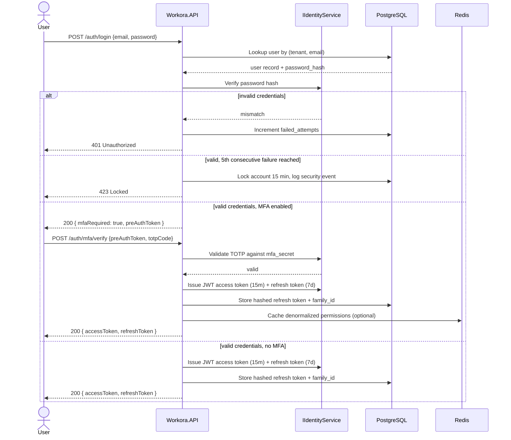
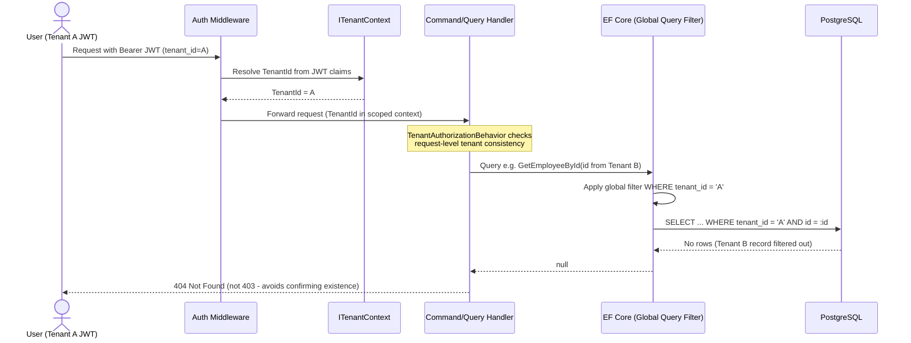
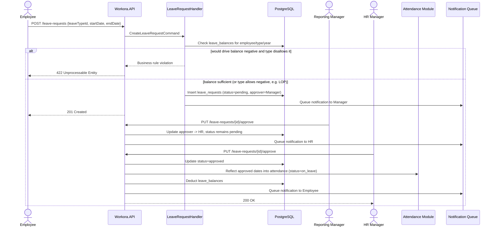
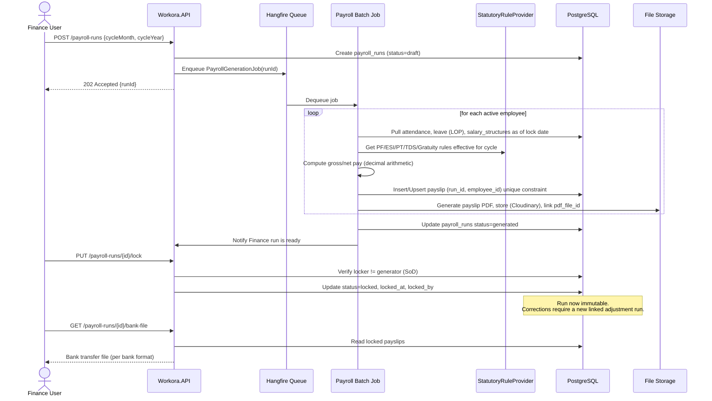
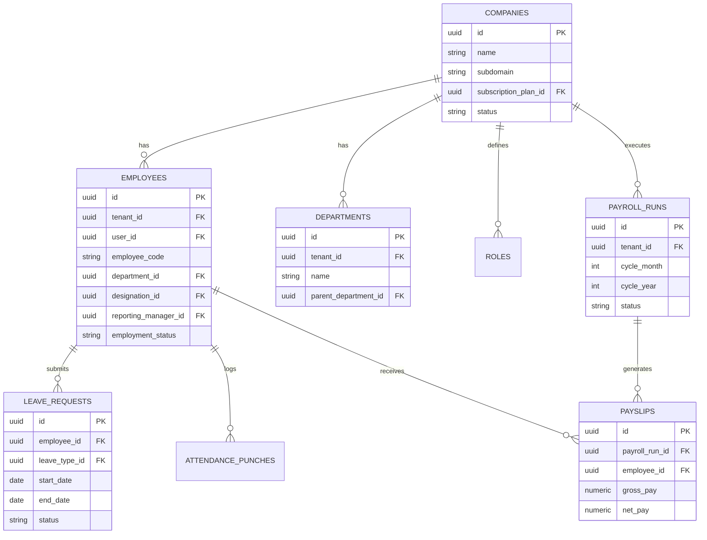

# 01-Architecture

## CleanArchitecture

# Clean Architecture

Workora follows Clean Architecture (Onion/Hexagonal) principles combined with Domain-Driven Design (DDD) and Command Query Responsibility Segregation (CQRS) via MediatR. 

The primary rule of Clean Architecture is that dependencies point inward. The inner layers contain the business rules, while the outer layers contain the implementation details (UI, database, external services).

## Layers Overview

### 1. Domain Layer (`Workora.Domain`)
This is the core of the system. It has **zero external dependencies** (no references to EF Core, ASP.NET, or any infrastructure packages).
- **Entities & Aggregates:** `Employee`, `Department`, `LeaveRequest`, `PayrollRun`, `User`, `Role`.
- **Value Objects:** `Money`, `DateRange`, `EmployeeCode`.
- **Domain Events:** Raised by aggregates and dispatched post-commit (e.g., `LeaveApprovedEvent`).
- **Base Types:** `AuditableEntity` (tracking CreatedBy, UpdatedBy, etc.).

### 2. Application Layer (`Workora.Application`)
Contains the application's use cases and business logic execution. Depends only on the Domain layer.
- **CQRS:** Commands (mutations) and Queries (reads).
- **MediatR:** Used for decoupling request routing. `IRequestHandler` implements the business logic.
- **Pipeline Behaviors:** Global cross-cutting concerns like `LoggingBehavior`, `ValidationBehavior` (FluentValidation), `TenantAuthorizationBehavior`, and `TransactionBehavior`.
- **Abstractions:** Defines interfaces implemented by Infrastructure (`IMediaService`, `IEmailService`, `ITenantContext`).

### 3. Infrastructure Layer (`Workora.Infrastructure`)
Contains concrete implementations for the interfaces defined in the Application layer.
- **Identity:** JWT issuance, ASP.NET Identity integration (`IIdentityService`).
- **External Services:** `IEmailService`, `ISmsService`, `IMediaService` (Cloudinary).
- **Caching:** Redis (`ICacheService`).
- **Statutory Rules:** `IPayrollStatutoryRuleProvider` (PF, ESI, PT, TDS).

### 4. Persistence Layer (`Workora.Persistence`)
Responsible for database interactions using Entity Framework Core.
- **DbContext:** `ApplicationDbContext` with a **Global Query Filter on `TenantId`**.
- **Configurations:** EF Core Fluent API configurations (no data annotations).
- **Repositories:** `IGenericRepository<T>` and specific repositories implementing Domain interfaces.
- **Unit of Work:** `IUnitOfWork` for transactional integrity (`BeginTransactionAsync`, `CommitAsync`).

### 5. API Layer (`Workora.API`)
The entry point of the application. It acts as the Presentation layer.
- **Controllers:** Thin controllers that delegate requests directly to `IMediator.Send`.
- **Middleware:** Global Exception Middleware, Rate Limiting, Correlation ID.
- **Authorization:** Policy-based RBAC (`PermissionAuthorizationHandler`).
- **Documentation:** Swagger/OpenAPI.


## CloudinaryIntegration

# Media & File Storage Architecture (Cloudinary)

## Overview

Workora requires a robust, scalable, and CDN-backed storage solution for handling user-uploaded assets such as profile pictures, company logos, documents (resumes, ID proofs), and other media files. We have chosen **Cloudinary** as the primary storage provider.

By leveraging Clean Architecture principles, the core application will remain agnostic of Cloudinary. We will define abstractions in the Application/Domain layer and implement the concrete logic in the Infrastructure layer.

## Architecture & Layers

### 1. Application Layer (Abstractions)
In the `Workora.Application` project, we define the `IMediaService` (or `IFileStorageService`) interface. This ensures that our command handlers (e.g., `UploadEmployeeDocumentCommandHandler`) do not depend directly on Cloudinary's SDK.

```csharp
namespace Workora.Application.Common.Interfaces;

public interface IMediaService
{
    Task<string> UploadFileAsync(Stream fileStream, string fileName, string contentType, CancellationToken cancellationToken);
    Task<string> UploadImageAsync(Stream fileStream, string fileName, CancellationToken cancellationToken);
    Task<bool> DeleteFileAsync(string fileUrl, CancellationToken cancellationToken);
}
```

### 2. Infrastructure Layer (Implementation)
In the `Workora.Infrastructure` project, we implement `IMediaService` using the official Cloudinary .NET SDK.

```csharp
namespace Workora.Infrastructure.Services;

public class CloudinaryMediaService : IMediaService
{
    private readonly Cloudinary _cloudinary;

    public CloudinaryMediaService(IOptions<CloudinarySettings> config)
    {
        var account = new Account(config.Value.CloudName, config.Value.ApiKey, config.Value.ApiSecret);
        _cloudinary = new Cloudinary(account);
    }

    public async Task<string> UploadImageAsync(Stream fileStream, string fileName, CancellationToken cancellationToken)
    {
        var uploadParams = new ImageUploadParams()
        {
            File = new FileDescription(fileName, fileStream),
            // Apply transformations here if needed (e.g., resize, crop, format)
            Folder = "workora/images" 
        };

        var uploadResult = await _cloudinary.UploadAsync(uploadParams);
        return uploadResult.SecureUrl.ToString();
    }
    
    // ... Implementation for raw files and deletion
}
```

### 3. API Layer
Controllers in `Workora.API` will receive `IFormFile` inputs, read them into a `Stream`, and pass them to MediatR commands, which in turn will utilize the `IMediaService`.

## Cloudinary Configuration

Configuration values are securely injected via `appsettings.json` and Azure Key Vault / Environment Variables in production.

```json
"CloudinarySettings": {
  "CloudName": "YOUR_CLOUD_NAME",
  "ApiKey": "YOUR_API_KEY",
  "ApiSecret": "YOUR_API_SECRET"
}
```

## Security & Tenant Isolation

- **Folder Structure**: Files in Cloudinary should be organized by tenant ID to prevent accidental exposure and to make tenant data cleanup easier. For example: `workora/tenant_{tenantId}/images/{employeeId}_profile.jpg`.
- **Signed URLs**: For highly sensitive documents (e.g., offer letters, payroll slips), Cloudinary signed URLs or private delivery types should be used to restrict unauthorized public access.
- **File Validation**: The API must validate MIME types and file sizes before streaming the file to Cloudinary.


## FolderStructure

# Folder Structure

The Workora backend is organized as a single `.sln` solution containing multiple class libraries, adhering to Clean Architecture principles.

```text
Workora.sln

src/
├── Workora.Domain/            (No external dependencies)
│   ├── Common/                (BaseEntity, AuditableEntity, ValueObjects)
│   ├── Entities/              (Employee, Department, LeaveRequest, etc.)
│   ├── Enums/
│   ├── Events/                (Domain Events like LeaveApprovedEvent)
│   └── Exceptions/            (Domain-specific exceptions)
│
├── Workora.Application/       (Depends on Domain)
│   ├── Common/
│   │   ├── Behaviors/         (MediatR Pipeline Behaviors)
│   │   ├── Exceptions/        (ValidationException, NotFoundException)
│   │   ├── Interfaces/        (IMediaService, IUnitOfWork, etc.)
│   │   └── Models/            (PaginatedResponse, Result<T>)
│   └── Modules/               (Feature slices)
│       ├── Employees/
│       │   ├── Commands/
│       │   ├── Queries/
│       │   └── DTOs/
│       └── Payroll/
│
├── Workora.Infrastructure/    (Depends on Application)
│   ├── Authentication/        (JwtTokenGenerator, IdentityService)
│   ├── Services/              (CloudinaryMediaService, EmailService)
│   └── Caching/               (RedisCacheService)
│
├── Workora.Persistence/       (Depends on Application & Domain)
│   ├── Contexts/              (ApplicationDbContext)
│   ├── Configurations/        (EF Core Fluent API configs)
│   ├── Migrations/
│   └── Repositories/          (GenericRepository, EmployeeRepository)
│
└── Workora.API/               (Depends on all, composed via DI)
    ├── Controllers/           (v1/EmployeesController, etc.)
    ├── Middleware/            (ExceptionMiddleware, TenantMiddleware)
    ├── Extensions/            (ServiceCollectionExtensions)
    └── Program.cs

tests/
├── Workora.UnitTests/         (xUnit, Moq for Application & Domain)
└── Workora.IntegrationTests/  (API endpoints, DB interactions, Auth flows)
```

## Dependency Direction

- **API** depends on Application, Infrastructure, Persistence.
- **Infrastructure** depends on Application.
- **Persistence** depends on Application and Domain.
- **Application** depends on Domain.
- **Domain** depends on *nothing*.


## ProjectFlow

# Project Flow (CQRS & MediatR)

Workora utilizes **CQRS (Command Query Responsibility Segregation)** pattern orchestrated by **MediatR**. This separates read operations (Queries) from write/mutation operations (Commands).

## The Request Lifecycle

When a client makes an HTTP request to the API, it follows a strict pipeline to ensure security, tenant isolation, validation, and execution.

### 1. API Layer (Controller)
- Receives the incoming HTTP request.
- Handles routing and basic model binding.
- Delegates the request payload to MediatR via `await _mediator.Send(command)`.
- **Rule:** Controllers must be thin; they contain zero business logic.

### 2. MediatR Pipeline Behaviors (Application Layer)
Before reaching the actual handler, the request passes through a series of behaviors (middlewares for MediatR):
1. **LoggingBehavior**: Logs the incoming request details, user, and tenant.
2. **ValidationBehavior**: Uses FluentValidation to validate the DTO/Command. If validation fails, it throws a `ValidationException` which the Global Exception Middleware catches and converts to a `400 Bad Request`.
3. **TenantAuthorizationBehavior**: Resolves the `TenantId` from the current context and ensures the user has access.
4. **TransactionBehavior**: For Commands only, wraps the execution in a database transaction (`IUnitOfWork.BeginTransactionAsync`).

### 3. Command/Query Handler (Application Layer)
- **Commands**: 
  - Fetch aggregates using a repository.
  - Execute business logic methods on the Domain Aggregate Root.
  - Call `IUnitOfWork.SaveChangesAsync()`.
  - Raise any Domain Events.
- **Queries**: 
  - Fetch data directly via Repositories or Dapper.
  - Map entities to DTOs using AutoMapper.
  - Return the payload.

### 4. Persistence Layer (EF Core)
- The `DbContext` intercepts `SaveChanges`.
- Automatically populates `AuditableEntity` fields (`CreatedBy`, `UpdatedDate`).
- **Global Query Filter** automatically appends `WHERE TenantId = @tenantId` to ensure cross-tenant data leaks are impossible at the database query level.

## Example Flow: Update Employee

```mermaid
flowchart TD
    Client["Client (Angular/Mobile)"] -->|PUT /api/v1/employees/123| API["EmployeesController"]
    API -->|Send(UpdateEmployeeCommand)| Pipeline["MediatR Pipeline"]
    Pipeline -->|Validation| Val["ValidationBehavior"]
    Pipeline -->|Transaction| Tx["TransactionBehavior"]
    Tx --> Handler["UpdateEmployeeCommandHandler"]
    Handler -->|GetByIdAsync(123)| Repo["EmployeeRepository"]
    Handler -->|UpdateDetails(...)| Domain["Employee (Aggregate Root)"]
    Handler -->|SaveChangesAsync| UoW["IUnitOfWork / DbContext"]
    UoW -->|Commit| DB[(PostgreSQL)]
    DB --> UoW
    UoW --> Handler
    Handler --> Tx
    Tx --> API
    API -->|200 OK| Client
```


## SequenceDiagram

# Sequence Diagrams

This document illustrates the execution flow of the most critical processes in the Workora platform.

## 1. Login with MFA & Token Issuance



## 2. Tenant Isolation Enforcement (Defense-in-Depth)



## 3. Leave Request Approval Workflow



## 4. Payroll Run Generation & Locking




# 02-Requirements

## BusinessRules

# Business Rules & Domain Logic

This document defines specific rules that must be enforced within the Domain and Application layers of the Workora platform.

## 1. Tenant Isolation
- **Rule:** A user belonging to `Tenant A` can never access, read, update, or delete records belonging to `Tenant B`.
- **Enforcement:** Enforced globally via EF Core `HasQueryFilter(e => e.TenantId == _tenantContext.TenantId)`. This applies to every table except platform-level administration tables.

## 2. Payroll Immutability
- **Rule:** Once a payroll run is transitioned to the `Locked` state, it cannot be modified or deleted by any user, including Company Admins.
- **Enforcement:** The `PayrollRun` entity throws a `DomainException` if a modification is attempted on a locked run.
- **Correction Protocol:** Any corrections required after a lock must be handled via a distinct **Adjustment Run** linked to the original run.

## 3. Separation of Duties (SoD) in Payroll
- **Rule:** The user who generated the payroll run (`GeneratedBy`) cannot be the same user who locks the payroll run (`LockedBy`).
- **Enforcement:** Handled in the `LockPayrollCommand` validation pipeline.

## 4. Leave Balance Validation
- **Rule:** A leave request cannot be submitted if it drives the employee's balance for that leave type below zero.
- **Exception:** Leave types configured with `AllowNegativeBalance = true` (e.g., Loss of Pay / LOP).
- **Enforcement:** `CreateLeaveRequestCommand` performs a balance check inside a serializable transaction block before inserting the request.

## 5. Attendance & Leave Interoperability
- **Rule:** If an employee has an `Approved` leave request for a specific date, the Attendance engine must automatically mark that date's attendance status as `On Leave` during the nightly reconciliation job.
- **Enforcement:** Triggered via the `LeaveApprovedEvent` domain event.

## 6. Audit Immutability
- **Rule:** Records in the `AuditLogs` table are append-only. They cannot be updated or deleted via the application API.
- **Enforcement:** The application lacks any EF Core configurations or repository methods to update or delete `AuditLog` entities.

## 7. Soft Deletion
- **Rule:** Critical business records (Employees, Departments, Salary Structures) are never hard-deleted from the database.
- **Enforcement:** Deleting a record sets `IsDeleted = true`, `DeletedBy = userId`, and `DeletedDate = utcNow`. A global query filter hides these records from standard queries.


## FunctionalRequirements

# Functional Requirements (FR)

This document outlines the core functional requirements for the Workora platform, grouped by module.

## FR-AUTH: Authentication & Identity
- **FR-AUTH-1**: Authenticate via email + password; short-lived JWT access token (15 min) + rotating refresh token (7 days, sliding).
- **FR-AUTH-2**: Optional TOTP-based MFA per user, enforceable per role by Company Admin policy.
- **FR-AUTH-3**: Lock account 15 minutes after 5 consecutive failed logins; log as security event.
- **FR-AUTH-4**: Forgot-password issues single-use, time-boxed (30 min) reset token via email.
- **FR-AUTH-5**: Tokens are tenant-scoped: a JWT for Tenant A must be rejected on Tenant B resources, enforced at middleware.
- **FR-AUTH-6**: Refresh tokens are single-use, rotated on every refresh; reuse of a revoked token revokes the entire token family.

## FR-ORG: Organization Management
- **FR-ORG-1**: Company Admin defines Branches, Departments, Designations, Cost Centers, Shifts, Holiday Calendars, scoped to tenant.
- **FR-ORG-2**: Departments/Designations support hierarchical (parent/child) structures.
- **FR-ORG-3**: Shifts support fixed, rotational, flexible types with grace-period and overtime threshold parameters.

## FR-EMP: Employee Management
- **FR-EMP-1**: Versioned employee profile (personal, contact, address, emergency contact, family, education, experience, skills, bank, identity documents).
- **FR-EMP-2**: Sensitive identity fields (Aadhaar, PAN, bank account) encrypted at rest, masked in API responses unless `Employee.ViewSensitive` is held.
- **FR-EMP-3**: Employment lifecycle events (Joining, Confirmation, Promotion, Transfer, Exit) as an immutable, timestamped event log.
- **FR-EMP-4**: Exit triggers configurable offboarding workflow.

## FR-ATT: Attendance
- **FR-ATT-1**: Check-In/Check-Out with timestamp, source (web/mobile/biometric), geo-coordinates.
- **FR-ATT-2**: Daily attendance status (Present, Absent, Half Day, Late, Early Exit, On Leave, Holiday, Week Off) via rules engine.
- **FR-ATT-3**: Manual correction requires a reason code and approval workflow; original punches retained.
- **FR-ATT-4**: Overtime auto-computed when check-out exceeds shift end + configurable threshold.
- **FR-ATT-5**: Biometric integration via idempotent internal ingestion API.

## FR-LVE: Leave Management
- **FR-LVE-1**: Configurable leave types per tenant (Casual, Sick, Earned, Maternity, LOP).
- **FR-LVE-2**: Leave balance via accrual engine.
- **FR-LVE-3**: Multi-level approval workflow (default: Reporting Manager → HR).
- **FR-LVE-4**: Approved leave automatically reflects in Attendance.
- **FR-LVE-5**: Prevent submission driving balance negative unless leave type allows it (e.g., LOP).

## FR-PAY: Payroll
- **FR-PAY-1**: Configurable salary structures (Basic, HRA, Allowances, Deductions).
- **FR-PAY-2**: Payroll generation as a batch process producing a run per tenant per cycle.
- **FR-PAY-3**: Locked runs are immutable; corrections require a linked adjustment run.
- **FR-PAY-4**: Statutory deductions (PF, ESI, PT, TDS) versioned.
- **FR-PAY-5**: Bank transfer file generation per supported formats; PDF payslips.

## FR-ADM: Settings & Platform Administration
- **FR-ADM-1**: Roles/Permissions managed via a permission-matrix UI backed by RBAC engine.
- **FR-ADM-2**: Super Admin manages tenant subscriptions, plan-based feature toggles, billing status.
- **FR-ADM-3**: All configuration changes captured in audit log with before/after values.


## NonFunctionalRequirements

# Non-Functional Requirements (NFR)

## Performance & Scalability (`NFR-PERF`)
- **P95 Response Time:** API response time must be `< 2s` for standard CRUD and read operations under nominal load.
- **Concurrency:** The platform must support `≥ 1,000` concurrent active users per deployment.
- **Database Scalability:** The attendance table must sustain `≥ 1,000,000` records with sub-second indexed query performance.
- **Batch Processing:** A payroll batch run for a 1,000-employee tenant must complete within `10 minutes`.
- **Stateless Tier:** API tier must be horizontally scalable. Session and rate limit state stored in Redis.

## Security & Compliance (`NFR-SEC`)
- **Authentication:** JWT access tokens (15-min TTL) combined with rotating, opaque refresh tokens.
- **MFA:** Optional Time-Based One-Time Password (TOTP) MFA support, enforceable per tenant policy.
- **Cryptography:** Passwords hashed with `Argon2id` or ASP.NET Identity PBKDF2 (V3).
- **Data at Rest:** Sensitive PII columns (PAN, Aadhaar, Bank Details) must be encrypted at rest in PostgreSQL.
- **Data in Transit:** TLS 1.2+ mandatory for all internal and external communication.
- **Rate Limiting:** API requests must be rate-limited per tenant and per user IP.

## Availability & Reliability (`NFR-AVAIL`)
- **Uptime Target:** 99.9% availability (approximately 8.7 hours downtime per year).
- **Disaster Recovery:** Continuous WAL archiving to blob storage + daily full logical backups, with a minimum 30-day retention policy.
- **Idempotency:** Payroll generation and financial mutations must be idempotent and fully transactional. If a failure occurs mid-transaction, the system must safely rollback.

## Maintainability & Architecture (`NFR-MAINT`)
- **Clean Architecture:** Strict boundary enforcement. Domain layer has no dependencies. No business logic in controllers.
- **Test Coverage:** Minimum `70%` unit test coverage on Application-layer command/query handlers and Domain models.
- **Audit Logging:** All mutating endpoints (`POST`, `PUT`, `DELETE`, `PATCH`) must write to an append-only audit store containing actor, timestamp, action, and JSON diff payload.

## Localization & Accessibility (`NFR-LOC`)
- **Multi-tenant Configurations:** Timezone and base currency are configured at the tenant level.
- **i18n:** Notification templates and UI must support multi-language string interpolation keys.
- **Accessibility:** UI components for employee self-service must target WCAG 2.1 AA compliance.


## UserStories

# User Stories & Personas

Workora uses a strict Role-Based Access Control (RBAC) model. Below are the primary personas and their core user stories.

## Personas

1. **Super Admin**: Platform operator managing the SaaS infrastructure. Operates outside of tenant isolation.
2. **Company Admin**: Highest authority within a single Tenant organization.
3. **HR Manager**: Manages employee lifecycles, recruitment, and organizational structure within a tenant.
4. **Finance**: Manages payroll, expenses, and statutory compliance within a tenant.
5. **Reporting Manager**: Middle management; accesses data for direct/indirect reports only.
6. **Employee**: Self-service user. Can only view and mutate their own data.

---

## User Stories

### Super Admin
- As a Super Admin, I want to onboard new tenant organizations, so they can start using the platform.
- As a Super Admin, I want to suspend a tenant's subscription, locking them into a read-only state without deleting their data.
- As a Super Admin, I want to manage feature toggles based on tenant pricing plans.

### Company Admin
- As a Company Admin, I want to configure the RBAC permission matrix for custom roles in my organization.
- As a Company Admin, I want to define branch locations, departments, and holiday calendars.
- As a Company Admin, I want to enforce MFA policies globally across my tenant.

### HR Manager
- As an HR Manager, I want to add new employees and define their salary structures, shifts, and reporting managers.
- As an HR Manager, I want to view the attendance anomaly report to correct punches for employees who forgot to check out.
- As an HR Manager, I want to process offboarding workflows to revoke access and trigger full-and-final settlements.

### Finance / Payroll Admin
- As a Finance user, I want to generate a monthly payroll batch run so that salaries are calculated automatically based on attendance and leave data.
- As a Finance user, I want to lock a verified payroll run so that the data becomes immutable and cannot be tampered with.
- As a Finance user, I want to generate a bank transfer file in the ICICI/HDFC corporate format to disburse salaries in bulk.

### Reporting Manager
- As a Reporting Manager, I want to receive notifications when my direct reports apply for leave, so I can approve or reject them.
- As a Reporting Manager, I want to view the attendance summary of my team to monitor punctuality.
- As a Reporting Manager, I want to submit performance appraisal reviews for my team members.

### Employee
- As an Employee, I want to check-in and check-out via the web portal or biometric device to log my daily hours.
- As an Employee, I want to view my available leave balances and apply for time off.
- As an Employee, I want to download my monthly PDF payslips.
- As an Employee, I want to upload expense receipts for reimbursement.


# 03-Database

## DatabaseDesign

# Database Design & Architecture

Workora utilizes **PostgreSQL 16+** as its primary relational database store, managed via Entity Framework (EF) Core 9.

## Multi-Tenancy Strategy
The database implements a **Shared-Database, Shared-Schema** multi-tenancy model. 
- All tenant data co-exists within the same tables.
- Isolation is achieved via a mandatory `TenantId` (UUID) column on every tenant-scoped table.
- At the EF Core level, a **Global Query Filter** automatically appends `WHERE TenantId = @currentTenantId` to all LINQ queries, preventing cross-tenant data leakage.

## Primary Keys
- **Surrogate Keys**: All primary keys are `UUID` (GUIDs in C#).
- **Generation**: Generated on the client/application side using `Guid.NewGuid()`, or database-side using `gen_random_uuid()` as the default value. This prevents sequential-ID enumeration attacks and simplifies distributed data insertion.

## Audit Columns
Every entity inherits from `AuditableEntity` and generates the following columns in the database:
- `CreatedBy` (UUID)
- `CreatedDate` (Timestamp with Timezone)
- `UpdatedBy` (UUID, nullable)
- `UpdatedDate` (Timestamp with Timezone, nullable)
- `DeletedBy` (UUID, nullable)
- `DeletedDate` (Timestamp with Timezone, nullable)
- `IsDeleted` (Boolean)

## Table Categories

### 1. Platform & Tenancy (Cross-Tenant)
These tables manage the SaaS infrastructure and do *not* contain a `TenantId`.
- `Companies`: The root tenant record.
- `SubscriptionPlans`: Pricing plans and feature limits.
- `SuperAdmins`: Platform-level operators.

### 2. Tenant Data (Isolated)
These tables carry the `TenantId` column and foreign key back to the `Companies` table.
- `Employees`, `Departments`, `Designations`, `Shifts`
- `LeaveRequests`, `LeaveBalances`
- `AttendancePunches`, `AttendanceDaily`
- `PayrollRuns`, `Payslips`, `SalaryStructures`
- `Roles`, `Permissions`, `Users`

### 3. Append-Only Stores
- `AuditLogs`: Records JSON snapshots (before/after states) for every mutating operation on business entities. Append-only, never updated or deleted.

## Data Types (PostgreSQL)
- **Monetary values**: `numeric(18,2)` mapped to C# `decimal`.
- **Strings**: `varchar` with defined maximum lengths.
- **JSON**: `jsonb` used for dynamic audit payloads and external webhook payloads.
- **Dates**: `date` for birth dates/joining dates. `timestamptz` for accurate auditing points.


## ERDiagram

# Entity-Relationship (ER) Diagram

This diagram visualizes the core relationships between the primary aggregates in the Workora database schema. 
*(Note: Audit columns and some lookup tables are omitted for clarity)*




## MigrationGuide

# EF Core Migration Guide

Workora uses Entity Framework (EF) Core Code-First migrations. Because of the Clean Architecture structure, the DbContext resides in `Workora.Persistence`, but the startup project is `Workora.API`.

## Prerequisites

Ensure you have the EF Core CLI tools installed:
```bash
dotnet tool install --global dotnet-ef
```

## Adding a New Migration

When you alter a domain entity or an EF Core Fluent API configuration, you must generate a new migration.

Execute this command from the **root of the solution**:

```bash
dotnet ef migrations add <MigrationName> --project src/Workora.Persistence --startup-project src/Workora.API
```
*Example: `dotnet ef migrations add AddLeaveBalancesTable --project src/Workora.Persistence --startup-project src/Workora.API`*

## Updating the Database (Development)

To apply pending migrations to your local PostgreSQL database:

```bash
dotnet ef database update --project src/Workora.Persistence --startup-project src/Workora.API
```

## Removing the Last Migration

If you made a mistake and haven't pushed the migration or applied it to the database, you can remove it:

```bash
dotnet ef migrations remove --project src/Workora.Persistence --startup-project src/Workora.API
```

## Generating SQL Scripts for Production

Production databases should **never** be updated using `dotnet ef database update`. Instead, generate an idempotent SQL script and execute it via your CI/CD pipeline or a tool like Flyway/DbUp.

```bash
dotnet ef migrations script -i -o scripts/migration_script.sql --project src/Workora.Persistence --startup-project src/Workora.API
```
*(The `-i` flag ensures the script is idempotent, meaning it checks if the migration was already applied before executing).*

## Handling Multi-Tenancy in Migrations

Since the application uses a shared-database approach, standard EF migrations work perfectly. However, if you are performing **Data Migrations** (e.g., seeding default Leave Types for all existing tenants), you must write raw SQL inside the `Up()` method of the migration to iterate over all `TenantIds` in the `Companies` table.


## NamingConvention

# Naming Conventions

Consistent naming is critical for maintainability across the C# codebase and the PostgreSQL database.

## C# Code Conventions

1. **Interfaces**: Prefix with `I` (e.g., `IEmployeeRepository`).
2. **Classes / Structs / Records**: PascalCase (e.g., `LeaveRequest`, `CreateEmployeeCommand`).
3. **Properties**: PascalCase (e.g., `FirstName`, `TenantId`).
4. **Private Fields**: camelCase prefixed with an underscore (e.g., `_employeeRepository`, `_tenantId`).
5. **Method Parameters & Local Variables**: camelCase (e.g., `employeeId`, `startDate`).
6. **Constants**: PascalCase (e.g., `DefaultPageSize`). *Note: Do not use ALL_CAPS in C#.*
7. **Asynchronous Methods**: Suffix with `Async` (e.g., `GetEmployeeByIdAsync`).

## Database Conventions (PostgreSQL)

Entity Framework Core should be configured (via conventions or interceptors like EFCore.NamingConventions) to map C# PascalCase objects to PostgreSQL standard `snake_case`.

1. **Tables**: plural, `snake_case` (e.g., `employees`, `leave_requests`, `payroll_runs`).
2. **Columns**: singular, `snake_case` (e.g., `first_name`, `tenant_id`, `created_date`).
3. **Primary Keys**: Always named `id` (maps from C# `Id`).
4. **Foreign Keys**: Suffixed with `_id` (e.g., `department_id`).
5. **Indexes**: Prefix with `ix_`, followed by table name, followed by column name(s) (e.g., `ix_employees_tenant_id`).
6. **Foreign Key Constraints**: Prefix with `fk_` (e.g., `fk_employees_departments_department_id`).

## Architecture Specifics

- **Commands**: Suffix with `Command` (e.g., `ApproveLeaveCommand`).
- **Command Handlers**: Suffix with `CommandHandler` (e.g., `ApproveLeaveCommandHandler`).
- **Queries**: Suffix with `Query` (e.g., `GetEmployeeDetailsQuery`).
- **Query Handlers**: Suffix with `QueryHandler` (e.g., `GetEmployeeDetailsQueryHandler`).
- **DTOs**: No suffix is strictly required, but `Dto` can be used for clarity (e.g., `EmployeeDetailsDto`). Alternatively, use `Response` (e.g., `EmployeeResponse`).


# 04-API

## Endpoints

# API Endpoints & Conventions

All endpoints in Workora follow strict RESTful conventions. 

## Base URL
All API routes are versioned. The base URL structure is:
`https://api.workora.io/api/v1/{module}`

## HTTP Methods
- `GET`: Retrieve a resource or a list of resources.
- `POST`: Create a new resource or execute an operation (e.g., login).
- `PUT`: Fully replace/update an existing resource.
- `PATCH`: Partially update an existing resource (used sparingly).
- `DELETE`: Soft-delete a resource.

## Standardized Response Envelope

To simplify frontend parsing and error handling, **every** response is wrapped in a standard JSON envelope.

### Success Response (200 OK, 201 Created)
```json
{
  "success": true,
  "message": "Resource created successfully",
  "data": {
    "id": "e3b0c442-98fc-1c14-9afb-f4c8996fb924",
    "name": "Software Engineer"
  }
}
```

### Error Response (400 Bad Request, 404 Not Found, etc.)
```json
{
  "success": false,
  "message": "Validation Failed",
  "errors": [
    "The FirstName field is required.",
    "Email format is invalid."
  ]
}
```

## Pagination, Sorting, and Filtering

List endpoints accept standard query parameters mapped to a `PagedRequest` object:
- `page`: The page number (default 1).
- `pageSize`: The number of items per page (default 10).
- `sortBy`: The column name to sort by (e.g., `createdDate`).
- `sortDir`: Direction (`asc` or `desc`).

### Paginated Response Payload
```json
{
  "success": true,
  "message": "Success",
  "data": {
    "items": [...],
    "page": 1,
    "pageSize": 10,
    "totalPages": 5,
    "totalRecords": 45
  }
}
```

## Standard HTTP Status Codes
- `200 OK`: Successful read/update/delete.
- `201 Created`: Resource successfully created.
- `202 Accepted`: Asynchronous operation queued (e.g., payroll generation).
- `204 No Content`: Successful operation with no return payload.
- `400 Bad Request`: Validation failure or malformed request.
- `401 Unauthorized`: Missing, invalid, or expired JWT.
- `403 Forbidden`: Authenticated, but lacks the necessary RBAC permission.
- `404 Not Found`: Resource does not exist (or belongs to another tenant).
- `409 Conflict`: Business rule violation or token reuse detected.
- `422 Unprocessable Entity`: Semantic error.
- `423 Locked`: Resource or account is locked.
- `429 Too Many Requests`: Rate limit exceeded.
- `500 Internal Server Error`: Unhandled exception.


## MediaEndpoints

# Media & File Upload API Specifications

This document defines the REST API endpoints used for uploading and managing files (images, documents) via Cloudinary in the Workora platform.

## Overview

All file uploads are handled through `multipart/form-data` requests. The API acts as a secure intermediary between the client and Cloudinary, ensuring that files are validated, virus-scanned (if applicable), and stored with the correct tenant context.

---

## 1. Upload Employee Profile Picture

Uploads a profile picture for a specific employee and updates their database record with the new Cloudinary URL.

- **Endpoint**: `POST /api/v1/employees/{employeeId}/profile-picture`
- **Authentication**: Bearer Token required
- **RBAC**: `HRManager`, `CompanyAdmin`, or `Employee` (if updating own profile)
- **Content-Type**: `multipart/form-data`

### Request Payload

| Field | Type | Required | Description |
|---|---|---|---|
| `file` | `IFormFile` (binary) | Yes | The image file (JPEG, PNG, WebP). Max size: 5MB. |

### Response (200 OK)

```json
{
  "success": true,
  "message": "Profile picture updated successfully.",
  "data": {
    "employeeId": "e3b0c44298fc1c149afbf4c8996fb924",
    "profilePictureUrl": "https://res.cloudinary.com/your-cloud/image/upload/v123456/workora/tenant_1/images/emp_e3b0_profile.jpg"
  }
}
```

### Error Responses

- **400 Bad Request**: Invalid file type or file size exceeds limit.
- **404 Not Found**: Employee ID does not exist.

---

## 2. Upload Organization Document (e.g. Policies, ID Proofs)

Uploads a raw document (PDF, DOCX) to Cloudinary and registers the document metadata in the Workora database.

- **Endpoint**: `POST /api/v1/documents`
- **Authentication**: Bearer Token required
- **RBAC**: `HRManager`, `CompanyAdmin`
- **Content-Type**: `multipart/form-data`

### Request Payload

| Field | Type | Required | Description |
|---|---|---|---|
| `file` | `IFormFile` (binary) | Yes | The document file. Max size: 20MB. |
| `documentType` | `string` | Yes | Type of document (e.g., `Policy`, `IDProof`, `Contract`) |
| `relatedEntityId` | `Guid` | Optional | ID of the employee/department this document relates to. |

### Response (201 Created)

```json
{
  "success": true,
  "message": "Document uploaded successfully.",
  "data": {
    "documentId": "d74g8c44298fc1c149afbf4c8996f332",
    "documentUrl": "https://res.cloudinary.com/your-cloud/raw/upload/v123456/workora/tenant_1/docs/policy.pdf",
    "uploadedAt": "2026-07-01T12:00:00Z"
  }
}
```

---

## 3. Delete Media/File

Deletes a previously uploaded file from both Cloudinary and the local database tracking record.

- **Endpoint**: `DELETE /api/v1/documents/{documentId}`
- **Authentication**: Bearer Token required
- **RBAC**: `CompanyAdmin`, `HRManager`

### Response (204 No Content)
*(No body returned on successful deletion)*

### Error Responses
- **404 Not Found**: Document not found.
- **403 Forbidden**: User does not have permission to delete this document.

---

## Best Practices & Client Implementation

1. **Direct Uploads (Optional Future Phase)**: For very large files, consider issuing pre-signed Cloudinary upload URLs to the client to bypass the backend and reduce server load, then have a backend webhook listen for completion. Currently, all uploads pass through the backend for strict validation.
2. **File Size Limits**: Max 5MB for images, 20MB for general documents.
3. **Supported Formats**:
   - Images: `.jpg`, `.jpeg`, `.png`, `.webp`
   - Documents: `.pdf`, `.doc`, `.docx`, `.xls`, `.xlsx`, `.csv`


## Swagger

# Swagger & OpenAPI Configuration

Workora uses Swagger (Swashbuckle.AspNetCore) to generate interactive API documentation based on OpenAPI 3.0 specifications.

## Accessing Swagger
In the Development environment, the Swagger UI is available at:
`https://localhost:<port>/swagger`

> [!WARNING]
> Swagger UI is intentionally disabled in Production environments for security reasons.

## Authentication in Swagger
Because the API requires JWT authentication, you must provide a valid token to test the endpoints.

1. Generate a token via the `POST /api/v1/auth/login` endpoint in the UI.
2. Copy the `accessToken` from the response.
3. Scroll to the top of the Swagger UI page and click the **Authorize** button.
4. Enter `Bearer <your_token_here>` (Note the space after the word "Bearer").
5. Click **Authorize**.

All subsequent requests made via the "Try it out" button will automatically inject the `Authorization: Bearer ...` header.

## Generating OpenAPI Specifications
For frontend contract-first development (e.g., generating Angular services using tools like `openapi-generator`), you can fetch the raw JSON specification:
`https://localhost:<port>/swagger/v1/swagger.json`


# 05-Authentication

## JwtImplementation

# JWT Implementation

Workora uses JSON Web Tokens (JWT) for stateless, scalable authentication. 

## Token Lifecycle
- **Access Token TTL**: 15 minutes.
- **Algorithm**: `HS256` (HMAC with SHA-256).

## JWT Payload (Claims)
The access token payload is kept minimal to reduce bandwidth, but contains enough denormalized data to avoid hitting the database for authorization checks.

```json
{
  "sub": "e3b0c442-98fc-1c14-9afb-f4c8996fb924", // The UserId
  "email": "user@company.com",
  "tenant_id": "a1b2c3d4-...",                 // The TenantId (crucial for data isolation)
  "role": "HR Manager",                        // The primary role
  "permissions": [                             // Array of strings
    "Employee.View",
    "Employee.Create",
    "Leave.Approve"
  ],
  "jti": "unique-token-id",                    // JWT ID for tracking/revocation
  "exp": 1735689600,                           // Expiration timestamp
  "iss": "WorkoraAPI",
  "aud": "WorkoraClient"
}
```

## Security Considerations
1. **Never store sensitive data**: PII (like Aadhaar/PAN) or passwords are never embedded in the JWT.
2. **Permission Updates**: If a Company Admin changes a user's permissions in the database, the change will not take effect until the access token expires (max 15 mins) and the client fetches a new access token using their refresh token.
3. **Validation**: The ASP.NET Core Authentication Middleware validates the signature, issuer, audience, and expiration strictly before allowing the request into the MVC pipeline.


## RefreshToken

# Refresh Token Mechanism

Because JWT Access Tokens in Workora have a very short lifespan (15 minutes), a **Refresh Token** mechanism is required to maintain user sessions without forcing them to re-enter their credentials.

## Storage and Delivery
- The refresh token is an opaque string (e.g., a securely generated random 64-byte string).
- It is stored in the database in the `RefreshTokens` table.
- **Security Rule**: The actual refresh token string is *never* stored in plaintext in the database. It is stored as a one-way hash (e.g., SHA-256). The API hashes the incoming token and compares it to the database record.

## Rotation Strategy
Workora uses **Refresh Token Rotation**. 
1. When a client uses `RefreshToken_A` to get a new access token, `RefreshToken_A` is immediately revoked in the database.
2. The server issues a new access token AND a new `RefreshToken_B`.
3. The client must replace `RefreshToken_A` with `RefreshToken_B` in its local storage/HTTP-only cookie.

## Reuse Detection (FR-AUTH-6)
Refresh Token Rotation is vulnerable if a token is stolen, as the attacker could use it to generate a new valid session. To mitigate this, Workora uses **Family Revocation**:
- Every time a refresh token is issued as part of a rotation, it shares the same `FamilyId` as its predecessor.
- If the server receives a request to refresh using a token that is *already revoked* (e.g., `RefreshToken_A` is used again), the server assumes a token theft has occurred.
- The server immediately revokes **all tokens** associated with that `FamilyId`.
- Both the legitimate user and the attacker are logged out and must re-authenticate with their password.


# 06-Authorization

## RBAC

# Role-Based Access Control (RBAC)

Workora implements a strict, policy-based RBAC model. Users are assigned Roles, and Roles contain specific Permissions.

## Permission Naming Convention
Permissions are formatted as `<Module>.<Action>`.
Examples:
- `Employee.View`
- `Employee.Create`
- `Employee.ViewSensitive` (required to view decrypted Aadhaar/PAN)
- `Payroll.Lock`

## Implementation Details
1. **Denormalization in JWT**: During login, the `IIdentityService` fetches all permissions associated with the user's role and embeds them as a JSON array in the `permissions` claim of the JWT.
2. **Policy-Based Authorization**: ASP.NET Core controllers use the standard `[Authorize]` attribute specifying a policy.
   ```csharp
   [Authorize(Policy = "Employee.Update")]
   [HttpPut("{id}")]
   public async Task<IActionResult> UpdateEmployee(...)
   ```
3. **Custom Handler**: A custom `PermissionAuthorizationHandler` inspects the incoming JWT's `permissions` claim. If the requested policy string exists in the array, access is granted.

## Advantages
- Extremely fast authorization (no database lookup required on every API hit).
- The API tier doesn't need to know which Role is allowed to do what; it only cares about Permissions. This allows Company Admins to define highly customized roles for their tenant without requiring code changes.


## TenantIsolation

# Tenant Isolation (Defense-in-Depth)

Workora is a multi-tenant SaaS application operating on a shared-database, shared-schema model. Ensuring that one tenant cannot access another tenant's data is the highest security priority.

We implement **Defense-in-Depth** to guarantee tenant isolation.

## 1. Request Level (JWT)
The `TenantId` is embedded directly into the user's JWT at login. A user cannot switch tenants by simply changing a URL parameter or a request header. 

When a request arrives, the `ITenantContext` (a Scoped dependency injection service) extracts the `TenantId` from the JWT claims.

## 2. Application Level (MediatR Behaviors)
The `TenantAuthorizationBehavior` sits in the MediatR pipeline. If a command (e.g., `UpdateEmployeeCommand`) contains a resource ID, the application layer *could* perform a quick cache lookup to verify the resource actually belongs to `ctx.TenantId`.

## 3. Database Level (Global Query Filters)
This is the ultimate failsafe. In `ApplicationDbContext`, we apply an EF Core Global Query Filter to every entity that implements `IMustHaveTenant`.

```csharp
protected override void OnModelCreating(ModelBuilder builder)
{
    base.OnModelCreating(builder);
    
    // ...
    
    builder.Entity<Employee>().HasQueryFilter(e => e.TenantId == _tenantContext.TenantId);
    builder.Entity<LeaveRequest>().HasQueryFilter(e => e.TenantId == _tenantContext.TenantId);
}
```

**How it works:**
If a developer writes a bug in `GetEmployeeByIdQueryHandler`:
`await _context.Employees.FirstOrDefaultAsync(e => e.Id == request.EmployeeId);`
*(Notice they forgot to check the TenantId)*

The Global Query Filter automatically rewrites the SQL sent to PostgreSQL:
`SELECT * FROM employees WHERE id = @id AND tenant_id = @tenant_id;`

If the Employee ID belongs to Tenant B, but the user is Tenant A, EF Core returns `null`. The handler then returns a `404 Not Found`, ensuring the user doesn't even know the record exists in another tenant.


# 07-Deployment

## Docker

# Docker & Local Development Setup

To ensure environmental parity and easy onboarding, Workora provides a `docker-compose.yml` file for local development.

## Docker Compose Services

The `docker-compose.yml` spins up the following supporting infrastructure:
1. **PostgreSQL**: The primary relational database (Port `5432`).
2. **Redis**: Used for distributed caching, session state, and Hangfire background queues (Port `6379`).
3. **Mailpit / MailHog**: A local SMTP testing server to catch outbound notification emails without actually sending them to real users. UI available on port `8025`.

## Running Local Infrastructure

From the root of the repository:

```bash
cd docker
docker-compose up -d
```

## Dockerizing the API

While you typically run the API via Visual Studio or `dotnet run` during active development, you can containerize the API itself for staging tests.

The `Dockerfile` located in `src/Workora.API` utilizes multi-stage builds:
1. **Build Stage**: Uses the heavy .NET 9 SDK image to restore packages and publish the release DLLs.
2. **Runtime Stage**: Uses the lightweight .NET 9 ASP.NET runtime Alpine image to run the app, significantly reducing the final image size and attack surface.

```bash
docker build -t workora-api:latest -f src/Workora.API/Dockerfile .
```


## Kubernetes

# Kubernetes Production Deployment

Workora is designed to run in orchestrated container environments like Kubernetes (Amazon EKS, Azure AKS).

## Architecture

The deployment consists of two primary scalable workloads:
1. **API Tier (Web)**: Serves incoming HTTP traffic.
2. **Worker Tier (Background)**: Runs Hangfire/Quartz background jobs (e.g., payroll generation, email dispatch).

### 1. API Deployment
- **Horizontal Pod Autoscaling (HPA)**: The API Deployment scales based on CPU utilization (target 70%) and incoming request rates.
- **Liveness/Readiness Probes**: Configured to hit `/health/live` and `/health/ready`. Traffic is only routed to pods where the database and Redis are confirmed reachable.
- **Ingress**: An Ingress Controller (e.g., NGINX) handles SSL termination and routes traffic to the API Service.

### 2. Worker Deployment
- Deploys the exact same Docker image as the API, but starts via a different entrypoint or configuration flag that disables the HTTP listener and only boots the Hangfire Server.
- Autoscales based on queue depth (e.g., using KEDA) rather than CPU.

## Configuration & Secrets
- **ConfigMaps**: Store non-sensitive environment variables (e.g., `Serilog__MinimumLevel`, `Cloudinary__CloudName`).
- **Secrets**: Passwords, connection strings, JWT Secrets, and Cloudinary API Secrets are injected securely via Kubernetes Secrets (backed by Azure Key Vault or AWS Secrets Manager).

## Database Migrations
Migrations are executed via an Init Container or a separate pre-deploy Kubernetes Job running an idempotent SQL script (`migration_script.sql`). The API pods should *never* automatically call `context.Database.Migrate()` on startup in production, as concurrent pods will cause race conditions and database corruption.


# 08-Coding-Standards

## CSharpStandards

# C# Coding Standards

The Workora backend is written in C# 13 targeting .NET 9. Strict adherence to these standards ensures maintainability.

## 1. Clean Architecture Enforcement
- **Domain First**: Never reference EF Core, ASP.NET Core (`Microsoft.AspNetCore.*`), or any external Nuget package inside the `Workora.Domain` project.
- **Thin Controllers**: API Controllers must not contain business logic or raw EF Core queries. They must solely map HTTP requests to MediatR commands/queries.

## 2. Records and Value Objects
- Use C# `record` types for all DTOs, Commands, and Queries to ensure immutability by default.
  ```csharp
  public record CreateEmployeeCommand(string FirstName, string LastName, Guid DepartmentId) : IRequest<Result<Guid>>;
  ```
- Use Value Objects in the Domain for things like `Money`, `Address`, or `DateRange` instead of primitive obsession.

## 3. Asynchronous Programming
- Always append `Async` to the name of asynchronous methods (e.g., `SaveEmployeeAsync`).
- Always pass the `CancellationToken` down the entire call stack to the database or external API.
- Use `await` instead of `.Result` or `.Wait()` to prevent thread pool starvation.

## 4. Nullability
- **Nullable Reference Types (NRT)** are enabled globally `<Nullable>enable</Nullable>`.
- Pay attention to compiler warnings. If a property in a Domain entity is not nullable in the database, do not mark it with `?`. Initialize it via the constructor.

## 5. Dependency Injection
- Do not use the `new` keyword to instantiate services. Always inject interfaces via the constructor.
- Use `Scoped` lifetime for services that hold state per request (like `ITenantContext`).
- Use `Transient` for lightweight stateless services.
- Use `Singleton` only for caching or truly stateless application-wide services.


## GitFlow

# Git Branching & Workflow

Workora follows a standard Feature Branch workflow (similar to GitHub Flow).

## Branch Naming Convention
Branches should be created from `main` (or `develop` if applicable) and named according to their purpose and ticket number.
- **Feature**: `feature/WRK-123-add-leave-approval`
- **Bugfix**: `bugfix/WRK-124-fix-payroll-calc`
- **Hotfix**: `hotfix/WRK-125-prod-login-crash`

## Commit Messages
We follow the **Conventional Commits** specification. This allows automated changelog generation and semantic versioning.

Format: `<type>(<scope>): <subject>`

### Allowed Types:
- `feat`: A new feature (e.g., `feat(payroll): add pf calculation rules`)
- `fix`: A bug fix (e.g., `fix(auth): resolve token expiration issue`)
- `docs`: Documentation only changes
- `style`: Changes that do not affect the meaning of the code (white-space, formatting, missing semi-colons, etc)
- `refactor`: A code change that neither fixes a bug nor adds a feature
- `perf`: A code change that improves performance
- `test`: Adding missing tests or correcting existing tests
- `chore`: Changes to the build process or auxiliary tools and libraries

## Pull Requests (PRs)
1. **Title**: Must match the Conventional Commits specification.
2. **Reviewers**: Require at least one approval from a senior engineer.
3. **CI Checks**: All GitHub Actions (Build, Unit Tests, Linter) must pass before merging.
4. **Merge Strategy**: Use **Squash and Merge** to keep the `main` branch history clean.


# 09-Development-Guidelines

## LocalSetup

# Local Setup Guidelines

Follow these steps to run the Workora backend locally on your machine.

## Prerequisites
1. **.NET 9 SDK**: Ensure you have the latest .NET 9 SDK installed.
2. **Docker Desktop**: Required to run the local dependencies (Postgres, Redis).
3. **IDE**: Visual Studio 2022, JetBrains Rider, or VS Code with the C# Dev Kit.

## Step 1: Start Dependencies
Navigate to the root `docker` directory and spin up the infrastructure:
```bash
cd docker
docker-compose up -d
```
This starts PostgreSQL on `5432` and Redis on `6379`.

## Step 2: Environment Variables / User Secrets
Do not put your local database passwords or Cloudinary secrets in `appsettings.Development.json` directly if you plan to commit them. Use .NET User Secrets instead.

From the `src/Workora.API` directory:
```bash
dotnet user-secrets set "ConnectionStrings:DefaultConnection" "Host=localhost;Port=5432;Database=workora_db;Username=postgres;Password=yourpassword"
dotnet user-secrets set "CloudinarySettings:ApiKey" "YOUR_API_KEY"
```

## Step 3: Apply Database Migrations
Ensure the database schema is created and up to date.
From the root of the solution:
```bash
dotnet ef database update --project src/Workora.Persistence --startup-project src/Workora.API
```

## Step 4: Run the API
Run the application from Visual Studio, or via CLI:
```bash
cd src/Workora.API
dotnet run
```
The API will start. Navigate to `https://localhost:<port>/swagger` in your browser to test the endpoints.


## Testing

# Testing Guidelines

Workora mandates a high standard of automated testing to ensure the stability of the HRMS and Payroll engines. We use **xUnit** as our test framework, **Moq** for mocking dependencies, and **FluentAssertions** for readable assertions.

## 1. Unit Tests (`Workora.UnitTests`)
Unit tests focus on isolated pieces of business logic. They do not connect to a real database or external API.

### Target Areas:
- **Domain Entities**: Test business methods on Aggregate Roots (e.g., `employee.Promote(...)`).
- **Application Handlers**: Test MediatR Command and Query handlers by mocking the Repositories and external services.
- **Validators**: Ensure FluentValidation rules correctly identify valid and invalid DTOs.

### Example (FluentAssertions):
```csharp
[Fact]
public void ApproveLeave_WithValidState_UpdatesStatus()
{
    // Arrange
    var request = new LeaveRequest(...);
    
    // Act
    request.Approve();
    
    // Assert
    request.Status.Should().Be(LeaveStatus.Approved);
}
```

## 2. Integration Tests (`Workora.IntegrationTests`)
Integration tests verify that the various layers of the application work together correctly, particularly focusing on Database and API interactions.

### Target Areas:
- **Repositories**: Verify that custom EF Core LINQ queries translate to SQL correctly and return the expected results.
- **API Endpoints**: Use `WebApplicationFactory` to spin up an in-memory test server. Send HTTP requests and assert the JSON responses and HTTP status codes.
- **Tenant Isolation**: Write specific tests that log in as Tenant A, attempt to fetch a resource belonging to Tenant B, and assert that a `404 Not Found` is returned.

### Database Fixtures:
Integration tests should use **Testcontainers** (spinning up a disposable PostgreSQL Docker container per test run) or the EF Core In-Memory database provider (though Testcontainers is preferred for absolute fidelity).


# 10-Release-Notes

## v1.0.0

# Release Notes - v1.0.0

*Date: [YYYY-MM-DD]*

This is the initial production release of the Workora HRMS & Payroll platform.

## Features Included (MVP)
- **Identity**: Full JWT Auth + Refresh Token Rotation, Tenant Isolation.
- **Organization**: Departments, Designations, Branches configuration.
- **Employee Management**: Profile tracking, lifecycle events.
- **Attendance**: Basic check-in/out via web portal, daily reconciliation.
- **Leave**: Leave types, balance accrual, manager approval workflow.
- **Payroll**: Core fixed salary processing, standard PF/TDS deductions, Payslip generation.

## Known Issues
- Biometric integration is currently limited to specific vendors.
- Mobile application APIs are experimental and subject to change in v1.1.0.

## Breaking Changes
- N/A (Initial Release)


