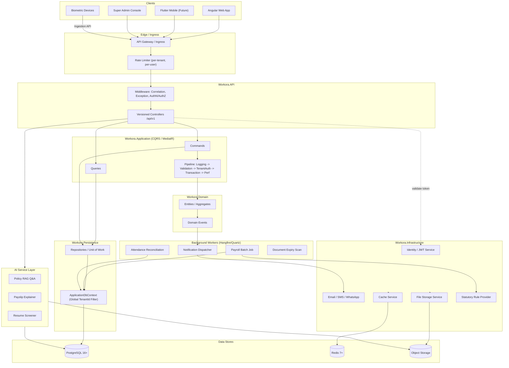
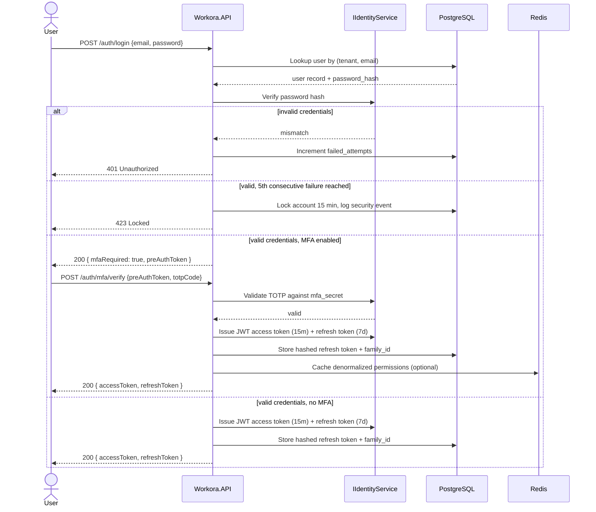
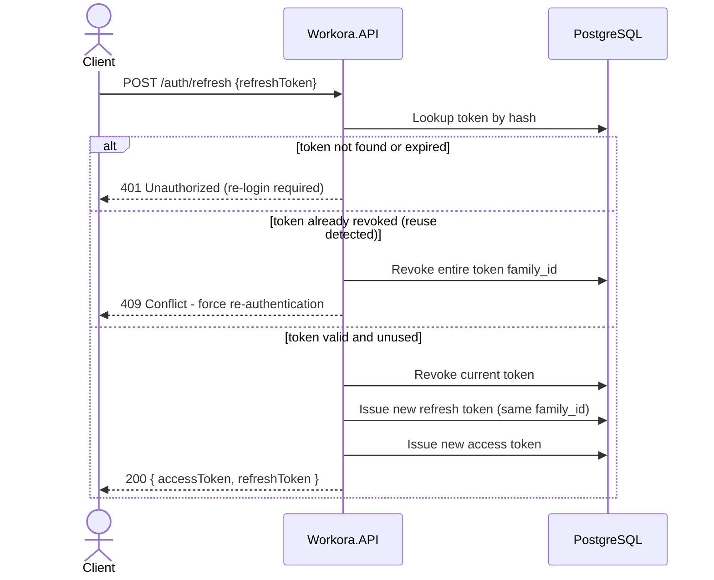
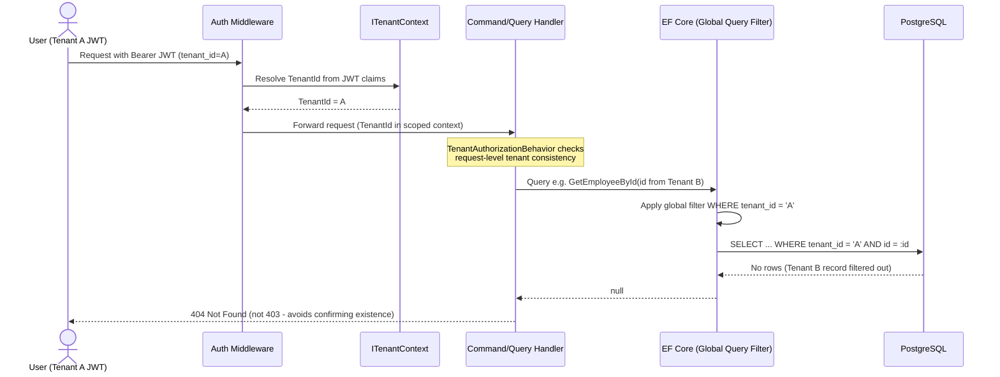
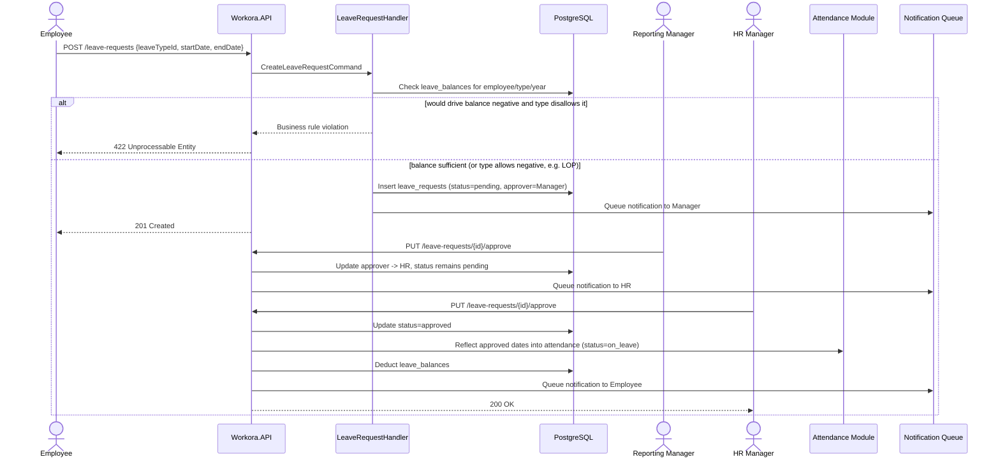
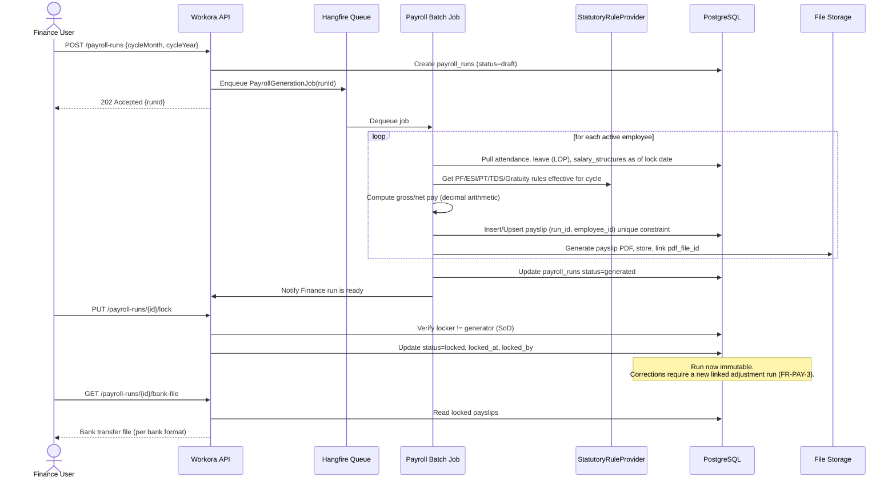
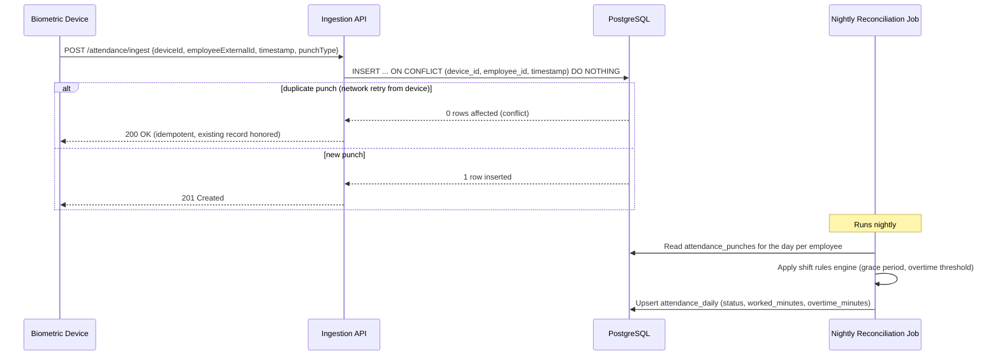
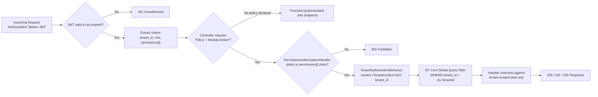

# Workora
## Technical Design Document
### SRS · Backend Architecture · Database Design · REST API Specification · Mermaid Diagrams

| | |
|---|---|
| **Document Version** | 1.0 |
| **Product Name** | Workora |
| **Product Type** | Cloud-based Multi-Tenant HRMS & Payroll Platform |
| **Status** | Draft for Engineering Review |

---

## Document Purpose

This document translates the Workora FRD into concrete technical specifications. It is organized into five parts:

1. **Part A — Software Requirements Specification (SRS):** system-level behavior, interfaces, and non-functional requirements, written to IEEE 830-style conventions.
2. **Part B — Backend Architecture:** the ASP.NET Core Clean Architecture implementation blueprint (layers, CQRS, RBAC, cross-cutting concerns).
3. **Part C — Database Design:** the multi-tenant PostgreSQL schema, entity-relationship model, and indexing/constraint strategy.
4. **Part D — REST API Specification:** every module's endpoints, methods, request/response DTOs, required RBAC permission, and status codes, all traceable to `FR-*` requirement IDs.
5. **Part E — Mermaid Diagram Set:** system architecture, entity-relationship model, and sequence diagrams for the highest-risk flows (auth, tenant isolation, payroll lock, leave approval, biometric ingestion).

This is the single technical reference engineering should use before writing the Angular Architecture document (next in the sequence).

---

# Part A — Software Requirements Specification (SRS)

## A.1 Introduction

### A.1.1 Purpose
Defines the functional and non-functional behavior of Workora at a system level, sufficient for engineering, QA, and DevOps to design, build, and validate the platform without ambiguity.

### A.1.2 Scope
Workora is a multi-tenant SaaS HRMS/Payroll system serving companies of 20–1000 employees, covering authentication, organization structure, employee lifecycle, attendance, leave, payroll, recruitment, performance, assets, expenses, documents, reporting, notifications, an AI assistant, and platform administration.

### A.1.3 Intended Audience
Backend engineers, frontend engineers, QA, DevOps/SRE, security reviewers, and product stakeholders.

### A.1.4 Definitions & Abbreviations

| Term | Meaning |
|---|---|
| Tenant | A single company/organization using Workora |
| RBAC | Role-Based Access Control |
| CQRS | Command Query Responsibility Segregation |
| LOP | Loss of Pay |
| PF / ESI / TDS | Indian statutory payroll components (Provident Fund, Employee State Insurance, Tax Deducted at Source) |
| SoD | Separation of Duties |
| DTO | Data Transfer Object |
| RAG | Retrieval-Augmented Generation |

### A.1.5 References
- Workora FRD v1.0
- Workora Technical Design Document v1.0
- ASP.NET Core Clean Architecture Build Prompt (technology baseline)

---

## A.2 Overall Description

### A.2.1 Product Perspective
Workora is a new, standalone multi-tenant SaaS product composed of:
- A **backend REST API** (ASP.NET Core / .NET 9, Clean Architecture, CQRS via MediatR)
- A **web frontend** (Angular 20+, NgRx)
- A **future mobile app** (Flutter)
- Supporting infrastructure: PostgreSQL, Redis, background job processing (Hangfire/Quartz), object storage (Cloudinary for images and files), and an AI service layer.

### A.2.2 Product Functions (Summary)
1. Identity & Access (Authentication, RBAC, MFA)
2. Tenant & Organization Management
3. Employee Lifecycle Management
4. Attendance & Time Tracking
5. Leave Management
6. Payroll Processing
7. Recruitment
8. Performance Management
9. Asset Management
10. Expense Management
11. Document Management
12. Reporting & Analytics
13. Notifications
14. AI Assistant
15. Platform Administration (Super Admin)

### A.2.3 User Classes and Characteristics

| Role | Technical Characteristics | Primary Access Surface |
|---|---|---|
| Super Admin | Platform operator, cross-tenant access | Admin console |
| Company Admin | Full access within one tenant | Web app |
| HR Manager | Broad HR-module access within tenant | Web app |
| Finance | Payroll/expense financial operations | Web app |
| Reporting Manager / Team Lead | Scoped to direct/indirect reports | Web app, mobile |
| Employee | Self-service only | Web app, mobile |
| Auditor | Read-only, audit-log access | Web app |

### A.2.4 Operating Environment
- Server: Linux containers on Kubernetes (AKS/EKS), .NET 9 runtime
- Database: PostgreSQL 16+
- Cache/Queue: Redis 7+
- Client: Evergreen browsers; responsive down to tablet width; mobile app (future) on iOS 15+/Android 10+

### A.2.5 Design and Implementation Constraints
- Comply with Indian statutory payroll rules (PF, ESI, Professional Tax, TDS, Gratuity) at GA, extensible to other countries later.
- Multi-tenant from day one.
- Clean Architecture dependency rules enforced (Domain has zero external dependencies).
- All mutating operations auditable (CreatedBy/UpdatedBy/DeletedBy + audit log stream).

### A.2.6 Assumptions and Dependencies
- Tenants provide their own statutory registration numbers (PF/ESI/TAN) at onboarding.
- Biometric device integration depends on third-party SDK/driver availability per vendor.
- WhatsApp Business API, Razorpay, and Stripe integrations depend on external account provisioning.

---

## A.3 System Features (Functional Requirements)

### A.3.1 Module 1 — Authentication & Identity (`FR-AUTH`)

| ID | Requirement |
|---|---|
| FR-AUTH-1 | Authenticate via email + password; short-lived JWT access token (15 min) + rotating refresh token (7 days, sliding). |
| FR-AUTH-2 | Optional TOTP-based MFA per user, enforceable per role by Company Admin policy. |
| FR-AUTH-3 | Lock account 15 minutes after 5 consecutive failed logins; log as security event. |
| FR-AUTH-4 | Forgot-password issues single-use, time-boxed (30 min) reset token via email. |
| FR-AUTH-5 | Tokens are tenant-scoped: a JWT for Tenant A must be rejected on Tenant B resources, enforced at middleware regardless of claim tampering. |
| FR-AUTH-6 | Refresh tokens are single-use, rotated on every refresh; reuse of a revoked token revokes the entire token family and forces re-authentication. |

### A.3.2 Module 2 — Organization Management (`FR-ORG`)
- FR-ORG-1: Company Admin defines Branches, Departments, Designations, Cost Centers, Shifts, Holiday Calendars, scoped to tenant.
- FR-ORG-2: Departments/Designations support hierarchical (parent/child) structures.
- FR-ORG-3: Shifts support fixed, rotational, flexible types with grace-period and overtime threshold parameters.

### A.3.3 Module 3 — Employee Management (`FR-EMP`)
- FR-EMP-1: Versioned employee profile (personal, contact, address, emergency contact, family, education, experience, skills, bank, identity documents).
- FR-EMP-2: Sensitive identity fields (Aadhaar, PAN, bank account) encrypted at rest, masked in API responses unless `Employee.ViewSensitive` held.
- FR-EMP-3: Employment lifecycle events (Joining, Confirmation, Promotion, Transfer, Exit) as an immutable, timestamped event log driving derived fields.
- FR-EMP-4: Exit triggers configurable offboarding workflow (asset return, final settlement trigger, access revocation).

### A.3.4 Module 4 — Attendance (`FR-ATT`)
- FR-ATT-1: Check-In/Check-Out with timestamp, source (web/mobile/biometric), geo-coordinates when available.
- FR-ATT-2: Daily attendance status (Present, Absent, Half Day, Late, Early Exit, On Leave, Holiday, Week Off) via rules engine driven by shift config.
- FR-ATT-3: Manual correction requires a reason code and approval workflow; original punches retained.
- FR-ATT-4: Overtime auto-computed when check-out exceeds shift end + configurable threshold.
- FR-ATT-5: Biometric/face-recognition integrations push punches via idempotent internal ingestion API (device ID, employee ID, timestamp).

### A.3.5 Module 5 — Leave Management (`FR-LVE`)
- FR-LVE-1: Configurable leave types per tenant (Casual, Sick, Earned, Maternity, Paternity, Comp Off, LOP, custom).
- FR-LVE-2: Leave balance via accrual engine (monthly/annual accrual, carry-forward caps, encashment rules).
- FR-LVE-3: Multi-level approval workflow (default: Reporting Manager → HR).
- FR-LVE-4: Approved leave automatically reflects in Attendance for corresponding dates.
- FR-LVE-5: Prevent submission driving balance negative unless leave type allows it (e.g., LOP).

### A.3.6 Module 6 — Payroll (`FR-PAY`)
- FR-PAY-1: Configurable salary structures (Basic, HRA, Allowances, Bonuses, Incentives, Deductions) — fixed, percentage-of-basic, or formula-based.
- FR-PAY-2: Payroll generation as a batch process producing a run per tenant per cycle, pulling attendance/leave/salary data as of the lock date.
- FR-PAY-3: Locked runs are immutable; corrections require a linked adjustment run.
- FR-PAY-4: Statutory deductions (PF, ESI, PT, TDS, Gratuity) versioned so historical recalculation uses rules in force at the time.
- FR-PAY-5: Bank transfer file generation per supported Indian bank formats; individual PDF payslips.
- FR-PAY-6: All payroll math server-side using decimal arithmetic.

### A.3.7 Module 7 — Recruitment (`FR-REC`)
- FR-REC-1: Job Postings with department, designation, custom application fields.
- FR-REC-2: Candidate resume submission (PDF/DOCX) with automatic parsing into structured profile.
- FR-REC-3: Interview scheduling integrates with Outlook/Google Calendar via OAuth.
- FR-REC-4: Offer Letters generated from tenant templates, support e-signature.
- FR-REC-5: One-click Candidate → Employee conversion on offer acceptance.

### A.3.8 Module 8 — Performance (`FR-PRF`)
- FR-PRF-1: Configurable review cycles (quarterly/half-yearly/annual) with KPI and OKR goal types.
- FR-PRF-2: Self-Review → Manager Review → Calibration stages, independently lockable.
- FR-PRF-3: Completed scores feed a promotion-recommendation report (computed, not auto-applied).

### A.3.9 Module 9 — Assets (`FR-AST`)
- FR-AST-1: Asset inventory (Laptop, Desktop, Mobile, SIM, Accessories) with serial number, warranty, condition.
- FR-AST-2: Allocation/Return/Repair/Lost events logged against both asset and employee (full custody chain).

### A.3.10 Module 10 — Expense (`FR-EXP`)
- FR-EXP-1: Expense claims (Travel, Food, Hotel, Fuel, Internet) with receipt attachments.
- FR-EXP-2: Workflow: Submit → Manager → Finance → Payment, each stage independently approvable/rejectable with comments.
- FR-EXP-3: Approved claims exportable into payroll as a reimbursement line item.

### A.3.11 Module 11 — Documents (`FR-DOC`)
- FR-DOC-1: Versioned document upload with expiry-date tracking and automated reminders.
- FR-DOC-2: E-signature workflows; storage in tenant-isolated object storage containers.

### A.3.12 Module 12 — Reports (`FR-RPT`)
- FR-RPT-1: Parameterized standard reports (Attendance, Payroll, Employee, Leave, Recruitment, Performance, Tax, Compliance) exportable as PDF/Excel/CSV.
- FR-RPT-2: Reports touching payroll/PII enforce the same field-level masking as FR-EMP-2.

### A.3.13 Module 13 — Notifications (`FR-NOT`)
- FR-NOT-1: Delivery via Email, SMS, Push, WhatsApp with per-user channel preferences.
- FR-NOT-2: Asynchronous (queued) delivery; never blocks the originating transaction.

### A.3.14 Module 14 — AI Assistant (`FR-AI`)
- FR-AI-1: HR-policy Q&A grounded in tenant's uploaded policy documents (retrieval-augmented, not general knowledge).
- FR-AI-2: Payslip explanation in natural language, strictly using that payslip's computed values.
- FR-AI-3: Resume screening produces a ranked shortlist with explanation citing matched job-requirement fields.
- FR-AI-4: Any AI output affecting a business record requires explicit human confirmation before persisting.

### A.3.15 Module 15 — Settings & Platform Administration (`FR-ADM`)
- FR-ADM-1: Roles/Permissions managed via a permission-matrix UI backed by RBAC engine.
- FR-ADM-2: Super Admin manages tenant subscriptions, plan-based feature toggles, billing status; suspended tenant → read-only, not data deletion.
- FR-ADM-3: All configuration changes captured in audit log with before/after values.

---

## A.4 External Interface Requirements

### A.4.1 User Interfaces
Angular 20+ SPA; role-based navigation; WCAG 2.1 AA target for core employee self-service screens.

### A.4.2 Hardware Interfaces
Biometric attendance devices via vendor SDK/REST bridge; normalized into the internal Attendance Ingestion API (FR-ATT-5).

### A.4.3 Software Interfaces

| System | Direction | Purpose |
|---|---|---|
| Outlook / Google Calendar | Bi-directional | Interview scheduling, leave calendar sync |
| Microsoft Teams / Slack | Outbound | Notifications, approval actions |
| WhatsApp Business API | Outbound | Notifications |
| Razorpay / Stripe | Outbound | Billing (Super Admin), expense reimbursement (future) |
| Indian Banking File Formats | Outbound | Payroll bank transfer files |
| Aadhaar eKYC / DigiLocker | Bi-directional (future) | Identity verification, document fetch |

### A.4.4 Communication Interfaces
HTTPS/TLS 1.2+ only; REST/JSON primary; WebSocket (SignalR) for real-time notification delivery.

---

## A.5 Non-Functional Requirements

### A.5.1 Performance
- P95 API response time < 2s for standard CRUD/read operations under nominal load.
- Support ≥ 1,000 concurrent users per platform deployment.
- Attendance table sustains ≥ 1,000,000 records with indexed query performance.
- Payroll batch run for a 1,000-employee tenant completes within 10 minutes.

### A.5.2 Security
- JWT + rotating refresh tokens; MFA (TOTP) optional per tenant policy.
- Passwords hashed with a memory-hard algorithm (Argon2id or upgraded ASP.NET Identity work factor).
- Full RBAC with policy-based authorization.
- All mutating requests logged to an append-only audit store.
- Encryption at rest for sensitive PII columns; TLS in transit everywhere.
- API rate limiting per tenant and per user.

### A.5.3 Scalability
- Multi-tenant shared-database/shared-schema model, horizontally scalable API tier, stateless services (session state in Redis).
- Background/batch workloads isolated onto separate worker processes.

### A.5.4 Availability & Reliability
- 99.9% uptime target (≈ 8.7 hours downtime/year budget).
- Continuous WAL archiving + daily full backup, 30-day retention minimum.
- Payroll runs and financial mutations idempotent and transactional.

### A.5.5 Maintainability
- Clean Architecture boundaries strictly enforced; no business logic in controllers or EF configurations.
- Minimum 70% unit test coverage on Application-layer command/query handlers.

### A.5.6 Localization
- UI and notification templates support multi-language (i18n keys); currency and timezone are tenant-level settings.

---

# Part B — Backend Architecture

## B.1 Architectural Style
Clean Architecture (Onion/Hexagonal) with CQRS via MediatR, DDD tactical patterns, Repository + Unit of Work at the persistence boundary. Dependency direction always inward: **API → Application → Domain**, with **Infrastructure** and **Persistence** depending on Application/Domain abstractions, never the reverse.

## B.2 Solution Structure

```
Workora.sln

src/
  Workora.Domain            (no external dependencies)
  Workora.Application       (CQRS: Commands, Queries, Validators, DTOs)
  Workora.Infrastructure    (JWT, Email/SMS, File storage, Redis, external APIs)
  Workora.Persistence       (EF Core, DbContext, Configurations, Repositories, Migrations)
  Workora.API               (Controllers, Middleware, Filters, Swagger, DI composition root)

tests/
  Workora.UnitTests
  Workora.IntegrationTests
```

## B.3 Layer Responsibilities

### B.3.1 Domain Layer
- Entities: `Employee`, `Department`, `LeaveRequest`, `PayrollRun`, `User`, `Role`, `Permission`, etc.
- Base types: `BaseEntity`, `AuditableEntity` (CreatedBy/UpdatedBy/DeletedBy + timestamps), `AggregateRoot`.
- Value Objects: `Money`, `DateRange`, `EmployeeCode`.
- Domain Events: `LeaveApprovedEvent`, `PayrollLockedEvent`, `EmployeeExitedEvent` — raised by aggregates, dispatched post-commit via MediatR domain-event pipeline.
- Zero references to EF Core, ASP.NET, or infrastructure packages.

### B.3.2 Application Layer
- Organized per module (Employee, Attendance, Leave, Payroll, …) with `Commands/`, `Queries/`, `Validators/`, `Mappings/`, `DTOs/`.
- MediatR `IRequest`/`IRequestHandler` per command/query.
- Pipeline Behaviors (execution order): `LoggingBehavior` → `ValidationBehavior` (FluentValidation) → `TenantAuthorizationBehavior` → `TransactionBehavior` → `PerformanceBehavior`.
- `ITenantContext`, `ICurrentUserService`, `IDateTimeService` as injected abstractions.

### B.3.3 Infrastructure Layer
- `IIdentityService` (JWT issuance/validation, ASP.NET Identity integration)
- `IEmailService`, `ISmsService`, `IWhatsAppService`
- `IFileStorageService` (tenant-isolated blob containers)
- `ICacheService` (Redis)
- `IPayrollStatutoryRuleProvider` (versioned PF/ESI/PT/TDS rule sets)
- `ITokenService`, `IPasswordHasher`

### B.3.4 Persistence Layer
- `ApplicationDbContext` with a **global query filter on `TenantId`** applied to every tenant-scoped entity.
- EF Core Fluent API configurations only (no data annotations) in `Configurations/`.
- `IGenericRepository<T>` (`AddAsync`, `Update`, `Delete`, `GetByIdAsync`, `GetAllAsync`, `FindAsync`, `ExistsAsync`) plus module-specific repositories.
- `IUnitOfWork` (`SaveChangesAsync`, `BeginTransactionAsync`, `CommitAsync`, `RollbackAsync`).
- Soft delete via `IsDeleted` + global query filter; hard delete never exposed via API.

### B.3.5 API Layer
- Versioned controllers (`/api/v1/...`), thin — delegate directly to `IMediator.Send`.
- Global Exception Middleware mapping domain/validation exceptions to the standardized response envelope (B.6).
- Correlation ID Middleware (propagated into Serilog scope and downstream HTTP calls).
- Rate Limiting Middleware (per-tenant + per-user buckets).
- Swagger/OpenAPI with JWT bearer scheme documented.

## B.4 Authentication & RBAC

### B.4.1 Token Model
- Access token: JWT, 15 min TTL, claims `sub`, `tenant_id`, `role`, `permissions[]` (denormalized at issuance), `jti`.
- Refresh token: opaque, stored hashed in `RefreshTokens`, rotated on use, family-revocation on reuse detection (FR-AUTH-6).

### B.4.2 RBAC Model
Entities: `Users`, `Roles`, `Permissions`, `RolePermissions`, `UserRoles`. Permission naming: `<Module>.<Action>`, e.g. `Employee.View`, `Employee.Create`, `Payroll.Lock`, `Employee.ViewSensitive`.

Authorization is **policy-based**: controllers declare `[Authorize(Policy = "Employee.Update")]`; a custom `PermissionAuthorizationHandler` checks the JWT's `permissions[]` claim, so permission changes take effect on next token refresh without a code deploy.

### B.4.3 Tenant Isolation
Every authenticated request resolves `TenantId` from the JWT into `ITenantContext` at pipeline start. The EF Core global query filter and `TenantAuthorizationBehavior` provide defense-in-depth: even a handler bug that omits an explicit tenant filter is still blocked by the query filter.

## B.5 Common Cross-Cutting Features
- **Pagination/Sorting/Filtering:** standard `PagedRequest` base (page, pageSize, sortBy, sortDir, filters[]) via a shared `IQueryable` extension pipeline; whitelisted expression builder (not raw Dynamic LINQ strings).
- **Audit Logging:** `AuditableEntity` fields auto-populated in `SaveChangesAsync` override; append-only `AuditLog` table records entity name, action, before/after JSON diff, actor, correlation ID.
- **Soft Delete:** `IsDeleted`, `DeletedBy`, `DeletedDate` + global query filter.

## B.6 API Response Contract

Success:
```json
{ "success": true, "message": "Data fetched successfully", "data": {} }
```
Error:
```json
{ "success": false, "message": "Validation Failed", "errors": ["Name is required"] }
```
Paginated:
```json
{
  "success": true,
  "data": { "items": [], "page": 1, "pageSize": 10, "totalPages": 15, "totalRecords": 150 }
}
```

## B.7 Background Processing
Hangfire (or Quartz) workers, deployed as a separate process from the API tier:
- Payroll batch generation (long-running, transactional per-employee, run-level lock)
- Notification dispatch (Email/SMS/Push/WhatsApp queue consumers)
- Document-expiry reminder scan (daily)
- Attendance-status nightly reconciliation job
- Report generation for large exports

## B.8 Observability
- **Serilog** structured logging → central log store; every line enriched with `TenantId`, `UserId`, `CorrelationId`.
- **Health Checks** (`/health/live`, `/health/ready`) covering DB, Redis, worker connectivity.
- Request/response and SQL query logging in non-production; sampled in production.

## B.9 Testing Strategy
- **Unit tests** (xUnit, Moq, FluentAssertions): Application-layer handlers/validators, Domain entity behavior.
- **Integration tests**: Auth flow, representative CRUD per module, authorization boundary tests (cross-tenant access blocked, permission-denied paths).

## B.10 Deployment
- Dockerized API and worker images; `docker-compose.yml` for local dev (API + Postgres + Redis).
- Kubernetes manifests for staging/production (separate Deployments for API and workers, HPA on API tier).
- CI/CD: build → test → migrate (guarded, reviewed) → deploy, per environment.

## B.11 Load Balancing & Rate Limiting
- **API Gateway / Load Balancer**: NGINX or YARP (Yet Another Reverse Proxy) sits at the edge, routing traffic to downstream API instances. Supports horizontal scaling and SSL termination.
- **Rate Limiting**: Implemented at the API Gateway and application middleware level using Redis. Limits endpoints (e.g., `100 req/min/IP`, stricter for Auth endpoints) to prevent brute-forcing and noisy-neighbor issues in the multi-tenant environment.

## B.12 Caching & Event-Driven Architecture
- **Distributed Caching**: Redis is used for JWT token blacklisting, caching tenant configurations, and accelerating frequent queries (e.g., RBAC policies).
- **Event Bus**: RabbitMQ or Kafka for asynchronous inter-service communication and background jobs (e.g., generating payroll, processing resume uploads). Ensures decoupling and high availability.

---

# Part C — Database Design

## C.1 Design Principles
- **PostgreSQL 16+**, shared-database/shared-schema multi-tenancy: every tenant-scoped table carries `tenant_id`, indexed and enforced via application-level global query filters plus, optionally, PostgreSQL Row-Level Security as defense-in-depth.
- Surrogate primary keys: `uuid` (`gen_random_uuid()`), avoiding sequential-ID enumeration across tenants.
- All tables inherit audit columns: `created_by`, `created_date`, `updated_by`, `updated_date`, `deleted_by`, `deleted_date`, `is_deleted`.
- Money stored as `numeric(18,2)`; never `float`/`double`.

## C.2 Tenancy & Platform Tables

**companies** (tenant root)
`id (PK)`, `name`, `subdomain (unique)`, `subscription_plan_id (FK)`, `status (active/suspended)`, `pf_registration_no`, `esi_registration_no`, `tan_no`, `timezone`, `currency`, audit columns.

**subscription_plans**
`id (PK)`, `name`, `feature_flags (jsonb)`, `max_employees`, `price`.

**branches** — `id`, `tenant_id (FK→companies)`, `name`, `address`, `timezone`.

## C.3 Organization Tables
- **departments** — `id`, `tenant_id`, `name`, `parent_department_id (self-FK, nullable)`.
- **designations** — `id`, `tenant_id`, `title`, `parent_designation_id (self-FK, nullable)`.
- **cost_centers** — `id`, `tenant_id`, `code`, `name`.
- **shifts** — `id`, `tenant_id`, `name`, `start_time`, `end_time`, `grace_minutes`, `overtime_threshold_minutes`, `type (fixed/rotational/flexible)`.
- **holiday_calendars** / **holidays** — `id`, `tenant_id`, `calendar_name`; `holidays(id, calendar_id FK, date, name)`.

## C.4 Identity & Access Tables
- **users** — `id`, `tenant_id (nullable for Super Admin)`, `email (unique per tenant)`, `password_hash`, `mfa_enabled`, `mfa_secret (encrypted)`, `status`.
- **roles** — `id`, `tenant_id (nullable = system role)`, `name`.
- **permissions** — `id`, `code (e.g. Employee.View)`, `module`.
- **role_permissions** — `role_id (FK)`, `permission_id (FK)`, composite PK.
- **user_roles** — `user_id (FK)`, `role_id (FK)`, composite PK.
- **refresh_tokens** — `id`, `user_id (FK)`, `token_hash`, `family_id`, `expires_at`, `revoked_at (nullable)`.
- **audit_logs** — `id`, `tenant_id`, `entity_name`, `entity_id`, `action`, `changes (jsonb)`, `actor_user_id`, `correlation_id`, `created_date`. Append-only.

## C.5 Employee & Employment Tables
- **employees** — `id`, `tenant_id`, `user_id (FK, nullable until account provisioned)`, `employee_code (unique per tenant)`, `first_name`, `last_name`, `dob`, `gender`, `department_id (FK)`, `designation_id (FK)`, `branch_id (FK)`, `reporting_manager_id (self-FK)`, `employment_status (active/exited/on_leave)`, `joining_date`.
- **employee_contacts** — address, emergency contact, family (1:N per type).
- **employee_identity_docs** — `id`, `employee_id (FK)`, `doc_type (aadhaar/pan/passport)`, `doc_number_encrypted`, `file_id (FK→documents)`.
- **employee_bank_details** — `id`, `employee_id (FK)`, `account_number_encrypted`, `ifsc`, `bank_name`.
- **employment_events** — `id`, `employee_id (FK)`, `event_type (joining/confirmation/promotion/transfer/exit)`, `effective_date`, `details (jsonb)`. Immutable event log.

**Indexes:** `employees(tenant_id, employment_status)`, `employees(tenant_id, department_id)`, unique `(tenant_id, employee_code)`.

## C.6 Attendance & Leave Tables
- **attendance_punches** — `id`, `tenant_id`, `employee_id (FK)`, `punch_type (in/out)`, `timestamp`, `source (web/mobile/biometric)`, `latitude`, `longitude`, `device_id (nullable)`. Unique `(device_id, employee_id, timestamp)` where `device_id is not null`.
- **attendance_daily** — `id`, `tenant_id`, `employee_id (FK)`, `date`, `status`, `worked_minutes`, `overtime_minutes`, computed nightly. Unique `(employee_id, date)`. Partitioned by month (range partitioning on `date`).
- **leave_types** — `id`, `tenant_id`, `name`, `accrual_rule (jsonb)`, `allows_negative_balance (bool)`.
- **leave_balances** — `id`, `employee_id (FK)`, `leave_type_id (FK)`, `year`, `balance`. Unique `(employee_id, leave_type_id, year)`.
- **leave_requests** — `id`, `tenant_id`, `employee_id (FK)`, `leave_type_id (FK)`, `start_date`, `end_date`, `status (pending/approved/rejected/cancelled)`, `approver_id (FK→employees, nullable)`.

## C.7 Payroll Tables
- **salary_structures** — `id`, `tenant_id`, `employee_id (FK)`, `effective_date`, `components (jsonb: [{code, type, value}])`.
- **payroll_runs** — `id`, `tenant_id`, `cycle_month`, `cycle_year`, `status (draft/locked/paid)`, `locked_at`, `locked_by`.
- **payslips** — `id`, `payroll_run_id (FK)`, `employee_id (FK)`, `gross_pay numeric(18,2)`, `net_pay numeric(18,2)`, `components (jsonb)`, `pdf_file_id (FK→documents)`. Unique `(payroll_run_id, employee_id)`.
- **statutory_rule_versions** — `id`, `rule_type (pf/esi/pt/tds/gratuity)`, `effective_from`, `effective_to (nullable)`, `parameters (jsonb)`.

## C.8 Recruitment Tables
- **job_postings** — `id`, `tenant_id`, `title`, `department_id (FK)`, `status`.
- **candidates** — `id`, `tenant_id`, `job_posting_id (FK)`, `name`, `email`, `resume_file_id (FK→documents)`, `parsed_profile (jsonb)`, `stage (applied/interview/offer/hired/rejected)`.
- **interviews** — `id`, `candidate_id (FK)`, `scheduled_at`, `interviewer_employee_id (FK)`, `feedback (jsonb, nullable)`.

## C.9 Performance Tables
- **review_cycles** — `id`, `tenant_id`, `name`, `start_date`, `end_date`, `status`.
- **goals** — `id`, `employee_id (FK)`, `cycle_id (FK)`, `type (kpi/okr)`, `description`, `target`, `weight`.
- **reviews** — `id`, `cycle_id (FK)`, `employee_id (FK)`, `self_score`, `manager_score`, `stage (self/manager/calibration/completed)`.

## C.10 Assets, Expense, Documents Tables
- **assets** — `id`, `tenant_id`, `asset_tag`, `type`, `serial_number`, `condition`, `status (available/allocated/repair/lost)`.
- **asset_events** — `id`, `asset_id (FK)`, `employee_id (FK, nullable)`, `event_type (allocated/returned/repair/lost)`, `event_date`.
- **expense_claims** — `id`, `tenant_id`, `employee_id (FK)`, `category`, `amount numeric(18,2)`, `status (submitted/manager_approved/finance_approved/rejected/paid)`, `receipt_file_id (FK→documents)`.
- **documents** — `id`, `tenant_id`, `owner_type`, `owner_id`, `version`, `storage_path`, `expiry_date (nullable)`, `is_signed (bool)`.

## C.11 Notifications Table
- **notifications** — `id`, `tenant_id`, `user_id (FK)`, `channel (email/sms/push/whatsapp)`, `template_code`, `payload (jsonb)`, `status (queued/sent/failed)`, `sent_at`.

## C.12 Indexing & Constraint Summary
- Every tenant-scoped table: composite index leading with `tenant_id`.
- Unique constraints: `(tenant_id, employee_code)`, `(tenant_id, email)` on users, `(employee_id, date)` on attendance_daily, `(payroll_run_id, employee_id)` on payslips, `(device_id, employee_id, timestamp)` on attendance_punches.
- Foreign keys: `ON DELETE RESTRICT` for reference data (departments, roles); `ON DELETE CASCADE` only for strictly owned child records.
- Partitioning: `attendance_punches` and `attendance_daily` partitioned by month.
- `jsonb` columns (`components`, `parsed_profile`, `changes`, `payload`) indexed with GIN where queried.

---

# Part D — REST API Specification

## D.1 Conventions

- **Base URL:** `https://api.workora.io/api/v1`
- **Auth:** `Authorization: Bearer <access_token>` on every endpoint except `auth/login`, `auth/refresh`, `auth/forgot-password`, `auth/reset-password`.
- **Tenant scoping:** implicit from JWT `tenant_id` claim — never passed as a request parameter (prevents cross-tenant tampering, FR-AUTH-5).
- **Response envelope:** as defined in B.6 (success / error / paginated).
- **Pagination params (list endpoints):** `page`, `pageSize`, `sortBy`, `sortDir`, `filters[]` (query string, whitelisted fields only).
- **Standard status codes:** `200 OK`, `201 Created`, `204 No Content`, `400 Bad Request` (validation), `401 Unauthorized`, `403 Forbidden` (permission or cross-tenant), `404 Not Found`, `409 Conflict` (e.g. duplicate punch, locked payroll run), `422 Unprocessable Entity` (business rule violation, e.g. negative leave balance).
- **Permission column** references the `<Module>.<Action>` RBAC policy (B.4.2) enforced via `[Authorize(Policy = "...")]`.

---

## D.2 Module 1 — Authentication (`FR-AUTH`)

| Method | Path | Permission | Description |
|---|---|---|---|
| POST | `/auth/login` | Public | Email+password login. Body: `{ email, password }`. Returns `{ accessToken, refreshToken, expiresIn, mfaRequired }`. |
| POST | `/auth/mfa/verify` | Public (short-lived pre-auth token) | Completes login when MFA enabled. Body: `{ preAuthToken, totpCode }`. Returns access/refresh tokens. |
| POST | `/auth/refresh` | Public (valid refresh token) | Rotates refresh token. Body: `{ refreshToken }`. Reuse of a revoked token → `409`, revokes entire token family (FR-AUTH-6). |
| POST | `/auth/logout` | Authenticated | Revokes current refresh token family. |
| POST | `/auth/forgot-password` | Public | Body: `{ email }`. Always `200` (no user enumeration); issues 30-min reset token by email. |
| POST | `/auth/reset-password` | Public | Body: `{ resetToken, newPassword }`. Single-use. |
| POST | `/auth/mfa/enable` | Authenticated | Generates TOTP secret + QR provisioning URI. |
| POST | `/auth/mfa/confirm` | Authenticated | Body: `{ totpCode }`. Confirms setup, flips `mfa_enabled`. |
| POST | `/auth/mfa/disable` | Authenticated | Body: `{ password }`. Disables MFA. |
| GET | `/auth/me` | Authenticated | Returns current user profile, roles, denormalized permissions. |

**Request example — POST /auth/login**
```json
{ "email": "priya.rao@acme.com", "password": "••••••••" }
```
**Response**
```json
{
  "success": true,
  "data": {
    "accessToken": "eyJ...",
    "refreshToken": "8f3a...",
    "expiresIn": 900,
    "mfaRequired": false
  }
}
```

---

## D.3 Module 2 — Organization Management (`FR-ORG`)

| Method | Path | Permission | Description |
|---|---|---|---|
| GET | `/branches` | `Org.View` | Paginated list of branches. |
| POST | `/branches` | `Org.Create` | Create branch. Body: `{ name, address, timezone }`. |
| PUT | `/branches/{id}` | `Org.Update` | Update branch. |
| DELETE | `/branches/{id}` | `Org.Delete` | Soft-delete branch. |
| GET | `/departments` | `Org.View` | List departments (supports `?parentId=` for hierarchy traversal). |
| POST | `/departments` | `Org.Create` | Body: `{ name, parentDepartmentId? }`. |
| PUT | `/departments/{id}` | `Org.Update` | Update department, including re-parenting. |
| DELETE | `/departments/{id}` | `Org.Delete` | Blocked (`409`) if active employees reference it. |
| GET | `/designations` | `Org.View` | List designations. |
| POST | `/designations` | `Org.Create` | Body: `{ title, parentDesignationId? }`. |
| PUT | `/designations/{id}` | `Org.Update` | Update. |
| GET | `/cost-centers` | `Org.View` | List cost centers. |
| POST | `/cost-centers` | `Org.Create` | Body: `{ code, name }`. |
| GET | `/shifts` | `Org.View` | List shifts. |
| POST | `/shifts` | `Org.Create` | Body: `{ name, startTime, endTime, graceMinutes, overtimeThresholdMinutes, type }`. |
| PUT | `/shifts/{id}` | `Org.Update` | Update shift config. |
| GET | `/holiday-calendars` | `Org.View` | List calendars. |
| POST | `/holiday-calendars` | `Org.Create` | Body: `{ calendarName }`. |
| POST | `/holiday-calendars/{id}/holidays` | `Org.Update` | Add holiday. Body: `{ date, name }`. |
| GET | `/holiday-calendars/{id}/holidays` | `Org.View` | List holidays for a calendar. |

---

## D.4 Module 3 — Employee Management (`FR-EMP`)

| Method | Path | Permission | Description |
|---|---|---|---|
| GET | `/employees` | `Employee.View` | Paginated, filterable (department, designation, status, branch). PII fields masked unless `Employee.ViewSensitive`. |
| GET | `/employees/{id}` | `Employee.View` | Full profile. |
| POST | `/employees` | `Employee.Create` | Body: `{ firstName, lastName, dob, gender, departmentId, designationId, branchId, reportingManagerId, joiningDate }`. |
| PUT | `/employees/{id}` | `Employee.Update` | Update core profile fields. |
| PUT | `/employees/{id}/contacts` | `Employee.Update` | Body: `{ address, emergencyContacts[], familyMembers[] }`. |
| GET | `/employees/{id}/bank-details` | `Employee.ViewSensitive` | Returns decrypted bank details (audited access). |
| PUT | `/employees/{id}/bank-details` | `Employee.Update` | Body: `{ accountNumber, ifsc, bankName }` (encrypted at rest). |
| POST | `/employees/{id}/identity-docs` | `Employee.Update` | Multipart upload. Body: `{ docType, docNumber, file }`. |
| GET | `/employees/{id}/identity-docs` | `Employee.ViewSensitive` | List, values masked unless permission held. |
| GET | `/employees/{id}/employment-events` | `Employee.View` | Immutable event timeline. |
| POST | `/employees/{id}/employment-events` | `Employee.Update` | Body: `{ eventType, effectiveDate, details }`. Types: joining/confirmation/promotion/transfer/exit. |
| POST | `/employees/{id}/exit` | `Employee.Offboard` | Triggers offboarding workflow (asset return tasks, access revocation, final settlement flag). Body: `{ exitDate, reason }`. |

---

## D.5 Module 4 — Attendance (`FR-ATT`)

| Method | Path | Permission | Description |
|---|---|---|---|
| POST | `/attendance/punch` | `Attendance.Punch` | Self-service check-in/out. Body: `{ punchType, latitude?, longitude? }`; source inferred from client. |
| POST | `/attendance/ingest` | `Attendance.IngestDevice` (device API key) | Internal biometric ingestion. Body: `{ deviceId, employeeExternalId, timestamp, punchType }`. Idempotent on `(deviceId, employeeId, timestamp)` — duplicate returns `200` with existing record, not `409`. |
| GET | `/attendance/daily` | `Attendance.View` | Query params: `employeeId?, dateFrom, dateTo`. Returns computed daily status rows. |
| GET | `/attendance/punches` | `Attendance.View` | Raw punch history for audit/dispute resolution. |
| POST | `/attendance/corrections` | `Attendance.Correct` | Body: `{ employeeId, date, requestedPunches[], reasonCode }`. Creates a pending correction request. |
| PUT | `/attendance/corrections/{id}/approve` | `Attendance.ApproveCorrection` | Approves; regenerates `attendance_daily` row; original punches retained. |
| PUT | `/attendance/corrections/{id}/reject` | `Attendance.ApproveCorrection` | Body: `{ comments }`. |
| GET | `/attendance/overtime` | `Attendance.View` | Overtime summary by employee/date range. |

---

## D.6 Module 5 — Leave Management (`FR-LVE`)

| Method | Path | Permission | Description |
|---|---|---|---|
| GET | `/leave-types` | `Leave.View` | List configured leave types. |
| POST | `/leave-types` | `Leave.Configure` | Body: `{ name, accrualRule, allowsNegativeBalance }`. |
| PUT | `/leave-types/{id}` | `Leave.Configure` | Update accrual/config. |
| GET | `/leave-balances` | `Leave.View` | Query params: `employeeId?, year?`. Self-scoped for Employee role. |
| POST | `/leave-requests` | `Leave.Apply` | Body: `{ leaveTypeId, startDate, endDate, reason }`. `422` if balance would go negative and type disallows it. |
| GET | `/leave-requests` | `Leave.View` | Filterable by status/employee/date range; scoped by role (reporting-line for managers). |
| PUT | `/leave-requests/{id}/approve` | `Leave.Approve` | Advances to next approval level or finalizes; on final approval, reflects into Attendance (FR-LVE-4). |
| PUT | `/leave-requests/{id}/reject` | `Leave.Approve` | Body: `{ comments }`. |
| PUT | `/leave-requests/{id}/cancel` | `Leave.Apply` (own request) | Employee-initiated cancellation prior to start date. |

---

## D.7 Module 6 — Payroll (`FR-PAY`)

| Method | Path | Permission | Description |
|---|---|---|---|
| GET | `/salary-structures` | `Payroll.ViewStructure` | Query param: `employeeId`. |
| POST | `/salary-structures` | `Payroll.ManageStructure` | Body: `{ employeeId, effectiveDate, components[] }` (`{code, type, value}`). |
| POST | `/payroll-runs` | `Payroll.Generate` | Body: `{ cycleMonth, cycleYear }`. Kicks off async batch job (B.7); returns `202 Accepted` + run ID. |
| GET | `/payroll-runs/{id}` | `Payroll.View` | Run status, summary totals. |
| GET | `/payroll-runs/{id}/payslips` | `Payroll.View` | Paginated payslips for the run. |
| PUT | `/payroll-runs/{id}/lock` | `Payroll.Lock` | Locks run (immutable thereafter, FR-PAY-3). Requires SoD: locker ≠ generator (enforced by policy). |
| POST | `/payroll-runs/{id}/adjustments` | `Payroll.Adjust` | Creates a linked adjustment run for corrections against a locked run. |
| GET | `/payroll-runs/{id}/bank-file` | `Payroll.Export` | Generates and returns the bank transfer file (per configured bank format). |
| GET | `/payslips/{id}` | `Payroll.View` (self or `Payroll.ViewAll`) | Single payslip detail. |
| GET | `/payslips/{id}/pdf` | `Payroll.View` | Streams generated PDF. |
| GET | `/statutory-rules` | `Payroll.ConfigureStatutory` | List versioned PF/ESI/PT/TDS/Gratuity rule sets. |
| POST | `/statutory-rules` | `Payroll.ConfigureStatutory` | Body: `{ ruleType, effectiveFrom, parameters }`; supersedes prior version rather than mutating it. |

---

## D.8 Module 7 — Recruitment (`FR-REC`)

| Method | Path | Permission | Description |
|---|---|---|---|
| GET | `/job-postings` | `Recruitment.View` | List postings. |
| POST | `/job-postings` | `Recruitment.Manage` | Body: `{ title, departmentId, designationId, customFields[], status }`. |
| PUT | `/job-postings/{id}` | `Recruitment.Manage` | Update / close posting. |
| POST | `/candidates` | Public (application form) or `Recruitment.Manage` | Multipart resume upload; triggers async parsing into `parsed_profile`. |
| GET | `/candidates` | `Recruitment.View` | Filterable by posting, stage. |
| GET | `/candidates/{id}` | `Recruitment.View` | Full profile incl. parsed resume data. |
| PUT | `/candidates/{id}/stage` | `Recruitment.Manage` | Body: `{ stage }` (applied/interview/offer/hired/rejected). |
| POST | `/interviews` | `Recruitment.Manage` | Body: `{ candidateId, scheduledAt, interviewerEmployeeId }`; syncs to interviewer's calendar via OAuth. |
| PUT | `/interviews/{id}/feedback` | `Recruitment.Interview` | Body: `{ feedback }` (structured scorecard JSON). |
| POST | `/offers` | `Recruitment.Manage` | Body: `{ candidateId, templateId, fields }`; generates offer letter, routes for e-signature. |
| POST | `/candidates/{id}/convert-to-employee` | `Recruitment.Manage` | One-click pre-onboarding conversion into an `employees` record. |

---

## D.9 Module 8 — Performance (`FR-PRF`)

| Method | Path | Permission | Description |
|---|---|---|---|
| GET | `/review-cycles` | `Performance.View` | List cycles. |
| POST | `/review-cycles` | `Performance.Configure` | Body: `{ name, startDate, endDate }`. |
| GET | `/goals` | `Performance.View` | Query params: `employeeId, cycleId`. |
| POST | `/goals` | `Performance.ManageGoals` | Body: `{ employeeId, cycleId, type, description, target, weight }` (kpi/okr). |
| POST | `/reviews/self` | `Performance.Review` | Body: `{ cycleId, selfScore, comments }`. |
| PUT | `/reviews/{id}/manager` | `Performance.Review` | Body: `{ managerScore, comments }`; advances stage. |
| PUT | `/reviews/{id}/calibrate` | `Performance.Calibrate` | Finalizes calibration stage; locks scores. |
| GET | `/reports/promotion-recommendations` | `Performance.ViewReports` | Computed report; recommendations only, never auto-applied (FR-PRF-3). |

---

## D.10 Module 9 — Assets (`FR-AST`)

| Method | Path | Permission | Description |
|---|---|---|---|
| GET | `/assets` | `Asset.View` | Filterable by type/status. |
| POST | `/assets` | `Asset.Manage` | Body: `{ assetTag, type, serialNumber, condition }`. |
| PUT | `/assets/{id}` | `Asset.Manage` | Update condition/details. |
| GET | `/assets/{id}/events` | `Asset.View` | Full custody chain for the asset. |
| POST | `/assets/{id}/allocate` | `Asset.Manage` | Body: `{ employeeId, eventDate }`. |
| POST | `/assets/{id}/return` | `Asset.Manage` | Body: `{ eventDate, condition }`. |
| POST | `/assets/{id}/repair` | `Asset.Manage` | Body: `{ eventDate, notes }`. |
| POST | `/assets/{id}/lost` | `Asset.Manage` | Body: `{ eventDate, notes }`. |

---

## D.11 Module 10 — Expense (`FR-EXP`)

| Method | Path | Permission | Description |
|---|---|---|---|
| POST | `/expense-claims` | `Expense.Submit` | Multipart. Body: `{ category, amount, description, receipt }`. |
| GET | `/expense-claims` | `Expense.View` | Scoped: own (Employee), reports (Manager), all (Finance). |
| PUT | `/expense-claims/{id}/manager-approve` | `Expense.ApproveManager` | Body: `{ comments }`. |
| PUT | `/expense-claims/{id}/finance-approve` | `Expense.ApproveFinance` | Body: `{ comments }`. |
| PUT | `/expense-claims/{id}/reject` | `Expense.ApproveManager` or `Expense.ApproveFinance` | Body: `{ stage, comments }`. |
| POST | `/expense-claims/export-to-payroll` | `Expense.Export` | Body: `{ payrollRunId, claimIds[] }`; adds reimbursement line items. |

---

## D.12 Module 11 — Documents (`FR-DOC`)

| Method | Path | Permission | Description |
|---|---|---|---|
| POST | `/documents` | `Document.Upload` | Multipart. Body: `{ ownerType, ownerId, expiryDate? }`. Stored in tenant-isolated container. |
| GET | `/documents/{id}` | `Document.View` | Metadata + download URL (short-lived signed URL). |
| GET | `/documents/{id}/versions` | `Document.View` | Version history. |
| POST | `/documents/{id}/sign` | `Document.Sign` | Initiates e-signature workflow. |
| GET | `/documents/expiring` | `Document.View` | Query param: `withinDays`. Feeds the daily reminder job. |

---

## D.13 Module 12 — Reports (`FR-RPT`)

| Method | Path | Permission | Description |
|---|---|---|---|
| GET | `/reports/attendance` | `Report.View` | Params: `dateFrom, dateTo, departmentId?, format`. |
| GET | `/reports/payroll` | `Report.ViewPayroll` | PII/financial masking per FR-RPT-2. |
| GET | `/reports/employee` | `Report.View` | Headcount, demographics, tenure. |
| GET | `/reports/leave` | `Report.View` | Leave utilization/balance summaries. |
| GET | `/reports/recruitment` | `Report.View` | Pipeline funnel metrics. |
| GET | `/reports/performance` | `Report.View` | Score distributions, cycle completion. |
| GET | `/reports/tax` | `Report.ViewPayroll` | Statutory filing support (PF/ESI/TDS summaries). |
| GET | `/reports/compliance` | `Report.ViewPayroll` | Document expiry, statutory registration status. |
| POST | `/reports/export` | `Report.View` | Body: `{ reportType, params, format }` (PDF/Excel/CSV). Large exports offloaded to background worker; returns `202` + download-ready notification. |

---

## D.14 Module 13 — Notifications (`FR-NOT`)

| Method | Path | Permission | Description |
|---|---|---|---|
| GET | `/notifications` | Authenticated (self) | Paginated, unread-first. |
| PUT | `/notifications/{id}/read` | Authenticated (self) | Marks read. |
| PUT | `/notifications/read-all` | Authenticated (self) | Bulk mark-read. |
| GET | `/notification-preferences` | Authenticated (self) | Per-channel opt-in state. |
| PUT | `/notification-preferences` | Authenticated (self) | Body: `{ channel, enabled }[]`. |

---

## D.15 Module 14 — AI Assistant (`FR-AI`)

| Method | Path | Permission | Description |
|---|---|---|---|
| POST | `/ai/policy-query` | `AI.Query` | Body: `{ question }`. RAG over tenant's uploaded policy documents only (FR-AI-1); response includes source-document citations. |
| POST | `/ai/payslip-explain` | `AI.Query` (self or `Payroll.ViewAll`) | Body: `{ payslipId }`. Explanation grounded strictly in that payslip's stored values (FR-AI-2). |
| POST | `/ai/resume-screen` | `AI.ResumeScreen` | Body: `{ jobPostingId, candidateIds[] }`. Returns ranked shortlist with per-candidate matched-requirement citations (FR-AI-3). |
| POST | `/ai/actions/{id}/confirm` | `AI.Query` | Confirms an AI-suggested action (e.g. suggested leave approval) before it persists (FR-AI-4) — mandatory human-in-the-loop gate. |

---

## D.16 Module 15 — Settings & Platform Administration (`FR-ADM`)

| Method | Path | Permission | Description |
|---|---|---|---|
| GET | `/roles` | `Admin.ManageRoles` | List tenant roles. |
| POST | `/roles` | `Admin.ManageRoles` | Body: `{ name }`. |
| GET | `/permissions` | `Admin.ManageRoles` | Full permission catalog (for matrix UI). |
| PUT | `/roles/{id}/permissions` | `Admin.ManageRoles` | Body: `{ permissionIds[] }`; replaces role's permission set. Change is audit-logged with before/after (FR-ADM-3). |
| GET | `/users` | `Admin.ManageUsers` | Tenant user list. |
| PUT | `/users/{id}/roles` | `Admin.ManageUsers` | Body: `{ roleIds[] }`. |
| GET | `/audit-logs` | `Admin.ViewAuditLog` (or `Auditor` role) | Filterable append-only log; read-only, no update/delete endpoint exists by design. |
| GET | `/admin/tenants` | Super Admin only | Cross-tenant list (platform console, not tenant-scoped). |
| PUT | `/admin/tenants/{id}/subscription` | Super Admin only | Body: `{ planId }`. |
| PUT | `/admin/tenants/{id}/suspend` | Super Admin only | Suspends billing status → tenant moves to read-only, not data deletion (FR-ADM-2). |
| PUT | `/admin/tenants/{id}/reactivate` | Super Admin only | Restores write access. |

---

## D.17 Module 16 — Webhooks (`FR-WHK`)

| Method | Path | Permission | Description |
|---|---|---|---|
| GET | `/webhooks` | `Admin.ManageIntegrations` | List registered webhooks. |
| POST | `/webhooks` | `Admin.ManageIntegrations` | Body: `{ eventType, url, secret }`. Subscribes to tenant events (e.g., `employee.created`, `leave.approved`). |
| DELETE | `/webhooks/{id}` | `Admin.ManageIntegrations` | Unsubscribe webhook. |

---

## D.18 Module 17 — Integrations & SSO (`FR-INT`)

| Method | Path | Permission | Description |
|---|---|---|---|
| GET | `/integrations/sso/config` | `Admin.ManageIntegrations` | Get SAML/OAuth2 configuration for tenant. |
| POST | `/integrations/sso/config` | `Admin.ManageIntegrations` | Configure SSO provider details (IdP URL, Certificate). |
| POST | `/integrations/slack/connect` | `Admin.ManageIntegrations` | Initiates Slack/Teams OAuth flow for tenant-wide notifications. |

---

## D.19 Module 18 — Bulk Operations (`FR-BLK`)

| Method | Path | Permission | Description |
|---|---|---|---|
| POST | `/bulk/employees/import` | `Employee.Create` | Body: `{ file }` (CSV/Excel). Async processing, returns batch job ID. |
| GET | `/bulk/jobs/{id}` | Authenticated | Polling endpoint for bulk operation status and error logs. |

---

## D.20 Internal / System Endpoints

| Method | Path | Auth | Description |
|---|---|---|---|
| GET | `/health/live` | None | Liveness probe. |
| GET | `/health/ready` | None | Readiness probe (DB, Redis, worker connectivity). |
| GET | `/swagger` | Dev/Staging only | OpenAPI UI. |

---

# Part E — Mermaid Diagram Set

## E.1 System Architecture



## E.2 Entity-Relationship Diagram (Core Domain)

```mermaid
erDiagram
    COMPANIES ||--o{ BRANCHES : has
    COMPANIES ||--o{ DEPARTMENTS : has
    DEPARTMENTS ||--o{ DEPARTMENTS : "parent of"
    COMPANIES ||--o{ DESIGNATIONS : has
    COMPANIES ||--o{ USERS : has
    USERS ||--o{ USER_ROLES : has
    ROLES ||--o{ USER_ROLES : assigned
    ROLES ||--o{ ROLE_PERMISSIONS : has
    PERMISSIONS ||--o{ ROLE_PERMISSIONS : granted
    USERS ||--o{ REFRESH_TOKENS : issues
    COMPANIES ||--o{ EMPLOYEES : employs
    DEPARTMENTS ||--o{ EMPLOYEES : contains
    DESIGNATIONS ||--o{ EMPLOYEES : holds
    BRANCHES ||--o{ EMPLOYEES : "based at"
    EMPLOYEES ||--o{ EMPLOYEES : "reports to"
    USERS ||--o| EMPLOYEES : "linked account"
    EMPLOYEES ||--o{ EMPLOYMENT_EVENTS : has
    EMPLOYEES ||--o{ EMPLOYEE_IDENTITY_DOCS : has
    EMPLOYEES ||--o{ EMPLOYEE_BANK_DETAILS : has
    EMPLOYEES ||--o{ ATTENDANCE_PUNCHES : records
    EMPLOYEES ||--o{ ATTENDANCE_DAILY : aggregates
    EMPLOYEES ||--o{ LEAVE_REQUESTS : submits
    LEAVE_TYPES ||--o{ LEAVE_REQUESTS : "of type"
    EMPLOYEES ||--o{ LEAVE_BALANCES : has
    LEAVE_TYPES ||--o{ LEAVE_BALANCES : tracks
    EMPLOYEES ||--o{ SALARY_STRUCTURES : has
    COMPANIES ||--o{ PAYROLL_RUNS : runs
    PAYROLL_RUNS ||--o{ PAYSLIPS : produces
    EMPLOYEES ||--o{ PAYSLIPS : receives
    COMPANIES ||--o{ JOB_POSTINGS : posts
    DEPARTMENTS ||--o{ JOB_POSTINGS : "hiring for"
    JOB_POSTINGS ||--o{ CANDIDATES : receives
    CANDIDATES ||--o{ INTERVIEWS : scheduled
    EMPLOYEES ||--o{ INTERVIEWS : conducts
    COMPANIES ||--o{ REVIEW_CYCLES : defines
    EMPLOYEES ||--o{ GOALS : sets
    REVIEW_CYCLES ||--o{ GOALS : "within"
    REVIEW_CYCLES ||--o{ REVIEWS : "within"
    EMPLOYEES ||--o{ REVIEWS : receives
    COMPANIES ||--o{ ASSETS : owns
    ASSETS ||--o{ ASSET_EVENTS : has
    EMPLOYEES ||--o{ ASSET_EVENTS : involved
    EMPLOYEES ||--o{ EXPENSE_CLAIMS : submits
    COMPANIES ||--o{ DOCUMENTS : stores
    COMPANIES ||--o{ NOTIFICATIONS : sends
    USERS ||--o{ NOTIFICATIONS : receives

    COMPANIES {
        uuid id PK
        string name
        string subdomain
        uuid subscription_plan_id FK
        string status
    }
    EMPLOYEES {
        uuid id PK
        uuid tenant_id FK
        uuid user_id FK
        string employee_code
        uuid department_id FK
        uuid designation_id FK
        uuid reporting_manager_id FK
        string employment_status
    }
    PAYROLL_RUNS {
        uuid id PK
        uuid tenant_id FK
        int cycle_month
        int cycle_year
        string status
    }
    PAYSLIPS {
        uuid id PK
        uuid payroll_run_id FK
        uuid employee_id FK
        numeric gross_pay
        numeric net_pay
    }
    LEAVE_REQUESTS {
        uuid id PK
        uuid employee_id FK
        uuid leave_type_id FK
        date start_date
        date end_date
        string status
    }
```



## E.3 Sequence — Login with MFA & Token Issuance (FR-AUTH-1, FR-AUTH-2)



## E.4 Sequence — Refresh Token Rotation & Reuse Detection (FR-AUTH-6)



## E.5 Sequence — Tenant Isolation Enforcement (Defense-in-Depth)



## E.6 Sequence — Leave Request Approval Workflow (FR-LVE-3, FR-LVE-4, FR-LVE-5)



## E.7 Sequence — Payroll Run Generation & Locking (FR-PAY-2, FR-PAY-3, FR-PAY-4)



## E.8 Sequence — Biometric Attendance Ingestion (Idempotent) (FR-ATT-5)



## E.9 RBAC Authorization Flow



---

## Document Sign-off & Next Steps

Parts A–E now cover the full technical reference chain from requirements through API contracts and visual architecture. Remaining deliverables per the FRD's documentation sequence:

1. **Angular Architecture Document** — feature modules, NgRx store slices, route guards, interceptors mapped to the RBAC model in B.4.
2. **UI/UX Wireframes** for the Phase 1 (MVP) module set.
3. **Development Roadmap** with sprint-level breakdown against the FRD's Phase 1/2/3 plan.
4. **OpenAPI/Swagger YAML** generated directly from Part D for contract-first frontend development.
